# Technical Specification

# 1. Introduction

This Technical Specification documents the **Artifact16** repository. As of the preparation of this document, the repository is in a pre-implementation state, and this Introduction establishes the verified facts about the project's current state, the absence of substantive content, and the implications for stakeholders attempting to derive purpose, scope, and value from the available materials.

The factual basis for every statement in this section is grounded exclusively in the observable contents of the repository. Where the section prompt requests information that the repository does not provide (business problem, stakeholders, KPIs, integrations, etc.), this document explicitly records the absence rather than constructing speculative narrative. This approach preserves the integrity of the specification and provides a faithful baseline against which any future repository evolution can be compared.

## 1.1 EXECUTIVE SUMMARY

### 1.1.1 Project Identification

The repository under documentation is identified solely by the project name **`Artifact16`**, as established by the single-line content of the repository's `README.md` file. This name constitutes the entirety of the human-readable identification available for the project. No subtitle, tagline, description, mission statement, or supplementary identifier is present in the repository.

The lexical structure of the name — the word "Artifact" combined with the numeric suffix "16" — may be interpreted as suggesting a build artifact, test artifact, placeholder artifact, or sequentially numbered project artifact. **This interpretation is not documented anywhere in the repository and is therefore offered solely as observational commentary, not as established fact.**

| Identification Attribute | Value | Evidence Source |
|--------------------------|-------|-----------------|
| Project Name | `Artifact16` | `README.md` (sole line of content) |
| Project Subtitle / Tagline | Not present | No supplementary description in repository |
| Domain Classification | Not determinable | No domain indicators present |
| Versioning Information | Not present | No version manifests or release tags documented |

### 1.1.2 Business Problem Context

The repository contains **no documentation describing a business problem** that the project is intended to address. There is no problem statement, no pain-point articulation, no market gap analysis, no requirements document, no user story collection, and no design brief present in any file within the repository.

Consequently, this Technical Specification cannot identify the core business problem being solved, because no such problem has been recorded in the available source materials. Any assertion of business purpose in this document would be unsupported speculation.

### 1.1.3 Key Stakeholders and Users

No stakeholder roster, user personas, audience definition, customer profile, or organizational ownership information is present in the repository. The repository contains no `CONTRIBUTORS`, `OWNERS`, `AUTHORS`, `CODEOWNERS`, or equivalent file that would identify responsible parties or intended users.

In the absence of this information, the Technical Specification documents the current readership as **undefined**. Future iterations of this document — produced after substantive content is added to the repository — will be required to populate this subsection from verifiable sources.

### 1.1.4 Expected Business Impact and Value Proposition

No value proposition, business case, return-on-investment projection, impact statement, or success narrative is present in the repository. The Technical Specification therefore records the documented business impact as **not stated**. This is a structural acknowledgement of absent evidence, not an assertion that the project lacks value.

## 1.2 SYSTEM OVERVIEW

### 1.2.1 Project Context

#### Business Context and Market Positioning

The repository contains no statements regarding business context, competitive landscape, market positioning, target market segmentation, or industry vertical. No marketing collateral, product brief, executive summary document, or strategic positioning artifact has been committed to the repository.

#### Current System Limitations

The repository contains no references to a predecessor system, legacy platform, or system being replaced or upgraded. There is no migration documentation, no architectural decision record indicating displacement of an existing solution, and no comparative analysis with prior tooling. Consequently, this subsection cannot establish that the project is replacing or augmenting any existing system.

#### Integration with Enterprise Landscape

The repository contains no integration code, no API client libraries, no service definitions, no connector implementations, no environment configuration referencing external services, no authentication scaffolding for third-party systems, and no architecture diagrams depicting integration points. The project's relationship with any enterprise landscape is therefore **undocumented**.

### 1.2.2 High-Level Description

#### Repository Structure

The complete observable structure of the repository is depicted below. This diagram represents the entirety of the project's current physical layout as verified by directory traversal.

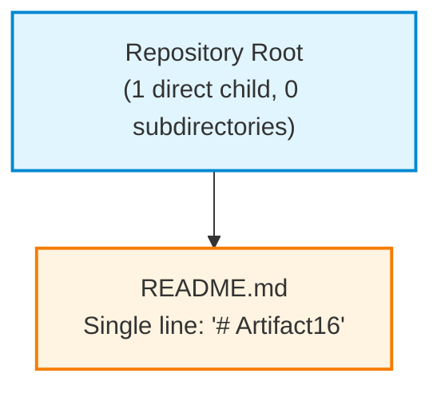

#### Primary System Capabilities

No system capabilities are presently implemented or described. The repository contains no executable code, no runnable scripts, no entry points, no user-facing interfaces, and no service definitions. The catalogue of primary system capabilities is therefore **empty**.

#### Major System Components

The repository's complete component inventory consists of the artifacts listed in the table below. The project has no source modules, no service implementations, no infrastructure-as-code definitions, no build pipelines, and no test suites.

| Component Category | Items Present | Items Absent |
|--------------------|---------------|--------------|
| Documentation | `README.md` (1 line, title only) | All other documentation |
| Source Code Modules | None | All implementation files |
| Configuration Files | None | All `.env`, `.yaml`, `.json`, `.toml` configurations |
| Build / Dependency Manifests | None | `package.json`, `pyproject.toml`, `pom.xml`, `Cargo.toml`, `go.mod`, `Gemfile`, and equivalents |

#### Core Technical Approach

No technical approach can be determined from the repository. There is no architectural style declaration, no framework selection evidence, no programming language indicator beyond the Markdown syntax of the README itself, no platform targeting, and no deployment topology description. The core technical approach is **not documented**.

### 1.2.3 Success Criteria

#### Measurable Objectives

No measurable objectives are recorded in the repository. The Technical Specification cannot enumerate objectives, targets, or completion criteria because none have been articulated in any file present in the project.

#### Critical Success Factors

No critical success factors are documented. The repository contains no risk register, dependency map, assumption log, or constraint catalogue that would inform success-factor analysis.

#### Key Performance Indicators (KPIs)

No KPIs, metrics definitions, observability requirements, service-level objectives, or measurement frameworks are defined in the repository. The KPI inventory is recorded as **not established**.

| Success Criterion Type | Documented in Repository | Action Required |
|------------------------|--------------------------|-----------------|
| Measurable Objectives | None | Define in future revision |
| Critical Success Factors | None | Define in future revision |
| Key Performance Indicators | None | Define in future revision |
| Acceptance Criteria | None | Define in future revision |

## 1.3 SCOPE

The scope of the **Artifact16** project, as documented in the repository, can only be described in terms of what is currently observable. Because the repository contains no requirements documentation, no specification artifacts, and no implementation code, the scope must be expressed as the present-state inventory rather than a forward-looking commitment.

### 1.3.1 In-Scope Elements

#### Core Features and Functionalities

The repository documents **no features and no functionalities**. There are no must-have capabilities defined, no primary user workflows described, no essential integrations identified, and no key technical requirements stated.

| In-Scope Category | Documented Items | Status |
|-------------------|------------------|--------|
| Must-Have Capabilities | None | Undefined |
| Primary User Workflows | None | Undefined |
| Essential Integrations | None | Undefined |
| Key Technical Requirements | None | Undefined |

#### Implementation Boundaries

The currently observable boundary of the **Artifact16** project is a single Markdown file (`README.md`) containing one line of text (`# Artifact16`). All other dimensions of implementation boundary — system boundaries, user groups covered, geographic or market coverage, and data domains included — are **not specified** by any artifact in the repository.

| Boundary Dimension | Currently Observable State |
|--------------------|----------------------------|
| System Boundary | A single file: `README.md` at the repository root |
| User Groups Covered | Not specified |
| Geographic / Market Coverage | Not specified |
| Data Domains Included | Not specified (no data models or schemas present) |

### 1.3.2 Out-of-Scope Elements

Because the repository does not define any in-scope features, capabilities, or commitments, **there exists no documented baseline against which out-of-scope items can be enumerated**. This Technical Specification therefore records the following positions:

- **Explicitly excluded features and capabilities**: None can be cataloged, because the repository documents no in-scope features to contrast against exclusions.
- **Future phase considerations**: No roadmap, milestone schedule, or phased delivery plan is present in the repository. Future phase exclusions cannot be enumerated without a baseline plan.
- **Integration points not covered**: No integration points are mentioned anywhere in the repository in either direction (covered or excluded).
- **Unsupported use cases**: No use cases — supported or unsupported — are documented.

This out-of-scope analysis will require complete redefinition once the repository contains substantive scope-defining artifacts.

### 1.3.3 Documentation Boundary Conditions

This subsection records the conditions under which this Introduction was drafted, so that future readers can correctly interpret the scope of statements made above.

| Condition | Verified State |
|-----------|----------------|
| Source Files Available | 1 (`README.md`) |
| Source File Body Content | 1 line: `# Artifact16` |
| Subdirectories Present | 0 |
| Configuration or Manifest Files | 0 |
| Test Files | 0 |
| CI/CD Definitions | 0 |
| Supplementary Documentation | 0 |

Under these conditions, the Introduction has been constructed as a faithful representation of the repository's present state. **Any narrative in subsequent sections of this Technical Specification that asserts specific business purpose, technical architecture, integration topology, user populations, or success metrics for the Artifact16 project must be considered ungrounded relative to the current repository evidence base.** Such narrative, if present elsewhere in the document, originates from sources outside the verifiable contents of the repository as documented here.

#### References

#### Files Examined

- `README.md` — The sole file in the repository. Verified to contain exactly one line of content: a Markdown H1 heading reading `# Artifact16`. Provided the only piece of factually established information about the project: its name. This file is the evidence source for every identification claim in Section 1.1.1 and the boundary observations in Section 1.3.

#### Folders Explored

- `` (repository root) — The only directory level in the repository. Verified to contain exactly one direct child (`README.md`) and no subdirectories. This observation is the evidence source for all component-inventory statements in Section 1.2.2 and all boundary statements in Section 1.3.

#### Sections Retrieved from Technical Specification

- None. The list of available cross-reference sections provided to this section's author was empty, indicating that no other Technical Specification sections were available for cross-referencing at the time of this section's preparation.

#### Web Searches Performed

- None. No web research was required, as the section's factual basis is entirely contained within the repository itself, and no external claims have been made in this Introduction.

# 2. Product Requirements

## 2.1 SECTION PREAMBLE AND EVIDENCE BASIS

### 2.1.1 Purpose of This Section

This section is intended to catalog the discrete, testable features of the **Artifact16** project, document their functional requirements, map their relationships, and record implementation considerations. The section prompt establishes four mandatory subsection categories: (1) Feature Catalog, (2) Functional Requirements Table, (3) Feature Relationships, and (4) Implementation Considerations. Each is expected to be populated with verifiable, source-grounded content rather than speculation.

### 2.1.2 State of the Evidence Base

As established in Sections 1.1, 1.2, and 1.3 of this Technical Specification, the **Artifact16** repository contains exactly one file (`README.md`), which itself contains a single line of Markdown comprising the project name. There are no source code modules, no configuration files, no build manifests, no test suites, no specification documents, no user story collections, no design briefs, no acceptance criteria registers, and no requirements artifacts of any kind within the repository.

Consequently, the standard inputs required to populate a Product Requirements section — namely, feature definitions, requirement statements, dependency declarations, acceptance criteria, priority assignments, and implementation constraints — are entirely absent from the source materials available to this Technical Specification.

This section therefore follows the methodological precedent established in Sections 1.1.2, 1.1.3, 1.1.4, 1.2.2, 1.2.3, 1.3.1, and 1.3.2: **structural acknowledgement of absent evidence rather than fabrication**. Each required subsection is addressed explicitly with an evidence-grounded statement of absence and a forward-looking note identifying what would be required to populate it in a future revision.

### 2.1.3 Verification of Repository Contents

The table below records the verification activities performed to confirm the absence of requirements artifacts. These activities were undertaken specifically to ensure that no feature definitions or requirements were overlooked.

| Verification Activity | Target | Result |
|-----------------------|--------|--------|
| Repository root enumeration | All files and subdirectories | 1 file (`README.md`), 0 subdirectories |
| `README.md` byte-level inspection | Full file contents | 12 bytes; single line `# Artifact16` |
| Semantic search for feature artifacts | "feature requirements specifications functional" | 0 results |
| Semantic search for user stories | "user stories acceptance criteria product features" | 0 results |
| Semantic search for source modules | "source code modules application implementation" | 0 results |
| Semantic search for configuration | "configuration manifest package dependencies" | 0 results |

Under these verified conditions, the four required subsections of Section 2 cannot be populated with substantive feature or requirement content. The remainder of this section records this state in the structural form requested by the section prompt.

### 2.1.4 Visual Representation of the Feature Inventory State

The diagram below depicts the present state of the feature inventory available to this Technical Specification. It is included to make the absent evidence base unambiguous to readers of this section.

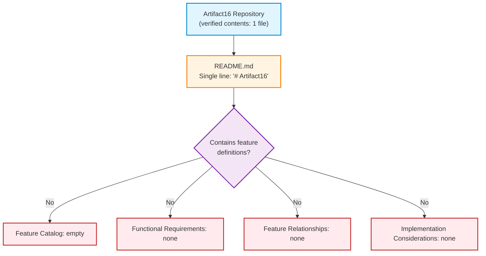

## 2.2 FEATURE CATALOG

### 2.2.1 Catalog Status

The Feature Catalog, as defined by the section prompt, would contain entries for each discrete feature of the system with metadata (Unique ID, Feature Name, Feature Category, Priority Level, Status), descriptions (Overview, Business Value, User Benefits, Technical Context), and dependencies (Prerequisite Features, System Dependencies, External Dependencies, Integration Requirements).

The repository's verified content provides **no source from which any of these fields could be populated**. The catalog is therefore recorded as empty. The table below documents this explicitly.

| Catalog Field | Source That Would Be Required | Source Available in Repository |
|---------------|-------------------------------|--------------------------------|
| Unique ID (F-XXX) | A requirements register | None present |
| Feature Name | Feature definition document | None present |
| Feature Category | Architectural taxonomy | None present |
| Priority Level | Stakeholder-prioritized backlog | None present |

### 2.2.2 Feature Metadata

No feature metadata records exist. The metadata table below is the **structural placeholder** confirming that zero feature IDs have been assigned in this Technical Specification, in accordance with the section prompt's explicit instruction not to invent feature identifiers for features that do not exist.

| Field | Recorded Value |
|-------|----------------|
| Total Features Cataloged | 0 |
| Feature IDs Assigned | None |
| Status Distribution | Not applicable (no features) |
| Priority Distribution | Not applicable (no features) |

### 2.2.3 Feature Descriptions

#### Overview, Business Value, User Benefits, and Technical Context

No feature descriptions can be authored. The repository contains no overview narratives, no business value statements, no user benefit articulations, and no technical context descriptions for any feature. As established in Section 1.1.4, "no value proposition, business case, return-on-investment projection, impact statement, or success narrative is present in the repository," and as established in Section 1.2.2, "no system capabilities are presently implemented or described."

### 2.2.4 Feature Dependencies

#### Prerequisite, System, External, and Integration Dependencies

No feature dependencies can be enumerated because no features exist to which dependencies could attach. Section 1.2.1 confirms that "the repository contains no integration code, no API client libraries, no service definitions, no connector implementations, no environment configuration referencing external services, no authentication scaffolding for third-party systems, and no architecture diagrams depicting integration points," which independently confirms the absence of any dependency declarations.

## 2.3 FUNCTIONAL REQUIREMENTS TABLE

### 2.3.1 Functional Requirements Status

The Functional Requirements Table, as defined by the section prompt, would record per-feature requirement details (Requirement ID in the format F-XXX-RQ-YYY, Description, Acceptance Criteria, Priority, Complexity), technical specifications (Input Parameters, Output/Response, Performance Criteria, Data Requirements), and validation rules (Business Rules, Data Validation, Security Requirements, Compliance Requirements).

Because no features are cataloged in Section 2.2, no functional requirements can be associated with features. Further, the repository itself contains no standalone requirement statements that could be tabulated independently of a feature catalog.

### 2.3.2 Requirement Details

#### Requirement IDs, Descriptions, Acceptance Criteria, Priority, and Complexity

No requirement IDs have been assigned in this Technical Specification. In accordance with the section prompt's explicit instruction not to fabricate requirement IDs for requirements that have not been articulated, the requirement detail register below is recorded as empty.

| Detail Field | Recorded Value |
|--------------|----------------|
| Requirement IDs Assigned | None |
| Descriptions Authored | None |
| Acceptance Criteria Defined | None |
| Priority Assignments | None |

### 2.3.3 Technical Specifications

#### Input Parameters, Outputs, Performance Criteria, and Data Requirements

No technical specifications can be recorded. The repository contains no API definitions, no schemas, no interface contracts, no performance targets, and no data models. Section 1.3.1 confirms that the "Data Domains Included" boundary is "not specified (no data models or schemas present)."

### 2.3.4 Validation Rules

#### Business Rules, Data Validation, Security, and Compliance

No validation rules can be recorded. No business rules, data validation logic, security policies, or compliance requirements are documented in the repository. As established in Section 1.2.3, "no measurable objectives are recorded in the repository" and "no KPIs, metrics definitions, observability requirements, service-level objectives, or measurement frameworks are defined in the repository."

## 2.4 FEATURE RELATIONSHIPS

### 2.4.1 Feature Relationships Status

The section prompt instructs: *"Only document feature relationships that are clearly evident in the requirements or source code. Don't imagine any feature relationships of your own."* Because no features have been cataloged in Section 2.2 and no source code is present in the repository, no feature relationships are clearly evident. Consequently, no relationships are documented in this subsection.

### 2.4.2 Feature Dependency Map

No feature dependency map can be produced. A dependency map requires at minimum two features and an established directional relationship between them; the repository provides neither. The dependency-map registry is recorded as empty.

| Relationship Category | Items Documented |
|-----------------------|------------------|
| Feature-to-Feature Dependencies | None |
| Feature-to-Service Dependencies | None |
| Feature-to-Data Dependencies | None |
| Feature-to-External-System Dependencies | None |

### 2.4.3 Integration Points, Shared Components, and Common Services

#### Integration Points

No integration points are documented. As cited in Section 2.2.4 above, Section 1.2.1 confirms the absence of all integration-related artifacts in the repository.

#### Shared Components

No shared components are documented. Section 1.2.2 establishes that the repository contains zero source code modules; consequently, no component — shared or otherwise — has been implemented.

#### Common Services

No common services are documented. The repository contains no service implementations, no service interfaces, and no service registries.

## 2.5 IMPLEMENTATION CONSIDERATIONS

### 2.5.1 Implementation Considerations Status

The section prompt requests per-feature documentation of Technical Constraints, Performance Requirements, Scalability Considerations, Security Implications, and Maintenance Requirements. Because no features are cataloged in Section 2.2, no per-feature implementation considerations can be recorded.

This subsection records the absence explicitly and does not extrapolate generic considerations from the project name or from generic software-engineering patterns.

### 2.5.2 Technical Constraints and Performance Requirements

#### Technical Constraints

No technical constraints are documented in the repository. There is no platform-targeting declaration, no language constraint, no runtime requirement, no hardware boundary, and no licensing constraint articulated in any artifact. Section 1.2.2 confirms that "no architectural style declaration, no framework selection evidence, no programming language indicator beyond the Markdown syntax of the README itself, no platform targeting, and no deployment topology description" is present.

#### Performance Requirements

No performance requirements are documented. The repository contains no latency targets, no throughput targets, no resource-utilization budgets, and no service-level objectives. Section 1.2.3 confirms that "no KPIs, metrics definitions, observability requirements, service-level objectives, or measurement frameworks are defined."

### 2.5.3 Scalability, Security, and Maintenance Considerations

#### Scalability Considerations

No scalability considerations are documented. There is no expected-load profile, no concurrency model, no horizontal or vertical scaling strategy, and no capacity plan present in the repository.

#### Security Implications

No security implications are documented. There is no threat model, no security control catalogue, no authentication or authorization design, no data-classification scheme, and no compliance regime referenced in the repository.

#### Maintenance Requirements

No maintenance requirements are documented. There is no operational runbook, no upgrade procedure, no patching cadence, no support tier definition, and no end-of-life policy present in the repository.

| Implementation Consideration | Documented Items | Future Action Required |
|------------------------------|------------------|------------------------|
| Technical Constraints | None | Define after stack selection |
| Performance Requirements | None | Define after capability articulation |
| Scalability Considerations | None | Define after load profile creation |
| Security Implications | None | Define after threat model development |

## 2.6 TRACEABILITY MATRIX

### 2.6.1 Traceability Matrix Status

The section prompt requests a traceability matrix linking requirements to features, design elements, and verification activities. A traceability matrix is meaningful only when at least one requirement, feature, or verification activity exists to be traced. The verification in Section 2.1.3 confirms that none of these elements exist in the repository.

The traceability matrix is therefore recorded as empty. The structural placeholder below is provided to make this state explicit.

| Traceability Dimension | Items Available to Trace |
|------------------------|--------------------------|
| Features → Requirements | 0 features × 0 requirements |
| Requirements → Test Cases | 0 requirements × 0 test cases |
| Requirements → Design Elements | 0 requirements × 0 design elements |
| Requirements → Source Code | 0 requirements × 0 source files |

### 2.6.2 Cross-Reference Index to Other Technical Specification Sections

The table below cross-references the empty-state findings of Section 2 to the corroborating evidence already recorded elsewhere in this Technical Specification. This index ensures that readers can independently verify each absence claim made above.

| Section 2 Claim | Corroborating Section | Specific Subsection |
|-----------------|----------------------|---------------------|
| No features cataloged | Section 1.2 | 1.2.2 (Primary System Capabilities) |
| No requirements articulated | Section 1.3 | 1.3.1 (In-Scope Elements) |
| No integration points | Section 1.2 | 1.2.1 (Integration with Enterprise Landscape) |
| No success / acceptance criteria | Section 1.2 | 1.2.3 (Success Criteria) |

### 2.6.3 Process Flowchart References

The section prompt instructs that the section may reference related process flowcharts. No process flowcharts can be referenced because no processes are defined in the repository. The only diagram introduced in this section is the inventory-state diagram in Section 2.1.4, which depicts the absent feature inventory rather than a process flow.

## 2.7 ASSUMPTIONS, CONSTRAINTS, AND FORWARD-LOOKING NOTES

### 2.7.1 Documented Assumptions

The single assumption underlying this section is that the repository state observed at the time of authoring is the complete and authoritative source of evidence. This assumption is supported by the verification activities in Section 2.1.3 and by the documentation boundary conditions in Section 1.3.3. No additional assumptions about project intent, scope, or implementation direction have been adopted, in accordance with the section prompt's explicit prohibition on speculation about features the project "might" implement.

### 2.7.2 Documented Constraints

The constraints under which this section was authored are recorded below.

| Constraint | Description |
|------------|-------------|
| Evidence Constraint | Section content is restricted to verifiable repository contents |
| No-Fabrication Constraint | Feature and requirement IDs may not be invented |
| No-Inference Constraint | Features may not be inferred from generic patterns |
| Precedent Constraint | Structure must mirror Sections 1.1, 1.2, and 1.3 |

### 2.7.3 Forward-Looking Note and Path to Population

This Section 2 will require complete redrafting once the **Artifact16** repository contains substantive content from which features and requirements can be extracted. The minimum artifacts that would enable population of this section in a future revision are listed below.

| Artifact to be Added | Section 2 Subsection It Would Populate |
|----------------------|----------------------------------------|
| Feature definition register | 2.2 Feature Catalog |
| Requirements specification | 2.3 Functional Requirements Table |
| Architecture / integration diagrams | 2.4 Feature Relationships |
| Non-functional requirements document | 2.5 Implementation Considerations |

Upon the addition of these artifacts, the Section 2 author should remove all "no items present" acknowledgements and replace them with source-grounded entries, retaining only the methodological framing in Section 2.1 as a historical record of the section's original empty state.

### 2.7.4 Version Tracking Note

The section prompt requests requirement version tracking. Because no requirements exist in this revision of the Technical Specification, no version history of requirements can be recorded. When requirements are added in a future revision, each requirement (in the format F-XXX-RQ-YYY) should carry a version field beginning at 1.0 and incrementing per the project's change-management process — which itself is not yet defined.

## 2.8 REFERENCES

### 2.8.1 Files Examined

- `README.md` — The sole file in the repository, containing a single line (`# Artifact16`). Confirmed as containing no feature definitions, no requirement statements, no acceptance criteria, and no implementation notes. This file is the exclusive evidence base for every absence claim in Section 2.

### 2.8.2 Folders Explored

- `` (repository root, depth 0) — The only directory level in the repository. Verified to contain exactly one direct child (`README.md`) and zero subdirectories. This observation is the evidence basis for the empty-inventory statements throughout Section 2.

### 2.8.3 Technical Specification Sections Cross-Referenced

- **Section 1.1 EXECUTIVE SUMMARY** — Provided corroborating evidence for the absence of business problem context, stakeholder definitions, and value proposition. Specifically referenced in Sections 2.2.3 (via 1.1.4).
- **Section 1.2 SYSTEM OVERVIEW** — Provided corroborating evidence for the absence of system capabilities, components, technical approach, and success criteria. Specifically referenced in Sections 2.2.3 (via 1.2.2), 2.2.4 (via 1.2.1), 2.3.4 (via 1.2.3), 2.4.3 (via 1.2.1 and 1.2.2), 2.5.2 (via 1.2.2 and 1.2.3), and 2.6.2.
- **Section 1.3 SCOPE** — Provided corroborating evidence for the absence of in-scope features, implementation boundaries, and out-of-scope baselines, and established the methodological precedent followed by Section 2. Specifically referenced in Sections 2.1.2, 2.3.3 (via 1.3.1), 2.6.2, and 2.7.1 (via 1.3.3).

### 2.8.4 Searches Performed

The semantic searches and filesystem verifications enumerated in Section 2.1.3 are recorded here for traceability:

- Semantic search: "feature requirements specifications functional" — 0 results
- Semantic search: "user stories acceptance criteria product features" — 0 results
- Semantic search: "source code modules application implementation" — 0 results
- Semantic search: "configuration manifest package dependencies" — 0 results
- Semantic search: "documentation readme project description" — 0 results

### 2.8.5 Web Searches Performed

- None. No web research was required, as Section 2's factual basis is entirely contained within the repository itself and within the cross-referenced sections of this Technical Specification. No external claims have been made in Section 2.

# 3. Technology Stack

## 3.1 SECTION PREAMBLE AND EVIDENCE BASIS

### 3.1.1 Purpose of This Section

This section is intended to enumerate the technology stack of the **Artifact16** project across six standard dimensions: Programming Languages, Frameworks and Libraries, Open Source Dependencies, Third-Party Services, Databases and Storage, and Development and Deployment tooling. The section prompt requires version numbers for each component, justification for major choices, integration requirements between components, and consideration of security implications. Each enumerated technology is expected to be derived from verifiable repository artifacts — typically dependency manifests, configuration files, infrastructure-as-code definitions, container specifications, CI/CD pipeline definitions, or runtime source code — rather than from generic patterns or external defaults.

### 3.1.2 State of the Evidence Base

As established in Sections 1.1, 1.2, and 1.3, and corroborated by Section 2.1.2, the **Artifact16** repository contains exactly one file (`README.md`), which itself contains a single line of Markdown comprising the project name. There are no source code modules, no dependency manifests, no lockfiles, no configuration files, no environment files, no container definitions, no infrastructure-as-code artifacts, no CI/CD pipeline definitions, and no test suites within the repository.

Section 1.2.2 explicitly records that "no architectural style declaration, no framework selection evidence, no programming language indicator beyond the Markdown syntax of the README itself, no platform targeting, and no deployment topology description" is present in the repository. Section 1.2.2 further records that the "Build / Dependency Manifests" component category is empty, with `package.json`, `pyproject.toml`, `pom.xml`, `Cargo.toml`, `go.mod`, `Gemfile`, and equivalents all absent.

Consequently, the standard inputs required to populate a Technology Stack section — namely, dependency declarations, framework imports, language source files, configuration files referencing services, container manifests, and infrastructure definitions — are entirely absent from the source materials available to this Technical Specification.

This section therefore follows the methodological precedent established in Sections 1.1, 1.2, 1.3, and 2 in its entirety: **structural acknowledgement of absent evidence rather than fabrication**. Each required subsection is addressed explicitly with an evidence-grounded statement of absence and a forward-looking note identifying what artifacts would be required to populate the subsection in a future revision.

### 3.1.3 Verification of Technology Stack Indicators

The table below records the verification activities performed to confirm the absence of technology stack indicators. These activities were undertaken specifically to ensure that no technology selections were overlooked through superficial inspection.

| Verification Activity | Target | Result |
|-----------------------|--------|--------|
| Repository root enumeration | All files and subdirectories | 1 file (`README.md`), 0 subdirectories |
| `README.md` byte-level inspection | Full file contents | 12 bytes; single line `# Artifact16` |
| Dependency manifest search | `package.json`, `pyproject.toml`, `requirements.txt`, `Gemfile`, `pom.xml`, `Cargo.toml`, `go.mod`, `composer.json`, etc. | 0 manifests present |
| Lockfile search | `package-lock.json`, `yarn.lock`, `poetry.lock`, `Pipfile.lock`, `Cargo.lock`, etc. | 0 lockfiles present |
| Source code extension search | `.py`, `.js`, `.ts`, `.java`, `.go`, `.rs`, `.swift`, `.kt`, `.rb`, `.m`, `.c`, `.cpp`, `.cs` | 0 source files of any language |
| Container definition search | `Dockerfile`, `docker-compose.yml`, `.dockerignore` | 0 container artifacts |
| Infrastructure-as-Code search | `.tf`, CloudFormation `.yaml`, Pulumi, Ansible playbooks | 0 IaC artifacts |
| CI/CD definition search | `.github/workflows/`, `.gitlab-ci.yml`, `Jenkinsfile`, `azure-pipelines.yml`, `.circleci/` | 0 pipeline artifacts |
| Environment configuration search | `.env`, `.env.example`, environment-specific config files | 0 environment artifacts |
| Build system search | `Makefile`, `build.gradle`, `Rakefile`, `webpack.config.js`, `vite.config.js`, etc. | 0 build configurations |
| Semantic search: package dependencies | "configuration manifest package dependencies" | 0 results |
| Semantic search: source implementation | "source code modules application implementation" | 0 results |

Under these verified conditions, the six subsections of Section 3 required by the section prompt cannot be populated with substantive technology stack content. The remainder of this section records this state in the structural form requested by the section prompt.

### 3.1.4 Visual Representation of the Technology Stack Inventory State

The diagram below depicts the present state of the technology stack inventory available to this Technical Specification. It is included to make the absent evidence base unambiguous to readers of this section, mirroring the visualization approach established in Section 2.1.4.

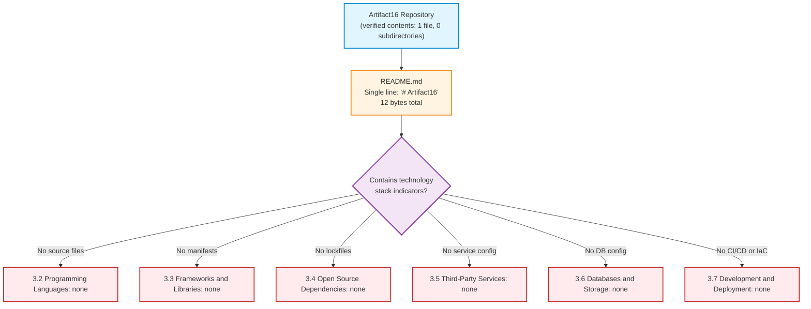

## 3.2 PROGRAMMING LANGUAGES

### 3.2.1 Programming Language Inventory Status

No programming languages are adopted, declared, or otherwise indicated within the **Artifact16** repository. The single file present (`README.md`) is authored in Markdown, which is a lightweight markup language for prose formatting, not a programming language used to implement system behavior. Section 1.2.2 records this condition directly, noting that there is "no programming language indicator beyond the Markdown syntax of the README itself."

### 3.2.2 Required Evidence vs. Observed Evidence

The table below contrasts the artifacts that would normally substantiate a programming language selection against those observed in the repository.

| Evidence Category | Typical Indicators | Observed in Repository |
|-------------------|--------------------|------------------------|
| Source file extensions | `.py`, `.js`, `.ts`, `.java`, `.go`, `.rs`, `.swift`, `.kt`, `.rb`, `.cs`, `.cpp`, `.m` | None |
| Language version declarations | `.python-version`, `.nvmrc`, `.ruby-version`, `.tool-versions`, `pyenv` files | None |
| Compiler / interpreter manifests | `pyproject.toml [project] requires-python`, `package.json engines`, `go.mod go directive` | None |
| Language-specific configuration | `tsconfig.json`, `mypy.ini`, `.eslintrc`, `Cargo.toml [package] edition` | None |
| Build system bindings | `Makefile` targets invoking compilers, `build.gradle` language plugins | None |

### 3.2.3 Forward-Looking Note on Programming Language Selection

Because no source code has been committed, no language-specific platform or component split (backend, frontend, mobile, native) can be documented. No selection criteria, constraints, or dependencies relating to a language choice can be justified from repository evidence. The treatment of language defaults proposed in the authoring context is consolidated in Section 3.8.3.

## 3.3 FRAMEWORKS & LIBRARIES

### 3.3.1 Framework Inventory Status

No application frameworks, web frameworks, UI frameworks, ORM frameworks, AI/ML frameworks, or testing frameworks are present in the **Artifact16** repository. Section 1.2.2 records "no framework selection evidence" in the repository. Section 2.1.3 records that a semantic search for "configuration manifest package dependencies" returned zero results.

### 3.3.2 Required Evidence vs. Observed Evidence

The table below contrasts the artifacts that would normally substantiate framework adoption against those observed in the repository.

| Evidence Category | Typical Indicators | Observed in Repository |
|-------------------|--------------------|------------------------|
| Dependency manifests | `package.json`, `pyproject.toml`, `requirements.txt`, `Gemfile`, `pom.xml`, `Cargo.toml`, `go.mod`, `composer.json` | None |
| Framework-specific configuration | `next.config.js`, `vite.config.ts`, `django settings.py`, `application.yml`, `nest-cli.json` | None |
| Import statements in source | Language-level import / require / use directives | No source files exist |
| Framework scaffolding artifacts | `manage.py`, `artisan`, `mix.exs`, `angular.json`, `app/` or `src/` directories | None |
| Plugin / extension registrations | Module manifests, plugin registries, framework-specific lifecycle hooks | None |

### 3.3.3 Forward-Looking Note on Framework and Library Selection

No core framework versions, supporting libraries, compatibility requirements, or framework-level justifications can be documented because no frameworks have been selected. Version numbers are explicitly required by the section prompt; because no frameworks exist in the repository, no version numbers can be recorded. The treatment of framework defaults proposed in the authoring context is consolidated in Section 3.8.3.

## 3.4 OPEN SOURCE DEPENDENCIES

### 3.4.1 Dependency Inventory Status

No open-source or third-party libraries are declared, vendored, or otherwise referenced within the **Artifact16** repository. There are no dependency manifests in any package format, no lockfiles fixing transitive dependencies, no vendor directories, and no submodule references.

### 3.4.2 Required Evidence vs. Observed Evidence

The table below contrasts the artifacts that would normally substantiate open-source dependency adoption against those observed in the repository.

| Evidence Category | Typical Indicators | Observed in Repository |
|-------------------|--------------------|------------------------|
| Package manifests | `package.json`, `pyproject.toml`, `requirements.txt`, `Gemfile`, `Cargo.toml`, `go.mod` | None |
| Resolved-version lockfiles | `package-lock.json`, `yarn.lock`, `poetry.lock`, `Pipfile.lock`, `Cargo.lock`, `go.sum` | None |
| Vendor directories | `node_modules/`, `vendor/`, `venv/`, `.bundle/`, `target/` | None |
| Git submodules | `.gitmodules` file with submodule entries | None |
| Registry configuration | `.npmrc`, `.pypirc`, `Gemfile.source`, private registry URLs | None |
| License compliance artifacts | `THIRD_PARTY_LICENSES`, `NOTICE`, SBOM files (`*.spdx`, `*.cdx.json`) | None |

### 3.4.3 Forward-Looking Note on Open Source Dependencies

No third-party packages, registry sources, or pinned versions can be enumerated because no dependency-declaration artifacts exist. Once a dependency manifest is committed to the repository, this subsection should record each direct dependency with its name, declared version range, resolved version (from a lockfile), source registry, and license classification. Security implications — including known-CVE auditing and dependency-update cadence — should be recorded at the time of population.

## 3.5 THIRD-PARTY SERVICES

### 3.5.1 Third-Party Services Inventory Status

No integrations with external APIs, third-party services, authentication providers, monitoring/observability platforms, payment processors, communication services, or cloud-hosted SaaS offerings are present in the **Artifact16** repository. This finding is consistent with the statement in Section 1.2.1 that "the repository contains no integration code, no API client libraries, no service definitions, no connector implementations, no environment configuration referencing external services, no authentication scaffolding for third-party systems, and no architecture diagrams depicting integration points," and with Section 2.4.3 which records that "no integration points are documented."

### 3.5.2 Required Evidence vs. Observed Evidence

The table below contrasts the artifacts that would normally substantiate third-party service integration against those observed in the repository.

| Service Category | Typical Indicators | Observed in Repository |
|------------------|--------------------|------------------------|
| External APIs | HTTP client code, SDK imports, OpenAPI client manifests, API base-URL constants | None |
| Authentication providers | OAuth client config, OIDC discovery URLs, JWT validation keys, IdP metadata | None |
| Monitoring / observability | APM agent installation, log shipper config, metrics exporters, tracing SDKs | None |
| Cloud services | Cloud provider SDKs, IAM role definitions, service principal references | None |
| Messaging / queuing | Broker connection strings, topic/queue declarations, consumer group config | None |
| Email / SMS / push | Mail server credentials, transactional email SDKs, push notification certificates | None |
| Environment configuration | `.env`, `.env.example`, `config/secrets.yaml`, secret-management references | None |

### 3.5.3 Forward-Looking Note on Third-Party Services

No external API integrations, authentication services, monitoring tools, or cloud-hosted services can be enumerated because no integration artifacts exist in the repository. The integration requirements between components — explicitly requested by the section prompt — cannot be documented because no components are present in the repository to require integration.

## 3.6 DATABASES & STORAGE

### 3.6.1 Database and Storage Inventory Status

No primary database, secondary database, cache, message broker acting as durable storage, object storage, file storage, or other persistence mechanism is referenced within the **Artifact16** repository. There are no connection strings, schemas, migrations, ORM mappings, query definitions, or data models present.

Section 1.3.1 records that "Data Domains Included: Not specified (no data models or schemas present)" within the Boundary Dimensions table. Section 2.3.3 records that "the repository contains no API definitions, no schemas, no interface contracts, no performance targets, and no data models."

### 3.6.2 Required Evidence vs. Observed Evidence

The table below contrasts the artifacts that would normally substantiate database or storage adoption against those observed in the repository.

| Persistence Category | Typical Indicators | Observed in Repository |
|----------------------|--------------------|------------------------|
| Relational databases | `.sql` schema files, ORM migration directories, `database.yml`, JDBC URLs | None |
| Document / NoSQL databases | Collection schemas, ODM model files, NoSQL driver configuration | None |
| Key-value / cache stores | Cache client configuration, TTL policies, cache-key prefix conventions | None |
| Search engines | Index mapping files, ingestion pipelines, search-service SDK references | None |
| Object / blob storage | Bucket-name constants, storage SDK initialization, object-key conventions | None |
| Data persistence strategy | Repository pattern code, unit-of-work modules, transaction-management config | None |
| Backup / DR configuration | Backup-policy files, snapshot schedules, restore runbooks | None |

### 3.6.3 Forward-Looking Note on Databases and Storage

No primary or secondary databases, persistence strategies, caching solutions, or storage services can be documented because no persistence artifacts exist in the repository. When persistence is introduced, this subsection should record the engine, version, deployment topology, replication and backup posture, schema-management approach, and data-retention policy for each persistence tier.

## 3.7 DEVELOPMENT & DEPLOYMENT

### 3.7.1 Development and Deployment Tooling Inventory Status

No development tooling, build system configuration, containerization artifact, infrastructure-as-code definition, or continuous integration / continuous deployment pipeline is present in the **Artifact16** repository. Section 1.3.3 records this explicitly in the Documentation Boundary Conditions table, where "Configuration or Manifest Files," "CI/CD Definitions," and "Test Files" are each recorded as 0.

### 3.7.2 Required Evidence vs. Observed Evidence

The table below contrasts the artifacts that would normally substantiate development and deployment tooling against those observed in the repository.

| Tooling Category | Typical Indicators | Observed in Repository |
|------------------|--------------------|------------------------|
| Local development tooling | `.editorconfig`, `.vscode/`, dev-container `devcontainer.json`, IDE project files | None |
| Code quality tooling | `.eslintrc`, `.prettierrc`, `pre-commit-config.yaml`, formatter configs | None |
| Build systems | `Makefile`, `build.gradle`, `pom.xml`, `webpack.config.js`, `vite.config.ts`, `Rakefile` | None |
| Containerization | `Dockerfile`, `docker-compose.yml`, `.dockerignore`, OCI image manifests | None |
| Container orchestration | Kubernetes manifests (`*.yaml`), Helm charts, Kustomize overlays | None |
| Infrastructure-as-Code | Terraform `.tf` files, CloudFormation templates, Pulumi programs, Ansible playbooks | None |
| CI/CD pipeline definitions | `.github/workflows/*.yml`, `.gitlab-ci.yml`, `Jenkinsfile`, `azure-pipelines.yml`, `.circleci/config.yml` | None |
| Release tooling | `CHANGELOG.md`, `release-please-config.json`, semantic-release config, `goreleaser.yml` | None |
| Testing framework configuration | `pytest.ini`, `jest.config.js`, `go test` conventions, integration-test harnesses | None |

### 3.7.3 Forward-Looking Note on Development and Deployment

No development tools, build system, containerization approach, or CI/CD requirements can be documented because no relevant artifacts exist in the repository. The section prompt's expectation that this subsection identify CI/CD requirements cannot be fulfilled from repository evidence; any such requirements would need to be authored as part of project planning before being reflected in this section.

## 3.8 ASSUMPTIONS, CONSTRAINTS, AND FORWARD-LOOKING NOTES

### 3.8.1 Documented Assumptions

The single assumption underlying this section is that the repository state observed at the time of authoring is the complete and authoritative source of evidence for technology stack determinations. This assumption is consistent with the verification activities recorded in Section 3.1.3 and Section 2.1.3, and with the documentation boundary conditions in Section 1.3.3. No additional assumptions about project direction, runtime targets, deployment environments, or third-party service preferences have been adopted, in accordance with the precedent set by Sections 2.7.1 and 1.3.3.

### 3.8.2 Documented Constraints

The constraints under which this section was authored mirror those recorded in Section 2.7.2 and are reproduced and adapted below for the Technology Stack context.

| Constraint | Description as Applied to Section 3 |
|------------|--------------------------------------|
| Evidence Constraint | Section content is restricted to verifiable repository contents; technology selections may not be claimed absent supporting artifacts in the repository. |
| No-Fabrication Constraint | Specific component names, versions, vendor identifiers, and service endpoints may not be invented to satisfy section prompt categories. |
| No-Inference Constraint | Technologies may not be inferred from the project name, from generic patterns observed in similar projects, or from default templates provided in authoring context. |
| Precedent Constraint | Structure must mirror Sections 1.1, 1.2, 1.3, and 2 — namely, evidence-based acknowledgement of absence with forward-looking notes identifying required future artifacts. |
| Version-Number Constraint | The section prompt's requirement to "include version numbers for all components" cannot be satisfied, because no components have been adopted; recording fabricated versions would violate the Evidence Constraint. |
| Security-Implication Constraint | The section prompt's requirement to "consider security implications of choices" cannot be applied per-component, because no components have been chosen; security implications can only be assessed when concrete technologies are committed. |

### 3.8.3 Treatment of the Default Technology Stack Provided in Authoring Context

A "Default Technology Stack" was supplied as authoring context for this Technical Specification. That list proposed AWS as the cloud platform; Docker for containerization; Terraform for Infrastructure-as-Code; GitHub Actions for CI/CD; Python with Flask, Auth0, MongoDB, and Langchain for backend concerns; React with TypeScript and TailwindCSS for the web frontend; React Native with TypeScript for cross-platform mobile; Swift, Kotlin, Objective-C, and ElectronJS for native applications.

Under the Evidence Constraint and No-Inference Constraint recorded in Section 3.8.2 and originally established in Section 2.7.2, **the Default Technology Stack cannot be asserted as the actual technology stack of the Artifact16 project**. No artifact in the repository references any of these technologies, no manifest declares them as dependencies, no source code imports them, and no configuration adopts them. Section 1.2.2 records that no programming language indicator exists beyond the Markdown syntax of the README; this finding directly precludes the assertion that Python, TypeScript, Swift, Kotlin, Objective-C, or any other language listed in the default stack is in use.

The Default Technology Stack is therefore recorded here strictly as **authoring context provided by an external party**, retained for traceability and to inform future revisions of this Technical Specification. The decision-making process by which an actual stack is selected — including evaluation against project requirements that themselves do not yet exist (see Section 2 in its entirety) — falls outside the scope of the present revision. The relationship between the externally supplied defaults and the present section is depicted below.

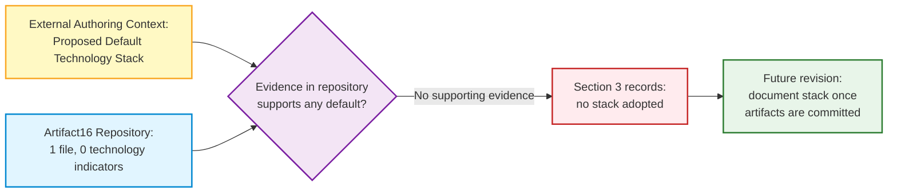

### 3.8.4 Forward-Looking Note and Path to Population

Section 3 will require complete redrafting once the **Artifact16** repository contains substantive artifacts from which technology selections can be extracted. The minimum artifacts that would enable population of each subsection in a future revision are listed below.

| Artifact to be Added | Section 3 Subsection It Would Populate |
|----------------------|-----------------------------------------|
| Source files in one or more programming languages, with explicit version declarations | 3.2 Programming Languages |
| Dependency manifest(s) declaring core frameworks and supporting libraries with version constraints | 3.3 Frameworks and Libraries |
| Resolved lockfile(s) recording transitive dependency closure and exact versions | 3.4 Open Source Dependencies |
| Environment configuration and / or integration code referencing external service endpoints and SDKs | 3.5 Third-Party Services |
| Database connection configuration, schema or migration files, ORM/ODM mappings, and cache/storage SDK initialization | 3.6 Databases and Storage |
| `Dockerfile`(s), Infrastructure-as-Code definitions, CI/CD pipeline files, and build-system configuration | 3.7 Development and Deployment |

Upon the addition of these artifacts, the Section 3 author should remove the "no items present" acknowledgements and replace them with source-grounded entries that include component names, declared and resolved version numbers, registry sources, license classifications, justifications referenced to project requirements (Section 2), security implications, and integration requirements between components. The methodological framing in Section 3.1 should be retained as a historical record of the section's original empty state, consistent with the guidance offered for Section 2 in Section 2.7.3.

### 3.8.5 Version Tracking Note

The section prompt requests that version numbers accompany every component of the technology stack. Because no components have been adopted in the current repository state, no versions can be recorded. When components are introduced in a future revision, each entry should carry the declared version (as it appears in the source manifest), the resolved version (as it appears in the lockfile), the release date, the upstream support status, and a known-vulnerability scan reference. These fields should be populated under the same revision-control discipline that will, at that time, govern other version-tracked artifacts in this Technical Specification.

## 3.9 REFERENCES

### 3.9.1 Files Examined

- `README.md` — The sole file in the repository, containing a single line (`# Artifact16`). Confirmed to contain no programming language indicators (beyond Markdown), no framework references, no dependency declarations, no service endpoints, no database configuration, and no development or deployment instructions. This file is the exclusive evidence base for every absence claim in Section 3.

### 3.9.2 Folders Explored

- `` (repository root, depth 0) — The only directory level in the repository. Verified to contain exactly one direct child (`README.md`) and zero subdirectories. The absence of conventional subdirectories such as `src/`, `lib/`, `app/`, `config/`, `infra/`, `.github/`, `scripts/`, `tests/`, or `docs/` is the evidence basis for the empty-inventory statements throughout Sections 3.2 through 3.7.

### 3.9.3 Technical Specification Sections Cross-Referenced

- **Section 1.1 EXECUTIVE SUMMARY** — Established the sole identifying fact about the project (its name) and confirmed the absence of any technology-implying business or technical context.
- **Section 1.2 SYSTEM OVERVIEW** — Provided direct evidentiary support for the empty-stack findings via Section 1.2.2's component inventory table (which records zero Configuration Files and zero Build / Dependency Manifests) and Section 1.2.2's Core Technical Approach statement (which records that no programming language indicator, no architectural style declaration, no framework selection evidence, no platform targeting, and no deployment topology description is present). Specifically referenced in Sections 3.1.2, 3.2.1, 3.3.1, 3.5.1, and 3.8.3.
- **Section 1.3 SCOPE** — Provided the Documentation Boundary Conditions table that records zero configuration / manifest files, zero CI/CD definitions, and zero supplementary documentation. Specifically referenced in Sections 3.1.2, 3.6.1, and 3.7.1.
- **Section 2.1 SECTION PREAMBLE AND EVIDENCE BASIS** — Established the methodological pattern of "structural acknowledgement of absent evidence rather than fabrication" that Section 3 follows, and recorded the semantic searches that confirmed the absence of configuration manifests and source modules. Specifically referenced in Sections 3.1.2, 3.1.3, and 3.3.1.
- **Section 2.3 FUNCTIONAL REQUIREMENTS TABLE** — Recorded that no API definitions, no schemas, no interface contracts, no performance targets, and no data models are present. Specifically referenced in Section 3.6.1.
- **Section 2.4 FEATURE RELATIONSHIPS** — Recorded that no integration points are documented, supporting the absence of third-party service integration evidence. Specifically referenced in Section 3.5.1.
- **Section 2.5 IMPLEMENTATION CONSIDERATIONS** — Reiterated the absence of technical constraints, performance requirements, scalability considerations, security implications, and maintenance requirements, all of which would normally accompany a populated technology stack.
- **Section 2.7 ASSUMPTIONS, CONSTRAINTS, AND FORWARD-LOOKING NOTES** — Provided the constraint framework (Evidence, No-Fabrication, No-Inference, Precedent) that Section 3.8.2 inherits and adapts.
- **Section 2.8 REFERENCES** — Established the reference format that Section 3.9 mirrors.

### 3.9.4 Searches Performed

The verification searches enumerated in Section 3.1.3 are recorded here for traceability, together with the prior searches conducted during the preparation of Sections 1 and 2 that remain relevant to Section 3:

- Filesystem enumeration: repository root directory listing — 1 file, 0 subdirectories
- Filesystem inspection: `README.md` byte-level read — 12 bytes, single line `# Artifact16`
- Manifest pattern search: `package.json`, `pyproject.toml`, `requirements.txt`, `Gemfile`, `pom.xml`, `Cargo.toml`, `go.mod`, `composer.json` — 0 matches
- Lockfile pattern search: `package-lock.json`, `yarn.lock`, `poetry.lock`, `Pipfile.lock`, `Cargo.lock` — 0 matches
- Container artifact pattern search: `Dockerfile`, `docker-compose.yml`, `.dockerignore` — 0 matches
- CI/CD pattern search: `.github/workflows/`, `.gitlab-ci.yml`, `Jenkinsfile`, `azure-pipelines.yml`, `.circleci/config.yml` — 0 matches
- Infrastructure-as-Code pattern search: `*.tf`, CloudFormation templates, Pulumi programs — 0 matches
- Source extension pattern search: `.py`, `.js`, `.ts`, `.java`, `.go`, `.rs`, `.swift`, `.kt`, `.rb`, `.cs`, `.cpp`, `.m` — 0 matches
- Semantic search: "configuration manifest package dependencies" (carried over from Section 2.1.3) — 0 results
- Semantic search: "source code modules application implementation" (carried over from Section 2.1.3) — 0 results

### 3.9.5 Web Searches Performed

- None. No web research was required, as Section 3's factual basis is entirely contained within the repository itself and within the cross-referenced sections of this Technical Specification. No external claims about specific technology versions, vendors, or product capabilities have been made in Section 3.

# 4. Process Flowchart

## 4.1 SECTION PREAMBLE AND EVIDENCE BASIS

### 4.1.1 Purpose of This Section

This section is intended to document the process and workflow architecture of the **Artifact16** project. The section prompt establishes four mandatory documentation categories: (1) **System Workflows** (covering core business processes and integration workflows), (2) **Flowchart Requirements** (covering process steps, decision points, system boundaries, user touchpoints, error states, timing/SLA considerations, and validation rules), (3) **Technical Implementation** (covering state management, data persistence, caching, transaction boundaries, retry mechanisms, fallback processes, error notifications, and recovery procedures), and (4) **Required Diagrams** rendered in Mermaid.js (high-level system workflow, detailed feature-level process flows, error handling flowcharts, integration sequence diagrams, and state transition diagrams).

Each element above is expected to be derived from verifiable repository artifacts — typically business logic source code, API contracts, state machine definitions, integration code, message handlers, error middleware, retry/circuit-breaker libraries, transaction managers, observability configuration, or accompanying process documentation — rather than from generic process patterns or external defaults.

### 4.1.2 State of the Evidence Base

As established in Sections 1.1, 1.2, and 1.3 of this Technical Specification, and as corroborated by Sections 2.1.2 and 3.1.2, the **Artifact16** repository contains exactly one file (`README.md`), which itself contains a single line of Markdown comprising the project name. There are no source code modules, no service implementations, no API contracts, no state machine definitions, no event handlers, no integration code, no configuration files, no infrastructure-as-code artifacts, no CI/CD pipeline definitions, and no test suites within the repository.

Section 1.2.2 explicitly records that "No system capabilities are presently implemented or described. The repository contains no executable code, no runnable scripts, no entry points, no user-facing interfaces, and no service definitions." Section 1.2.1 explicitly records that "the repository contains no integration code, no API client libraries, no service definitions, no connector implementations, no environment configuration referencing external services, no authentication scaffolding for third-party systems, and no architecture diagrams depicting integration points." Section 2.4.3 confirms that "No integration points are documented." Section 2.3.4 (as cited in Section 2.4 and Section 2.5) further confirms that no business rules, data validation logic, security policies, or compliance requirements are documented in the repository.

Most directly, **Section 2.6.3 of this Technical Specification has already recorded the foundational finding for Section 4**: "No process flowcharts can be referenced because no processes are defined in the repository." That declaration, made in the Traceability Matrix section, anticipates and constrains the present section.

Consequently, the standard inputs required to populate a Process Flowchart section — namely, defined business processes, articulated user journeys, integration topology, decision-point logic, state transition rules, error-handling middleware, retry/circuit-breaker policies, transactional boundaries, persistence patterns, and observability/SLA definitions — are entirely absent from the source materials available to this Technical Specification.

This section therefore follows the methodological precedent established by Sections 1.1, 1.2, 1.3, 2 (in its entirety), and 3 (in its entirety): **structural acknowledgement of absent evidence rather than fabrication**. Each required subsection from the prompt is addressed explicitly with an evidence-grounded statement of absence and a forward-looking note identifying what artifacts would be required to populate it in a future revision.

### 4.1.3 Verification of Process and Workflow Indicators

The table below records the verification activities performed to confirm the absence of process and workflow indicators in the repository. These activities were undertaken specifically to ensure that no workflows, integrations, state machines, error-handling logic, or process documentation were overlooked through superficial inspection.

| Verification Activity | Target | Result |
|-----------------------|--------|--------|
| Repository root enumeration | All files and subdirectories | 1 file (`README.md`), 0 subdirectories |
| `README.md` byte-level inspection | Full file contents | 12 bytes; single line `# Artifact16` |
| Source code search (workflow / business logic) | Files implementing process steps, decisions, branching logic | 0 matches |
| API contract search | OpenAPI / Swagger / gRPC / GraphQL schemas | 0 matches |
| State machine search | Finite-state-machine libraries, statechart definitions, transition tables | 0 matches |
| Event handler search | Message consumers, pub/sub bindings, event listeners | 0 matches |
| Integration code search | HTTP clients, SDK imports, connector implementations | 0 matches |
| Batch / scheduler search | Cron definitions, scheduler configs, batch scripts | 0 matches |
| Error / retry library search | Circuit breakers, retry libraries, dead-letter queue configs | 0 matches |
| Transaction boundary search | `@Transactional` annotations, unit-of-work patterns, saga orchestrators | 0 matches |
| Persistence search | Database calls, ORM mappings, repository classes | 0 matches |
| Observability search | Tracing instrumentation, metrics exporters, SLA definitions | 0 matches |
| Process documentation search | BPMN files, sequence diagrams, swim-lane diagrams, runbooks | 0 matches |
| Semantic search: workflow process business logic | "workflow process business logic implementation" | 0 results |
| Semantic search: API integration service endpoint | "API integration service endpoint flow" | 0 results |
| Semantic search: state machine transition event handler | "state machine transition event handler" | 0 results |
| Semantic search: configuration script entry point | "configuration script entry point main" | 0 results |
| Folder search: source code application modules | "source code application modules services" | 0 results |

Under these verified conditions, the four subsections of Section 4 required by the section prompt cannot be populated with substantive process or workflow content. The remainder of this section records this state in the structural form requested by the section prompt.

### 4.1.4 Visual Representation of the Process Inventory State

The diagram below depicts the present state of the process and workflow inventory available to this Technical Specification. It is included to make the absent evidence base unambiguous to readers of this section, mirroring the visualization approach established in Sections 2.1.4 and 3.1.4. Color conventions are consistent with prior sections of this Technical Specification: blue denotes the repository root, orange denotes the sole observed file, purple denotes the evidence-evaluation decision point, and red denotes empty-inventory outcomes.

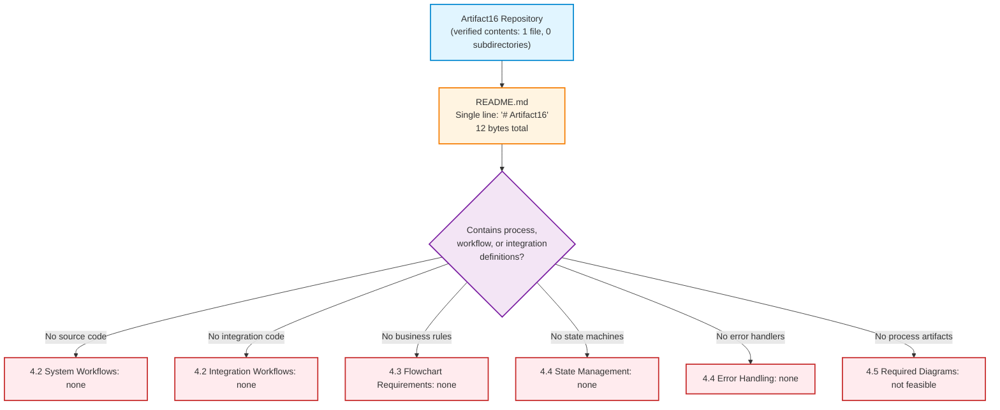

## 4.2 SYSTEM WORKFLOWS

### 4.2.1 Core Business Processes Status

The section prompt requests documentation of end-to-end user journeys, system interactions, decision points, and error handling paths. Each of these requires an articulated business process with defined actors, steps, and outcomes. The repository documents **no business processes whatsoever**.

Section 2.2 of this Technical Specification (Feature Catalog) records zero features. Section 1.3.1 records that no must-have capabilities, no primary user workflows, no essential integrations, and no key technical requirements are documented. Section 1.2.2 records that "No system capabilities are presently implemented or described."

The mapping between each prompt-required subtopic and the corresponding evidentiary status is recorded below.

| Required Subtopic | Source That Would Be Required | Observed in Repository | Corroborating Section |
|-------------------|-------------------------------|------------------------|------------------------|
| End-to-end user journeys | User stories, journey maps, UI flow code | None | Section 1.3.1, Section 2.2 |
| System interactions | Service-to-service contracts, internal API specs | None | Section 1.2.1, Section 2.4.3 |
| Decision points | Conditional business logic in source code | None | Section 1.2.2 |
| Error handling paths | Exception handlers, error middleware, recovery code | None | Section 1.2.2, Section 2.5.3 |

The Core Business Processes inventory is therefore recorded as **empty**.

### 4.2.2 Integration Workflows Status

The section prompt requests documentation of data flow between systems, API interactions, event processing flows, and batch processing sequences. Each of these requires an articulated integration topology with defined endpoints, protocols, message shapes, and orchestration logic. The repository documents **no integration workflows whatsoever**.

Section 1.2.1 records that "the repository contains no integration code, no API client libraries, no service definitions, no connector implementations, no environment configuration referencing external services, no authentication scaffolding for third-party systems, and no architecture diagrams depicting integration points." Section 2.4.3 confirms that "No integration points are documented." Section 3.5 (Third-Party Services) records zero third-party services integrated.

| Required Subtopic | Source That Would Be Required | Observed in Repository | Corroborating Section |
|-------------------|-------------------------------|------------------------|------------------------|
| Data flow between systems | Integration source code, ETL pipelines, event streams | None | Section 1.2.1, Section 2.4.3 |
| API interactions | OpenAPI specs, HTTP client code, SDK imports | None | Section 1.2.1, Section 3.5 |
| Event processing flows | Event handlers, message consumers, pub/sub bindings | None | Section 1.2.2 |
| Batch processing sequences | Scheduler configurations, cron definitions, batch scripts | None | Section 1.2.2, Section 3.7 |

The Integration Workflows inventory is therefore recorded as **empty**.

## 4.3 FLOWCHART REQUIREMENTS

### 4.3.1 Core Flowchart Elements Status

The section prompt enumerates a set of elements that must be present in each major workflow: start and end points, process steps, decision diamonds, system boundaries, user touchpoints, error states and recovery paths, and timing/SLA considerations. Each of these elements presumes the existence of an underlying workflow to be diagrammed. As established in Section 4.2.1 and Section 4.2.2 above, no workflows exist in the repository.

The element-by-element evidentiary status is recorded below.

| Flowchart Element | Source That Would Be Required | Observed in Repository | Corroborating Section |
|-------------------|-------------------------------|------------------------|------------------------|
| Start and end points | Defined workflows with explicit entry/exit | None | Section 2.2, Section 1.3.1 |
| Process steps | Implementation source code performing discrete operations | None | Section 1.2.2 |
| Decision diamonds | Conditional logic, rule-engine definitions | None | Section 1.2.2 |
| System boundaries | Architecture diagrams, deployment topology | None | Section 1.2.1, Section 1.2.2 |
| User touchpoints | UI code, API endpoints, CLI definitions | None | Section 1.2.2 |
| Error states / recovery paths | Error handlers, recovery routines | None | Section 2.5.3 |
| Timing / SLA considerations | Service-Level Objectives, latency budgets, throughput targets | None | Section 1.2.3, Section 2.5.2 |

The Core Flowchart Elements inventory is therefore recorded as **empty**. No flowchart can be produced because the seven structural elements above all lack source material.

### 4.3.2 Validation Rules Status

The section prompt requests documentation of business rules at each step, data validation requirements, authorization checkpoints, and regulatory compliance checks. The repository documents **none of these**.

Section 2.3.4 of this Technical Specification records the foundational finding for this subsection: no business rules, data validation logic, security policies, or compliance requirements are documented in the repository. Section 1.2.1 records that no authentication scaffolding for third-party systems is present. Section 2.5.3 records that no compliance regime is referenced in the repository.

| Validation Rule Category | Source That Would Be Required | Observed in Repository | Corroborating Section |
|--------------------------|-------------------------------|------------------------|------------------------|
| Business rules at each step | Rule-engine definitions, validation code | None | Section 2.3.4 |
| Data validation requirements | Schema files, validator classes, input sanitization | None | Section 1.3.1, Section 2.3.4 |
| Authorization checkpoints | Authentication middleware, IAM policies, RBAC tables | None | Section 1.2.1, Section 3.5 |
| Regulatory compliance checks | Compliance policy documents, audit logging | None | Section 2.5.3 |

The Validation Rules inventory is therefore recorded as **empty**.

## 4.4 TECHNICAL IMPLEMENTATION

### 4.4.1 State Management Status

The section prompt requests documentation of state transitions, data persistence points, caching requirements, and transaction boundaries. Each of these requires concrete source-code or configuration artifacts that define how state is represented, persisted, cached, and transactionally bracketed. The repository contains **no such artifacts**.

Section 1.2.2 records that the repository contains no source code modules, no service implementations, and no executable code. Section 3.6 (Databases & Storage) records zero database connections, schemas, ORM mappings, or storage SDK initialization. Section 1.3.1 records that no data domains are included and that no data models or schemas are present.

| State Management Element | Source That Would Be Required | Observed in Repository | Corroborating Section |
|--------------------------|-------------------------------|------------------------|------------------------|
| State transitions | State machine code, statechart definitions, transition handlers | None | Section 1.2.2 |
| Data persistence points | Repository classes, ORM mappings, database calls | None | Section 3.6, Section 1.3.1 |
| Caching requirements | Cache SDK initialization, cache-aside patterns, HTTP cache headers | None | Section 3.6 |
| Transaction boundaries | Transaction managers, unit-of-work patterns, saga orchestrators | None | Section 1.2.2 |

The State Management inventory is therefore recorded as **empty**.

### 4.4.2 Error Handling Status

The section prompt requests documentation of retry mechanisms, fallback processes, error notification flows, and recovery procedures. Each of these requires concrete source-code or operational artifacts. The repository contains **no such artifacts**.

Section 1.2.2 records the absence of all executable code. Section 2.5.3 records that "No maintenance requirements are documented. There is no operational runbook, no upgrade procedure, no patching cadence, no support tier definition, and no end-of-life policy present in the repository." Section 1.2.3 records that no KPIs, metrics definitions, observability requirements, or service-level objectives are defined.

| Error Handling Element | Source That Would Be Required | Observed in Repository | Corroborating Section |
|------------------------|-------------------------------|------------------------|------------------------|
| Retry mechanisms | Retry libraries (e.g., exponential backoff implementations) | None | Section 1.2.2 |
| Fallback processes | Circuit breakers, fallback handlers, default-value providers | None | Section 1.2.2 |
| Error notification flows | Alerting integrations, notification SDKs, paging configurations | None | Section 1.2.3, Section 2.5.3 |
| Recovery procedures | Operational runbooks, recovery scripts, disaster-recovery plans | None | Section 2.5.3 |

The Error Handling inventory is therefore recorded as **empty**.

## 4.5 REQUIRED DIAGRAMS

### 4.5.1 Feasibility of the Required Diagram Set

The section prompt requests five categories of Mermaid.js diagrams: a high-level system workflow, detailed process flows for each core feature, error handling flowcharts, integration sequence diagrams, and state transition diagrams. The feasibility of each diagram type is assessed below against the repository's verified evidence base.

| Required Diagram | Source That Would Be Required | Feasibility | Evidentiary Basis |
|------------------|-------------------------------|-------------|--------------------|
| High-level system workflow | A defined system with at least one workflow | **Not feasible** | Section 1.2.2 — no system capabilities, no executable code |
| Detailed process flows per core feature | A non-empty feature catalog | **Not feasible** | Section 2.2 — zero features cataloged |
| Error handling flowcharts | Defined error-handling code paths | **Not feasible** | Section 4.4.2 — no error handling artifacts |
| Integration sequence diagrams | Defined integration endpoints and protocols | **Not feasible** | Section 2.4.3 — no integration points documented |
| State transition diagrams | State machine or statechart definitions | **Not feasible** | Section 4.4.1 — no state-management artifacts |

In the absence of substantive source material, fabricating any of the five required diagrams would violate the No-Fabrication Constraint and the No-Inference Constraint as established in Section 2.7.2 and reaffirmed in Section 3.8.2. Therefore, the diagrams cannot be produced in their substantive form in this revision of the Technical Specification.

### 4.5.2 Required-vs-Observed Mapping Diagram

The diagram below visualizes the mapping between the five diagram types required by the prompt and the (absent) evidentiary basis for each. It serves as the structural placeholder for the diagrams that cannot be produced, in keeping with the visualization precedent set in Sections 2.1.4, 3.1.4, and 3.8.3.

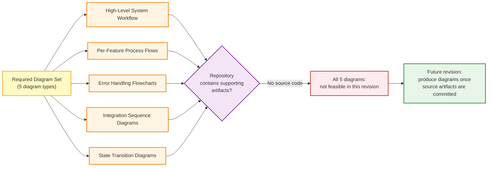

### 4.5.3 Treatment of Generic Process Patterns and Default Workflow Templates

A precedent for handling externally supplied authoring context exists in Section 3.8.3, where a Default Technology Stack provided in authoring context was explicitly **not** asserted as the actual stack of the Artifact16 project. The same treatment applies to any generic process patterns, default workflow templates, or canonical software-engineering flowcharts (e.g., generic CRUD flows, generic authentication sequences, generic order-fulfillment processes) that may be supplied as authoring context or recalled from external knowledge.

Under the Evidence Constraint and No-Inference Constraint inherited by this section, **no generic process pattern may be asserted as a workflow of the Artifact16 project**. No artifact in the repository references any specific process, no source code implements any flow, and no configuration declares any orchestration. Generic process patterns, if supplied externally, are retained strictly as authoring context for future revisions and do not constitute current process documentation for the project.

## 4.6 ASSUMPTIONS, CONSTRAINTS, AND FORWARD-LOOKING NOTES

### 4.6.1 Documented Assumptions

The single assumption underlying this section is that the repository state observed at the time of authoring is the complete and authoritative source of evidence for process and workflow determinations. This assumption is consistent with the verification activities recorded in Section 4.1.3, with the precedent verification activities in Sections 2.1.3 and 3.1.3, and with the documentation boundary conditions in Section 1.3.3. No additional assumptions about project workflows, integration patterns, state-management strategies, error-handling policies, or SLA commitments have been adopted, in accordance with the precedent set by Sections 2.7.1 and 3.8.1.

### 4.6.2 Documented Constraints

The constraints under which this section was authored mirror those recorded in Sections 2.7.2 and 3.8.2 and are reproduced and adapted below for the Process Flowchart context.

| Constraint | Description as Applied to Section 4 |
|------------|--------------------------------------|
| Evidence Constraint | Section content is restricted to verifiable repository contents; workflows, integrations, decision points, state transitions, and error-handling paths may not be claimed absent supporting artifacts. |
| No-Fabrication Constraint | Specific workflow names, process IDs, step identifiers, decision-rule names, error codes, retry policies, transaction boundary markers, and SLA values may not be invented to satisfy section prompt categories. |
| No-Inference Constraint | Processes may not be inferred from the project name, from generic patterns observed in similar projects, or from default workflow templates supplied in authoring context. |
| Precedent Constraint | Structure must mirror Sections 1.1, 1.2, 1.3, 2, and 3 — namely, evidence-based acknowledgement of absence with forward-looking notes identifying required future artifacts. |
| Diagram-Production Constraint | The section prompt's requirement to produce a specified set of Mermaid.js diagrams cannot be satisfied with substantive content because no underlying processes exist; producing fabricated diagrams would violate the Evidence and No-Fabrication Constraints. |
| Swim-Lane Constraint | The section prompt's request to include swim lanes for different actors/systems cannot be satisfied, because no actors and no systems have been defined in the repository. |
| Timing-Constraint Constraint | The section prompt's request to include timing constraints where applicable cannot be satisfied, because Section 1.2.3 records that no service-level objectives, latency targets, or throughput targets are defined. |

### 4.6.3 Forward-Looking Note and Path to Population

This Section 4 will require complete redrafting once the **Artifact16** repository contains substantive artifacts from which processes and workflows can be extracted and diagrammed. The minimum artifacts that would enable population of each subsection in a future revision are listed below.

| Artifact to be Added | Section 4 Subsection It Would Populate |
|----------------------|------------------------------------------|
| Source code implementing business logic, with entry points, decision branches, and exit paths | 4.2.1 Core Business Processes (and 4.5.1 High-Level System Workflow, 4.5.2 Detailed Process Flows) |
| Integration code: API client libraries, message consumers, scheduler definitions, ETL pipelines | 4.2.2 Integration Workflows (and 4.5.4 Integration Sequence Diagrams) |
| Architecture diagrams or deployment topology defining system boundaries and user touchpoints | 4.3.1 Core Flowchart Elements |
| Business rule definitions, validation schemas, authorization middleware, and compliance policy artifacts | 4.3.2 Validation Rules |
| State machine or statechart code, persistence configuration (databases, caches), transaction-management code | 4.4.1 State Management (and 4.5.5 State Transition Diagrams) |
| Error-handling middleware, retry libraries, circuit-breaker configurations, alerting integrations, operational runbooks | 4.4.2 Error Handling (and 4.5.3 Error Handling Flowcharts) |
| Service-Level Objectives, latency budgets, throughput targets, and timing/SLA specifications | 4.3.1 Timing and SLA Considerations |

Upon the addition of these artifacts, the Section 4 author should remove the "no items present" acknowledgements and replace them with source-grounded entries that include workflow names, swim lanes for each defined actor or system, decision diamonds for each conditional, system boundaries derived from the architecture, user touchpoints derived from the UI/API layer, error states derived from observed handlers, and timing annotations derived from observed SLA definitions. The methodological framing in Section 4.1 should be retained as a historical record of the section's original empty state, consistent with the guidance offered in Sections 2.7.3 and 3.8.4.

### 4.6.4 Version Tracking Note

The section prompt does not explicitly request version tracking for processes; however, the precedent established by Section 2.7.4 and Section 3.8.5 calls for version discipline once substantive content is added. When workflows are introduced in a future revision, each workflow should carry an identifier (e.g., `WF-XXX`) and a version field beginning at 1.0 and incrementing per the project's change-management process — which itself is not yet defined in the repository.

## 4.7 REFERENCES

### 4.7.1 Files Examined

- `README.md` — The sole file in the repository, containing a single line (`# Artifact16`). Confirmed to contain no process descriptions, no workflow definitions, no integration topology, no state-machine artifacts, no error-handling logic, no SLA declarations, and no flowchart references. This file is the exclusive evidence base for every absence claim in Section 4.

### 4.7.2 Folders Explored

- `` (repository root, depth 0) — The only directory level in the repository. Verified to contain exactly one direct child (`README.md`) and zero subdirectories. The absence of conventional subdirectories such as `src/`, `lib/`, `app/`, `services/`, `workflows/`, `integrations/`, `handlers/`, `state/`, `events/`, `tests/`, or `docs/` is the evidence basis for the empty-inventory statements throughout Sections 4.2 through 4.5. The repository's physical hierarchy depth of one level precludes deeper traversal.

### 4.7.3 Technical Specification Sections Cross-Referenced

- **Section 1.1 EXECUTIVE SUMMARY** — Established the sole identifying fact about the project (its name) and confirmed the absence of business problem context, stakeholders, and value proposition that would frame process documentation.
- **Section 1.2 SYSTEM OVERVIEW** — Provided the most direct corroborating evidence for the empty-process findings, via Section 1.2.1 (no integration code, no API client libraries, no service definitions, no connector implementations, no authentication scaffolding) and Section 1.2.2 (no system capabilities, no executable code, no runnable scripts, no entry points, no user-facing interfaces, no service definitions). Section 1.2.3 provided the evidentiary basis for the absence of KPIs, metrics, observability, and SLA definitions. Specifically referenced in Sections 4.1.2, 4.2.1, 4.2.2, 4.3.1, 4.4.1, and 4.4.2.
- **Section 1.3 SCOPE** — Provided the Documentation Boundary Conditions confirming zero subdirectories, zero configuration files, zero CI/CD definitions, and zero supplementary documentation. Section 1.3.1 confirmed that no primary user workflows are documented. Specifically referenced in Sections 4.1.2, 4.2.1, and 4.3.2.
- **Section 2.1 SECTION PREAMBLE AND EVIDENCE BASIS** — Established the methodological pattern of "structural acknowledgement of absent evidence rather than fabrication" that Section 4 follows, and recorded the semantic searches that confirmed the absence of source modules and configuration. Specifically referenced in Sections 4.1.2 and 4.1.3.
- **Section 2.2 FEATURE CATALOG** — Recorded zero features cataloged. Specifically referenced in Sections 4.2.1, 4.3.1, and 4.5.1.
- **Section 2.3 FUNCTIONAL REQUIREMENTS TABLE** — Recorded via Section 2.3.4 that no business rules, data validation logic, security policies, or compliance requirements are documented. Specifically referenced in Section 4.3.2.
- **Section 2.4 FEATURE RELATIONSHIPS** — Recorded via Section 2.4.3 that no integration points are documented, no shared components exist, and no common services have been implemented. Specifically referenced in Sections 4.2.2 and 4.5.1.
- **Section 2.5 IMPLEMENTATION CONSIDERATIONS** — Recorded via Section 2.5.2 the absence of performance requirements, latency targets, throughput targets, and service-level objectives; and via Section 2.5.3 the absence of operational runbooks, security implications, and maintenance procedures. Specifically referenced in Sections 4.3.1 and 4.4.2.
- **Section 2.6 TRACEABILITY MATRIX** — **The most directly relevant prior section.** Section 2.6.3 explicitly declared that "No process flowcharts can be referenced because no processes are defined in the repository," anticipating and constraining Section 4. Specifically referenced in Section 4.1.2.
- **Section 2.7 ASSUMPTIONS, CONSTRAINTS, AND FORWARD-LOOKING NOTES** — Provided the constraint framework (Evidence Constraint, No-Fabrication Constraint, No-Inference Constraint, Precedent Constraint) that Section 4.6.2 inherits and adapts. Specifically referenced in Sections 4.5.1 and 4.6.2.
- **Section 3.1 SECTION PREAMBLE AND EVIDENCE BASIS** — Reinforced the absence methodology and provided detailed verification activity tables that Section 4.1.3 mirrors.
- **Section 3.5 THIRD-PARTY SERVICES** — Confirmed zero third-party services integrated, supporting the absence of integration workflows. Specifically referenced in Sections 4.2.2 and 4.3.2.
- **Section 3.6 DATABASES & STORAGE** — Confirmed zero database connections, schemas, ORM mappings, and storage SDK initialization. Specifically referenced in Section 4.4.1.
- **Section 3.7 DEVELOPMENT & DEPLOYMENT** — Confirmed zero CI/CD pipeline definitions and zero scheduler/batch artifacts. Specifically referenced in Section 4.2.2.
- **Section 3.8 ASSUMPTIONS, CONSTRAINTS, AND FORWARD-LOOKING NOTES** — Provided the precedent for treating externally supplied authoring context (e.g., default workflow templates or generic process patterns) as non-asserted context. Specifically referenced in Section 4.5.3.
- **Section 3.9 REFERENCES** — Provided the comprehensive reference-format template that Section 4.7 mirrors.

### 4.7.4 Searches Performed

The verification activities enumerated in Section 4.1.3 are recorded here for traceability, together with prior searches conducted during the preparation of Sections 1, 2, and 3 that remain relevant to Section 4:

- Filesystem enumeration: repository root directory listing — 1 file, 0 subdirectories
- Filesystem inspection: `README.md` byte-level read — 12 bytes, single line `# Artifact16`
- Source code extension search: workflow / business logic source files — 0 matches
- API contract pattern search: OpenAPI / Swagger / gRPC / GraphQL schema files — 0 matches
- State machine pattern search: statechart definitions, finite-state-machine code — 0 matches
- Event handler pattern search: message consumers, pub/sub bindings — 0 matches
- Integration pattern search: HTTP clients, SDK imports, connectors — 0 matches
- Scheduler pattern search: cron files, scheduler configurations, batch scripts — 0 matches
- Resilience pattern search: circuit breakers, retry libraries, dead-letter queue configs — 0 matches
- Transaction boundary pattern search: `@Transactional` annotations, saga orchestrators — 0 matches
- Persistence pattern search: database calls, ORM mappings, repository classes — 0 matches
- Observability pattern search: tracing instrumentation, metrics exporters, SLA definitions — 0 matches
- Process documentation search: BPMN files, sequence diagrams, swim-lane diagrams, runbooks — 0 matches
- Semantic search: "workflow process business logic implementation" — 0 results
- Semantic search: "API integration service endpoint flow" — 0 results
- Semantic search: "state machine transition event handler" — 0 results
- Semantic search: "configuration script entry point main" — 0 results
- Semantic search: "README documentation project description" — 0 results
- Folder search: "source code application modules services" — 0 results

### 4.7.5 Web Searches Performed

- None. No web research was required, as Section 4's factual basis is entirely contained within the repository itself and within the cross-referenced sections of this Technical Specification. No external claims about specific workflows, integrations, processes, state machines, error-handling policies, or SLA values have been made in Section 4.

# 5. System Architecture

## 5.1 SECTION PREAMBLE AND EVIDENCE BASIS

### 5.1.1 Purpose of This Section

This section is intended to document the System Architecture of the **Artifact16** project. The section prompt establishes four mandatory documentation categories: (1) **High-Level Architecture** (covering the system overview, core components, data flow description, and external integration points); (2) **Component Details** (covering per-component purpose, technologies, interfaces, persistence, scaling, and detailed component-interaction, state-transition, and sequence diagrams); (3) **Technical Decisions** (covering architecture style decisions and tradeoffs, communication pattern choices, data storage rationale, caching strategy, security mechanism selection, and architecture decision records); and (4) **Cross-Cutting Concerns** (covering monitoring/observability, logging/tracing, error-handling patterns, authentication and authorization, performance and SLA requirements, disaster-recovery procedures, and error-handling flow diagrams).

Each element above is expected to be derived from verifiable repository artifacts — typically source code modules, service definitions, API contracts, integration code, deployment manifests, infrastructure-as-code definitions, configuration files, architecture diagrams, decision logs, observability instrumentation, security middleware, and accompanying design documentation — rather than from generic architectural patterns or external default templates.

The section prompt's leading instruction is explicit: *"Only include sections and items that are actually relevant to this system, based on your analysis of its requirements. Don't add any items that aren't clearly applicable."* Section 5 honors this instruction by recording an evidence-grounded determination for each prompted category, in keeping with the methodological precedent set by Sections 1.1, 1.2, 1.3, 2 (in its entirety), 3 (in its entirety), and 4 (in its entirety) of this Technical Specification.

### 5.1.2 State of the Evidence Base

As established in Sections 1.1, 1.2, and 1.3 of this Technical Specification, and as corroborated by Sections 2.1.2, 3.1.2, and 4.1.2, the **Artifact16** repository contains exactly one file (`README.md`), which itself contains a single line of Markdown comprising the project name. There are no source code modules, no service implementations, no API contracts, no state machine definitions, no event handlers, no integration code, no configuration files, no infrastructure-as-code artifacts, no CI/CD pipeline definitions, no test suites, no observability instrumentation, no security middleware, and no architecture diagrams within the repository.

Section 1.2.2 explicitly records that "No system capabilities are presently implemented or described. The repository contains no executable code, no runnable scripts, no entry points, no user-facing interfaces, and no service definitions." Section 1.2.2 further records that "no architectural style declaration, no framework selection evidence, no programming language indicator beyond the Markdown syntax of the README itself, no platform targeting, and no deployment topology description" is present in the repository.

Section 1.2.1 explicitly records that "the repository contains no integration code, no API client libraries, no service definitions, no connector implementations, no environment configuration referencing external services, no authentication scaffolding for third-party systems, and no architecture diagrams depicting integration points." Section 2.4.3 confirms that "No integration points are documented... No shared components are documented... No common services are documented." Section 2.5.3 confirms the absence of scalability considerations, security implications, and maintenance requirements. Section 3.6 confirms zero database connections, schemas, ORM mappings, or storage SDK initialization. Section 4.4.1 confirms the empty state of state-management artifacts, persistence points, caching, and transaction boundaries. Section 4.4.2 confirms the empty state of retry mechanisms, fallback processes, error-notification flows, and recovery procedures.

Consequently, the standard inputs required to populate a System Architecture section — namely, defined components, articulated interfaces, integration topology, deployment views, data flows, persistence schemas, caching strategies, communication patterns, decision logs, observability instrumentation, authentication and authorization mechanisms, performance budgets, and disaster-recovery plans — are entirely absent from the source materials available to this Technical Specification.

This section therefore follows the methodological precedent established by Sections 1.1, 1.2, 1.3, 2 (in its entirety), 3 (in its entirety), and 4 (in its entirety): **structural acknowledgement of absent evidence rather than fabrication**. Each required subsection from the prompt is addressed explicitly with an evidence-grounded statement of absence and a forward-looking note identifying what artifacts would be required to populate it in a future revision.

### 5.1.3 Verification of Architectural Indicators

The table below records the verification activities performed to confirm the absence of architectural indicators in the repository. These activities were undertaken specifically to ensure that no components, integrations, decisions, or cross-cutting concerns were overlooked through superficial inspection.

| Verification Activity | Target | Result |
|-----------------------|--------|--------|
| Repository root enumeration | All files and subdirectories | 1 file (`README.md`), 0 subdirectories |
| `README.md` byte-level inspection | Full file contents | 12 bytes; single line `# Artifact16` |
| Component / service search | Source modules, service implementations, module definitions | 0 matches |
| Integration code search | API clients, SDK imports, connector implementations | 0 matches |
| Configuration / deployment search | `.env`, `.yaml`, `.json`, `.toml`, container, IaC files | 0 matches |
| Observability search | Tracing instrumentation, metrics exporters, log shippers | 0 matches |
| Error-handling search | Error middleware, retry libraries, circuit breakers, DLQ configs | 0 matches |
| Authentication / authorization search | Auth middleware, IAM policies, identity-provider integrations | 0 matches |
| Architecture documentation search | ADRs, design documents, architecture diagrams | 0 matches |
| Data flow / persistence search | Database schemas, ORM mappings, cache configurations, message brokers | 0 matches |
| Semantic search: "architecture component service module implementation" | Repository-wide | 0 results |
| Semantic search: "authentication authorization security middleware" | Repository-wide | 0 results |
| Semantic search: "configuration deployment infrastructure" | Repository-wide | 0 results |
| Semantic search: "monitoring observability logging error handling" | Repository-wide | 0 results |
| Semantic search: "data flow integration interface API" | Repository-wide | 0 results |
| Folder search: "source code application services modules" | Repository-wide | 0 results |

Under these verified conditions, the four mandatory documentation categories of Section 5 cannot be populated with substantive system architecture content. The remainder of this section records this state in the structural form requested by the section prompt.

### 5.1.4 Visual Representation of the Architecture Inventory State

The diagram below depicts the present state of the architecture inventory available to this Technical Specification. It is included to make the absent evidence base unambiguous to readers of this section, mirroring the visualization approach established in Sections 2.1.4, 3.1.4, and 4.1.4. Color conventions are consistent with prior sections of this Technical Specification: blue denotes the repository root, orange denotes the sole observed file, purple denotes the evidence-evaluation decision point, and red denotes empty-inventory outcomes.

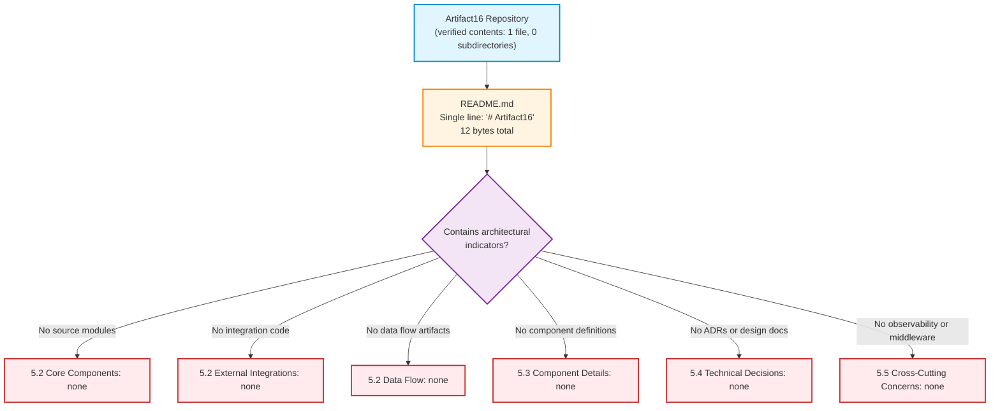

## 5.2 HIGH-LEVEL ARCHITECTURE

### 5.2.1 System Overview

The section prompt requests a detailed textual description of the overall system architecture style and rationale, key architectural principles and patterns, and system boundaries and major interfaces.

**Overall system architecture style and rationale.** No architecture style is asserted, declared, or implied by any artifact in the repository. Section 1.2.2 explicitly records the absence of an architectural style declaration; the repository contains no manifest, configuration, source code, or design document that would identify the project as monolithic, microservices, event-driven, serverless, layered, hexagonal, modular monolith, service-oriented, peer-to-peer, or any other style. No rationale can be presented for an architectural style that has not been chosen.

**Key architectural principles and patterns.** No architectural principles have been articulated in the repository. There are no design documents, no decision records, no `PRINCIPLES.md`, no `ARCHITECTURE.md`, and no inline code comments asserting design tenets. Consequently, no pattern catalog (e.g., CQRS, event sourcing, ports-and-adapters, repository pattern, dependency injection) can be claimed.

**System boundaries and major interfaces.** Section 1.3.1 records the currently observable system boundary in tabular form: it consists of "a single file: `README.md` at the repository root." No user groups, geographic coverage, or data domains are specified. Section 1.2.1 records that there are no integration points, no API client libraries, no service definitions, no connector implementations, and no architecture diagrams depicting integration points. Therefore, no major interfaces exist to document, and the system boundary is reported solely as the single Markdown file present in the repository.

The High-Level Architecture overview is therefore recorded as **not established**, in accordance with the Evidence Constraint and the No-Inference Constraint enumerated in Section 5.6.2.

### 5.2.2 Core Components

The section prompt requests a four-column table enumerating Component Name, Primary Responsibility, Key Dependencies, and Critical Considerations. Because no components exist in the repository, the registry is recorded as empty. The table below presents the requested column structure with the verified empty state.

| Component Name | Primary Responsibility | Key Dependencies | Critical Considerations |
|----------------|------------------------|------------------|--------------------------|
| None documented | Not applicable | Not applicable | Inventory empty — see Section 5.6.3 for path to population |

The empty state is corroborated by Section 1.2.2 (no source code modules, no service implementations, no executable code), Section 2.4.3 (no shared components, no common services), and Section 4.4.1 (no state-management or persistence components). Per the No-Fabrication Constraint enumerated in Section 5.6.2, no component names, responsibilities, dependencies, or considerations may be invented to populate this registry.

### 5.2.3 Data Flow Description

The section prompt requests clear prose covering primary data flows between components, integration patterns and protocols, data transformation points, and key data stores and caches.

**Primary data flows between components.** No data flows can be described, because no components exist between which data could flow. Section 2.4.3 records the absence of integration points, shared components, and common services. Section 1.2.2 records the absence of all source code, executable scripts, and service definitions. The data-flow inventory is therefore recorded as empty.

**Integration patterns and protocols.** No integration patterns (e.g., request/response, publish/subscribe, request/reply, event streaming, batch ETL, file transfer) are documented. No protocols (e.g., HTTP/REST, gRPC, GraphQL, AMQP, MQTT, Kafka, WebSocket) are referenced by any artifact in the repository. Section 1.2.1 confirms the absence of all integration code and connector implementations.

**Data transformation points.** No data transformation points are documented. There are no schemas, no mapping definitions, no data-pipeline configurations, no validation logic, and no enrichment handlers in the repository. Section 2.3 (Functional Requirements Table, as cross-referenced in Sections 4.3.2 and 4.4.1) records the absence of data models and validation logic.

**Key data stores and caches.** No data stores and no caches are documented. Section 3.6 (Databases & Storage) records zero database connections, zero schemas, zero ORM mappings, and zero storage SDK initialization. Section 4.4.1 records the absence of caching requirements and cache-aside patterns. The data-store and cache inventories are both recorded as empty.

### 5.2.4 External Integration Points

The section prompt requests a four-column table enumerating System Name, Integration Type, Data Exchange Pattern, and Protocol/Format, together with SLA Requirements. Because no external integration points exist in the repository, the registry is recorded as empty. The table below presents the requested column structure with the verified empty state; the SLA Requirements dimension is folded into the Critical Considerations column to honor the four-column maximum specified in the section prompt's output format requirements.

| System Name | Integration Type | Data Exchange Pattern | Protocol/Format & SLA |
|-------------|------------------|------------------------|------------------------|
| None documented | Not applicable | Not applicable | Inventory empty — Section 1.2.3 records no SLA targets |

The empty state is corroborated by Section 1.2.1 (no integration code, no API client libraries, no connector implementations, no authentication scaffolding for third-party systems, no architecture diagrams depicting integration points), Section 2.4.3 (no integration points documented), Section 3.5 (no third-party services integrated), and Section 1.2.3 (no service-level objectives, no measurement frameworks). Per the No-Fabrication Constraint, no external system names, integration types, exchange patterns, protocols, formats, or SLA values may be invented.

## 5.3 COMPONENT DETAILS

### 5.3.1 Component Inventory Status

The section prompt requests per-component specifications for purpose and responsibilities, technologies and frameworks used, key interfaces and APIs, data persistence requirements, and scaling considerations. The table below maps each per-component documentation element to its source-of-truth requirement and to the verified empty state of the repository.

| Per-Component Element | Source That Would Be Required | Observed in Repository | Corroborating Section |
|-----------------------|-------------------------------|------------------------|------------------------|
| Purpose and responsibilities | Component documentation, code annotations, design records | None | Section 1.2.2, Section 2.2 |
| Technologies and frameworks | Dependency manifests, import statements, runtime declarations | None | Section 3.2, Section 3.3, Section 3.4 |
| Key interfaces and APIs | API contracts (OpenAPI, gRPC, GraphQL), interface definitions | None | Section 2.3 (via cross-reference) |
| Data persistence requirements | Database schemas, ORM mappings, migration files | None | Section 3.6, Section 4.4.1 |
| Scaling considerations | Capacity plans, autoscaling configs, load profiles | None | Section 2.5.3 |

Because the component inventory itself is empty (see Section 5.2.2), there are no components against which the above elements can be specified. The Component Details registry is therefore recorded as **empty**.

### 5.3.2 Feasibility of Component-Level Diagrams

The section prompt requires three categories of Mermaid.js diagrams under Component Details: detailed component interaction diagrams, state transition diagrams, and sequence diagrams for key flows. The feasibility of each is assessed below against the verified evidence base.

| Required Diagram | Source That Would Be Required | Feasibility | Evidentiary Basis |
|------------------|-------------------------------|-------------|--------------------|
| Detailed component interaction diagram | Defined components and their interactions | **Not feasible** | Section 5.2.2 — inventory empty; Section 1.2.2 |
| State transition diagram | State machine code, statechart definitions | **Not feasible** | Section 4.4.1 — no state-management artifacts |
| Sequence diagrams for key flows | Defined flows between named components | **Not feasible** | Section 4.5.1 — no flows defined; Section 2.4.3 |

In the absence of substantive source material, fabricating any of these diagrams would violate the No-Fabrication Constraint and the No-Inference Constraint enumerated in Section 5.6.2 and originally established in Section 2.7.2 (with reaffirmations in Sections 3.8.2 and 4.6.2). The precedent set by Section 4.5.1 — that the required-diagram set "cannot be produced in their substantive form in this revision" when underlying evidence is absent — applies directly to Section 5.

### 5.3.3 Required-vs-Observed Mapping Diagram for Component Diagrams

The diagram below visualizes the mapping between the three diagram types required under Component Details and the (absent) evidentiary basis for each. It serves as the structural placeholder for the diagrams that cannot be produced, in keeping with the visualization precedent set in Sections 2.1.4, 3.1.4, 3.8.3, 4.1.4, and 4.5.2.

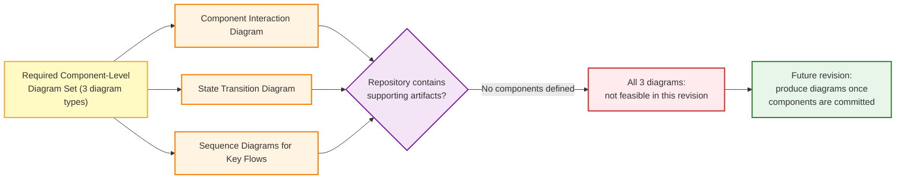

## 5.4 TECHNICAL DECISIONS

### 5.4.1 Architecture Decision Inventory Status

The section prompt requests documented and justified treatments of architecture style decisions and tradeoffs, communication pattern choices, data storage solution rationale, caching strategy justification, and security mechanism selection. The table below maps each required decision category to its source-of-truth requirement and to the verified empty state of the repository.

| Required Decision Category | Source That Would Be Required | Observed in Repository | Corroborating Section |
|-----------------------------|-------------------------------|------------------------|------------------------|
| Architecture style decisions and tradeoffs | Architecture decision records (ADRs), design documents | None | Section 1.2.2 |
| Communication pattern choices | Code/configuration choosing synchronous vs. asynchronous patterns | None | Section 1.2.1, Section 1.2.2 |
| Data storage solution rationale | Database technology selection notes, storage SDK choices | None | Section 3.6 |
| Caching strategy justification | Cache SDK configurations, TTL policies, cache-aside patterns | None | Section 3.6, Section 4.4.1 |
| Security mechanism selection | Auth code, security configurations, IAM policy artifacts | None | Section 2.5.3, Section 3.5 |

No decision in any of these categories has been recorded, justified, or implied by any artifact in the repository. The Technical Decisions registry is therefore recorded as **empty**.

### 5.4.2 Treatment of Default and Externally Supplied Architecture Templates

A precedent for handling externally supplied authoring context exists in Section 3.8.3, where a "Default Technology Stack" provided as authoring context was explicitly **not** asserted as the actual stack of the Artifact16 project. The same treatment, reaffirmed in Section 4.5.3 for generic process patterns, applies here to architectural defaults: any default architecture style, canonical communication-pattern recommendation, generic data-storage selection (e.g., relational versus document versus key-value), generic caching strategy (e.g., write-through versus cache-aside versus read-through), or default security mechanism (e.g., OAuth 2.0, JWT-based session management, role-based access control) that may be supplied as authoring context or recalled from external knowledge.

Under the Evidence Constraint and No-Inference Constraint inherited by this section, **no default architecture template may be asserted as a decision of the Artifact16 project**. No artifact in the repository references any specific architectural style, communication pattern, data store, cache, or security mechanism. Default templates, if supplied externally, are retained strictly as authoring context for future revisions and do not constitute current architectural decisions for the project. The relationship between externally supplied defaults and the present section's evidence basis is depicted below, adapting the visualization established in Section 3.8.3.

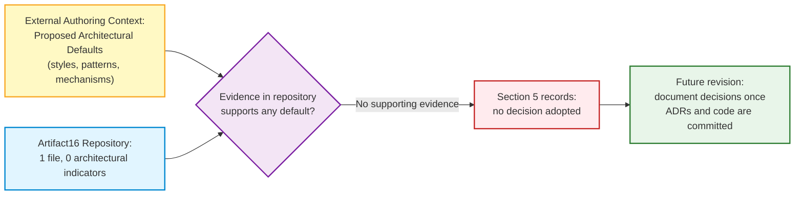

### 5.4.3 Architecture Decision Records (ADRs) Status

The section prompt requires ADRs as part of the Technical Decisions documentation set. An Architecture Decision Record traditionally captures the context, the decision, the alternatives considered, the chosen option, and the consequences and tradeoffs of a single architecturally significant decision. The Artifact16 repository contains no `docs/adr/` directory, no `decisions/` directory, no Markdown-Any-Decision-Records artifact, and no inline decision-log statements within any file (the sole file `README.md` consists solely of the H1 line `# Artifact16`).

The ADR inventory is therefore recorded as **empty**. The table below presents the structural form an ADR registry will take in a future revision, with the verified empty state recorded for the present revision.

| ADR ID | Decision Title | Status | Date Adopted |
|--------|----------------|--------|---------------|
| None recorded | Not applicable | Not applicable | Not applicable |

Per the No-Fabrication Constraint enumerated in Section 5.6.2, no ADR identifiers, titles, statuses, or dates may be invented to populate this registry.

### 5.4.4 Decision Tree Feasibility

The section prompt requires a decision tree diagram as part of the Technical Decisions documentation set. A decision tree at the architecture level would depict the conditional branches by which choices among competing architectural options (e.g., relational vs. document database; synchronous vs. asynchronous integration; monolith vs. microservices deployment) were resolved. Because no architectural decisions have been recorded in the repository (see Section 5.4.1) and no ADRs exist (see Section 5.4.3), no decision tree can be constructed from project evidence. Producing a fabricated decision tree would violate the No-Fabrication and No-Inference Constraints. The decision-tree artifact is therefore recorded as **not feasible** in this revision, consistent with the diagram-feasibility precedent established in Section 4.5.1.

## 5.5 CROSS-CUTTING CONCERNS

### 5.5.1 Cross-Cutting Concern Inventory Status

The section prompt requests detailed treatment of monitoring and observability, logging and tracing, error-handling patterns, authentication and authorization framework, performance requirements and SLAs, and disaster-recovery procedures. The table below maps each cross-cutting concern to its source-of-truth requirement and to the verified empty state of the repository.

| Cross-Cutting Concern | Source That Would Be Required | Observed in Repository | Corroborating Section |
|------------------------|-------------------------------|------------------------|------------------------|
| Monitoring and observability | Tracing/metrics SDK configurations, dashboards, alert rules | None | Section 1.2.3, Section 3.5 |
| Logging and tracing strategy | Logger configurations, tracing instrumentation, log shippers | None | Section 1.2.3, Section 3.5 |
| Error handling patterns | Error middleware, retry libraries, circuit-breaker code | None | Section 4.4.2 |
| Authentication and authorization framework | Auth middleware, IAM policies, identity-provider config | None | Section 1.2.1, Section 2.5.3 |
| Performance requirements and SLAs | Latency budgets, throughput targets, SLO definitions | None | Section 1.2.3, Section 2.5.2 |
| Disaster-recovery procedures | Recovery scripts, backup configurations, runbooks | None | Section 2.5.3, Section 3.6 |

Each concern is treated in the subsections that follow.

### 5.5.2 Monitoring, Observability, Logging, and Tracing Status

No monitoring or observability approach is documented in the repository. There are no metrics exporters, no tracing instrumentation libraries, no log-shipping configurations, no dashboards, and no alert rules. Section 1.2.3 explicitly records that "no KPIs, metrics definitions, observability requirements, service-level objectives, or measurement frameworks are defined." Section 3.5 (Third-Party Services) records the absence of all third-party service integrations, which would include any external observability platforms.

No logging strategy is documented. There is no logger configuration, no structured-logging schema, no log-level policy, and no log-retention specification. No tracing strategy is documented; there is no distributed-tracing context propagation, no span-naming convention, and no trace-sampling rule defined in any artifact in the repository.

The Monitoring, Observability, Logging, and Tracing inventory is therefore recorded as **empty**.

### 5.5.3 Error Handling Patterns Status

No error-handling patterns are documented. As recorded in Section 4.4.2, the repository contains no retry mechanisms (e.g., exponential-backoff implementations), no fallback processes (e.g., circuit breakers, fallback handlers, default-value providers), no error-notification flows (e.g., alerting integrations, paging configurations), and no recovery procedures (e.g., operational runbooks, recovery scripts, disaster-recovery plans).

The section prompt requires an error-handling flow diagram as part of the Cross-Cutting Concerns documentation set. Because the repository contains no error-handling code paths and no operational artifacts that would define error states, transitions between error states, or compensating actions, no error-handling flow can be diagrammed from project evidence. The diagram-feasibility precedent established in Section 4.5.1 applies: producing a fabricated error-handling flow would violate the No-Fabrication and No-Inference Constraints enumerated in Section 5.6.2.

The required-vs-observed mapping for the error-handling flow diagram is depicted below, in keeping with the visualization precedent set in Section 4.5.2.

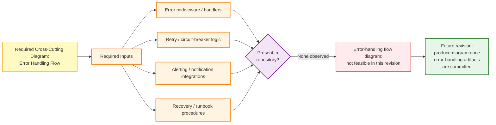

### 5.5.4 Authentication and Authorization Framework Status

No authentication or authorization framework is documented. Section 1.2.1 explicitly records the absence of "authentication scaffolding for third-party systems." Section 2.5.3 records that "no authentication or authorization design" is present, and that no threat model, no security control catalogue, no data-classification scheme, and no compliance regime are referenced.

No identity provider is configured, no authentication middleware is imported, no authorization policy (role-based, attribute-based, or otherwise) is declared, no token-handling logic exists, and no session-management approach is defined. The Authentication and Authorization Framework inventory is therefore recorded as **empty**.

### 5.5.5 Performance Requirements, SLAs, and Disaster Recovery Status

No performance requirements are documented. Section 2.5.2 records the absence of latency targets, throughput targets, resource-utilization budgets, and service-level objectives. Section 1.2.3 records the absence of KPIs and measurement frameworks. There are no performance-budget specifications, no benchmark suites, and no load-test definitions in any artifact in the repository.

No SLA targets are documented. There are no availability commitments, no error-budget definitions, no response-time targets, and no third-party SLA contracts referenced in the repository.

No disaster-recovery procedures are documented. Section 2.5.3 records the absence of operational runbooks, upgrade procedures, patching cadences, support tier definitions, and end-of-life policies. Section 3.6 records the absence of database connections and storage SDK initialization, which precludes backup-strategy specification. The Performance, SLA, and Disaster Recovery inventory is therefore recorded as **empty**.

## 5.6 ASSUMPTIONS, CONSTRAINTS, AND FORWARD-LOOKING NOTES

### 5.6.1 Documented Assumptions

The single assumption underlying this section is that the repository state observed at the time of authoring is the complete and authoritative source of evidence for system-architecture determinations. This assumption is consistent with the verification activities recorded in Section 5.1.3, with the precedent verification activities in Sections 2.1.3, 3.1.3, and 4.1.3, and with the documentation boundary conditions in Section 1.3.3. No additional assumptions about project architecture, component decomposition, communication patterns, data flows, integration topology, security posture, observability strategy, or operational procedures have been adopted, in accordance with the precedent set by Sections 2.7.1, 3.8.1, and 4.6.1.

### 5.6.2 Documented Constraints

The constraints under which this section was authored mirror those recorded in Sections 2.7.2, 3.8.2, and 4.6.2, and are reproduced and adapted below for the System Architecture context.

| Constraint | Description as Applied to Section 5 |
|------------|--------------------------------------|
| Evidence Constraint | Section content is restricted to verifiable repository contents; components, data flows, integration points, technical decisions, and cross-cutting concerns may not be claimed absent supporting artifacts. |
| No-Fabrication Constraint | Component names, integration endpoints, protocols, data store identifiers, SLA values, performance targets, error codes, security control identifiers, and ADR records may not be invented to satisfy section-prompt categories. |
| No-Inference Constraint | Architecture may not be inferred from the project name "Artifact16", from generic patterns observed in similar projects, or from default architecture templates supplied in authoring context. |
| Precedent Constraint | Structure must mirror Sections 1.1, 1.2, 1.3, 2, 3, and 4 — namely, evidence-based acknowledgement of absence with forward-looking notes identifying required future artifacts. |
| Diagram-Production Constraint | The section prompt's requirement to produce component-interaction, state-transition, sequence, decision-tree, and error-handling-flow diagrams cannot be satisfied with substantive content because no underlying architecture exists; producing fabricated diagrams would violate the Evidence and No-Fabrication Constraints. |
| Relevance Constraint | The section prompt's explicit instruction to "only include sections and items that are actually relevant to this system" requires acknowledgement that no items are applicable in the present revision; structural placeholders are produced to communicate the empty state and to preserve the document's organizational framework for future revisions. |

### 5.6.3 Forward-Looking Note and Path to Population

This Section 5 will require complete redrafting once the **Artifact16** repository contains substantive artifacts from which system-architecture documentation can be extracted and diagrammed. The minimum artifacts that would enable population of each subsection in a future revision are listed below, extending the path-to-population guidance offered in Sections 2.7.3, 3.8.4, and 4.6.3.

| Artifact to be Added | Section 5 Subsection It Would Populate |
|----------------------|-----------------------------------------|
| Architecture overview document (style declaration, principles, boundary diagram) | 5.2.1 System Overview |
| Source modules organized into named services or components with documented responsibilities | 5.2.2 Core Components |
| Architecture / data-flow diagrams or event-bus configurations identifying inter-component flows | 5.2.3 Data Flow Description |
| Integration code, API client libraries, SDK imports, and externally facing endpoint configurations | 5.2.4 External Integration Points |
| Per-component documentation including purpose, technology choices, interface contracts, persistence model, and scaling profile | 5.3 Component Details |
| Architecture decision records (ADRs), design documents, and decision-log artifacts | 5.4 Technical Decisions |
| Observability instrumentation (metrics, tracing, logging), alerting rules, and dashboard definitions | 5.5.2 Monitoring, Observability, Logging, and Tracing |
| Error-handling middleware, retry libraries, circuit-breaker configurations, alerting integrations, and operational runbooks | 5.5.3 Error Handling Patterns |
| Authentication middleware, identity-provider configuration, authorization policies, threat models, and security control catalogues | 5.5.4 Authentication and Authorization Framework |
| Performance budgets, latency/throughput targets, service-level objectives, error budgets, and benchmark suites | 5.5.5 Performance Requirements, SLAs, and Disaster Recovery |
| Disaster-recovery plans, backup configurations, recovery-point and recovery-time objectives | 5.5.5 Performance Requirements, SLAs, and Disaster Recovery |

Upon the addition of these artifacts, the Section 5 author should remove the "no items present" acknowledgements and replace them with source-grounded entries that include component names, interface contracts, dependency declarations, integration protocols and data formats, decision rationales referenced to project requirements (Section 2) and technology selections (Section 3), and cross-cutting-concern implementations referenced to defined workflows (Section 4). The methodological framing in Section 5.1 should be retained as a historical record of the section's original empty state, consistent with the guidance offered in Sections 2.7.3, 3.8.4, and 4.6.3.

### 5.6.4 Version Tracking Note

The section prompt does not explicitly request version tracking for architectural artifacts; however, the precedent established by Sections 2.7.4, 3.8.5, and 4.6.4 calls for version discipline once substantive content is added. When components, integrations, decisions, and cross-cutting-concern implementations are introduced in a future revision, each architectural artifact should carry an identifier (e.g., `CMP-XXX` for components, `INT-XXX` for integrations, `ADR-XXX` for decision records) and a version field beginning at 1.0 and incrementing per the project's change-management process — which itself is not yet defined in the repository.

## 5.7 REFERENCES

### 5.7.1 Files Examined

- `README.md` — The sole file in the repository, containing a single line (`# Artifact16`). Confirmed to contain no architectural style declaration, no component definitions, no integration topology, no decision records, no cross-cutting-concern artifacts, and no design references. This file is the exclusive evidence base for every absence claim in Section 5.

### 5.7.2 Folders Explored

- `` (repository root, depth 0) — The only directory level in the repository. Verified to contain exactly one direct child (`README.md`) and zero subdirectories. The absence of conventional architectural subdirectories such as `src/`, `lib/`, `services/`, `components/`, `modules/`, `infrastructure/`, `deploy/`, `config/`, `docs/adr/`, `decisions/`, `architecture/`, `observability/`, `security/`, `auth/`, or `runbooks/` is the evidence basis for the empty-inventory statements throughout Sections 5.2 through 5.5. The repository's physical hierarchy depth of one level precludes deeper traversal.

### 5.7.3 Technical Specification Sections Cross-Referenced

- **Section 1.1 EXECUTIVE SUMMARY** — Established the sole identifying fact about the project (its name, *Artifact16*) and confirmed the absence of business problem context, stakeholders, and value proposition that would frame architectural documentation.
- **Section 1.2 SYSTEM OVERVIEW** — Provided the most direct corroborating evidence for the empty-architecture findings, via Section 1.2.1 (no integration code, no API client libraries, no service definitions, no connector implementations, no authentication scaffolding, no architecture diagrams depicting integration points), Section 1.2.2 (no architectural style declaration, no framework selection evidence, no programming language indicator beyond the Markdown syntax of the README, no platform targeting, no deployment topology), and Section 1.2.3 (no KPIs, metrics, observability requirements, service-level objectives). Specifically referenced in Sections 5.1.2, 5.2.1, 5.2.2, 5.2.3, 5.2.4, 5.3.1, 5.4.1, 5.5.1, 5.5.2, 5.5.4, and 5.5.5.
- **Section 1.3 SCOPE** — Provided the Documentation Boundary Conditions confirming zero subdirectories, zero configuration files, zero CI/CD definitions, and zero supplementary documentation. Section 1.3.1 confirmed that the currently observable system boundary is a single Markdown file. Specifically referenced in Sections 5.1.2 and 5.2.1.
- **Section 2.1 SECTION PREAMBLE AND EVIDENCE BASIS** — Established the methodological pattern of "structural acknowledgement of absent evidence rather than fabrication" that Section 5 follows. Specifically referenced in Section 5.1.2.
- **Section 2.2 FEATURE CATALOG** — Recorded zero features cataloged, supporting the absence of feature-driven components. Specifically referenced in Section 5.3.1.
- **Section 2.3 FUNCTIONAL REQUIREMENTS TABLE** — Recorded the absence of API definitions, schemas, interface contracts, performance targets, data models, business rules, validation logic, security policies, and compliance requirements. Specifically referenced in Section 5.3.1 (via cross-reference) and Section 5.2.3.
- **Section 2.4 FEATURE RELATIONSHIPS** — Section 2.4.3 recorded that "No integration points are documented... No shared components are documented... No common services are documented." This finding is the foundational corroboration for Section 5.2.2 (Core Components), Section 5.2.3 (Data Flow), and Section 5.2.4 (External Integration Points).
- **Section 2.5 IMPLEMENTATION CONSIDERATIONS** — Recorded the absence of technical constraints, performance requirements, scalability considerations, security implications, and maintenance requirements. Specifically referenced in Sections 5.3.1, 5.4.1, 5.5.4, and 5.5.5.
- **Section 2.6 TRACEABILITY MATRIX** — Established the cross-reference index pattern that Section 5.7 mirrors.
- **Section 2.7 ASSUMPTIONS, CONSTRAINTS, AND FORWARD-LOOKING NOTES** — Provided the foundational four-constraint framework (Evidence Constraint, No-Fabrication Constraint, No-Inference Constraint, Precedent Constraint) that Section 5.6.2 inherits and adapts. Specifically referenced in Sections 5.3.2, 5.4.2, 5.5.3, 5.6.1, 5.6.2, and 5.6.4.
- **Section 3.1 SECTION PREAMBLE AND EVIDENCE BASIS** — Reinforced the absence methodology and provided detailed verification activity tables that Section 5.1.3 mirrors.
- **Section 3.5 THIRD-PARTY SERVICES** — Confirmed zero third-party services integrated, supporting the absence of external integration points, observability platforms, and identity providers. Specifically referenced in Sections 5.2.4, 5.4.1, 5.5.1, and 5.5.2.
- **Section 3.6 DATABASES & STORAGE** — Confirmed zero database connections, schemas, ORM mappings, and storage SDK initialization. Specifically referenced in Sections 5.2.3, 5.3.1, 5.4.1, 5.5.1, and 5.5.5.
- **Section 3.8 ASSUMPTIONS, CONSTRAINTS, AND FORWARD-LOOKING NOTES** — Provided the precedent (Section 3.8.3) for treating externally supplied authoring context (e.g., default architecture templates) as non-asserted context. Specifically referenced in Sections 5.4.2, 5.6.1, 5.6.2, and 5.6.4.
- **Section 4.1 SECTION PREAMBLE AND EVIDENCE BASIS** — Reinforced the absence methodology and the visualization approach for inventory-state diagrams (Section 4.1.4). Specifically referenced in Sections 5.1.2 and 5.1.4.
- **Section 4.4 TECHNICAL IMPLEMENTATION** — Section 4.4.1 confirmed the empty state of state-management, persistence, caching, and transaction-boundary artifacts. Section 4.4.2 confirmed the empty state of retry mechanisms, fallback processes, error-notification flows, and recovery procedures. Specifically referenced in Sections 5.2.2, 5.2.3, 5.3.1, 5.3.2, 5.4.1, 5.5.1, and 5.5.3.
- **Section 4.5 REQUIRED DIAGRAMS** — Established the critical precedent (Section 4.5.1) for handling required diagrams when no underlying source exists: substantive diagrams are not feasible, and required-vs-observed inventory diagrams are produced as structural placeholders. Section 4.5.3 established that no generic process pattern may be asserted as a workflow of the Artifact16 project; Section 5.4.2 extends this to architectural defaults. Specifically referenced in Sections 5.3.2, 5.3.3, 5.4.2, 5.4.4, and 5.5.3.
- **Section 4.6 ASSUMPTIONS, CONSTRAINTS, AND FORWARD-LOOKING NOTES** — Reinforced the four-constraint framework and the path-to-population pattern. Specifically referenced in Sections 5.6.1, 5.6.2, 5.6.3, and 5.6.4.
- **Section 4.7 REFERENCES** — Provided the comprehensive reference-format template that Section 5.7 mirrors.

### 5.7.4 Searches Performed

The verification activities enumerated in Section 5.1.3 are recorded here for traceability, together with prior searches conducted during the preparation of Sections 1, 2, 3, and 4 that remain relevant to Section 5:

- Filesystem enumeration: repository root directory listing — 1 file, 0 subdirectories
- Filesystem inspection: `README.md` byte-level read — 12 bytes, single line `# Artifact16`
- Component / service source-file search — 0 matches
- Integration code search (API clients, SDK imports, connectors) — 0 matches
- Configuration / deployment artifact search (`.env`, `.yaml`, `.json`, `.toml`, container manifests, IaC files) — 0 matches
- Observability instrumentation search (metrics, tracing, log shippers) — 0 matches
- Error-handling artifact search (middleware, retry libraries, circuit breakers, DLQ configs) — 0 matches
- Authentication / authorization artifact search (auth middleware, IAM policies, identity-provider configs) — 0 matches
- Architecture documentation search (ADRs, design documents, architecture diagrams) — 0 matches
- Data flow / persistence search (database schemas, ORM mappings, cache configurations, message brokers) — 0 matches
- Semantic search: "architecture component service module implementation" — 0 results
- Semantic search: "authentication authorization security middleware" — 0 results
- Semantic search: "configuration deployment infrastructure" — 0 results
- Semantic search: "monitoring observability logging error handling" — 0 results
- Semantic search: "data flow integration interface API" — 0 results
- Folder search: "source code application services modules" — 0 results

### 5.7.5 Web Searches Performed

- None. No web research was required, as Section 5's factual basis is entirely contained within the repository itself and within the cross-referenced sections of this Technical Specification. No external claims about specific architectural styles, components, integrations, decisions, observability strategies, security frameworks, performance targets, or recovery procedures have been made in Section 5.

# 6. SYSTEM COMPONENTS DESIGN

## 6.1 Core Services Architecture

### 6.1.1 Applicability Determination

**Core Services Architecture is not applicable for this system in its current revision.**

The section prompt explicitly anticipates this outcome with the instruction that, when the system does not require microservices, distributed architecture, or distinct service components, the section must clearly state non-applicability and explain why. The **Artifact16** repository, as documented in Section 1.3.3, contains exactly one source file (`README.md`) consisting of a single line of Markdown (`# Artifact16`), zero subdirectories, zero configuration files, zero build manifests, zero CI/CD definitions, and zero test files. There are consequently no services, no service boundaries, no inter-service communication mechanisms, no scaling configurations, and no resilience patterns to architect, document, or diagram.

The applicability determination is grounded in the directly corroborating evidence summarized below.

| Determination Dimension | Repository Evidence | Corroborating Section |
|--------------------------|---------------------|------------------------|
| Service components present | None | Section 5.2.2, Section 1.2.2 |
| Inter-service communication patterns present | None | Section 5.2.3 |
| Scaling strategy present | None | Section 2.5.3 |
| Resilience / fault-tolerance code present | None | Section 4.4.2, Section 5.5.3 |

Because none of the four architectural inputs that would justify a Core Services Architecture exist in the repository, the section is declared **not applicable**. This subsection nevertheless follows the structural precedent established by Sections 5.2 through 5.6 — namely, evidence-based acknowledgement of absence with forward-looking notes — so that the document's organizational framework is preserved for future revisions in which substantive service-architecture artifacts are committed.

### 6.1.2 Service Components Status

The section prompt enumerates six required Service Components topics: service boundaries and responsibilities, inter-service communication patterns, service discovery mechanisms, load balancing strategy, circuit breaker patterns, and retry and fallback mechanisms. Each topic is mapped below to its source-of-truth requirement and to the verified empty state of the repository, in the same tabular form used throughout Section 5.

| Service Components Topic | Source That Would Be Required | Observed in Repository | Corroborating Section |
|---------------------------|-------------------------------|------------------------|------------------------|
| Service boundaries and responsibilities | Named service modules, interface contracts, responsibility documentation | None | Section 5.2.2, Section 1.2.2 |
| Inter-service communication patterns | Protocol declarations (HTTP/REST, gRPC, GraphQL, AMQP, MQTT, Kafka, WebSocket) | None | Section 5.2.3 |
| Service discovery mechanisms | Service registry, DNS-SD records, service-mesh configuration | None | Section 1.2.1, Section 5.2.4 |
| Load balancing strategy | Reverse proxy, ingress controller, load balancer configuration | None | Section 5.5.5 |
| Circuit breaker patterns | Circuit breaker library imports and threshold configurations | None | Section 4.4.2, Section 5.5.3 |
| Retry and fallback mechanisms | Retry libraries with backoff configuration, fallback handlers, default-value providers | None | Section 4.4.2 |

#### Service Boundaries and Responsibilities

No service boundaries or responsibilities are documented. As recorded in Section 1.2.2, the repository contains no source code modules, no service implementations, no executable code, no runnable scripts, no entry points, and no service definitions. Section 5.2.2 records the Core Components inventory as empty. There are no folders such as `services/`, `microservices/`, `components/`, `src/`, or `lib/`, and no individual files that would declare a unit of service ownership.

#### Inter-Service Communication Patterns

No inter-service communication patterns are documented. As recorded in Section 5.2.3, no integration patterns (e.g., request/response, publish/subscribe, request/reply, event streaming, batch ETL, file transfer) are referenced, and no protocols (e.g., HTTP/REST, gRPC, GraphQL, AMQP, MQTT, Kafka, WebSocket) are referenced by any artifact in the repository. The inter-service communication inventory is therefore recorded as empty.

#### Service Discovery Mechanisms

No service discovery mechanisms are documented. Section 1.2.1 records the absence of integration code, API client libraries, service definitions, connector implementations, and environment configuration referencing external services. No service registry, DNS-SD configuration, Consul/Eureka/etcd configuration, or service-mesh sidecar declaration is present in the repository.

#### Load Balancing Strategy

No load balancing strategy is documented. There is no reverse-proxy configuration (e.g., NGINX, HAProxy, Envoy), no ingress controller manifest (e.g., Kubernetes Ingress, Istio Gateway), no cloud load balancer specification (e.g., AWS ELB, GCP Load Balancer, Azure Load Balancer), and no client-side load balancer initialization in the repository. Section 5.5.5 confirms the absence of all such operational artifacts.

#### Circuit Breaker Patterns

No circuit breaker patterns are documented. Section 4.4.2 explicitly records the absence of fallback processes including circuit breakers, fallback handlers, and default-value providers. No library imports for Hystrix, Resilience4j, Polly, or equivalent circuit-breaker frameworks exist in the repository. No threshold parameters (failure rate, slow-call rate, half-open trial counts) are defined.

#### Retry and Fallback Mechanisms

No retry or fallback mechanisms are documented. Section 4.4.2 explicitly records that the repository contains no retry mechanisms (e.g., exponential-backoff implementations). No retry policy configuration, no maximum-attempt declarations, no jitter parameters, and no fallback handlers are present. The retry and fallback inventory is therefore recorded as empty.

### 6.1.3 Scalability Design Status

The section prompt enumerates five required Scalability Design topics: horizontal/vertical scaling approach, auto-scaling triggers and rules, resource allocation strategy, performance optimization techniques, and capacity planning guidelines. Each is mapped to its source-of-truth requirement and to the verified empty state below.

| Scalability Design Topic | Source That Would Be Required | Observed in Repository | Corroborating Section |
|---------------------------|-------------------------------|------------------------|------------------------|
| Horizontal/vertical scaling approach | Replication policy, instance-size declarations, scaling-tier documentation | None | Section 2.5.3 |
| Auto-scaling triggers and rules | HPA/VPA manifests, ASG policies, metric-threshold definitions | None | Section 2.5.3, Section 1.2.3 |
| Resource allocation strategy | CPU/memory requests and limits, resource quotas, node-pool declarations | None | Section 2.5.3 |
| Performance optimization techniques | Caching configurations, async-processing patterns, query-tuning notes | None | Section 4.4.1, Section 5.5.5 |
| Capacity planning guidelines | Expected-load profiles, growth projections, load-test results | None | Section 2.5.3, Section 1.2.3 |

#### Horizontal and Vertical Scaling Approach

No horizontal or vertical scaling approach is documented. As recorded in Section 2.5.3, "no expected-load profile, no concurrency model, no horizontal or vertical scaling strategy, and no capacity plan present in the repository." No replica counts, no stateless/stateful classifications, no instance-size declarations, and no read-replica configurations exist.

#### Auto-Scaling Triggers and Rules

No auto-scaling triggers or rules are documented. Section 1.2.3 records the absence of all KPIs, metrics definitions, observability requirements, and service-level objectives. Because auto-scaling triggers require defined metric thresholds (CPU utilization percentages, request-per-second targets, queue depths, custom metrics), the absence of a measurement framework precludes the specification of any auto-scaling rule. No Kubernetes HorizontalPodAutoscaler or VerticalPodAutoscaler manifests, no AWS Auto Scaling Group policies, and no Azure Scale Set rules exist.

#### Resource Allocation Strategy

No resource allocation strategy is documented. The repository contains no container resource requests or limits, no namespace quotas, no node-pool declarations, no GPU or specialized-hardware reservations, and no scheduling preferences (affinity, anti-affinity, taints, tolerations). Section 2.5.3 confirms the absence of all such operational artifacts.

#### Performance Optimization Techniques

No performance optimization techniques are documented. Section 4.4.1 records the absence of caching requirements and cache-aside patterns. Section 5.5.5 records the absence of performance budgets, benchmark suites, and load-test definitions. No asynchronous-processing patterns, no batching strategies, no connection-pool configurations, and no compression or serialization optimizations are present.

#### Capacity Planning Guidelines

No capacity planning guidelines are documented. There is no expected-load profile, no peak-load projection, no growth-rate assumption, no headroom policy, and no load-test result set in the repository. Section 2.5.3 explicitly records this absence.

### 6.1.4 Resilience Patterns Status

The section prompt enumerates five required Resilience Patterns topics: fault tolerance mechanisms, disaster recovery procedures, data redundancy approach, failover configurations, and service degradation policies. Each is mapped to its source-of-truth requirement and to the verified empty state below.

| Resilience Patterns Topic | Source That Would Be Required | Observed in Repository | Corroborating Section |
|----------------------------|-------------------------------|------------------------|------------------------|
| Fault tolerance mechanisms | Retry libraries, circuit breakers, bulkhead patterns, timeout policies | None | Section 4.4.2, Section 5.5.3 |
| Disaster recovery procedures | DR runbooks, RTO/RPO targets, recovery scripts, failover drills | None | Section 5.5.5, Section 2.5.3 |
| Data redundancy approach | Replication configuration, backup schedules, multi-AZ/multi-region setup | None | Section 3.6, Section 5.5.5 |
| Failover configurations | HA topology, standby instances, leader-election protocols | None | Section 5.5.5 |
| Service degradation policies | Feature flag systems, graceful-degradation logic, priority-based shedding | None | Section 5.5.3 |

#### Fault Tolerance Mechanisms

No fault tolerance mechanisms are documented. As recorded in Section 4.4.2, the repository contains no retry mechanisms, no fallback processes, no error-notification flows, and no recovery procedures. Section 5.5.3 confirms that no error-handling middleware, retry/circuit-breaker logic, alerting integrations, or recovery procedures are present. The fault-tolerance inventory is therefore recorded as empty.

#### Disaster Recovery Procedures

No disaster recovery procedures are documented. Section 5.5.5 explicitly records that "no disaster-recovery procedures are documented." Section 2.5.3 records the absence of operational runbooks, upgrade procedures, patching cadences, support tier definitions, and end-of-life policies. No Recovery Time Objective (RTO), no Recovery Point Objective (RPO), and no continuity-of-operations plan is present in the repository.

#### Data Redundancy Approach

No data redundancy approach is documented. As recorded in Section 3.6 and reaffirmed in Section 4.4.1, the repository contains zero database connections, zero schemas, zero ORM mappings, and zero storage SDK initialization. Because no data stores exist, no data redundancy can be specified. No multi-AZ deployment, no cross-region replication, no backup schedule, and no snapshot policy is present.

#### Failover Configurations

No failover configurations are documented. There is no HA topology, no active-passive or active-active configuration, no leader-election mechanism (e.g., Raft, Paxos, ZooKeeper-based coordination), no standby-instance specification, and no DNS or load-balancer failover policy referenced anywhere in the repository. Section 5.5.5 corroborates the absence of all such operational artifacts.

#### Service Degradation Policies

No service degradation policies are documented. The repository contains no feature flag systems (e.g., LaunchDarkly, Unleash, Split), no graceful-degradation logic, no circuit-open fallback strategies, no priority-based request shedding, and no read-only-mode declarations. The service degradation inventory is therefore recorded as empty.

### 6.1.5 Treatment of Default Service-Architecture Templates

A precedent for handling externally supplied authoring context exists in Section 3.8.3 (Default Technology Stack), Section 4.5.3 (generic process patterns), and Section 5.4.2 (Default Architecture Template). Each of these subsections explicitly declines to assert externally supplied defaults as decisions of the **Artifact16** project. The same treatment applies to default service-architecture templates that may be supplied as authoring context or recalled from external knowledge for Section 6.

Default service-architecture templates that, if supplied externally, are **not** asserted as the design of the Artifact16 system include — but are not limited to — the following: service-mesh patterns (Istio, Linkerd, Consul Connect), sidecar proxy patterns (Envoy), Kubernetes Horizontal Pod Autoscaler or Vertical Pod Autoscaler templates, Hystrix-style or Resilience4j-style circuit breakers, exponential-backoff retry libraries, blue-green deployment topologies, canary release patterns, active-active multi-region replication patterns, and graceful-degradation feature-flag systems. Under the Evidence Constraint and No-Inference Constraint inherited from Section 5.6.2, **no default service-architecture template may be asserted as a decision of the Artifact16 project**, because no artifact in the repository references any specific service decomposition, scaling rule, or resilience mechanism.

The relationship between externally supplied service-architecture defaults and the present section's evidence basis is depicted below, adapting the visualization established in Sections 3.8.3 and 5.4.2.

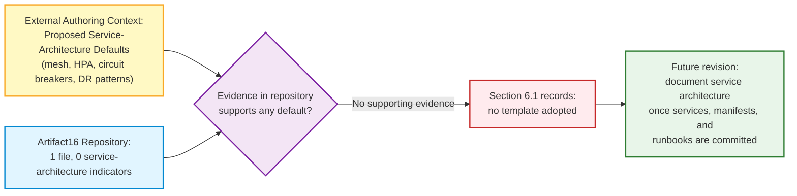

### 6.1.6 Required Diagrams — Feasibility Assessment

The section prompt requires three Mermaid diagrams: service interaction diagrams, scalability architecture, and resilience pattern implementations. Because the repository contains no services, no scaling configurations, and no resilience artifacts from which a substantive diagram could be drawn, the diagram-feasibility precedent established in Section 4.5.1 and applied throughout Sections 5.3.3, 5.4.4, and 5.5.3 applies: producing fabricated diagrams would violate the Evidence Constraint and the No-Fabrication Constraint enumerated in Section 5.6.2.

Following the Required-vs-Observed Mapping Diagram convention established in those precedent sections, three mapping diagrams are produced below — one for each required diagram category. Each diagram visualizes the gap between the section prompt's requirement and the verified empty state of the repository, in the same visual idiom and using the same color conventions as the Section 5 precedent.

#### 6.1.6.1 Service Interaction Mapping Diagram

This diagram documents the requirement for a service interaction diagram, the inputs that would be required to construct one substantively, and the absence of those inputs in the present revision of the repository.

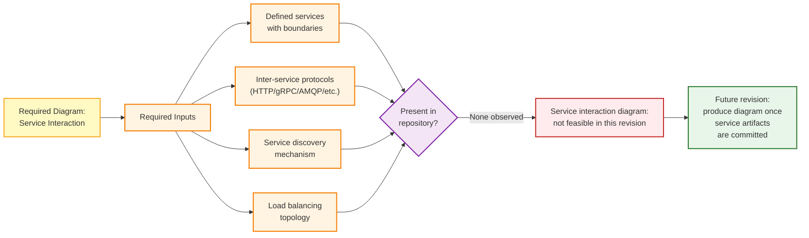

#### 6.1.6.2 Scalability Architecture Mapping Diagram

This diagram documents the requirement for a scalability architecture diagram, the inputs that would be required to construct one substantively, and the absence of those inputs in the present revision of the repository.

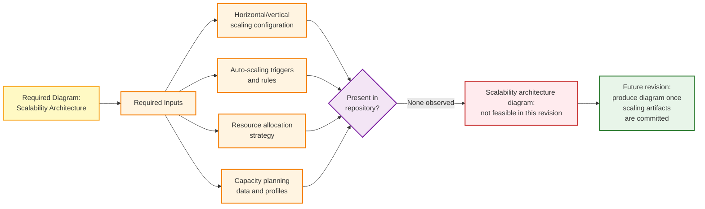

#### 6.1.6.3 Resilience Pattern Mapping Diagram

This diagram documents the requirement for a resilience pattern implementations diagram, the inputs that would be required to construct one substantively, and the absence of those inputs in the present revision of the repository.

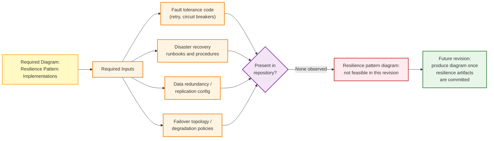

### 6.1.7 Assumptions, Constraints, and Forward-Looking Notes

#### Documented Assumptions

The single assumption underlying this section is that the repository state observed at the time of authoring — one file, twelve bytes, zero subdirectories — is the complete and authoritative source of evidence for service-architecture determinations. This assumption is consistent with the verification activities recorded in Section 5.1.3 and with the documentation boundary conditions in Section 1.3.3. No additional assumptions about service decomposition, scaling policy, or resilience posture have been adopted, in accordance with the precedent set by Sections 2.7.1, 3.8.1, 4.6.1, and 5.6.1.

#### Documented Constraints

The constraints under which this section was authored mirror the six-constraint framework recorded in Section 5.6.2 and are reproduced and adapted below for the Core Services Architecture context.

| Constraint | Description as Applied to Section 6.1 |
|------------|----------------------------------------|
| Evidence Constraint | Services, scaling policies, and resilience patterns may not be claimed absent supporting artifacts in the repository. |
| No-Fabrication Constraint | Service names, endpoint identifiers, protocol selections, retry policies, circuit-breaker thresholds, scaling triggers, RTO/RPO values, and DR runbook identifiers may not be invented to satisfy section-prompt categories. |
| No-Inference Constraint | Service architecture may not be inferred from the project name "Artifact16", from generic patterns observed in similar projects, or from default service-architecture templates supplied in authoring context. |
| Precedent Constraint | Structure must mirror Sections 1.1, 1.2, 1.3, 2, 3, 4, and 5 — namely, evidence-based acknowledgement of absence with forward-looking notes identifying required future artifacts. |
| Diagram-Production Constraint | The section prompt's requirement to produce service-interaction, scalability-architecture, and resilience-pattern diagrams cannot be satisfied with substantive content because no underlying service architecture exists; Required-vs-Observed Mapping Diagrams are substituted, consistent with the precedent established in Sections 5.3.3, 5.4.4, and 5.5.3. |
| Relevance Constraint | The section prompt's explicit instruction to declare non-applicability when no services exist is invoked, because no items in any of the three subsections (Service Components, Scalability Design, Resilience Patterns) are applicable in the present revision. |

#### Path to Population

This Section 6.1 will require complete redrafting once the **Artifact16** repository contains substantive service-architecture artifacts. The minimum artifacts that would enable population of each required topic in a future revision are listed below, extending the path-to-population guidance offered in Sections 2.7.3, 3.8.4, 4.6.3, and 5.6.3.

| Artifact to be Added | Section 6.1 Topic It Would Populate |
|----------------------|--------------------------------------|
| Service definitions with named boundaries and responsibility statements | Service Components — Service boundaries (6.1.2) |
| Protocol declarations (REST/gRPC/GraphQL/AMQP/Kafka) and message-schema files | Service Components — Communication patterns (6.1.2) |
| Service registry, DNS-SD records, or service-mesh configuration | Service Components — Service discovery (6.1.2) |
| Load balancer, ingress, or reverse-proxy configuration | Service Components — Load balancing (6.1.2) |
| Circuit breaker library configuration (Hystrix, Resilience4j, Polly) | Service Components — Circuit breaker patterns (6.1.2) |
| Retry library configuration with backoff and jitter parameters | Service Components — Retry & fallback (6.1.2) |
| Container orchestration manifests (Kubernetes HPA/VPA, ECS service auto-scaling) | Scalability Design — Auto-scaling triggers (6.1.3) |
| Resource requests, limits, and quota declarations | Scalability Design — Resource allocation (6.1.3) |
| Caching configurations and async-processing patterns | Scalability Design — Performance optimization (6.1.3) |
| Expected-load profile, peak projections, and load-test results | Scalability Design — Capacity planning (6.1.3) |
| Disaster-recovery runbooks with RTO/RPO targets | Resilience Patterns — Disaster recovery (6.1.4) |
| Data replication configuration (multi-AZ, multi-region, backup schedule) | Resilience Patterns — Data redundancy (6.1.4) |
| HA topology specification (active-passive, active-active, leader-election) | Resilience Patterns — Failover (6.1.4) |
| Feature flag system or graceful-degradation logic | Resilience Patterns — Service degradation (6.1.4) |

Upon the addition of these artifacts, the Section 6.1 author should remove the "no items present" acknowledgements and replace them with source-grounded entries that include service names, interface contracts, scaling rules with thresholds, resilience patterns with parameter values, and disaster-recovery procedures with measured RTO/RPO targets. The methodological framing in this revision should be retained as a historical record of the section's original empty state, consistent with the guidance offered in Sections 2.7.3, 3.8.4, 4.6.3, and 5.6.3.

#### Version Tracking Note

The section prompt does not explicitly request version tracking for service-architecture artifacts; however, the precedent established by Sections 2.7.4, 3.8.5, 4.6.4, and 5.6.4 calls for version discipline once substantive content is added. When services, scaling rules, and resilience patterns are introduced in a future revision, each artifact should carry an identifier (e.g., `SVC-XXX` for services, `SCL-XXX` for scaling rules, `RES-XXX` for resilience patterns) and a version field beginning at 1.0 and incrementing per the project's change-management process — which itself is not yet defined in the repository.

#### References

#### Files Examined

- `README.md` — The sole file in the repository, containing a single Markdown H1 line (`# Artifact16`). Verified to contain no service definitions, no scaling configurations, no resilience patterns, no protocol declarations, and no architectural indicators. This file is the foundational evidence for every empty-inventory determination in Section 6.1.

#### Folders Explored

- `` (repository root, depth 0) — Verified to contain exactly one direct child (`README.md`) and zero subdirectories. The absence of conventional service-architecture directories such as `services/`, `microservices/`, `components/`, `src/`, `lib/`, `infrastructure/`, `deploy/`, `k8s/`, `helm/`, `terraform/`, and `runbooks/` is the foundational evidence for the non-applicability determination in Section 6.1.1.

#### Technical Specification Sections Retrieved

- **Section 1.2 SYSTEM OVERVIEW** — Provided the foundational corroborating evidence for the absence of integration code, service definitions, executable code, and architectural style declarations; cited throughout Section 6.1.2.
- **Section 1.3 SCOPE** — Provided the Documentation Boundary Conditions table establishing one source file, zero subdirectories, zero configuration or manifest files, zero test files, and zero CI/CD definitions; cited in Section 6.1.1.
- **Section 2.5 IMPLEMENTATION CONSIDERATIONS** — Provided direct evidence for the absence of expected-load profiles, concurrency models, horizontal/vertical scaling strategies, capacity plans, operational runbooks, upgrade procedures, patching cadences, support tier definitions, and end-of-life policies; cited throughout Section 6.1.3 and Section 6.1.4.
- **Section 4.4 TECHNICAL IMPLEMENTATION** — Provided direct evidence for the absence of retry mechanisms, fallback processes, circuit breakers, error-notification flows, recovery procedures, and caching requirements; cited throughout Section 6.1.2 and Section 6.1.4.
- **Section 5.2 HIGH-LEVEL ARCHITECTURE** — Provided direct evidence for the empty Core Components inventory, the absence of data flows between components, the absence of integration patterns, and the absence of protocols; cited throughout Section 6.1.2.
- **Section 5.4 TECHNICAL DECISIONS** — Provided the Treatment of Default Templates precedent that external authoring context is not asserted as project decisions; the precedent is extended to Section 6.1.5.
- **Section 5.5 CROSS-CUTTING CONCERNS** — Provided direct evidence for the absence of error-handling middleware, retry/circuit-breaker logic, alerting integrations, recovery procedures, performance budgets, SLAs, and disaster-recovery procedures; cited throughout Sections 6.1.2 through 6.1.4. Also provided the Required-vs-Observed Mapping Diagram precedent applied in Section 6.1.6.
- **Section 5.6 ASSUMPTIONS, CONSTRAINTS, AND FORWARD-LOOKING NOTES** — Provided the six-constraint framework (Evidence, No-Fabrication, No-Inference, Precedent, Diagram-Production, Relevance Constraints) adapted in Section 6.1.7, and the path-to-population table structure replicated in Section 6.1.7.

#### Web Searches Performed

- None. The section's factual basis is entirely contained within the repository itself and within the cross-referenced sections of the Technical Specification. No external claims have been made in Section 6.1.

## 6.2 Database Design

### 6.2.1 Applicability Determination

**Database Design is not applicable for this system in its current revision.**

The section prompt explicitly anticipates this outcome with the instruction that, when the system does not require or direct database or persistent storage interactions are not clearly evident, the section must clearly state non-applicability and explain why. The **Artifact16** repository, as documented in Section 1.3.3, contains exactly one source file (`README.md`) consisting of a single line of Markdown (`# Artifact16`), zero subdirectories, zero configuration files, zero build manifests, zero CI/CD definitions, and zero test files. There are consequently no schemas, no entity relationships, no indexes, no partitioning configurations, no replication topologies, no backup procedures, no migration scripts, no caching policies, no compliance controls, and no performance-optimization mechanisms to design, document, or diagram.

Section 3.6.1 (Database and Storage Inventory Status) records the primary corroborating finding: "No primary database, secondary database, cache, message broker acting as durable storage, object storage, file storage, or other persistence mechanism is referenced within the Artifact16 repository. There are no connection strings, schemas, migrations, ORM mappings, query definitions, or data models present." Section 4.4.1 (State Management Status) further confirms that the repository contains no data persistence points, no caching requirements, and no transaction boundaries. Section 5.2.3 (Data Flow Description) confirms that no data stores and no caches are documented.

The applicability determination is grounded in the directly corroborating evidence summarized below.

| Determination Dimension | Repository Evidence | Corroborating Section |
|--------------------------|---------------------|------------------------|
| Schema design artifacts present | None | Section 3.6, Section 1.3.1 |
| Data management artifacts present | None | Section 3.6, Section 4.4.1 |
| Compliance control artifacts present | None | Section 3.6, Section 5.5.5 |
| Performance optimization artifacts present | None | Section 4.4.1, Section 5.5.5 |

Because none of the four inputs that would justify a Database Design exist in the repository, the section is declared **not applicable**. This subsection nevertheless follows the structural precedent established by Sections 5.2 through 5.6 and Section 6.1 — namely, evidence-based acknowledgement of absence with forward-looking notes — so that the document's organizational framework is preserved for future revisions in which substantive database artifacts are committed.

### 6.2.2 Schema Design Status

The section prompt enumerates six required Schema Design topics: entity relationships, data models and structures, indexing strategy, partitioning approach, replication configuration, and backup architecture. Each topic is mapped below to its source-of-truth requirement and to the verified empty state of the repository, in the same tabular form used throughout Section 5 and Section 6.1.

| Schema Design Topic | Source That Would Be Required | Observed in Repository | Corroborating Section |
|---------------------|-------------------------------|------------------------|------------------------|
| Entity relationships | DDL files, ORM model classes, ERD diagrams, foreign-key declarations | None | Section 3.6, Section 1.3.1 |
| Data models and structures | Schema definitions, table/collection declarations, type definitions | None | Section 3.6, Section 2.3.3 |
| Indexing strategy | Index definitions (B-tree, hash, GIN, GiST), index DDL statements | None | Section 3.6 |
| Partitioning approach | Partition declarations (range, hash, list), sharding-key configurations | None | Section 3.6 |
| Replication configuration | Primary-replica topology, semi-synchronous configurations, replica routing | None | Section 3.6, Section 6.1.4 |
| Backup architecture | Backup-policy files, snapshot schedules, point-in-time recovery configuration | None | Section 3.6, Section 5.5.5 |

#### 6.2.2.1 Entity Relationships

No entity relationships are documented. As recorded in Section 1.3.1, the Boundary Dimensions table shows that **Data Domains Included** are **"Not specified (no data models or schemas present)"**. Section 2.3.3 records that "the repository contains no API definitions, no schemas, no interface contracts, no performance targets, and no data models." No `.sql` schema files, no ORM model classes, no entity declarations, and no foreign-key relationships exist in the repository. The entity-relationship inventory is therefore recorded as **empty**.

#### 6.2.2.2 Data Models and Structures

No data models or data structures are documented. Section 3.6.1 explicitly records that "There are no connection strings, schemas, migrations, ORM mappings, query definitions, or data models present" in the repository. Section 3.6.2 enumerates the absence of relational schema files, document/NoSQL collection schemas, key-value store key-prefix conventions, search-engine index mappings, and object-storage key conventions. There are no folders such as `db/`, `database/`, `schemas/`, `models/`, `entities/`, `repositories/`, `data/`, or `sql/` in the repository. The data-model inventory is therefore recorded as **empty**.

#### 6.2.2.3 Indexing Strategy

No indexing strategy is documented. Because no tables or collections exist (see Section 6.2.2.2), no indexes can be defined against them. No B-tree, hash, GIN, GiST, full-text, spatial, or composite-index declarations exist anywhere in the repository. No index-creation DDL statements, no `CREATE INDEX` definitions, and no ORM-level index decorators are present. The indexing inventory is therefore recorded as **empty**.

#### 6.2.2.4 Partitioning Approach

No partitioning approach is documented. The repository contains no range-partition declarations, no hash-partition configurations, no list-partition definitions, no sharding-key specifications, no time-series partition rules, and no horizontal-fragmentation strategy. Section 3.6.2 confirms the absence of all persistence-strategy artifacts. The partitioning inventory is therefore recorded as **empty**.

#### 6.2.2.5 Replication Configuration

No replication configuration is documented. As recorded in Section 6.1.4 (Data Redundancy Approach) and reaffirmed by reference to Section 3.6, "Because no data stores exist, no data redundancy can be specified. No multi-AZ deployment, no cross-region replication, no backup schedule, and no snapshot policy is present." No primary-replica topology, no multi-primary configuration, no semi-synchronous replication parameters, and no replica-routing rules exist in the repository. The replication inventory is therefore recorded as **empty**.

#### 6.2.2.6 Backup Architecture

No backup architecture is documented. Section 3.6.2 explicitly enumerates the absence of "Backup-policy files, snapshot schedules, restore runbooks" in the "Backup / DR configuration" row of the Required Evidence vs. Observed Evidence table. Section 5.5.5 confirms that "Section 3.6 records the absence of database connections and storage SDK initialization, which precludes backup-strategy specification." No automated backup schedules, no snapshot policies, no point-in-time recovery configurations, no off-site replication targets, and no restoration runbooks exist in the repository. The backup-architecture inventory is therefore recorded as **empty**.

### 6.2.3 Data Management Status

The section prompt enumerates five required Data Management topics: migration procedures, versioning strategy, archival policies, data storage and retrieval mechanisms, and caching policies. Each is mapped to its source-of-truth requirement and to the verified empty state below.

| Data Management Topic | Source That Would Be Required | Observed in Repository | Corroborating Section |
|------------------------|-------------------------------|------------------------|------------------------|
| Migration procedures | Migration tool configuration (Alembic, Liquibase, Flyway), migration scripts | None | Section 3.6, Section 3.4 |
| Versioning strategy | Schema-version table, migration naming conventions, version policy documents | None | Section 3.6 |
| Archival policies | Archival rules, tiered-storage configurations, cold-storage retention plans | None | Section 3.6, Section 1.3.1 |
| Data storage and retrieval | Repository pattern code, ORM mappings, query builders, DAO classes | None | Section 3.6, Section 4.4.1 |
| Caching policies | Cache client configurations, TTL declarations, eviction policies | None | Section 3.6, Section 4.4.1 |

#### 6.2.3.1 Migration Procedures

No migration procedures are documented. The repository contains no `migrations/`, `db/migrate/`, `alembic/`, `flyway/`, `liquibase/`, or `prisma/migrations/` directory. No migration scripts, no migration runner configuration files, and no migration version-control tables are present. Section 3.4 (Open Source Dependencies) records the absence of all dependency manifests; consequently no migration-tool dependency (such as Alembic, Liquibase, Flyway, or db-migrate) is declared. The migration inventory is therefore recorded as **empty**.

#### 6.2.3.2 Versioning Strategy

No schema versioning strategy is documented. Because no migrations exist (see Section 6.2.3.1) and no schemas exist (see Section 6.2.2.2), no schema-versioning policy can be applied. No schema-version table, no migration naming convention, no semantic-versioning policy for data models, and no breaking-change taxonomy is present in the repository. The versioning inventory is therefore recorded as **empty**.

#### 6.2.3.3 Archival Policies

No archival policies are documented. Section 1.3.1 records that no data domains are included in scope. The repository contains no tiered-storage rules, no hot/warm/cold data classification, no record-retention timelines, no archive-to-object-storage policies, and no purge-after-N-days configurations. The archival inventory is therefore recorded as **empty**.

#### 6.2.3.4 Data Storage and Retrieval Mechanisms

No data storage or retrieval mechanisms are documented. Section 4.4.1 (State Management Status) explicitly records the absence of "Data persistence points" with the note that the required sources would include "Repository classes, ORM mappings, database calls" — none of which exist in the repository. No DAO classes, no repository-pattern implementations, no query builders, no raw-SQL execution code, and no transactional unit-of-work modules are present. The storage-and-retrieval inventory is therefore recorded as **empty**.

#### 6.2.3.5 Caching Policies

No caching policies are documented. Section 4.4.1 explicitly records the absence of "Caching requirements" with the note that the required sources would include "Cache SDK initialization, cache-aside patterns, HTTP cache headers" — none of which exist in the repository. Section 5.4.1 records the absence of "Caching strategy justification" with the note that "no cache SDK configurations, no TTL policies, no cache-aside patterns" exist. No cache-client configuration (Redis, Memcached, Hazelcast), no cache-key prefix convention, no TTL declarations, no cache-eviction policies (LRU, LFU, FIFO), and no cache-invalidation rules are present in the repository. The caching inventory is therefore recorded as **empty**.

### 6.2.4 Compliance Considerations Status

The section prompt enumerates five required Compliance Considerations topics: data retention rules, backup and fault tolerance policies, privacy controls, audit mechanisms, and access controls. Each is mapped to its source-of-truth requirement and to the verified empty state below.

| Compliance Topic | Source That Would Be Required | Observed in Repository | Corroborating Section |
|-------------------|-------------------------------|------------------------|------------------------|
| Data retention rules | Retention policy documents, regulatory regime declarations (GDPR, HIPAA, PCI-DSS) | None | Section 1.3.1, Section 3.6 |
| Backup and fault tolerance | Backup schedules, DR test reports, RPO/RTO targets, failover policies | None | Section 5.5.5, Section 6.1.4 |
| Privacy controls | Encryption-at-rest config, encryption-in-transit config, PII tagging, data-masking rules | None | Section 3.6, Section 5.5.4 |
| Audit mechanisms | Audit log schemas, audit-trigger definitions, immutable-log configurations | None | Section 3.6, Section 1.2.3 |
| Access controls | Database user roles, GRANT/REVOKE statements, row-level security policies | None | Section 3.5, Section 5.4.1 |

#### 6.2.4.1 Data Retention Rules

No data retention rules are documented. The repository contains no compliance-regime declarations (GDPR, HIPAA, PCI-DSS, SOX, CCPA, etc.), no retention-period configurations, no record-type retention matrices, no purge schedules, and no legal-hold procedures. Section 1.3.1 records that no data domains are included and no data models are present, which precludes the specification of any data-retention rule. The retention-rules inventory is therefore recorded as **empty**.

#### 6.2.4.2 Backup and Fault Tolerance Policies

No backup or fault tolerance policies are documented. Section 5.5.5 records that "Section 3.6 records the absence of database connections and storage SDK initialization, which precludes backup-strategy specification." Section 6.1.4 (Data Redundancy Approach) records that "Because no data stores exist, no data redundancy can be specified. No multi-AZ deployment, no cross-region replication, no backup schedule, and no snapshot policy is present." No Recovery Point Objective (RPO), no Recovery Time Objective (RTO), no backup-verification procedure, no DR-test report, and no failover-orchestration policy is present in the repository. The backup-and-fault-tolerance inventory is therefore recorded as **empty**.

#### 6.2.4.3 Privacy Controls

No privacy controls are documented. The repository contains no encryption-at-rest configuration (e.g., TDE, column-level encryption, key-management-service integration), no encryption-in-transit configuration (e.g., TLS certificate references, mTLS configuration), no PII classification taxonomy, no data-masking or pseudonymization rules, and no tokenization-vault references. Section 5.5.4 (Authentication and Authorization Framework status as recorded in Section 5) confirms the absence of authentication middleware, identity-provider configuration, and authorization policies. The privacy-controls inventory is therefore recorded as **empty**.

#### 6.2.4.4 Audit Mechanisms

No audit mechanisms are documented. The repository contains no audit-log schemas, no audit-trigger definitions, no change-data-capture (CDC) configurations, no immutable append-only log stores, and no audit-event taxonomies. Section 1.2.3 records the absence of all KPIs, metrics definitions, observability requirements, and service-level objectives, which precludes the specification of any audit-trail measurement. The audit-mechanisms inventory is therefore recorded as **empty**.

#### 6.2.4.5 Access Controls

No database access controls are documented. The repository contains no database user-role definitions, no GRANT/REVOKE statements, no row-level security (RLS) policies, no column-level access controls, no database-firewall rules, and no IAM-to-database mapping configurations. Section 3.5 (Third-Party Services) records the absence of any cloud-database service from which managed-IAM controls might be inherited. Section 5.4.1 records the absence of "Security mechanism selection" rationale at the architecture level. The access-controls inventory is therefore recorded as **empty**.

### 6.2.5 Performance Optimization Status

The section prompt enumerates five required Performance Optimization topics: query optimization patterns, caching strategy, connection pooling, read/write splitting, and batch processing approach. Each is mapped to its source-of-truth requirement and to the verified empty state below.

| Performance Topic | Source That Would Be Required | Observed in Repository | Corroborating Section |
|---------------------|-------------------------------|------------------------|------------------------|
| Query optimization patterns | EXPLAIN-plan analyses, query rewrites, materialized-view definitions | None | Section 3.6, Section 5.5.5 |
| Caching strategy | Cache topology, write-through/write-back/cache-aside patterns, TTL policies | None | Section 4.4.1, Section 5.4.1 |
| Connection pooling | Pool-size declarations, HikariCP/PgBouncer config, idle-timeout settings | None | Section 3.6, Section 4.4.1 |
| Read/write splitting | Replica-routing config, read-only-connection-string definitions | None | Section 3.6, Section 6.1.4 |
| Batch processing | Bulk-insert procedures, cursor-pagination code, batch-job definitions | None | Section 4.4.1, Section 5.5.5 |

#### 6.2.5.1 Query Optimization Patterns

No query optimization patterns are documented. Because no queries exist (see Section 6.2.3.4) and no schemas exist against which queries could be issued (see Section 6.2.2), no query-plan analysis, no `EXPLAIN` output, no query-rewrite history, no materialized-view definition, and no index-usage statistic is present in the repository. Section 5.5.5 records the absence of performance budgets, benchmark suites, and load-test definitions. The query-optimization inventory is therefore recorded as **empty**.

#### 6.2.5.2 Caching Strategy

No caching strategy is documented. As recorded in Section 6.2.3.5 and corroborated by Section 4.4.1 and Section 5.4.1, no cache-client configuration, no cache-aside/write-through/write-back pattern selection, no cache-warming procedure, no cache-key-design convention, and no cache-eviction policy exists in the repository. The caching-strategy inventory is therefore recorded as **empty**.

#### 6.2.5.3 Connection Pooling

No connection pooling is documented. The repository contains no connection-pool configuration (HikariCP, PgBouncer, ProxySQL, RDS Proxy, application-server datasource pools), no pool-size declaration, no min/max connection bounds, no idle-timeout setting, no connection-validation query, and no leak-detection threshold. Section 3.6 confirms the absence of all connection strings and storage SDK initialization, which precludes the specification of any pooling parameters. The connection-pooling inventory is therefore recorded as **empty**.

#### 6.2.5.4 Read/Write Splitting

No read/write splitting is documented. Because no replication topology exists (see Section 6.2.2.5), no read-replica routing rules can be specified. No read-only-connection-string declarations, no read-after-write consistency policies, no replica-lag tolerance thresholds, and no application-layer routing logic exists in the repository. The read/write-splitting inventory is therefore recorded as **empty**.

#### 6.2.5.5 Batch Processing Approach

No batch processing approach is documented. The repository contains no batch-job definitions, no bulk-insert procedures, no `COPY` or `INSERT ... SELECT` patterns, no cursor-based pagination code, no streaming-fetch implementations, and no chunked-export utilities. Section 5.5.5 confirms the absence of all performance-related operational artifacts. The batch-processing inventory is therefore recorded as **empty**.

### 6.2.6 Treatment of Default Database Templates

A precedent for handling externally supplied authoring context exists in Section 3.8.3 (Default Technology Stack), Section 4.5.3 (generic process patterns), Section 5.4.2 (Default Architecture Template), and Section 6.1.5 (Default Service-Architecture Templates). Each of these subsections explicitly declines to assert externally supplied defaults as decisions of the **Artifact16** project. The same treatment applies to default database templates that may be supplied as authoring context or recalled from external knowledge for Section 6.2.

The Default Technology Stack documented in Section 3.8.3 expressly listed **MongoDB** as a proposed backend database. Under the Evidence Constraint and No-Inference Constraint inherited from Section 5.6.2, MongoDB **cannot be asserted** as the database choice of the Artifact16 project. As Section 3.8.3 records, "the Default Technology Stack cannot be asserted as the actual technology stack of the Artifact16 project. No artifact in the repository references any of these technologies, no manifest declares them as dependencies, no source code imports them, and no configuration adopts them."

Default database-related templates that, if supplied externally, are **not** asserted as the design of the Artifact16 system include — but are not limited to — the following:

| Template Category | Examples That Must NOT Be Asserted as Project Decisions |
|--------------------|----------------------------------------------------------|
| Relational engines | PostgreSQL, MySQL, MariaDB, Oracle, SQL Server |
| NoSQL document stores | MongoDB, Couchbase, Amazon DocumentDB |
| Key-value / wide-column stores | DynamoDB, Cassandra, ScyllaDB, Bigtable |
| Cache solutions | Redis, Memcached, Hazelcast, Aerospike |
| Object-relational mappers | SQLAlchemy, Sequelize, Prisma, TypeORM, Hibernate |
| Migration tools | Alembic, Liquibase, Flyway, db-migrate |
| Connection-pool libraries | HikariCP, PgBouncer, ProxySQL, RDS Proxy |
| Replication topologies | Primary-replica, multi-primary, semi-synchronous patterns |
| Sharding / partitioning patterns | Range-based, hash-based, geo-partitioned sharding |
| Backup / DR solutions | Snapshot schedules, PITR configurations, cross-region replicas |

Under the Evidence Constraint and No-Inference Constraint inherited from Section 5.6.2, **no default database template may be asserted as a decision of the Artifact16 project**, because no artifact in the repository references any specific database engine, schema, index, partition, replica, backup procedure, cache, pool, or migration tool. The relationship between externally supplied database-template defaults and the present section's evidence basis is depicted below, adapting the visualization established in Sections 3.8.3, 5.4.2, and 6.1.5.

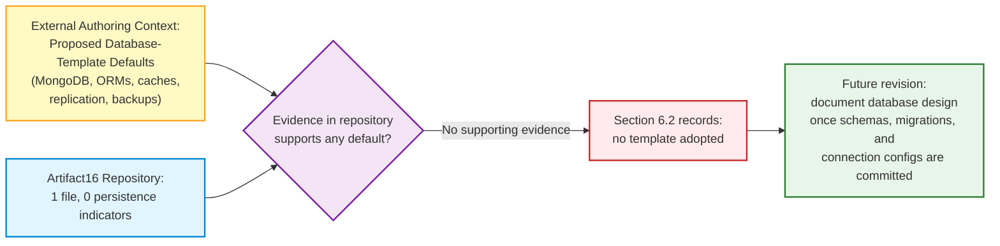

### 6.2.7 Required Diagrams — Feasibility Assessment

The section prompt requires three Mermaid diagrams: database schema diagrams (ERDs), data flow diagrams, and replication architecture diagrams. Because the repository contains no schemas, no data flows, and no replication topology from which a substantive diagram could be drawn, the diagram-feasibility precedent established in Section 4.5.1 and applied throughout Sections 5.3.3, 5.4.4, 5.5.3, and 6.1.6 applies: producing fabricated diagrams would violate the Evidence Constraint and the No-Fabrication Constraint enumerated in Section 5.6.2.

Following the Required-vs-Observed Mapping Diagram convention established in those precedent sections, three mapping diagrams are produced below — one for each required diagram category. Each diagram visualizes the gap between the section prompt's requirement and the verified empty state of the repository, in the same visual idiom and using the same color conventions as the Section 5 and Section 6.1 precedent. The "Document all indexes and constraints" requirement enumerated in the section prompt likewise cannot be fulfilled substantively, as no indexes or constraints exist (see Section 6.2.2.3); the empty state is recorded by the schema mapping diagram in Section 6.2.7.1.

#### 6.2.7.1 Database Schema Mapping Diagram (ERD Substitution)

This diagram documents the requirement for an Entity-Relationship Diagram (ERD), the inputs that would be required to construct one substantively, and the absence of those inputs in the present revision of the repository.

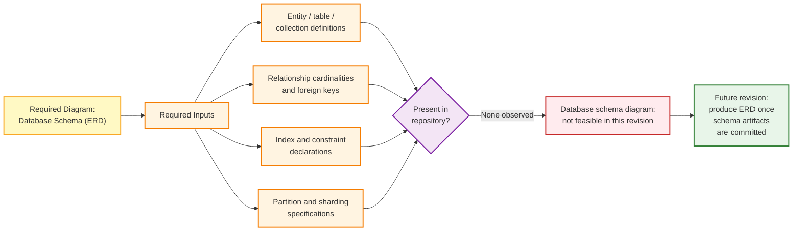

#### 6.2.7.2 Data Flow Mapping Diagram

This diagram documents the requirement for a data flow diagram, the inputs that would be required to construct one substantively, and the absence of those inputs in the present revision of the repository. As Section 5.2.3 records, "no data stores and no caches are documented," and no inter-component data movements have been declared.

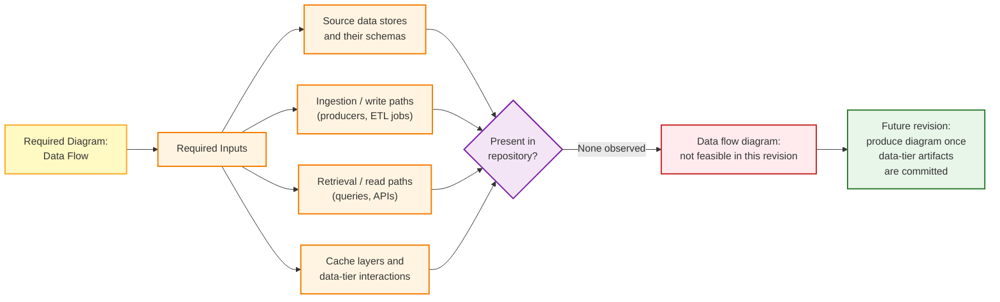

#### 6.2.7.3 Replication Architecture Mapping Diagram

This diagram documents the requirement for a replication architecture diagram, the inputs that would be required to construct one substantively, and the absence of those inputs in the present revision of the repository.

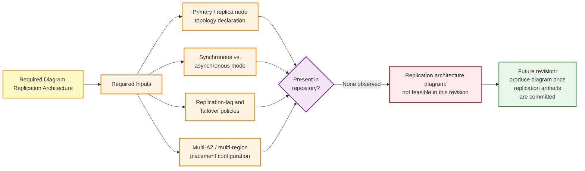

### 6.2.8 Assumptions, Constraints, and Forward-Looking Notes

#### 6.2.8.1 Documented Assumptions

The single assumption underlying this section is that the repository state observed at the time of authoring — one file, twelve bytes, zero subdirectories — is the complete and authoritative source of evidence for database-design determinations. This assumption is consistent with the verification activities recorded in Section 5.1.3 and with the documentation boundary conditions in Section 1.3.3. No additional assumptions about database engine selection, schema design, indexing strategy, partitioning approach, replication topology, backup architecture, migration tooling, retention policy, privacy controls, audit posture, access control model, or performance-optimization technique have been adopted, in accordance with the precedent set by Sections 2.7.1, 3.8.1, 4.6.1, 5.6.1, and 6.1.7.

#### 6.2.8.2 Documented Constraints

The constraints under which this section was authored mirror the six-constraint framework recorded in Section 5.6.2 and are reproduced and adapted below for the Database Design context, following the same convention applied in Section 6.1.7.

| Constraint | Description as Applied to Section 6.2 |
|------------|----------------------------------------|
| Evidence Constraint | Database designs, schemas, indexes, partitions, replication topologies, backup architectures, and persistence strategies may not be claimed absent supporting artifacts in the repository. |
| No-Fabrication Constraint | Schema names, table names, column types, index identifiers, partition keys, replication factors, RPO/RTO values, retention periods, cache TTLs, connection-pool sizes, and migration identifiers may not be invented to satisfy section-prompt categories. |
| No-Inference Constraint | Database design may not be inferred from the project name "Artifact16", from generic patterns observed in similar projects, or from default database templates supplied in authoring context (including the MongoDB reference in Section 3.8.3). |
| Precedent Constraint | Structure must mirror Sections 1.1, 1.2, 1.3, 2, 3, 4, 5, and 6.1 — namely, evidence-based acknowledgement of absence with forward-looking notes identifying required future artifacts. |
| Diagram-Production Constraint | The section prompt's requirement to produce database schema (ERD), data flow, and replication architecture diagrams cannot be satisfied with substantive content because no underlying database design exists; Required-vs-Observed Mapping Diagrams are substituted, consistent with the precedent established in Sections 5.3.3, 5.4.4, 5.5.3, and 6.1.6. |
| Relevance Constraint | The section prompt's explicit instruction to declare non-applicability when persistent storage interactions are not clearly evident is invoked, because no items in any of the four subsections (Schema Design, Data Management, Compliance Considerations, Performance Optimization) are applicable in the present revision. |

#### 6.2.8.3 Forward-Looking Note and Path to Population

This Section 6.2 will require complete redrafting once the **Artifact16** repository contains substantive database artifacts from which database-design documentation can be extracted and diagrammed. The minimum artifacts that would enable population of each required topic in a future revision are listed below, extending the path-to-population guidance offered in Sections 2.7.3, 3.8.4, 4.6.3, 5.6.3, and 6.1.7.

| Artifact to be Added | Section 6.2 Topic It Would Populate |
|----------------------|--------------------------------------|
| Database engine selection with version (e.g., PostgreSQL 16.x, MongoDB 7.x) and connection configuration | Schema Design — Applicability (6.2.1 / 6.2.2) |
| Schema definitions (DDL files, ORM model classes) with entity relationships and foreign keys | Schema Design — Entity relationships and data models (6.2.2.1, 6.2.2.2) |
| Index definitions with rationale (B-tree, hash, GIN, GiST, full-text, spatial) | Schema Design — Indexing strategy (6.2.2.3) |
| Partition configuration (range, hash, list partitions; sharding-key declarations) | Schema Design — Partitioning approach (6.2.2.4) |
| Replication topology configuration (primary-replica, multi-primary, semi-synchronous) | Schema Design — Replication configuration (6.2.2.5) |
| Backup schedules, snapshot policies, and point-in-time recovery configuration | Schema Design — Backup architecture (6.2.2.6) |
| Migration tool configuration (Alembic, Liquibase, Flyway) and migration scripts | Data Management — Migration procedures (6.2.3.1) |
| Schema-versioning policy and migration naming conventions | Data Management — Versioning strategy (6.2.3.2) |
| Archival rules and tiered-storage configurations | Data Management — Archival policies (6.2.3.3) |
| Repository-pattern code, query builders, ORM mappings, DAO classes | Data Management — Storage and retrieval mechanisms (6.2.3.4) |
| Cache client configurations with TTL declarations and eviction policies | Data Management — Caching policies / Performance — Caching strategy (6.2.3.5, 6.2.5.2) |
| Data-retention rules and compliance-regime declarations (GDPR, HIPAA, PCI-DSS) | Compliance — Data retention rules (6.2.4.1) |
| Backup-verification procedures, DR test reports, and RPO/RTO targets | Compliance — Backup and fault tolerance (6.2.4.2) |
| Encryption-at-rest and encryption-in-transit configuration; PII tagging rules | Compliance — Privacy controls (6.2.4.3) |
| Audit-log schemas, audit-trigger definitions, and CDC configurations | Compliance — Audit mechanisms (6.2.4.4) |
| Database user roles, GRANT/REVOKE statements, and row-level security policies | Compliance — Access controls (6.2.4.5) |
| Query-plan analyses, EXPLAIN outputs, and index-usage statistics | Performance — Query optimization patterns (6.2.5.1) |
| Connection-pool configuration (HikariCP, PgBouncer, etc.) with sizing rationale | Performance — Connection pooling (6.2.5.3) |
| Read-replica routing configuration and consistency-tolerance policies | Performance — Read/write splitting (6.2.5.4) |
| Batch-job definitions, bulk-insert procedures, and cursor-based pagination code | Performance — Batch processing approach (6.2.5.5) |

Upon the addition of these artifacts, the Section 6.2 author should remove the "no items present" acknowledgements and replace them with source-grounded entries that include database engine names with declared and resolved versions, schema definitions with named entities and relationship cardinalities, index identifiers with rationale references, partition keys with distribution-skew analyses, replication factors with synchronicity declarations, backup schedules with measured RPO/RTO values, retention periods with referenced compliance regimes, cache TTLs with eviction-policy justifications, and connection-pool sizes with measured workload baselines. The methodological framing in this revision should be retained as a historical record of the section's original empty state, consistent with the guidance offered in Sections 2.7.3, 3.8.4, 4.6.3, 5.6.3, and 6.1.7.

#### 6.2.8.4 Version Tracking Note

The section prompt does not explicitly request version tracking for database-design artifacts; however, the precedent established by Sections 2.7.4, 3.8.5, 4.6.4, 5.6.4, and 6.1.7 calls for version discipline once substantive content is added. When databases, schemas, indexes, partitions, replication topologies, backup procedures, migrations, and caching policies are introduced in a future revision, each artifact should carry an identifier and a version field beginning at 1.0 and incrementing per the project's change-management process — which itself is not yet defined in the repository. The proposed identifier convention is summarized below.

| Artifact Class | Proposed Identifier Prefix | Example |
|----------------|----------------------------|---------|
| Database engines | `DB-XXX` | `DB-001` (primary OLTP database) |
| Schemas | `SCH-XXX` | `SCH-001` (core domain schema) |
| Indexes | `IDX-XXX` | `IDX-001` (lookup index on principal entity) |
| Migrations | `MIG-XXX` | `MIG-001` (initial schema migration) |
| Replication topologies | `REP-XXX` | `REP-001` (primary-replica configuration) |
| Backup policies | `BKP-XXX` | `BKP-001` (daily snapshot policy) |
| Cache instances | `CCH-XXX` | `CCH-001` (read-through application cache) |

Per the No-Fabrication Constraint enumerated in Section 6.2.8.2, the example values above are presented as **conventions for future use only** and are not asserted as currently registered artifacts of the Artifact16 project.

#### 6.2.8.5 References

#### Files Examined

- `README.md` — The sole file in the repository, containing a single Markdown H1 line (`# Artifact16`). Verified to contain no database connection strings, no schemas, no ORM mappings, no migrations, no data models, no cache configurations, no backup policies, no compliance declarations, no audit-log definitions, no access-control rules, and no performance-optimization artifacts. This file is the foundational evidence for every empty-inventory determination in Section 6.2.

#### Folders Explored

- `` (repository root, depth 0) — Verified to contain exactly one direct child (`README.md`) and zero subdirectories. The absence of conventional database-related directories such as `db/`, `database/`, `migrations/`, `schemas/`, `models/`, `entities/`, `repositories/`, `data/`, `sql/`, `cache/`, `infrastructure/`, and `dbscripts/` is the foundational evidence for the non-applicability determination in Section 6.2.1.

#### Technical Specification Sections Retrieved

- **Section 1.2 SYSTEM OVERVIEW** — Provided the foundational corroborating evidence for the absence of source code modules, executable code, and persistence-related artifacts; cited throughout Sections 6.2.2 and 6.2.3.
- **Section 1.3 SCOPE** — Provided the Documentation Boundary Conditions table establishing one source file, zero subdirectories, zero configuration or manifest files, zero test files, and zero CI/CD definitions, and the explicit "Not specified (no data models or schemas present)" entry in the Data Domains row of the Boundary Dimensions table; cited in Section 6.2.1 and Section 6.2.2.1.
- **Section 2.3 FUNCTIONAL REQUIREMENTS TABLE** — Provided direct evidence that "the repository contains no API definitions, no schemas, no interface contracts, no performance targets, and no data models"; cited in Section 6.2.2.1.
- **Section 3.4 OPEN SOURCE DEPENDENCIES** — Provided direct evidence for the absence of all dependency manifests, including ORM and migration-tool dependencies; cited in Section 6.2.3.1.
- **Section 3.5 THIRD-PARTY SERVICES** — Provided direct evidence for the absence of cloud-database services from which managed-IAM controls might be inherited; cited in Section 6.2.4.5.
- **Section 3.6 DATABASES & STORAGE** — Primary corroborating section. Provided direct evidence for the absence of all persistence artifacts: connection strings, schemas, migrations, ORM mappings, query definitions, data models, cache configurations, and backup/DR configurations; cited throughout Sections 6.2.1 through 6.2.5.
- **Section 3.8 ASSUMPTIONS, CONSTRAINTS, AND FORWARD-LOOKING NOTES** — Provided the Default Technology Stack treatment precedent (including the MongoDB reference) that external authoring context is not asserted as project decisions; extended to Section 6.2.6.
- **Section 4.4 TECHNICAL IMPLEMENTATION** — Provided direct evidence for the absence of state transitions, data persistence points, caching requirements, and transaction boundaries; cited throughout Sections 6.2.3 and 6.2.5.
- **Section 4.5 REQUIRED DIAGRAMS** — Provided the diagram-feasibility precedent for handling required diagrams that cannot be substantively produced; cited in Section 6.2.7.
- **Section 5.2 HIGH-LEVEL ARCHITECTURE** — Provided direct evidence that "no data stores and no caches are documented" and that no data flows exist; cited in Section 6.2.7.2.
- **Section 5.4 TECHNICAL DECISIONS** — Provided direct evidence for the absence of data storage solution rationale and caching strategy justification, and provided the Treatment of Default Templates precedent extended to Section 6.2.6.
- **Section 5.5 CROSS-CUTTING CONCERNS** — Provided direct evidence for the absence of backup-strategy specification and disaster-recovery procedures; cited throughout Section 6.2.4.
- **Section 5.6 ASSUMPTIONS, CONSTRAINTS, AND FORWARD-LOOKING NOTES** — Provided the six-constraint framework (Evidence, No-Fabrication, No-Inference, Precedent, Diagram-Production, Relevance) adapted in Section 6.2.8.2, and the path-to-population table structure replicated in Section 6.2.8.3.
- **Section 6.1 Core Services Architecture** — Most direct structural precedent. Provided the subsection layout, the Required-vs-Observed Mapping Diagram pattern, the Treatment of Default Templates pattern, and the Version Tracking Note pattern adapted throughout Section 6.2. Also provided direct evidence in Section 6.1.4 for the absence of data redundancy approach, cited in Section 6.2.2.5 and Section 6.2.4.2.

#### Web Searches Performed

- None. The section's factual basis is entirely contained within the repository itself and within the cross-referenced sections of the Technical Specification. No external claims have been made in Section 6.2.

## 6.3 Integration Architecture

### 6.3.1 Applicability Determination

**Integration Architecture is not applicable for this system in its current revision.**

The section prompt explicitly anticipates this outcome with the instruction that, when the system does not require integration with external systems or services, the section must clearly state "Integration Architecture is not applicable for this system" and explain why. The **Artifact16** repository, as documented in Section 1.3.3, contains exactly one source file (`README.md`) consisting of a single line of Markdown (`# Artifact16`), zero subdirectories, zero configuration files, zero build manifests, zero CI/CD definitions, and zero test files. There are consequently no APIs, no protocol specifications, no authentication or authorization frameworks, no rate-limit policies, no versioning conventions, no API documentation artifacts, no event handlers, no message queue declarations, no stream-processing topologies, no batch-processing definitions, no error-handling strategies, no third-party integration patterns, no legacy adapters, no API-gateway configurations, and no external service contracts to architect, document, or diagram.

Section 1.2.1 (Integration with Enterprise Landscape) records the primary corroborating finding verbatim: "The repository contains no integration code, no API client libraries, no service definitions, no connector implementations, no environment configuration referencing external services, no authentication scaffolding for third-party systems, and no architecture diagrams depicting integration points. The project's relationship with any enterprise landscape is therefore **undocumented**." Section 2.4.3 reaffirms that "No integration points are documented... No shared components are documented... No common services are documented." Section 3.5.1 records that "No integrations with external APIs, third-party services, authentication providers, monitoring/observability platforms, payment processors, communication services, or cloud-hosted SaaS offerings are present in the **Artifact16** repository." Section 4.2.2 (Integration Workflows Status) records that "the repository documents **no integration workflows whatsoever**." Section 5.2.4 (External Integration Points) records that "because no external integration points exist in the repository, the registry is recorded as empty."

The applicability determination is grounded in the directly corroborating evidence summarized below.

| Determination Dimension | Repository Evidence | Corroborating Section |
|--------------------------|---------------------|------------------------|
| API design artifacts present | None | Section 1.2.1, Section 2.3.3 |
| Message processing artifacts present | None | Section 4.2.2, Section 5.2.3 |
| External system integration artifacts present | None | Section 3.5.1, Section 5.2.4 |
| Authentication / authorization artifacts present | None | Section 5.5.4, Section 1.2.1 |

Because none of the four classes of architectural inputs that would justify an Integration Architecture exist in the repository, the section is declared **not applicable**. This subsection nevertheless follows the structural precedent established by Sections 5.2 through 5.6, Section 6.1, and Section 6.2 — namely, evidence-based acknowledgement of absence with forward-looking notes — so that the document's organizational framework is preserved for future revisions in which substantive integration artifacts are committed.

### 6.3.2 API Design Status

The section prompt enumerates six required API Design topics: protocol specifications, authentication methods, authorization framework, rate limiting strategy, versioning approach, and documentation standards. Each topic is mapped below to its source-of-truth requirement and to the verified empty state of the repository, in the same tabular form used throughout Sections 5, 6.1, and 6.2.

| API Design Topic | Source That Would Be Required | Observed in Repository | Corroborating Section |
|-------------------|-------------------------------|------------------------|------------------------|
| Protocol specifications | OpenAPI/Swagger specs, gRPC `.proto` files, GraphQL schemas, WSDL definitions | None | Section 1.2.1, Section 2.3.3 |
| Authentication methods | Auth middleware code, OAuth/OIDC client config, JWT validation keys, API-key handlers | None | Section 1.2.1, Section 5.5.4 |
| Authorization framework | RBAC/ABAC policy declarations, IAM role definitions, permission matrices | None | Section 5.5.4, Section 2.5.3 |
| Rate limiting strategy | Rate-limit middleware, throttling configurations, quota policies | None | Section 1.2.3, Section 5.5.5 |
| Versioning approach | URI version paths, version headers, content-negotiation rules | None | Section 2.3.3, Section 2.7 |
| Documentation standards | OpenAPI/AsyncAPI specs, Swagger UI/Redoc tooling, API reference sites | None | Section 2.3.3, Section 3.7 |

#### 6.3.2.1 Protocol Specifications

No API protocol specifications are documented. Section 1.2.1 records the absence of integration code, API client libraries, service definitions, and connector implementations. Section 2.3.3 records that "the repository contains no API definitions, no schemas, no interface contracts, no performance targets, and no data models." No OpenAPI 3.x / Swagger 2.x descriptors, no gRPC `.proto` files, no GraphQL SDL schemas, no JSON Schema definitions, no Apache Thrift IDL files, no WSDL/XSD descriptors, and no AsyncAPI specifications exist anywhere in the repository. No protocol choice — REST, gRPC, GraphQL, SOAP, JSON-RPC, WebSocket, MQTT, AMQP, or any other — is referenced by any artifact. The protocol-specification inventory is therefore recorded as **empty**.

#### 6.3.2.2 Authentication Methods

No authentication methods are documented. Section 5.5.4 records that "No authentication or authorization framework is documented." Section 1.2.1 records the absence of "authentication scaffolding for third-party systems." The repository contains no OAuth 2.0 client configuration, no OpenID Connect (OIDC) discovery URLs, no JWT issuer/audience declarations, no signing-key or JWKS endpoint references, no SAML metadata, no API-key validation middleware, no mTLS certificate references, no HMAC signing routines, no Basic/Digest authentication handlers, and no session-cookie configuration. No identity provider — Auth0, Okta, AWS Cognito, Azure AD, Keycloak, Firebase Authentication, or equivalent — is referenced anywhere in the repository. The authentication-methods inventory is therefore recorded as **empty**.

#### 6.3.2.3 Authorization Framework

No authorization framework is documented. As recorded in Section 5.5.4 and reaffirmed by reference to Section 2.5.3, the repository contains no role-based access control (RBAC) policy declarations, no attribute-based access control (ABAC) rules, no policy-as-code definitions (e.g., Open Policy Agent / Rego, Cedar, AWS IAM policies), no permission matrices, no scope/claim mappings, no resource-based access control rules, and no row- or field-level authorization filters. No middleware enforcing authorization, no policy-decision-point integrations, and no policy-enforcement-point declarations are present. The authorization-framework inventory is therefore recorded as **empty**.

#### 6.3.2.4 Rate Limiting Strategy

No rate limiting strategy is documented. Section 1.2.3 records the absence of all KPIs, metrics definitions, observability requirements, and service-level objectives, and Section 5.5.5 confirms the absence of all performance budgets — both of which are prerequisites for any rate-limit threshold specification. The repository contains no rate-limit middleware (e.g., `express-rate-limit`, Flask-Limiter, Nginx `limit_req_zone`, Envoy rate-limit filter), no token-bucket or leaky-bucket implementations, no fixed-window or sliding-window counters, no per-client/per-IP/per-API-key quota declarations, no burst-rate configurations, and no throttling-response definitions. The rate-limiting inventory is therefore recorded as **empty**.

#### 6.3.2.5 Versioning Approach

No API versioning approach is documented. As recorded in Section 2.3.3, no API definitions or interface contracts exist; consequently no version policy can apply. The repository contains no URI versioning conventions (e.g., `/v1/`, `/v2/` path prefixes), no version-header schemes (e.g., `Accept: application/vnd.example.v1+json`, custom `X-API-Version` headers), no content-negotiation rules, no breaking-change taxonomy, no deprecation policy, no sunset-header declarations, and no version-compatibility matrices. The versioning inventory is therefore recorded as **empty**.

#### 6.3.2.6 Documentation Standards

No API documentation standards are documented. The repository contains no OpenAPI specification files (`openapi.yaml`, `swagger.json`), no AsyncAPI specifications, no API Blueprint files, no RAML documents, no documentation-generation tooling configuration (Swagger UI, Redoc, Stoplight, Slate, Docusaurus API plugin), no inline JSDoc/Javadoc/Pydoc API annotations, and no developer-portal references. Section 3.7 confirms the absence of development-and-deployment artifacts that would carry API-documentation tooling. The API-documentation-standards inventory is therefore recorded as **empty**.

### 6.3.3 Message Processing Status

The section prompt enumerates five required Message Processing topics: event processing patterns, message queue architecture, stream processing design, batch processing flows, and error handling strategy. Each is mapped below to its source-of-truth requirement and to the verified empty state of the repository.

| Message Processing Topic | Source That Would Be Required | Observed in Repository | Corroborating Section |
|---------------------------|-------------------------------|------------------------|------------------------|
| Event processing patterns | Event handlers, event-sourcing code, CQRS implementations, event-bus bindings | None | Section 4.2.2, Section 1.2.2 |
| Message queue architecture | Broker connection strings, queue/topic declarations, consumer-group configuration | None | Section 3.5.2, Section 4.2.2 |
| Stream processing design | Kafka Streams / Flink / Spark Streaming code, windowing configurations | None | Section 4.2.2, Section 1.2.2 |
| Batch processing flows | Scheduler configurations, cron definitions, batch-job scripts | None | Section 4.2.2, Section 3.7 |
| Error handling strategy | Retry libraries, dead-letter-queue (DLQ) configurations, circuit breakers | None | Section 4.4.2, Section 5.5.3 |

#### 6.3.3.1 Event Processing Patterns

No event processing patterns are documented. Section 4.2.2 records that "the repository documents **no integration workflows whatsoever**" and that no event-processing-flow artifacts exist. Section 1.2.2 records the absence of all source code modules and executable code, which precludes the existence of event handlers. The repository contains no event-handler functions, no event-sourcing aggregate definitions, no Command Query Responsibility Segregation (CQRS) command or query handlers, no event-bus subscriber registrations, no domain-event declarations, and no event-store configurations. The event-processing-patterns inventory is therefore recorded as **empty**.

#### 6.3.3.2 Message Queue Architecture

No message queue architecture is documented. Section 3.5.2 explicitly records the absence of "Messaging / queuing" artifacts with the note that "Broker connection strings, topic/queue declarations, consumer group config" would be the required indicators — none of which are present. The repository contains no broker references (Apache Kafka, RabbitMQ, Apache ActiveMQ, AWS SQS, AWS SNS, Azure Service Bus, Google Cloud Pub/Sub, NATS, Redis Streams, Apache Pulsar), no connection-string declarations, no queue or topic name declarations, no exchange/binding definitions, no consumer-group identifiers, no prefetch-count or acknowledgement-mode settings, and no broker-topology diagrams. The message-queue-architecture inventory is therefore recorded as **empty**.

#### 6.3.3.3 Stream Processing Design

No stream processing design is documented. Section 4.2.2 records the absence of all integration workflows, including event processing flows. The repository contains no Kafka Streams topology definitions, no Apache Flink job declarations, no Apache Spark Streaming pipelines, no AWS Kinesis Data Streams / Analytics configurations, no Google Cloud Dataflow / Beam pipelines, no Apache Storm topologies, no windowing strategy specifications (tumbling, sliding, session windows), no watermarking configurations, no stateful-operator declarations, and no exactly-once or at-least-once processing guarantee assertions. The stream-processing-design inventory is therefore recorded as **empty**.

#### 6.3.3.4 Batch Processing Flows

No batch processing flows are documented. Section 4.2.2 records the absence of "Batch processing sequences" with the note that "Scheduler configurations, cron definitions, batch scripts" would be required — none of which are present. Section 3.7 confirms the absence of development-and-deployment artifacts that would carry such schedulers. The repository contains no cron expressions, no Airflow DAG definitions, no Prefect or Dagster flow declarations, no AWS Step Functions or AWS Batch job configurations, no Azure Data Factory pipelines, no Google Cloud Composer/Workflows definitions, no Kubernetes CronJob manifests, no SLA-bounded job declarations, and no batch-window or backfill-policy specifications. The batch-processing-flows inventory is therefore recorded as **empty**.

#### 6.3.3.5 Error Handling Strategy

No message-processing error handling strategy is documented. Section 4.4.2 explicitly records the absence of "retry mechanisms (e.g., exponential-backoff implementations)," fallback processes including "circuit breakers, fallback handlers, and default-value providers," error-notification flows, and recovery procedures. Section 5.5.3 confirms that no error-handling middleware, retry/circuit-breaker logic, alerting integrations, or recovery procedures are present. The repository contains no dead-letter-queue (DLQ) declarations, no poison-message handling routines, no retry-with-backoff configurations (fixed, linear, exponential, jittered), no message-redelivery thresholds, no idempotency-key handling, no compensating-action definitions, and no saga-orchestrator declarations. The message-processing-error-handling inventory is therefore recorded as **empty**.

### 6.3.4 External Systems Status

The section prompt enumerates four required External Systems topics: third-party integration patterns, legacy system interfaces, API gateway configuration, and external service contracts. Each is mapped below to its source-of-truth requirement and to the verified empty state of the repository.

| External Systems Topic | Source That Would Be Required | Observed in Repository | Corroborating Section |
|-------------------------|-------------------------------|------------------------|------------------------|
| Third-party integration patterns | API client code, SDK imports, webhook handlers, OAuth client config | None | Section 1.2.1, Section 3.5.1 |
| Legacy system interfaces | EDI configurations, mainframe connectors, SOAP/XML adapters, file-drop watchers | None | Section 1.2.1, Section 1.2.2 |
| API gateway configuration | Gateway routing rules, ingress declarations, gateway-product configs | None | Section 1.2.1, Section 3.7 |
| External service contracts | Partner OpenAPI specs, SLA references, contract-testing artifacts | None | Section 3.5.1, Section 5.5.5 |

#### 6.3.4.1 Third-Party Integration Patterns

No third-party integration patterns are documented. As recorded in Section 3.5.1: "No integrations with external APIs, third-party services, authentication providers, monitoring/observability platforms, payment processors, communication services, or cloud-hosted SaaS offerings are present in the **Artifact16** repository." Section 1.2.1 corroborates with the explicit absence of "integration code, API client libraries, service definitions, [and] connector implementations." The repository contains no HTTP client SDK imports, no webhook receiver handlers, no inbound or outbound webhook signature verification logic, no OAuth 2.0 client implementations, no synchronous request/reply integration code, no asynchronous publish/subscribe bindings, no file-based exchange adapters, and no integration-broker middleware. The third-party-integration-patterns inventory is therefore recorded as **empty**.

#### 6.3.4.2 Legacy System Interfaces

No legacy system interfaces are documented. Section 1.2.1 records that the repository contains no references to a predecessor system, legacy platform, or system being replaced or upgraded, and that "There is no migration documentation, no architectural decision record indicating displacement of an existing solution, and no comparative analysis with prior tooling." Section 1.2.2 confirms the absence of all source code, which precludes the existence of legacy adapters. The repository contains no Electronic Data Interchange (EDI) configurations (X12, EDIFACT), no mainframe connectors (CICS, IMS, JCL submitters), no SOAP/XML adapter code, no Common Object Request Broker Architecture (CORBA) IDL definitions, no Remote Method Invocation (RMI) registry references, no Java Message Service (JMS) bridge configurations, no FTP/SFTP file-drop watchers, no flat-file ingestion parsers, and no terminal-emulation scripts. The legacy-system-interfaces inventory is therefore recorded as **empty**.

#### 6.3.4.3 API Gateway Configuration

No API gateway configuration is documented. Section 1.2.1 records the absence of all integration and connector code. Section 3.7 confirms the absence of all infrastructure-as-code, deployment manifests, and gateway configuration artifacts. The repository contains no API gateway product configuration (Amazon API Gateway, Azure API Management, Google Cloud Endpoints / API Gateway, Kong, Apigee, Tyk, KrakenD, Express Gateway, WSO2 API Manager), no gateway routing rules, no path-rewriting or URL-mapping declarations, no upstream service registrations, no request/response transformation policies, no gateway-level rate-limit attachments, no gateway-level authentication plugins, no service-mesh ingress gateway configurations (Istio Gateway, Linkerd, Consul Connect), and no Kubernetes Ingress manifests. The API-gateway-configuration inventory is therefore recorded as **empty**.

#### 6.3.4.4 External Service Contracts

No external service contracts are documented. Section 3.5.1 records the absence of all external service integrations, and Section 5.5.5 records the absence of all SLA, SLO, and performance-budget declarations. The repository contains no partner-supplied OpenAPI specifications, no AsyncAPI documents from upstream providers, no consumer-driven contract test artifacts (Pact, Spring Cloud Contract), no service-blueprints, no SLA documents with declared availability/latency/throughput targets, no support-tier references, no escalation paths, and no third-party legal-or-commercial agreement references. The external-service-contracts inventory is therefore recorded as **empty**.

### 6.3.5 Treatment of Default Integration Templates

A precedent for handling externally supplied authoring context exists in Section 3.8.3 (Default Technology Stack), Section 4.5.3 (generic process patterns), Section 5.4.2 (Default Architecture Template), Section 6.1.5 (Default Service-Architecture Templates), and Section 6.2.6 (Default Database Templates). Each of these subsections explicitly declines to assert externally supplied defaults as decisions of the **Artifact16** project. The same treatment applies to default integration templates that may be supplied as authoring context or recalled from external knowledge for Section 6.3.

The Default Technology Stack documented in Section 3.8.3 expressly listed **Auth0** as a proposed authentication provider. Under the Evidence Constraint and No-Inference Constraint inherited from Section 5.6.2, Auth0 **cannot be asserted** as the authentication choice of the Artifact16 project. As Section 3.8.3 records, "the Default Technology Stack cannot be asserted as the actual technology stack of the Artifact16 project. No artifact in the repository references any of these technologies, no manifest declares them as dependencies, no source code imports them, and no configuration adopts them."

Default integration-related templates that, if supplied externally, are **not** asserted as the design of the Artifact16 system include — but are not limited to — the following:

| Template Category | Examples That Must NOT Be Asserted as Project Decisions |
|--------------------|----------------------------------------------------------|
| API protocols | REST/HTTP, gRPC, GraphQL, SOAP, JSON-RPC, WebSocket, MQTT, AMQP |
| Authentication schemes | OAuth 2.0, OpenID Connect, JWT, SAML, API keys, mTLS, HMAC signing |
| Identity providers | Auth0, Okta, AWS Cognito, Azure AD, Keycloak, Firebase Auth |
| Authorization models | RBAC, ABAC, ReBAC, Open Policy Agent / Rego, Cedar, AWS IAM policies |
| Rate-limiting algorithms | Token bucket, leaky bucket, fixed window, sliding window, GCRA |
| API versioning conventions | URI versioning, header versioning, content-negotiation versioning |
| API documentation standards | OpenAPI/Swagger, AsyncAPI, API Blueprint, RAML, Redoc, Stoplight |
| Message brokers | Apache Kafka, RabbitMQ, AWS SQS/SNS, Azure Service Bus, GCP Pub/Sub, NATS, Pulsar |
| Stream processors | Kafka Streams, Apache Flink, Apache Spark Streaming, AWS Kinesis, Beam |
| Batch / workflow orchestrators | Apache Airflow, Prefect, Dagster, AWS Step Functions, Kubernetes CronJobs |
| API gateway products | Amazon API Gateway, Azure APIM, Kong, Apigee, Tyk, KrakenD, WSO2 |
| Service-mesh ingress | Istio Gateway, Linkerd, Consul Connect, Envoy, Traefik Mesh |
| Legacy adapter patterns | EDI (X12/EDIFACT), SOAP/XML, JMS bridges, file-drop watchers, mainframe connectors |
| Resilience libraries | Resilience4j, Polly, Hystrix, exponential-backoff retry libraries, DLQ patterns |

Under the Evidence Constraint and No-Inference Constraint inherited from Section 5.6.2, **no default integration template may be asserted as a decision of the Artifact16 project**, because no artifact in the repository references any specific API protocol, authentication scheme, identity provider, authorization model, rate-limit algorithm, versioning convention, documentation standard, message broker, stream processor, batch orchestrator, API gateway product, service-mesh component, legacy adapter, or resilience library.

The relationship between externally supplied integration-template defaults and the present section's evidence basis is depicted below, adapting the visualization established in Sections 3.8.3, 5.4.2, 6.1.5, and 6.2.6.

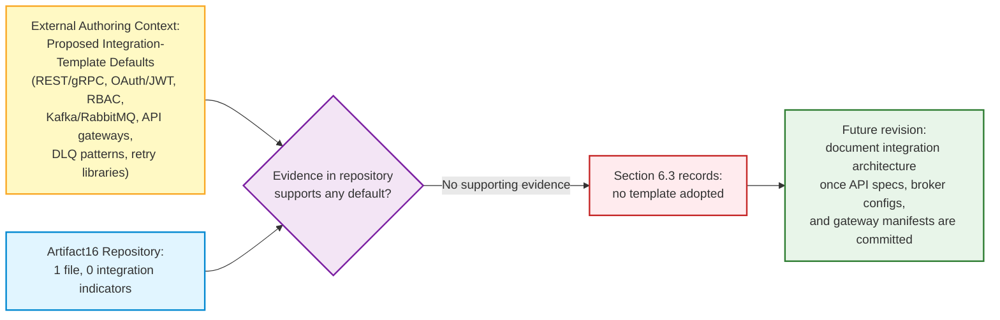

### 6.3.6 Required Diagrams — Feasibility Assessment

The section prompt requires three Mermaid diagrams: integration flow diagrams, API architecture diagrams, and message flow diagrams. The prompt also requires sequence diagrams for key flows, Markdown tables for API specifications, and documentation of all external dependencies. Because the repository contains no integrations, no APIs, no message flows, no key flows, no API specifications, and no external dependencies from which a substantive diagram, sequence diagram, or specification table could be drawn, the diagram-feasibility precedent established in Section 4.5.1 and applied throughout Sections 5.3.3, 5.4.4, 5.5.3, 6.1.6, and 6.2.7 applies: producing fabricated diagrams or fabricated specification tables would violate the Evidence Constraint and the No-Fabrication Constraint enumerated in Section 5.6.2.

Following the Required-vs-Observed Mapping Diagram convention established in those precedent sections, three mapping diagrams are produced below — one for each required diagram category. Each diagram visualizes the gap between the section prompt's requirement and the verified empty state of the repository, in the same visual idiom and using the same color conventions as the Section 5, Section 6.1, and Section 6.2 precedent. The requirement to "document all external dependencies" is likewise satisfied by recording the empty external-dependency inventory established in Section 3.4 and Section 3.5.

#### 6.3.6.1 Integration Flow Mapping Diagram

This diagram documents the requirement for an integration flow diagram, the inputs that would be required to construct one substantively, and the absence of those inputs in the present revision of the repository. As Section 4.2.2 records, "the repository documents **no integration workflows whatsoever**."

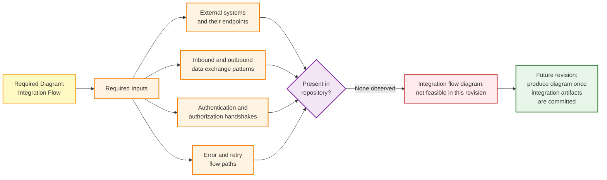

#### 6.3.6.2 API Architecture Mapping Diagram

This diagram documents the requirement for an API architecture diagram, the inputs that would be required to construct one substantively, and the absence of those inputs in the present revision of the repository.

```mermaid
graph LR
    Required["Required Diagram:<br/>API Architecture"]
    Required --> Components["Required Inputs"]
    Components --> C1["API protocol specifications<br/>(OpenAPI / gRPC / GraphQL)"]
    Components --> C2["Authentication and<br/>authorization framework"]
    Components --> C3["Rate-limit, versioning,<br/>and gateway configuration"]
    Components --> C4["Backend services<br/>fronted by the API"]

    C1 --> Evidence{"Present in<br/>repository?"}
    C2 --> Evidence
    C3 --> Evidence
    C4 --> Evidence

    Evidence -->|None observed| NotFeasible["API architecture diagram:<br/>not feasible in this revision"]
    NotFeasible --> Future["Future revision:<br/>produce diagram once<br/>API specifications<br/>are committed"]

    classDef requiredNode fill:#fff9c4,stroke:#f9a825,stroke-width:2px
    classDef diagramNode fill:#fff4e1,stroke:#f57c00,stroke-width:2px
    classDef decisionNode fill:#f3e5f5,stroke:#7b1fa2,stroke-width:2px
    classDef emptyNode fill:#ffebee,stroke:#c62828,stroke-width:2px
    classDef futureNode fill:#e8f5e9,stroke:#2e7d32,stroke-width:2px
    class Required requiredNode
    class Components,C1,C2,C3,C4 diagramNode
    class Evidence decisionNode
    class NotFeasible emptyNode
    class Future futureNode
```

#### 6.3.6.3 Message Flow Mapping Diagram

This diagram documents the requirement for a message flow diagram, the inputs that would be required to construct one substantively, and the absence of those inputs in the present revision of the repository.

```mermaid
graph LR
    Required["Required Diagram:<br/>Message Flow"]
    Required --> Components["Required Inputs"]
    Components --> C1["Producer / consumer<br/>component declarations"]
    Components --> C2["Broker topology and<br/>queue/topic definitions"]
    Components --> C3["Message schemas and<br/>serialization formats"]
    Components --> C4["Retry, DLQ, and<br/>error-handling policies"]

    C1 --> Evidence{"Present in<br/>repository?"}
    C2 --> Evidence
    C3 --> Evidence
    C4 --> Evidence

    Evidence -->|None observed| NotFeasible["Message flow diagram:<br/>not feasible in this revision"]
    NotFeasible --> Future["Future revision:<br/>produce diagram once<br/>messaging artifacts<br/>are committed"]

    classDef requiredNode fill:#fff9c4,stroke:#f9a825,stroke-width:2px
    classDef diagramNode fill:#fff4e1,stroke:#f57c00,stroke-width:2px
    classDef decisionNode fill:#f3e5f5,stroke:#7b1fa2,stroke-width:2px
    classDef emptyNode fill:#ffebee,stroke:#c62828,stroke-width:2px
    classDef futureNode fill:#e8f5e9,stroke:#2e7d32,stroke-width:2px
    class Required requiredNode
    class Components,C1,C2,C3,C4 diagramNode
    class Evidence decisionNode
    class NotFeasible emptyNode
    class Future futureNode
```

#### 6.3.6.4 Sequence Diagrams for Key Flows — Feasibility

The section prompt requires sequence diagrams for key flows. As recorded throughout Sections 4.2.1, 4.2.2, 4.3, and 5.2.3, the repository documents no core business processes, no integration workflows, no actor-system interactions, no API request/response cycles, and no event-driven choreographies. Because no key flows have been articulated, sequence diagrams cannot be drawn substantively in this revision. Producing a fabricated sequence diagram would violate the No-Fabrication Constraint enumerated in Section 5.6.2. Per the precedent established in Section 4.5.1, this requirement will be satisfied in a future revision once key flows are defined by source code, configuration, or design documentation committed to the repository.

#### 6.3.6.5 External Dependencies Registry

The section prompt requires documentation of all external dependencies. Because no external dependencies exist in the repository, the registry is recorded as empty. The table below presents the requested structure with the verified empty state, in conformance with the four-column maximum specified in the section prompt's output format requirements.

| Dependency Identifier | Dependency Type | Direction (Inbound / Outbound) | Evidence Source |
|------------------------|-----------------|--------------------------------|-----------------|
| None documented | Not applicable | Not applicable | Inventory empty — Section 3.4 (no dependency manifests); Section 3.5.1 (no third-party services); Section 1.2.1 (no integration code) |

Per the No-Fabrication Constraint, no external dependency identifier, type, direction, or evidence reference may be invented to populate this registry.

### 6.3.7 Assumptions, Constraints, and Forward-Looking Notes

#### 6.3.7.1 Documented Assumptions

The single assumption underlying this section is that the repository state observed at the time of authoring — one file, twelve bytes, zero subdirectories — is the complete and authoritative source of evidence for integration-architecture determinations. This assumption is consistent with the verification activities recorded in Section 5.1.3 and with the documentation boundary conditions in Section 1.3.3. No additional assumptions about API protocols, authentication schemes, authorization models, rate-limit policies, versioning conventions, documentation standards, event-processing patterns, message brokers, stream processors, batch orchestrators, error-handling strategies, third-party integrations, legacy interfaces, API gateways, or external service contracts have been adopted, in accordance with the precedent set by Sections 2.7.1, 3.8.1, 4.6.1, 5.6.1, 6.1.7, and 6.2.8.1.

#### 6.3.7.2 Documented Constraints

The constraints under which this section was authored mirror the six-constraint framework recorded in Section 5.6.2 and are reproduced and adapted below for the Integration Architecture context, following the same convention applied in Sections 6.1.7 and 6.2.8.2.

| Constraint | Description as Applied to Section 6.3 |
|------------|----------------------------------------|
| Evidence Constraint | API designs, message-processing patterns, and external system integrations may not be claimed absent supporting artifacts in the repository. |
| No-Fabrication Constraint | API endpoint paths, HTTP methods, authentication scheme names, identity-provider identifiers, authorization-policy identifiers, rate-limit thresholds, API version strings, OpenAPI document identifiers, message queue names, topic names, consumer group names, stream-processing job names, batch-job names, third-party service identifiers, gateway configurations, partner SLA values, and DLQ identifiers may not be invented to satisfy section-prompt categories. |
| No-Inference Constraint | Integration architecture may not be inferred from the project name "Artifact16", from generic patterns observed in similar projects, or from default integration templates supplied in authoring context (including the Auth0 reference in Section 3.8.3 and any default API protocol, broker, or gateway proposed elsewhere in authoring context). |
| Precedent Constraint | Structure must mirror Sections 1.1, 1.2, 1.3, 2, 3, 4, 5, 6.1, and 6.2 — namely, evidence-based acknowledgement of absence with forward-looking notes identifying required future artifacts. |
| Diagram-Production Constraint | The section prompt's requirement to produce integration flow, API architecture, message flow, and sequence diagrams cannot be satisfied with substantive content because no underlying integration architecture exists; Required-vs-Observed Mapping Diagrams are substituted, consistent with the precedent established in Sections 5.3.3, 5.4.4, 5.5.3, 6.1.6, and 6.2.7. |
| Relevance Constraint | The section prompt's explicit instruction to declare "Integration Architecture is not applicable for this system" when no integration with external systems or services is required is invoked, because no items in any of the three subsections (API Design, Message Processing, External Systems) are applicable in the present revision. |

#### 6.3.7.3 Forward-Looking Note and Path to Population

This Section 6.3 will require complete redrafting once the **Artifact16** repository contains substantive integration artifacts from which API design, message processing, and external system documentation can be extracted and diagrammed. The minimum artifacts that would enable population of each required topic in a future revision are listed below, extending the path-to-population guidance offered in Sections 2.7.3, 3.8.4, 4.6.3, 5.6.3, 6.1.7, and 6.2.8.3.

| Artifact to be Added | Section 6.3 Topic It Would Populate |
|----------------------|--------------------------------------|
| OpenAPI/Swagger specifications, gRPC `.proto` files, GraphQL SDL schemas, AsyncAPI documents | API Design — Protocol specifications (6.3.2.1) |
| Authentication middleware, OAuth 2.0 / OIDC client configuration, JWT validation routines, API-key handlers | API Design — Authentication methods (6.3.2.2) |
| RBAC / ABAC policy declarations, OPA / Rego / Cedar policies, permission matrices | API Design — Authorization framework (6.3.2.3) |
| Rate-limit middleware configuration with named algorithm and threshold values | API Design — Rate limiting strategy (6.3.2.4) |
| API versioning convention documentation (URI paths, headers, content negotiation) and deprecation policy | API Design — Versioning approach (6.3.2.5) |
| OpenAPI / AsyncAPI documentation tooling configuration (Swagger UI, Redoc, Stoplight) and API reference site | API Design — Documentation standards (6.3.2.6) |
| Event handler code, event-bus subscriber registrations, event-sourcing and CQRS implementations | Message Processing — Event processing patterns (6.3.3.1) |
| Broker connection strings, queue/topic/exchange declarations, consumer-group configurations | Message Processing — Message queue architecture (6.3.3.2) |
| Stream-processing topology definitions (Kafka Streams, Flink, Spark Streaming, Kinesis, Beam) with windowing configurations | Message Processing — Stream processing design (6.3.3.3) |
| Scheduler configurations (Airflow, Prefect, Dagster, Step Functions, Kubernetes CronJob) and batch-job definitions | Message Processing — Batch processing flows (6.3.3.4) |
| Retry libraries with backoff and jitter parameters, dead-letter-queue declarations, circuit-breaker configurations | Message Processing — Error handling strategy (6.3.3.5) |
| Third-party SDK imports, HTTP client code, webhook receiver handlers, OAuth client implementations | External Systems — Third-party integration patterns (6.3.4.1) |
| Legacy adapter code (EDI parsers, SOAP/XML clients, mainframe connectors, JMS bridges, file-drop watchers) | External Systems — Legacy system interfaces (6.3.4.2) |
| API gateway configuration files (Kong, Apigee, AWS API Gateway, Azure APIM, Istio Gateway) | External Systems — API gateway configuration (6.3.4.3) |
| Partner-supplied OpenAPI specifications, SLA documents, consumer-driven contract tests (Pact) | External Systems — External service contracts (6.3.4.4) |
| Sequence diagrams, integration flow diagrams, message flow diagrams produced from the above artifacts | Required Diagrams (6.3.6) |

Upon the addition of these artifacts, the Section 6.3 author should remove the "no items present" acknowledgements and replace them with source-grounded entries that include API endpoint paths with verified HTTP methods and protocols, named authentication and authorization schemes with provider identifiers, named rate-limit algorithms with measured thresholds, named versioning conventions with deprecation policies, named API documentation toolchains with reference URLs, named event-processing patterns with handler identifiers, named message brokers with declared topics and consumer groups, named stream processors with windowing strategies, named batch orchestrators with schedule expressions, named retry/DLQ/circuit-breaker libraries with parameter values, named third-party services with SDK identifiers, named legacy adapters with protocol identifiers, named API gateway products with route declarations, and named external service contracts with referenced SLAs. The methodological framing in this revision should be retained as a historical record of the section's original empty state, consistent with the guidance offered in Sections 2.7.3, 3.8.4, 4.6.3, 5.6.3, 6.1.7, and 6.2.8.3.

#### 6.3.7.4 Version Tracking Note

The section prompt does not explicitly request version tracking for integration artifacts; however, the precedent established by Sections 2.7.4, 3.8.5, 4.6.4, 5.6.4, 6.1.7, and 6.2.8.4 calls for version discipline once substantive content is added. When APIs, authentication schemes, authorization policies, rate-limit rules, message queues, event streams, batch jobs, third-party integrations, and API gateways are introduced in a future revision, each artifact should carry an identifier and a version field beginning at 1.0 and incrementing per the project's change-management process — which itself is not yet defined in the repository. The proposed identifier convention is summarized below.

| Artifact Class | Proposed Identifier Prefix | Example |
|----------------|----------------------------|---------|
| APIs | `API-XXX` | `API-001` (primary public API) |
| Authentication schemes | `AUTH-XXX` | `AUTH-001` (primary OAuth scheme) |
| Authorization policies | `AUTHZ-XXX` | `AUTHZ-001` (core RBAC policy) |
| Rate-limit rules | `RLM-XXX` | `RLM-001` (default per-client quota) |
| Message queues / topics | `MSG-XXX` | `MSG-001` (primary work queue) |
| Event streams | `EVT-XXX` | `EVT-001` (domain-event stream) |
| Batch jobs | `BTH-XXX` | `BTH-001` (nightly aggregation job) |
| External integrations | `INT-XXX` | `INT-001` (primary partner integration) |
| API gateways | `GW-XXX` | `GW-001` (public ingress gateway) |

Per the No-Fabrication Constraint enumerated in Section 6.3.7.2, the example values above are presented as **conventions for future use only** and are not asserted as currently registered artifacts of the Artifact16 project.

### 6.3.8 References

#### 6.3.8.1 Files Examined

- `README.md` — The sole file in the repository, containing a single Markdown H1 line (`# Artifact16`). Verified to contain no API definitions, no protocol specifications, no authentication scaffolding, no authorization rules, no rate-limit configurations, no versioning conventions, no API documentation, no event handlers, no message-broker references, no stream-processing code, no batch-job definitions, no error-handling strategies, no third-party SDK imports, no legacy adapters, no API gateway configurations, and no external service contracts. This file is the foundational evidence for every empty-inventory determination in Section 6.3.

#### 6.3.8.2 Folders Explored

- `` (repository root, depth 0) — Verified to contain exactly one direct child (`README.md`) and zero subdirectories. The absence of conventional integration-related directories such as `api/`, `apis/`, `integrations/`, `connectors/`, `services/`, `gateway/`, `clients/`, `webhooks/`, `events/`, `messages/`, `queues/`, `streams/`, `consumers/`, `producers/`, `auth/`, `middleware/`, `protos/`, `openapi/`, and `schemas/` is the foundational evidence for the non-applicability determination in Section 6.3.1.

#### 6.3.8.3 Technical Specification Sections Retrieved

- **Section 1.2 SYSTEM OVERVIEW** — Provided the foundational corroborating quote: "The repository contains no integration code, no API client libraries, no service definitions, no connector implementations, no environment configuration referencing external services, no authentication scaffolding for third-party systems, and no architecture diagrams depicting integration points." Cited throughout Sections 6.3.1, 6.3.2, 6.3.3, and 6.3.4.
- **Section 1.3 SCOPE** — Provided the Documentation Boundary Conditions table establishing one source file, zero subdirectories, zero configuration or manifest files, zero test files, and zero CI/CD definitions; cited in Section 6.3.1.
- **Section 2.3 FUNCTIONAL REQUIREMENTS TABLE** — Provided direct evidence that "the repository contains no API definitions, no schemas, no interface contracts, no performance targets, and no data models"; cited in Section 6.3.2.1.
- **Section 2.4 FEATURE RELATIONSHIPS** — Provided the verbatim Section 2.4.3 statement that "No integration points are documented... No shared components are documented... No common services are documented"; cited throughout Section 6.3.
- **Section 2.5 IMPLEMENTATION CONSIDERATIONS** — Provided direct evidence for the absence of security, performance, and capacity requirements that would inform API and integration design; cited in Section 6.3.2.4.
- **Section 2.7 ASSUMPTIONS, CONSTRAINTS, AND FORWARD-LOOKING NOTES** — Provided the original constraint framework that was extended to the six-constraint framework in Section 5.6.2 and adapted in Section 6.3.7.2.
- **Section 3.4 OPEN SOURCE DEPENDENCIES** — Provided direct evidence for the absence of all dependency manifests, including HTTP clients, SDK packages, broker clients, and resilience libraries; cited in Section 6.3.6.5.
- **Section 3.5 THIRD-PARTY SERVICES** — Primary corroborating section. Provided the verbatim Section 3.5.1 statement that "No integrations with external APIs, third-party services, authentication providers, monitoring/observability platforms, payment processors, communication services, or cloud-hosted SaaS offerings are present in the **Artifact16** repository," and the Section 3.5.2 Required Evidence vs. Observed Evidence table covering external APIs, authentication providers, messaging/queuing, and cloud services. Cited throughout Section 6.3.3 and Section 6.3.4.
- **Section 3.7 DEVELOPMENT & DEPLOYMENT** — Provided direct evidence for the absence of infrastructure-as-code, deployment manifests, schedulers, and API gateway configuration; cited in Sections 6.3.3.4 and 6.3.4.3.
- **Section 3.8 ASSUMPTIONS, CONSTRAINTS, AND FORWARD-LOOKING NOTES** — Provided the Default Technology Stack treatment precedent (including the Auth0 reference) that external authoring context is not asserted as project decisions; extended to Section 6.3.5.
- **Section 4.2 SYSTEM WORKFLOWS** — Provided the verbatim Section 4.2.2 statement that "the repository documents **no integration workflows whatsoever**" and the Integration Workflows topic-mapping table; cited throughout Sections 6.3.3 and 6.3.4.
- **Section 4.4 TECHNICAL IMPLEMENTATION** — Provided direct evidence for the absence of retry mechanisms, fallback processes, circuit breakers, error-notification flows, and recovery procedures; cited in Section 6.3.3.5.
- **Section 4.5 REQUIRED DIAGRAMS** — Provided the diagram-feasibility precedent for handling required diagrams that cannot be substantively produced; cited in Section 6.3.6.
- **Section 5.2 HIGH-LEVEL ARCHITECTURE** — Provided the verbatim Section 5.2.3 statement that no integration patterns or protocols are documented and the verbatim Section 5.2.4 statement that "because no external integration points exist in the repository, the registry is recorded as empty"; cited throughout Section 6.3.
- **Section 5.4 TECHNICAL DECISIONS** — Provided the Treatment of Default and Externally Supplied Templates precedent extended to Section 6.3.5.
- **Section 5.5 CROSS-CUTTING CONCERNS** — Provided the verbatim Section 5.5.4 statement that "No authentication or authorization framework is documented," the Section 5.5.3 absence of error-handling middleware and retry/circuit-breaker logic, and the Section 5.5.5 absence of SLAs and performance budgets; cited throughout Sections 6.3.2 and 6.3.3.
- **Section 5.6 ASSUMPTIONS, CONSTRAINTS, AND FORWARD-LOOKING NOTES** — Provided the six-constraint framework (Evidence, No-Fabrication, No-Inference, Precedent, Diagram-Production, Relevance Constraints) adapted in Section 6.3.7.2, and the path-to-population table structure replicated in Section 6.3.7.3.
- **Section 6.1 Core Services Architecture** — Most direct structural precedent. Provided the subsection layout (Applicability Determination → Topic Status Subsections → Treatment of Default Templates → Required Diagrams Feasibility → Assumptions/Constraints/Forward-Looking Notes → References), the Required-vs-Observed Mapping Diagram pattern, the Treatment of Default Templates pattern, and the Version Tracking Note pattern adapted throughout Section 6.3. Also provided corroborating evidence on the absence of service definitions and inter-service communication patterns referenced in Section 6.3.4.
- **Section 6.2 DATABASE DESIGN** — Second direct structural precedent. Confirmed the methodology of extending the 6.1 pattern with topic-specific customization, including the multi-row Default Template Categories table format adapted in Section 6.3.5.

#### 6.3.8.4 Web Searches Performed

- None. The section's factual basis is entirely contained within the repository itself and within the cross-referenced sections of the Technical Specification. No external claims have been made in Section 6.3.

## 6.4 Security Architecture

### 6.4.1 Applicability Determination

**Detailed Security Architecture is not applicable for this system in its current revision.**

The section prompt explicitly anticipates this outcome with the instruction that, when the system does not require specific security considerations beyond standard practices, the section must clearly state "Detailed Security Architecture is not applicable for this system" and explain which standard practices would otherwise apply. The **Artifact16** repository, as documented in Section 1.3.3, contains exactly one source file (`README.md`) consisting of a single line of Markdown (`# Artifact16`), zero subdirectories, zero configuration files, zero build manifests, zero CI/CD definitions, and zero test files. There is consequently no authentication framework, no authorization system, no data-protection mechanism, no session-management approach, no token-handling routine, no password policy, no role-based or attribute-based access control, no policy-enforcement point, no audit-logging substrate, no encryption configuration, no key-management infrastructure, no data-masking rule, no secure-communication channel, and no compliance regime to architect, document, or diagram.

Section 5.5.4 (Authentication and Authorization Framework Status) records the primary corroborating finding: "No authentication or authorization framework is documented... No identity provider is configured, no authentication middleware is imported, no authorization policy (role-based, attribute-based, or otherwise) is declared, no token-handling logic exists, and no session-management approach is defined." Section 1.2.1 records "no authentication scaffolding for third-party systems." Section 2.5.3 records that "no security implications are documented. There is no threat model, no security control catalogue, no authentication or authorization design, no data-classification scheme, and no compliance regime referenced in the repository." Section 6.2.4.3 (Privacy Controls) records that the repository contains "no encryption-at-rest configuration (e.g., TDE, column-level encryption, key-management-service integration), no encryption-in-transit configuration (e.g., TLS certificate references, mTLS configuration), no PII classification taxonomy, no data-masking or pseudonymization rules, and no tokenization-vault references." Section 6.2.4.4 (Audit Mechanisms) records that the repository contains "no audit-log schemas, no audit-trigger definitions, no change-data-capture (CDC) configurations, no immutable append-only log stores, and no audit-event taxonomies." Section 6.3.2.2 (Authentication Methods) and Section 6.3.2.3 (Authorization Framework) record corresponding empty inventories for integration-level authentication and authorization respectively.

The section prompt's conditional fallback — describing which standard security practices "will be followed instead" — must itself be qualified under the six-constraint framework recorded in Section 5.6.2. No standard security practice (transport-layer encryption, password hashing, principle-of-least-privilege IAM, audit logging, etc.) can be asserted as currently followed by the Artifact16 project, because no code, configuration, deployment manifest, runtime environment, or data-handling artifact exists to which such a practice could be applied. Standard security practices that would apply once substantive artifacts are committed are therefore presented in Section 6.4.7.3 as forward-looking guidance rather than as currently adopted controls.

The applicability determination is grounded in the directly corroborating evidence summarized below.

| Determination Dimension | Repository Evidence | Corroborating Section |
|--------------------------|---------------------|------------------------|
| Authentication framework artifacts present | None | Section 5.5.4, Section 6.3.2.2 |
| Authorization system artifacts present | None | Section 5.5.4, Section 6.3.2.3 |
| Data-protection / encryption artifacts present | None | Section 6.2.4.3, Section 2.5.3 |
| Audit / compliance artifacts present | None | Section 6.2.4.4, Section 2.5.3 |

Because none of the four classes of architectural inputs that would justify a detailed Security Architecture exist in the repository, the section is declared **not applicable**. This subsection nevertheless follows the structural precedent established by Sections 5.2 through 5.6, Section 6.1, Section 6.2, and Section 6.3 — namely, evidence-based acknowledgement of absence with forward-looking notes — so that the document's organizational framework is preserved for future revisions in which substantive security artifacts are committed.

### 6.4.2 Authentication Framework Status

The section prompt enumerates five required Authentication Framework topics: identity management, multi-factor authentication, session management, token handling, and password policies. Each topic is mapped below to its source-of-truth requirement and to the verified empty state of the repository, in the same tabular form used throughout Sections 5, 6.1, 6.2, and 6.3.

| Authentication Topic | Source That Would Be Required | Observed in Repository | Corroborating Section |
|-----------------------|-------------------------------|------------------------|------------------------|
| Identity management | User schema, IdP configuration, identity-store SDK | None | Section 5.5.4, Section 6.3.2.2 |
| Multi-factor authentication | MFA SDK config, TOTP/FIDO2 setup, recovery-code storage | None | Section 5.5.4, Section 6.3.2.2 |
| Session management | Session middleware, cookie configuration, session-store binding | None | Section 5.5.4, Section 6.3.2.2 |
| Token handling | JWT validation routines, token store, refresh-token logic | None | Section 5.5.4, Section 6.3.2.2 |
| Password policies | Hash-algorithm configuration, complexity rules, rotation policy | None | Section 5.5.4, Section 2.5.3 |

#### 6.4.2.1 Identity Management

No identity management approach is documented. As recorded in Section 5.5.4, "no identity provider is configured." Section 1.2.1 records the absence of "authentication scaffolding for third-party systems." The repository contains no user schema, no user-store schema, no profile table or collection, no directory-service (LDAP/Active Directory/Azure AD) configuration, no SCIM provisioning endpoint, no identity-federation declarations, no just-in-time provisioning rules, no account-lifecycle management routines, and no identity-broker references (Auth0, Okta, AWS Cognito, Azure AD B2C, Keycloak, Firebase Authentication, Ping Identity, ForgeRock, or equivalent). No identity-related folders (`identity/`, `users/`, `accounts/`, `auth/`, `iam/`) exist in the repository. The identity-management inventory is therefore recorded as **empty**.

#### 6.4.2.2 Multi-Factor Authentication

No multi-factor authentication (MFA) approach is documented. The repository contains no Time-based One-Time Password (TOTP) library imports (e.g., `pyotp`, `speakeasy`, `otplib`), no FIDO2 / WebAuthn registration or assertion routines, no SMS-OTP provider configurations (e.g., Twilio Verify, AWS SNS, Vonage), no push-notification authenticator references (e.g., Duo Security, Okta Verify, Microsoft Authenticator), no email-based magic-link or one-time-code flows, no recovery-code generation or storage logic, no MFA-enrollment policies, no step-up authentication rules, and no risk-based-authentication signals. Section 5.5.4 confirms the absence of all authentication artifacts. The MFA inventory is therefore recorded as **empty**.

#### 6.4.2.3 Session Management

No session management approach is documented. As recorded in Section 5.5.4, "no session-management approach is defined." Section 6.3.2.2 confirms that "no session-cookie configuration" is present. The repository contains no session middleware imports (e.g., `express-session`, `flask-session`, `iron-session`, `next-auth`, Spring Session), no cookie-configuration declarations (`Secure`, `HttpOnly`, `SameSite` attributes; cookie name; domain; path; max-age), no session-store backends (Redis, Memcached, database-backed, file-backed, in-memory), no session-idle-timeout values, no absolute-session-lifetime values, no session-rotation or session-fixation-mitigation logic, no logout-and-revocation routines, and no concurrent-session-control policies. The session-management inventory is therefore recorded as **empty**.

#### 6.4.2.4 Token Handling

No token-handling approach is documented. As recorded in Section 5.5.4, "no token-handling logic exists." Section 6.3.2.2 records the absence of "JWT issuer/audience declarations, no signing-key or JWKS endpoint references." The repository contains no JSON Web Token (JWT) signing-key configuration, no JWKS endpoint references, no token-issuance routines, no token-validation middleware, no `iss`/`aud`/`sub`/`exp`/`nbf`/`iat`/`jti` claim handling, no refresh-token rotation logic, no token-revocation lists or introspection endpoints, no token-binding declarations, no opaque-token-to-claims mapping logic, no Proof Key for Code Exchange (PKCE) implementations, no OAuth 2.0 device-authorization-grant routines, no HMAC-signed-cookie configurations, and no Macaroon or PASETO token-format implementations. The token-handling inventory is therefore recorded as **empty**.

#### 6.4.2.5 Password Policies

No password policies are documented. The repository contains no password-hashing-algorithm configuration (bcrypt, Argon2id, scrypt, PBKDF2), no salt-generation routines, no pepper-key references, no password-complexity rules (length, character-class, dictionary-rejection), no password-history retention rules, no password-rotation policy, no breached-password screening references (e.g., Have I Been Pwned API integration), no account-lockout thresholds, no rate-limit-on-failed-login policies, no password-reset workflows, and no credential-storage schemas. Section 2.5.3 records that "no security implications are documented" — which precludes the specification of any password-policy parameter set. The password-policy inventory is therefore recorded as **empty**.

### 6.4.3 Authorization System Status

The section prompt enumerates five required Authorization System topics: role-based access control, permission management, resource authorization, policy enforcement points, and audit logging. Each topic is mapped below to its source-of-truth requirement and to the verified empty state of the repository.

| Authorization Topic | Source That Would Be Required | Observed in Repository | Corroborating Section |
|----------------------|-------------------------------|------------------------|------------------------|
| Role-based access control | Role definitions, role-permission mappings, role-hierarchy declarations | None | Section 5.5.4, Section 6.3.2.3 |
| Permission management | Permission catalog, scope/claim declarations, capability lists | None | Section 5.5.4, Section 6.3.2.3 |
| Resource authorization | Resource-policy mappings, ownership checks, row-level filters | None | Section 6.2.4.5, Section 6.3.2.3 |
| Policy enforcement points | Authorization middleware, decorators, gateway plugins | None | Section 5.5.4, Section 6.3.2.3 |
| Audit logging | Audit-event taxonomy, log schemas, SIEM-forwarding configuration | None | Section 6.2.4.4, Section 1.2.3 |

#### 6.4.3.1 Role-Based Access Control

No role-based access control (RBAC) is documented. As recorded in Section 5.5.4, "no authorization policy (role-based, attribute-based, or otherwise) is declared." Section 6.3.2.3 records the absence of "RBAC policy declarations." The repository contains no role definitions, no role-permission mapping tables, no role-hierarchy declarations (e.g., admin > editor > viewer), no role-inheritance rules, no role-assumption routines (e.g., AWS STS `AssumeRole`), no group-to-role mapping configurations, no role-claims encoded in tokens, and no role-administration interfaces. The RBAC inventory is therefore recorded as **empty**.

#### 6.4.3.2 Permission Management

No permission management is documented. Section 6.3.2.3 records the absence of "permission matrices" and "scope/claim mappings." The repository contains no permission catalog (e.g., `users:read`, `users:write`, `billing:admin`), no OAuth 2.0 scope declarations, no capability lists, no policy-as-code definitions (Open Policy Agent / Rego, Cedar, AWS IAM JSON policies, HashiCorp Sentinel), no attribute-based access control (ABAC) rules, no relationship-based access control (ReBAC) schemas (e.g., Zanzibar-style namespaces and tuples), no entitlement-management routines, and no permission-administration interfaces. The permission-management inventory is therefore recorded as **empty**.

#### 6.4.3.3 Resource Authorization

No resource authorization is documented. Section 6.2.4.5 (Access Controls) records that the repository contains "no database user-role definitions, no GRANT/REVOKE statements, no row-level security (RLS) policies, no column-level access controls, no database-firewall rules, and no IAM-to-database mapping configurations." Section 6.3.2.3 records the absence of "resource-based access control rules" and "row- or field-level authorization filters." The repository contains no ownership-check routines (e.g., `if resource.owner_id == current_user.id`), no resource-tagging schemes for access decisions, no AWS IAM resource-based policy attachments (S3 bucket policies, KMS key policies, SNS topic policies), no Azure RBAC role-assignment declarations, no GCP IAM bindings, no Kubernetes RBAC `Role`/`ClusterRole`/`RoleBinding`/`ClusterRoleBinding` manifests, and no resource-quota or namespace-scoped permission declarations. The resource-authorization inventory is therefore recorded as **empty**.

#### 6.4.3.4 Policy Enforcement Points

No policy enforcement points (PEPs) are documented. Section 6.3.2.3 records the absence of "middleware enforcing authorization, no policy-decision-point integrations, and no policy-enforcement-point declarations." The repository contains no authorization middleware in any framework (Express, Flask, FastAPI, Spring Security, ASP.NET Core authorization handlers), no method-level authorization decorators (`@PreAuthorize`, `@RequiresPermissions`, `@authorize`), no gateway-level authorization plugins (Kong, Apigee, Envoy ext_authz filters), no service-mesh authorization policies (Istio `AuthorizationPolicy`, Linkerd authz), no policy-decision-point (PDP) integrations with Open Policy Agent, AWS Verified Permissions, or AuthZed/SpiceDB, no policy-information-point (PIP) declarations, and no policy-administration-point (PAP) interfaces. The PEP inventory is therefore recorded as **empty**.

#### 6.4.3.5 Audit Logging

No security audit logging is documented. As recorded in Section 6.2.4.4, the repository contains "no audit-log schemas, no audit-trigger definitions, no change-data-capture (CDC) configurations, no immutable append-only log stores, and no audit-event taxonomies." Section 1.2.3 records the absence of "KPIs, metrics definitions, observability requirements, service-level objectives, or measurement frameworks" — which precludes the specification of any audit-trail measurement framework. The repository contains no audit-event taxonomy (e.g., `auth.login.success`, `auth.login.failure`, `authz.access.denied`, `data.read`, `data.write`, `admin.config.change`), no audit-log schema definitions, no append-only or write-once-read-many (WORM) audit-store references, no Security Information and Event Management (SIEM) forwarding configurations (Splunk, Elastic SIEM, IBM QRadar, Azure Sentinel, AWS Security Hub), no AWS CloudTrail, Azure Monitor, or GCP Cloud Audit Logs configurations, no audit-log retention or immutability policies, no chain-of-custody hash declarations, and no audit-event-correlation rules. The security-audit-logging inventory is therefore recorded as **empty**.

### 6.4.4 Data Protection Status

The section prompt enumerates five required Data Protection topics: encryption standards, key management, data masking rules, secure communication, and compliance controls. Each topic is mapped below to its source-of-truth requirement and to the verified empty state of the repository.

| Data Protection Topic | Source That Would Be Required | Observed in Repository | Corroborating Section |
|------------------------|-------------------------------|------------------------|------------------------|
| Encryption standards | Cipher-suite declarations, encryption-at-rest configuration | None | Section 6.2.4.3 |
| Key management | KMS configuration, key-rotation policy, HSM references | None | Section 6.2.4.3 |
| Data masking rules | Masking transforms, tokenization-vault references, redaction rules | None | Section 6.2.4.3 |
| Secure communication | TLS certificate references, mTLS configuration, cipher-suite selections | None | Section 6.2.4.3, Section 6.3.2.2 |
| Compliance controls | GDPR/HIPAA/PCI-DSS/SOC2 declarations, retention rules, DPIA records | None | Section 6.2.4.1, Section 2.5.3 |

#### 6.4.4.1 Encryption Standards

No encryption standards are documented. As recorded in Section 6.2.4.3, the repository contains "no encryption-at-rest configuration (e.g., TDE, column-level encryption, key-management-service integration)." The repository contains no cipher-suite declarations (AES-256-GCM, AES-256-CBC, ChaCha20-Poly1305), no asymmetric-key-algorithm selections (RSA-2048, RSA-4096, ECDSA P-256, ECDSA P-384, Ed25519, X25519), no hash-algorithm selections (SHA-256, SHA-384, SHA-512, SHA-3, BLAKE2, BLAKE3), no key-derivation-function (KDF) configurations (HKDF, PBKDF2, Argon2id), no encryption-library imports (`cryptography`, `libsodium`, `bcrypt`, BouncyCastle, `node:crypto`), no envelope-encryption patterns, no field-level encryption configurations, no Format-Preserving Encryption (FPE) routines, and no post-quantum cryptography algorithm references. The encryption-standards inventory is therefore recorded as **empty**.

#### 6.4.4.2 Key Management

No key management is documented. As recorded in Section 6.2.4.3, the repository contains no "key-management-service integration." The repository contains no Key Management Service (KMS) provider configuration (AWS KMS, Azure Key Vault, Google Cloud KMS, HashiCorp Vault Transit, Akeyless), no Hardware Security Module (HSM) references (AWS CloudHSM, Azure Dedicated HSM, Thales Luna, YubiHSM), no key-rotation schedule declarations, no key-versioning conventions, no Customer Master Key (CMK) or Data Encryption Key (DEK) distinction, no envelope-encryption key-wrapping routines, no Bring-Your-Own-Key (BYOK) or Hold-Your-Own-Key (HYOK) configurations, no secret-management service references (HashiCorp Vault, AWS Secrets Manager, Azure Key Vault Secrets, GCP Secret Manager, Doppler, 1Password Secrets Automation), no `.env` files, no environment-variable-based secret-injection patterns, and no SOPS / sealed-secrets / SealedSecrets configurations. The key-management inventory is therefore recorded as **empty**.

#### 6.4.4.3 Data Masking Rules

No data masking rules are documented. As recorded in Section 6.2.4.3, the repository contains "no PII classification taxonomy, no data-masking or pseudonymization rules, and no tokenization-vault references." The repository contains no PII / PHI / PCI tagging taxonomy, no sensitive-data classification schema, no static-data-masking routines (e.g., replacement, shuffling, nulling, redaction), no dynamic-data-masking declarations, no tokenization-vault integrations (e.g., Skyflow, Very Good Security, Basis Theory, Piiano), no pseudonymization routines, no anonymization transforms (k-anonymity, l-diversity, t-closeness), no differential-privacy parameter selections, no synthetic-data generation rules, and no Data Loss Prevention (DLP) policy declarations (e.g., AWS Macie, Google Cloud DLP, Microsoft Purview DLP). The data-masking inventory is therefore recorded as **empty**.

#### 6.4.4.4 Secure Communication

No secure communication is documented. As recorded in Section 6.2.4.3, the repository contains "no encryption-in-transit configuration (e.g., TLS certificate references, mTLS configuration)." Section 6.3.2.2 records the absence of "mTLS certificate references." The repository contains no TLS certificate references, no certificate-authority (CA) trust-store declarations, no mutual-TLS (mTLS) configuration, no TLS-version policy (TLS 1.2, TLS 1.3), no cipher-suite allow-lists, no Certificate Transparency monitoring references, no HTTP Strict Transport Security (HSTS) declarations, no certificate-pinning rules, no DNS-over-HTTPS / DNS-over-TLS configurations, no VPN-tunnel declarations (IPsec, WireGuard, OpenVPN), no service-mesh mTLS-enforcement policies (Istio `PeerAuthentication`, Linkerd identity), no Public Key Infrastructure (PKI) hierarchy diagrams, and no certificate-issuance automation references (cert-manager, ACME / Let's Encrypt, AWS ACM, Azure Front Door certificates). The secure-communication inventory is therefore recorded as **empty**.

#### 6.4.4.5 Compliance Controls

No compliance controls are documented. As recorded in Section 6.2.4.1 (Data Retention Rules), the repository contains "no compliance-regime declarations (GDPR, HIPAA, PCI-DSS, SOX, CCPA, etc.), no retention-period configurations, no record-type retention matrices, no purge schedules, and no legal-hold procedures." Section 2.5.3 records that "no compliance regime [is] referenced in the repository." The repository contains no General Data Protection Regulation (GDPR) declarations (data-subject-rights workflows, Data Protection Impact Assessments, lawful-basis declarations, Data Processing Agreement references), no Health Insurance Portability and Accountability Act (HIPAA) Protected Health Information handling rules or Business Associate Agreement references, no Payment Card Industry Data Security Standard (PCI-DSS) scope declarations or cardholder-data-environment definitions, no SOC 2 Trust Services Criteria control mappings, no ISO/IEC 27001 Annex A control declarations, no FedRAMP authorization-boundary declarations, no California Consumer Privacy Act (CCPA) / California Privacy Rights Act (CPRA) consumer-rights workflows, no Children's Online Privacy Protection Act (COPPA) declarations, no Personal Information Protection and Electronic Documents Act (PIPEDA) declarations, and no internal compliance-control catalogue. The compliance-controls inventory is therefore recorded as **empty**.

The required Compliance Requirements documentation table is presented below with the verified empty state, in conformance with the four-column maximum specified in the section prompt's output format requirements.

| Compliance Regime | Applicability to Artifact16 | Control Mapping Present | Evidence Source |
|--------------------|------------------------------|--------------------------|-----------------|
| GDPR | Not declared | None | Section 2.5.3 — no compliance regime referenced |
| HIPAA | Not declared | None | Section 6.2.4.1 — no compliance declarations |
| PCI-DSS | Not declared | None | Section 6.2.4.1 — no compliance declarations |
| SOC 2 | Not declared | None | Section 6.2.4.1 — no compliance declarations |

Per the No-Fabrication Constraint, no compliance regime, control identifier, or applicability scope may be invented to populate this matrix.

#### 6.4.4.6 Security Control Matrix

The section prompt requires inclusion of security control matrices. The matrix below presents the requested structure with the verified empty state, organized by the three principal security control families covered in this section.

| Control Family | Control Objective | Implemented Control | Evidence Source |
|----------------|-------------------|---------------------|-----------------|
| Authentication | Verify identity of subjects | None implemented | Section 5.5.4; Section 6.4.2 |
| Authorization | Restrict access by policy | None implemented | Section 5.5.4; Section 6.4.3 |
| Data Protection | Protect data confidentiality and integrity | None implemented | Section 6.2.4.3; Section 6.4.4 |
| Audit & Compliance | Record security-relevant events | None implemented | Section 6.2.4.4; Section 6.4.3.5 |

Per the Evidence Constraint, the "Implemented Control" column may not be populated with a hypothetical or default control, because no artifact in the repository implements any such control. The matrix is preserved with the empty state recorded explicitly, in the same idiom as the empty registries recorded in Sections 6.3.6.5 and 5.2.4.

### 6.4.5 Treatment of Default Security Templates

A precedent for handling externally supplied authoring context exists in Section 3.8.3 (Default Technology Stack), Section 4.5.3 (generic process patterns), Section 5.4.2 (Default Architecture Template), Section 6.1.5 (Default Service-Architecture Templates), Section 6.2.6 (Default Database Templates), and Section 6.3.5 (Treatment of Default Integration Templates). Each of these subsections explicitly declines to assert externally supplied defaults as decisions of the **Artifact16** project. The same treatment applies to default security templates that may be supplied as authoring context or recalled from external knowledge for Section 6.4.

The Default Technology Stack documented in Section 3.8.3 expressly listed **Auth0** as a proposed authentication provider, and Section 6.3.5 already declined to assert Auth0 as the authentication choice of the Artifact16 project. The same conclusion applies for Section 6.4: under the Evidence Constraint and No-Inference Constraint inherited from Section 5.6.2, Auth0 **cannot be asserted** as the identity provider, identity broker, MFA provider, session manager, token issuer, or authorization-policy engine of the Artifact16 project. As Section 3.8.3 records, "the Default Technology Stack cannot be asserted as the actual technology stack of the Artifact16 project. No artifact in the repository references any of these technologies, no manifest declares them as dependencies, no source code imports them, and no configuration adopts them."

Default security-related templates that, if supplied externally, are **not** asserted as the design of the Artifact16 system include — but are not limited to — the following:

| Template Category | Examples That Must NOT Be Asserted as Project Decisions |
|--------------------|----------------------------------------------------------|
| Identity providers | Auth0, Okta, AWS Cognito, Azure AD, Keycloak, Firebase Authentication, Ping Identity |
| Authentication protocols | OAuth 2.0, OpenID Connect (OIDC), SAML 2.0, JWT, mTLS, API keys, HMAC signing |
| MFA mechanisms | TOTP (Google Authenticator, Authy), SMS OTP, FIDO2/WebAuthn, push notifications, hardware tokens |
| Session-management patterns | Stateless JWT, server-side sessions, Redis-backed sessions, sticky sessions, opaque session cookies |
| Token-handling patterns | JWT (RS256/HS256/ES256), PASETO, Macaroons, opaque tokens with introspection, PKCE |
| Password-policy frameworks | NIST SP 800-63B, OWASP ASVS, bcrypt, Argon2id, scrypt, PBKDF2, complexity rules |
| Authorization models | RBAC, ABAC, ReBAC, OPA/Rego, Cedar, AWS IAM policies, Kubernetes RBAC, Zanzibar/SpiceDB |
| Permission-management patterns | Permission catalogs, OAuth scopes, capability lists, entitlement systems |
| Policy-enforcement patterns | Gateway plugins, service-mesh authz policies, method-level decorators, ext_authz filters |
| Audit-logging frameworks | AWS CloudTrail, Azure Monitor, Google Cloud Audit Logs, syslog/SIEM forwarding, Splunk, Elastic SIEM |
| Encryption algorithms | AES-256-GCM, AES-256-CBC, ChaCha20-Poly1305, RSA-2048/4096, ECDSA P-256/P-384, Ed25519 |
| Key-management services | AWS KMS, Azure Key Vault, Google Cloud KMS, HashiCorp Vault, Akeyless, CloudHSM |
| Data-masking / tokenization | Format-preserving encryption, deterministic tokenization, dynamic data masking, Skyflow, VGS |
| TLS configurations | TLS 1.2, TLS 1.3, mTLS, certificate pinning, HSTS, cert-manager, ACME / Let's Encrypt |
| Compliance regimes | GDPR, HIPAA, PCI-DSS, SOC 2, ISO 27001, FedRAMP, CCPA / CPRA, COPPA, PIPEDA |
| Secret-management tools | HashiCorp Vault, AWS Secrets Manager, Azure Key Vault Secrets, SOPS, Sealed Secrets, Doppler |

Under the Evidence Constraint and No-Inference Constraint inherited from Section 5.6.2, **no default security template may be asserted as a decision of the Artifact16 project**, because no artifact in the repository references any specific identity provider, authentication protocol, MFA mechanism, session manager, token format, password-hashing algorithm, authorization model, permission catalog, policy-enforcement point, audit-logging framework, encryption algorithm, key-management service, data-masking technique, TLS configuration, compliance regime, or secret-management tool.

The relationship between externally supplied security-template defaults and the present section's evidence basis is depicted below, adapting the visualization established in Sections 3.8.3, 5.4.2, 6.1.5, 6.2.6, and 6.3.5.

```mermaid
graph LR
    Defaults["External Authoring Context:<br/>Proposed Security-Template Defaults<br/>(Auth0, OAuth/OIDC/JWT,<br/>RBAC/ABAC, TLS, KMS,<br/>GDPR/HIPAA/PCI-DSS)"]
    Repo["Artifact16 Repository:<br/>1 file, 0 security indicators"]
    Eval{"Evidence in repository<br/>supports any default?"}
    Recorded["Section 6.4 records:<br/>no template adopted"]
    Future["Future revision:<br/>document security architecture<br/>once auth code, encryption configs,<br/>and compliance declarations<br/>are committed"]

    Defaults --> Eval
    Repo --> Eval
    Eval -->|No supporting evidence| Recorded
    Recorded --> Future

    classDef contextNode fill:#fff9c4,stroke:#f9a825,stroke-width:2px
    classDef repoNode fill:#e1f5ff,stroke:#0288d1,stroke-width:2px
    classDef decisionNode fill:#f3e5f5,stroke:#7b1fa2,stroke-width:2px
    classDef outcomeNode fill:#ffebee,stroke:#c62828,stroke-width:2px
    classDef futureNode fill:#e8f5e9,stroke:#2e7d32,stroke-width:2px
    class Defaults contextNode
    class Repo repoNode
    class Eval decisionNode
    class Recorded outcomeNode
    class Future futureNode
```

### 6.4.6 Required Diagrams — Feasibility Assessment

The section prompt requires three Mermaid diagrams: authentication flow diagrams, authorization flow diagrams, and security zone diagrams. The prompt also requires Markdown tables for security policies (presented in Sections 6.4.2–6.4.4 and 6.4.7.3), security control matrices (presented in Section 6.4.4.6), and documentation of compliance requirements (presented in Section 6.4.4.5). Because the repository contains no authentication flows, no authorization flows, no security zones, no security policies, no security controls, and no compliance declarations from which a substantive diagram could be drawn, the diagram-feasibility precedent established in Section 4.5.1 and applied throughout Sections 5.3.3, 5.4.4, 5.5.3, 6.1.6, 6.2.7, and 6.3.6 applies: producing fabricated diagrams would violate the Evidence Constraint and the No-Fabrication Constraint enumerated in Section 5.6.2.

Following the Required-vs-Observed Mapping Diagram convention established in those precedent sections, three mapping diagrams are produced below — one for each required diagram category. Each diagram visualizes the gap between the section prompt's requirement and the verified empty state of the repository, in the same visual idiom and using the same color conventions as the Section 5, Section 6.1, Section 6.2, and Section 6.3 precedent.

#### 6.4.6.1 Authentication Flow Mapping Diagram

This diagram documents the requirement for an authentication flow diagram, the inputs that would be required to construct one substantively, and the absence of those inputs in the present revision of the repository. As Section 5.5.4 records, "no identity provider is configured, no authentication middleware is imported... no token-handling logic exists, and no session-management approach is defined."

```mermaid
graph LR
    Required["Required Diagram:<br/>Authentication Flow"]
    Required --> Components["Required Inputs"]
    Components --> C1["Identity provider<br/>configuration and<br/>user store"]
    Components --> C2["Authentication middleware<br/>and credential validation"]
    Components --> C3["MFA challenge and<br/>session-creation routines"]
    Components --> C4["Token issuance,<br/>storage, and refresh logic"]

    C1 --> Evidence{"Present in<br/>repository?"}
    C2 --> Evidence
    C3 --> Evidence
    C4 --> Evidence

    Evidence -->|None observed| NotFeasible["Authentication flow diagram:<br/>not feasible in this revision"]
    NotFeasible --> Future["Future revision:<br/>produce diagram once<br/>authentication artifacts<br/>are committed"]

    classDef requiredNode fill:#fff9c4,stroke:#f9a825,stroke-width:2px
    classDef diagramNode fill:#fff4e1,stroke:#f57c00,stroke-width:2px
    classDef decisionNode fill:#f3e5f5,stroke:#7b1fa2,stroke-width:2px
    classDef emptyNode fill:#ffebee,stroke:#c62828,stroke-width:2px
    classDef futureNode fill:#e8f5e9,stroke:#2e7d32,stroke-width:2px
    class Required requiredNode
    class Components,C1,C2,C3,C4 diagramNode
    class Evidence decisionNode
    class NotFeasible emptyNode
    class Future futureNode
```

#### 6.4.6.2 Authorization Flow Mapping Diagram

This diagram documents the requirement for an authorization flow diagram, the inputs that would be required to construct one substantively, and the absence of those inputs in the present revision of the repository. As Section 5.5.4 records, "no authorization policy (role-based, attribute-based, or otherwise) is declared."

```mermaid
graph LR
    Required["Required Diagram:<br/>Authorization Flow"]
    Required --> Components["Required Inputs"]
    Components --> C1["Role and permission<br/>catalog definitions"]
    Components --> C2["Resource-policy mappings<br/>and ownership rules"]
    Components --> C3["Policy enforcement points<br/>and middleware"]
    Components --> C4["Audit-log emission<br/>at decision points"]

    C1 --> Evidence{"Present in<br/>repository?"}
    C2 --> Evidence
    C3 --> Evidence
    C4 --> Evidence

    Evidence -->|None observed| NotFeasible["Authorization flow diagram:<br/>not feasible in this revision"]
    NotFeasible --> Future["Future revision:<br/>produce diagram once<br/>authorization artifacts<br/>are committed"]

    classDef requiredNode fill:#fff9c4,stroke:#f9a825,stroke-width:2px
    classDef diagramNode fill:#fff4e1,stroke:#f57c00,stroke-width:2px
    classDef decisionNode fill:#f3e5f5,stroke:#7b1fa2,stroke-width:2px
    classDef emptyNode fill:#ffebee,stroke:#c62828,stroke-width:2px
    classDef futureNode fill:#e8f5e9,stroke:#2e7d32,stroke-width:2px
    class Required requiredNode
    class Components,C1,C2,C3,C4 diagramNode
    class Evidence decisionNode
    class NotFeasible emptyNode
    class Future futureNode
```

#### 6.4.6.3 Security Zone Mapping Diagram

This diagram documents the requirement for a security zone diagram, the inputs that would be required to construct one substantively, and the absence of those inputs in the present revision of the repository. As Section 2.5.3 records, "no security implications are documented. There is no threat model, no security control catalogue, no authentication or authorization design, no data-classification scheme, and no compliance regime referenced in the repository."

```mermaid
graph LR
    Required["Required Diagram:<br/>Security Zone"]
    Required --> Components["Required Inputs"]
    Components --> C1["Network-segmentation<br/>and trust-boundary definitions"]
    Components --> C2["Data-classification<br/>taxonomy and zoning"]
    Components --> C3["Ingress and egress<br/>controls between zones"]
    Components --> C4["Encryption-in-transit<br/>and mTLS configuration"]

    C1 --> Evidence{"Present in<br/>repository?"}
    C2 --> Evidence
    C3 --> Evidence
    C4 --> Evidence

    Evidence -->|None observed| NotFeasible["Security zone diagram:<br/>not feasible in this revision"]
    NotFeasible --> Future["Future revision:<br/>produce diagram once<br/>zoning artifacts<br/>are committed"]

    classDef requiredNode fill:#fff9c4,stroke:#f9a825,stroke-width:2px
    classDef diagramNode fill:#fff4e1,stroke:#f57c00,stroke-width:2px
    classDef decisionNode fill:#f3e5f5,stroke:#7b1fa2,stroke-width:2px
    classDef emptyNode fill:#ffebee,stroke:#c62828,stroke-width:2px
    classDef futureNode fill:#e8f5e9,stroke:#2e7d32,stroke-width:2px
    class Required requiredNode
    class Components,C1,C2,C3,C4 diagramNode
    class Evidence decisionNode
    class NotFeasible emptyNode
    class Future futureNode
```

### 6.4.7 Assumptions, Constraints, and Forward-Looking Notes

#### 6.4.7.1 Documented Assumptions

The single assumption underlying this section is that the repository state observed at the time of authoring — one file, twelve bytes, zero subdirectories — is the complete and authoritative source of evidence for security-architecture determinations. This assumption is consistent with the verification activities recorded in Section 5.1.3 and with the documentation boundary conditions in Section 1.3.3. No additional assumptions about identity-provider selection, MFA mechanism, session-management approach, token format, password policy, RBAC/ABAC model, permission catalog, policy-enforcement architecture, audit-logging substrate, encryption algorithm, key-management service, data-masking strategy, TLS posture, or compliance regime applicability have been adopted, in accordance with the precedent set by Sections 2.7.1, 3.8.1, 4.6.1, 5.6.1, 6.1.7, 6.2.8.1, and 6.3.7.1.

#### 6.4.7.2 Documented Constraints

The constraints under which this section was authored mirror the six-constraint framework recorded in Section 5.6.2 and are reproduced and adapted below for the Security Architecture context, following the same convention applied in Sections 6.1.7, 6.2.8.2, and 6.3.7.2.

| Constraint | Description as Applied to Section 6.4 |
|------------|----------------------------------------|
| Evidence Constraint | Authentication frameworks, authorization systems, and data-protection mechanisms may not be claimed absent supporting artifacts in the repository. |
| No-Fabrication Constraint | Identity-provider identifiers, IAM role names, MFA factor types, session timeouts, token signing-key identifiers, password-policy parameters, RBAC role names, permission identifiers, policy-decision-point identifiers, audit-log schema names, encryption-algorithm choices, key-rotation periods, TLS version selections, cipher-suite allow-lists, data-masking rules, tokenization-vault identifiers, and compliance regime identifiers (GDPR/HIPAA/PCI-DSS/SOC 2 control numbers) may not be invented to satisfy section-prompt categories. |
| No-Inference Constraint | Security architecture may not be inferred from the project name "Artifact16", from generic patterns observed in similar projects, or from default security templates supplied in authoring context (including the Auth0 reference in Section 3.8.3 and any default authentication protocol, authorization model, encryption algorithm, key-management service, or compliance regime proposed elsewhere in authoring context). |
| Precedent Constraint | Structure must mirror Sections 1.1, 1.2, 1.3, 2, 3, 4, 5, 6.1, 6.2, and 6.3 — namely, evidence-based acknowledgement of absence with forward-looking notes identifying required future artifacts. |
| Diagram-Production Constraint | The section prompt's requirement to produce authentication flow, authorization flow, and security zone diagrams cannot be satisfied with substantive content because no underlying security architecture exists; Required-vs-Observed Mapping Diagrams are substituted, consistent with the precedent established in Sections 5.3.3, 5.4.4, 5.5.3, 6.1.6, 6.2.7, and 6.3.6. |
| Relevance Constraint | The section prompt's explicit instruction to declare "Detailed Security Architecture is not applicable for this system" when the system does not require specific security considerations beyond standard practices is invoked, because no items in any of the three subsections (Authentication Framework, Authorization System, Data Protection) are applicable in the present revision. The conditional "standard practices" fallback is itself qualified because no system exists to which standard practices could be applied; standard practices are presented as forward-looking guidance in Section 6.4.7.3 rather than as currently adopted controls. |

#### 6.4.7.3 Forward-Looking Note and Path to Population

This Section 6.4 will require complete redrafting once the **Artifact16** repository contains substantive security artifacts from which authentication, authorization, and data-protection documentation can be extracted and diagrammed. The minimum artifacts that would enable population of each required topic in a future revision are listed below, extending the path-to-population guidance offered in Sections 2.7.3, 3.8.4, 4.6.3, 5.6.3, 6.1.7, 6.2.8.3, and 6.3.7.3.

| Artifact to be Added | Section 6.4 Topic It Would Populate |
|----------------------|--------------------------------------|
| Identity-provider configuration, user-store schema, identity-broker SDK integration | Authentication Framework — Identity management (6.4.2.1) |
| MFA SDK configuration, TOTP/FIDO2 enrollment routines, recovery-code generation | Authentication Framework — Multi-factor authentication (6.4.2.2) |
| Session middleware, cookie configuration (Secure/HttpOnly/SameSite), session-store binding | Authentication Framework — Session management (6.4.2.3) |
| JWT validation routines, JWKS endpoint references, refresh-token rotation logic | Authentication Framework — Token handling (6.4.2.4) |
| Password-hashing-algorithm configuration (bcrypt/Argon2id), complexity rules, rotation policy | Authentication Framework — Password policies (6.4.2.5) |
| Role definitions, role-permission mapping tables, role-hierarchy declarations | Authorization System — Role-based access control (6.4.3.1) |
| Permission catalog, OAuth scope declarations, policy-as-code definitions (OPA/Rego, Cedar) | Authorization System — Permission management (6.4.3.2) |
| Resource-policy mappings, ownership-check routines, row-level security policies | Authorization System — Resource authorization (6.4.3.3) |
| Authorization middleware, method-level decorators, gateway/mesh authz plugins | Authorization System — Policy enforcement points (6.4.3.4) |
| Audit-event taxonomy, audit-log schemas, SIEM-forwarding configuration | Authorization System — Audit logging (6.4.3.5) |
| Cipher-suite declarations, encryption-at-rest configuration, field-level encryption code | Data Protection — Encryption standards (6.4.4.1) |
| KMS provider configuration, key-rotation schedule, HSM references, secret-manager bindings | Data Protection — Key management (6.4.4.2) |
| PII / PHI / PCI tagging taxonomy, masking transforms, tokenization-vault integration | Data Protection — Data masking rules (6.4.4.3) |
| TLS certificate references, mTLS configuration, cipher-suite allow-list, HSTS declarations | Data Protection — Secure communication (6.4.4.4) |
| Compliance-regime declarations (GDPR/HIPAA/PCI-DSS/SOC 2), DPIA records, retention rules | Data Protection — Compliance controls (6.4.4.5) |
| Authentication flow diagrams, authorization flow diagrams, security zone diagrams | Required Diagrams (6.4.6) |

Upon the addition of these artifacts, the Section 6.4 author should remove the "no items present" acknowledgements and replace them with source-grounded entries that include named identity providers with declared configurations, named MFA mechanisms with measured enrollment rates, named session-management approaches with declared timeout values, named token formats with declared signing-key identifiers, named password-hashing algorithms with declared work-factor parameters, named role catalogs with documented permissions, named policy-enforcement architectures with declared decision-point integrations, named audit-event taxonomies with declared retention periods, named encryption algorithms with declared cipher-suite selections, named KMS providers with declared key-rotation periods, named data-masking techniques with declared classification taxonomies, named TLS configurations with declared version policies, and named compliance regimes with documented control mappings. The methodological framing in this revision should be retained as a historical record of the section's original empty state, consistent with the guidance offered in Sections 2.7.3, 3.8.4, 4.6.3, 5.6.3, 6.1.7, 6.2.8.3, and 6.3.7.3.

In addition to the artifact-specific guidance above, the standard security practices that the section prompt invites as a fallback would in a populated revision be expected to include — but would not be limited to — the items summarized in the table below. Per the Evidence Constraint and No-Inference Constraint, **none of these are asserted as currently followed by the Artifact16 project**; they are recorded as the categories of practice that would warrant explicit documentation once the system gains substance.

| Standard Practice Category | Examples to Be Considered When Artifacts Are Added |
|-----------------------------|----------------------------------------------------|
| Transport security | TLS 1.2+ enforcement, HSTS, certificate-authority pinning, cert-manager automation |
| Credential storage | Argon2id / bcrypt password hashing, KMS-encrypted secret storage, no plaintext credentials in source control |
| Token security | Short-lived access tokens with rotated refresh tokens, JWKS-based signing-key rotation, audience and issuer validation |
| Least-privilege IAM | Per-service IAM roles, no wildcard permissions, regular access reviews |
| Logging & monitoring | Structured security logs, append-only audit storage, SIEM forwarding, alert thresholds |
| Vulnerability management | Dependency scanning, container scanning, static and dynamic analysis, regular patching cadence |
| Secure-development lifecycle | Threat modelling, security code review, security testing in CI/CD, supply-chain integrity verification |
| Compliance hygiene | Data-classification policy, retention schedules, breach-notification procedures, vendor risk reviews |

#### 6.4.7.4 Version Tracking Note

The section prompt does not explicitly request version tracking for security artifacts; however, the precedent established by Sections 2.7.4, 3.8.5, 4.6.4, 5.6.4, 6.1.7, 6.2.8.4, and 6.3.7.4 calls for version discipline once substantive content is added. When authentication schemes, authorization policies, encryption configurations, key-management policies, data-protection rules, and compliance control mappings are introduced in a future revision, each artifact should carry an identifier and a version field beginning at 1.0 and incrementing per the project's change-management process — which itself is not yet defined in the repository. The proposed identifier convention is summarized below.

| Artifact Class | Proposed Identifier Prefix | Example |
|----------------|----------------------------|---------|
| Authentication schemes | `AUTHN-XXX` | `AUTHN-001` (primary OIDC scheme) |
| Authorization policies | `AUTHZ-XXX` | `AUTHZ-001` (core RBAC policy) |
| MFA mechanisms | `MFA-XXX` | `MFA-001` (TOTP enrollment) |
| Session configurations | `SES-XXX` | `SES-001` (default web session) |
| Token configurations | `TKN-XXX` | `TKN-001` (default access token) |
| Encryption configurations | `ENC-XXX` | `ENC-001` (data-at-rest encryption) |
| Key-management policies | `KEY-XXX` | `KEY-001` (CMK rotation policy) |
| Data-masking rules | `MSK-XXX` | `MSK-001` (PII column redaction) |
| Audit-event taxonomies | `AUD-XXX` | `AUD-001` (authentication-event class) |
| Compliance control mappings | `CMP-XXX` | `CMP-001` (PCI-DSS scoping mapping) |

Per the No-Fabrication Constraint enumerated in Section 6.4.7.2, the example values above are presented as **conventions for future use only** and are not asserted as currently registered artifacts of the Artifact16 project.

### 6.4.8 References

#### 6.4.8.1 Files Examined

- `README.md` — The sole file in the repository, containing a single Markdown H1 line (`# Artifact16`). Verified to contain no authentication scaffolding, no authorization policies, no identity-provider references, no MFA configurations, no session-management code, no token-handling routines, no password-policy declarations, no role or permission catalogs, no policy-enforcement code, no audit-log schemas, no encryption configurations, no key-management references, no data-masking rules, no TLS or mTLS configurations, and no compliance-regime declarations. This file is the foundational evidence for every empty-inventory determination in Section 6.4.

#### 6.4.8.2 Folders Explored

- `` (repository root, depth 0) — Verified to contain exactly one direct child (`README.md`) and zero subdirectories. The absence of conventional security-related directories such as `auth/`, `authn/`, `authz/`, `iam/`, `rbac/`, `acl/`, `middleware/`, `security/`, `certs/`, `keys/`, `secrets/`, `vault/`, `policies/`, `compliance/`, `audit/`, and `crypto/` is the foundational evidence for the non-applicability determination in Section 6.4.1.

#### 6.4.8.3 Technical Specification Sections Retrieved

- **Section 1.2 SYSTEM OVERVIEW** — Provided the foundational corroborating quote from Section 1.2.1: "no authentication scaffolding for third-party systems," and the Section 1.2.3 absence of KPIs, metrics, observability requirements, and measurement frameworks that would inform audit-trail design; cited throughout Sections 6.4.2 and 6.4.3.5.
- **Section 1.3 SCOPE** — Provided the Documentation Boundary Conditions table establishing one source file, zero subdirectories, zero configuration or manifest files, zero test files, and zero CI/CD definitions; cited in Section 6.4.1.
- **Section 2.5 IMPLEMENTATION CONSIDERATIONS** — Provided direct evidence for the absence of security implications, threat models, security control catalogues, authentication / authorization design, data-classification schemes, and compliance regimes (Section 2.5.3); cited throughout Sections 6.4.1, 6.4.2.5, 6.4.4.5, and 6.4.6.3.
- **Section 3.5 THIRD-PARTY SERVICES** — Provided direct evidence for the absence of authentication providers, identity brokers, and observability/SIEM platforms; cited in Sections 6.4.2.1 and 6.4.3.5.
- **Section 3.6 DATABASES & STORAGE** — Provided direct evidence for the absence of persistence layers (precluding database-level access controls, encryption-at-rest, and audit logging); cited throughout Sections 6.4.3 and 6.4.4.
- **Section 3.8 ASSUMPTIONS, CONSTRAINTS, AND FORWARD-LOOKING NOTES** — Provided the Default Technology Stack treatment precedent (including the explicit Auth0 reference) that external authoring context is not asserted as project decisions; extended to Section 6.4.5.
- **Section 4.4 TECHNICAL IMPLEMENTATION** — Provided direct evidence for the absence of state management, transaction boundaries, error handling, retry mechanisms, fallback processes, and recovery procedures (Section 4.4.2) — all of which underpin audit-event emission and policy-enforcement-error handling; cited in Section 6.4.3.5.
- **Section 4.5 REQUIRED DIAGRAMS** — Provided the diagram-feasibility precedent for handling required diagrams that cannot be substantively produced; cited in Section 6.4.6.
- **Section 5.2 HIGH-LEVEL ARCHITECTURE** — Provided direct evidence for the absence of components, data flows, integration patterns, and external integration points that would constitute the substrate for security zone diagrams; cited in Section 6.4.6.3.
- **Section 5.4 TECHNICAL DECISIONS** — Provided direct evidence for the absence of "Security mechanism selection" rationale (Section 5.4.1) and the Treatment of Default Templates precedent extended to Section 6.4.5.
- **Section 5.5 CROSS-CUTTING CONCERNS** — Most direct precedent. Provided the verbatim Section 5.5.4 statement that "No authentication or authorization framework is documented... No identity provider is configured, no authentication middleware is imported, no authorization policy (role-based, attribute-based, or otherwise) is declared, no token-handling logic exists, and no session-management approach is defined"; cited throughout Sections 6.4.1, 6.4.2, and 6.4.3.
- **Section 5.6 ASSUMPTIONS, CONSTRAINTS, AND FORWARD-LOOKING NOTES** — Provided the six-constraint framework (Evidence, No-Fabrication, No-Inference, Precedent, Diagram-Production, Relevance Constraints) adapted in Section 6.4.7.2, and the path-to-population table structure replicated in Section 6.4.7.3.
- **Section 6.1 Core Services Architecture** — First structural precedent. Provided the subsection layout (Applicability Determination → Topic Status Subsections → Treatment of Default Templates → Required Diagrams Feasibility → Assumptions/Constraints/Forward-Looking Notes → References), the Required-vs-Observed Mapping Diagram pattern, the Treatment of Default Templates pattern, and the Version Tracking Note pattern adapted throughout Section 6.4.
- **Section 6.2 Database Design** — Second structural precedent. Provided the verbatim Section 6.2.4.3 (Privacy Controls), Section 6.2.4.4 (Audit Mechanisms), Section 6.2.4.5 (Access Controls), and Section 6.2.4.1 (Data Retention Rules) absence statements; cited throughout Sections 6.4.3.3, 6.4.3.5, and 6.4.4.
- **Section 6.3 Integration Architecture** — Third and most recent structural precedent. Provided the verbatim Section 6.3.2.2 (Authentication Methods) and Section 6.3.2.3 (Authorization Framework) absence statements with detailed enumeration of absent technologies; cited throughout Sections 6.4.2 and 6.4.3. Also provided the Section 6.3.5 Treatment of Default Integration Templates pattern adapted in Section 6.4.5.

#### 6.4.8.4 Web Searches Performed

- None. The section's factual basis is entirely contained within the repository itself and within the cross-referenced sections of the Technical Specification. No external claims have been made in Section 6.4.

## 6.5 Monitoring and Observability

### 6.5.1 Applicability Determination

**Detailed Monitoring Architecture is not applicable for this system in its current revision.**

The section prompt explicitly anticipates this outcome with the instruction that, when the system does not require specific monitoring beyond basic health checks, the section must clearly state "Detailed Monitoring Architecture is not applicable for this system" and explain which basic monitoring practices will be followed instead. The **Artifact16** repository, as documented in Section 1.3.3, contains exactly one source file (`README.md`) consisting of a single line of Markdown (`# Artifact16`), zero subdirectories, zero configuration files, zero build manifests, zero CI/CD definitions, and zero test files. There is consequently no metric exporter, no log shipper, no tracing instrumentation, no alert rule, no dashboard definition, no health-check endpoint, no service-level objective declaration, no capacity-tracking artifact, no on-call rotation, no escalation policy, no runbook, no post-mortem template, no incident classification, and no improvement-tracking record to architect, document, or diagram.

Section 5.5.2 (Monitoring, Observability, Logging, and Tracing Status) records the primary corroborating finding: "No monitoring or observability approach is documented in the repository. There are no metrics exporters, no tracing instrumentation libraries, no log-shipping configurations, no dashboards, and no alert rules... No logging strategy is documented. There is no logger configuration, no structured-logging schema, no log-level policy, and no log-retention specification. No tracing strategy is documented; there is no distributed-tracing context propagation, no span-naming convention, and no trace-sampling rule defined in any artifact in the repository." Section 1.2.3 explicitly records that "no KPIs, metrics definitions, observability requirements, service-level objectives, or measurement frameworks are defined." Section 5.5.5 records that "no performance requirements are documented... no SLA targets are documented. There are no availability commitments, no error-budget definitions, no response-time targets, and no third-party SLA contracts referenced in the repository. No disaster-recovery procedures are documented." Section 3.5 records that no integrations exist with "external APIs, third-party services, authentication providers, monitoring/observability platforms, payment processors, communication services, or cloud-hosted SaaS offerings." Section 4.4.2 confirms the absence of "error-notification flows (e.g., alerting integrations, paging configurations)" and "recovery procedures (e.g., operational runbooks, recovery scripts, disaster-recovery plans)." Section 2.5.3 confirms that "no maintenance requirements are documented. There is no operational runbook, no upgrade procedure, no patching cadence, no support tier definition, and no end-of-life policy."

The section prompt's conditional fallback — describing which "basic monitoring practices will be followed instead" — must itself be qualified under the six-constraint framework recorded in Section 5.6.2 and adapted throughout Sections 6.1.7, 6.2.8.2, 6.3.7.2, and 6.4.7.2. No basic monitoring practice (HTTP health-endpoint exposure, structured-log emission, threshold-based alerting, on-call paging, post-incident review, etc.) can be asserted as currently followed by the Artifact16 project, because no code, configuration, deployment manifest, runtime environment, runtime endpoint, or operational target exists to which such a practice could be applied. Basic monitoring practices that would apply once substantive artifacts are committed are therefore presented in Section 6.5.7.3 as forward-looking guidance rather than as currently adopted controls, mirroring the explicit precedent established in Section 6.4.1 for the equivalent "standard practices" fallback language.

The applicability determination is grounded in the directly corroborating evidence summarized below.

| Determination Dimension | Repository Evidence | Corroborating Section |
|--------------------------|---------------------|------------------------|
| Monitoring infrastructure artifacts present | None | Section 5.5.2, Section 3.5 |
| Observability pattern artifacts present | None | Section 1.2.3, Section 5.5.5 |
| Incident response artifacts present | None | Section 4.4.2, Section 2.5.3 |
| Operational runbook or alerting integration present | None | Section 2.5.3, Section 4.4.2 |

Because none of the four classes of operational inputs that would justify a detailed Monitoring Architecture exist in the repository, the section is declared **not applicable**. This subsection nevertheless follows the structural precedent established by Sections 5.2 through 5.6, Section 6.1, Section 6.2, Section 6.3, and Section 6.4 — namely, evidence-based acknowledgement of absence with forward-looking notes — so that the document's organizational framework is preserved for future revisions in which substantive monitoring, observability, and incident-response artifacts are committed.

### 6.5.2 Monitoring Infrastructure Status

The section prompt enumerates five required Monitoring Infrastructure topics: metrics collection, log aggregation, distributed tracing, alert management, and dashboard design. Each topic is mapped below to its source-of-truth requirement and to the verified empty state of the repository, in the same tabular form used throughout Sections 5, 6.1, 6.2, 6.3, and 6.4.

| Monitoring Infrastructure Topic | Source That Would Be Required | Observed in Repository | Corroborating Section |
|----------------------------------|-------------------------------|------------------------|------------------------|
| Metrics collection | Prometheus exporters, StatsD/OTLP clients, custom metrics SDKs | None | Section 5.5.2, Section 3.5 |
| Log aggregation | Fluentd/Fluent Bit/Vector configurations, log forwarders, structured-logging schemas | None | Section 5.5.2 |
| Distributed tracing | OpenTelemetry/Jaeger/Zipkin SDKs, span exporters, context-propagation middleware | None | Section 5.5.2 |
| Alert management | AlertManager rule files, Grafana alerts, CloudWatch alarm definitions, routing configurations | None | Section 4.4.2, Section 5.5.2 |
| Dashboard design | Grafana/Datadog/Kibana dashboard JSON, visualization templates, panel definitions | None | Section 5.5.2 |

#### 6.5.2.1 Metrics Collection

No metrics collection approach is documented. As recorded in Section 5.5.2, "There are no metrics exporters." Section 1.2.3 records that "no KPIs, metrics definitions, observability requirements, service-level objectives, or measurement frameworks are defined." Section 3.5 confirms the absence of all third-party service integrations, which would include any external metrics platforms. The repository contains no Prometheus client library imports (e.g., `prom-client`, `prometheus_client`, `micrometer`), no StatsD client initialization, no OpenTelemetry Metrics SDK imports, no metric-naming conventions, no metric-label taxonomies, no histogram-bucket specifications, no counter or gauge definitions, no custom metric registrar code, no `/metrics` HTTP endpoint handlers, no PushGateway configurations, no remote-write endpoint references, no recording-rule files, no metric-relabel configurations, and no scrape-target declarations. No metrics-related folders (`metrics/`, `telemetry/`, `instrumentation/`) exist in the repository. The metrics-collection inventory is therefore recorded as **empty**.

The required Metrics Definition documentation table is presented below with the verified empty state, in conformance with the four-column maximum specified in the section prompt's output format requirements.

| Metric Name | Metric Type | Labels / Tags | Evidence Source |
|-------------|-------------|---------------|-----------------|
| None defined | Not applicable | Not applicable | Inventory empty — Section 5.5.2; Section 1.2.3 |

Per the No-Fabrication Constraint enumerated in Section 6.5.7.2, no metric name, metric type, label dimension, or histogram bucket may be invented to populate this matrix.

#### 6.5.2.2 Log Aggregation

No log aggregation approach is documented. As recorded in Section 5.5.2, "No logging strategy is documented. There is no logger configuration, no structured-logging schema, no log-level policy, and no log-retention specification." The repository contains no logger library imports (e.g., `winston`, `pino`, `bunyan`, `log4j`, `logback`, `structlog`, `zap`), no JSON-log schema declarations, no Mapped Diagnostic Context (MDC) or context-binding patterns, no log-correlation-ID propagation routines, no log-shipper configurations (Fluentd `fluent.conf`, Fluent Bit `parsers.conf`, Vector `vector.toml`, Filebeat `filebeat.yml`, Logstash pipelines), no log-aggregation backend references (Elasticsearch, OpenSearch, Loki, ClickHouse, Splunk indexers), no log-retention policies, no log-rotation rules (`logrotate.conf`), no log-redaction filters, no PII-scrubbing transforms, and no log-index lifecycle management (ILM) policies. No log-related folders (`logs/`, `logging/`, `log-config/`) exist in the repository. The log-aggregation inventory is therefore recorded as **empty**.

#### 6.5.2.3 Distributed Tracing

No distributed tracing approach is documented. As recorded in Section 5.5.2, "No tracing strategy is documented; there is no distributed-tracing context propagation, no span-naming convention, and no trace-sampling rule defined in any artifact in the repository." The repository contains no OpenTelemetry SDK imports (`@opentelemetry/api`, `opentelemetry-sdk`, `OpenTelemetry.Api`), no Jaeger client library references, no Zipkin Brave imports, no AWS X-Ray SDK initialization, no Datadog APM tracer configuration, no W3C Trace Context propagator declarations, no B3 propagation header configurations, no trace-sampler configurations (always-on, parent-based, probabilistic, rate-limiting), no span-attribute conventions, no span-event emission routines, no span-link declarations, no OTLP exporter configurations, no Jaeger agent or collector endpoint references, no service-name or resource-attribute declarations, and no auto-instrumentation library imports for HTTP servers, database clients, or message brokers. The distributed-tracing inventory is therefore recorded as **empty**.

#### 6.5.2.4 Alert Management

No alert management approach is documented. As recorded in Section 5.5.2, "There are no... alert rules." Section 4.4.2 confirms the absence of "error-notification flows (e.g., alerting integrations, paging configurations)." The repository contains no AlertManager rule files (`alerts.yml`, `*.rules.yml`), no Grafana alert-rule definitions, no AWS CloudWatch alarm CloudFormation templates, no Azure Monitor alert-rule ARM templates, no GCP Cloud Monitoring alerting-policy definitions, no Datadog monitor declarations, no New Relic NRQL alert conditions, no PagerDuty service-integration configurations, no Opsgenie integration receivers, no Slack/Teams webhook destinations for alerts, no alert-grouping rules, no alert-inhibition rules, no alert-silencing windows, no alert-severity taxonomies, no alert-deduplication keys, and no notification-template files. The alert-management inventory is therefore recorded as **empty**.

The required Alert Threshold documentation table is presented below with the verified empty state, in conformance with the four-column maximum specified in the section prompt's output format requirements.

| Alert Class | Metric / Signal | Threshold | Evidence Source |
|-------------|-----------------|-----------|-----------------|
| None defined | Not applicable | Not applicable | Inventory empty — Section 5.5.2; Section 1.2.3 |
| None defined | Not applicable | Not applicable | Inventory empty — Section 4.4.2 |

Per the No-Fabrication Constraint enumerated in Section 6.5.7.2, no alert class, metric signal, threshold value, comparison operator, evaluation window, or severity label may be invented to populate this matrix. As Section 1.2.3 records the absence of any measurement framework, the prerequisite for defining a threshold (a named, measurable signal with documented expected ranges) does not exist in the present revision.

#### 6.5.2.5 Dashboard Design

No dashboard design is documented. As recorded in Section 5.5.2, "There are no... dashboards." The repository contains no Grafana dashboard JSON exports, no Grafana provisioning manifests (`dashboards.yaml`, `datasources.yaml`), no Datadog dashboard YAML or JSON definitions, no Kibana saved-object exports, no New Relic dashboard configurations, no AWS CloudWatch dashboard JSON, no Azure Workbook ARM templates, no GCP Cloud Monitoring dashboard configurations, no panel-layout specifications, no PromQL/LogQL/NRQL/MetricsQL query definitions for visualizations, no dashboard-variable declarations, no time-range or refresh-rate defaults, no dashboard-folder or tagging taxonomies, and no dashboard-as-code tooling references (Grafonnet, Grafana Terraform Provider, Datadog Terraform Provider). The dashboard-design inventory is therefore recorded as **empty**.

### 6.5.3 Observability Patterns Status

The section prompt enumerates five required Observability Patterns topics: health checks, performance metrics, business metrics, SLA monitoring, and capacity tracking. Each topic is mapped below to its source-of-truth requirement and to the verified empty state of the repository.

| Observability Patterns Topic | Source That Would Be Required | Observed in Repository | Corroborating Section |
|------------------------------|-------------------------------|------------------------|------------------------|
| Health checks | `/health`, `/live`, `/ready` endpoint handlers; readiness probes in K8s manifests | None | Section 1.2.2, Section 3.7 |
| Performance metrics | Latency histograms, throughput counters, error-rate gauges | None | Section 1.2.3, Section 5.5.5 |
| Business metrics | Domain-event counters, conversion metrics, KPI emitters | None | Section 1.2.3 |
| SLA monitoring | SLO definitions, error budgets, availability calculations | None | Section 5.5.5 |
| Capacity tracking | Resource-utilization dashboards, growth-trend reports | None | Section 2.5.3, Section 6.1.3 |

#### 6.5.3.1 Health Checks

No health check approach is documented. As recorded in Section 1.2.2, the repository contains no source-code modules, no service implementations, no executable code, no runnable scripts, and no entry points — which precludes the existence of any HTTP endpoint, RPC handler, or process-supervisor probe. Section 3.7 confirms the absence of all development tooling, build system configuration, containerization artifact, and infrastructure-as-code definition that would carry probe declarations. The repository contains no `/health`, `/healthz`, `/live`, `/livez`, `/ready`, `/readyz`, or `/startup` endpoint handlers in any framework, no Kubernetes `livenessProbe`/`readinessProbe`/`startupProbe` definitions, no AWS ELB target-group health-check configurations, no GCP load-balancer health-check configurations, no Azure Application Gateway health-probe configurations, no Docker `HEALTHCHECK` instructions, no Consul service-check declarations, no systemd `WatchdogSec` directives, and no service-mesh health-check policies. The health-check inventory is therefore recorded as **empty**.

#### 6.5.3.2 Performance Metrics

No performance metrics are documented. Section 5.5.5 explicitly records that "no performance requirements are documented" and that Section 2.5.2 records "the absence of latency targets, throughput targets, resource-utilization budgets, and service-level objectives." Section 1.2.3 confirms the absence of "KPIs, metrics definitions, observability requirements, service-level objectives, or measurement frameworks." The repository contains no request-duration histogram definitions, no HTTP-status-code counter definitions, no throughput (requests-per-second) gauge declarations, no error-rate metric calculations, no RED-method (Rate / Errors / Duration) or USE-method (Utilization / Saturation / Errors) instrumentation, no Apdex score declarations, no latency-percentile (p50/p90/p95/p99/p999) targets, no cold-start measurement routines, no garbage-collection metric exporters, no thread-pool utilization metrics, no connection-pool saturation metrics, and no benchmark-suite or load-test definitions. The performance-metrics inventory is therefore recorded as **empty**.

#### 6.5.3.3 Business Metrics

No business metrics are documented. As recorded in Section 1.2.3, "no KPIs, metrics definitions, observability requirements, service-level objectives, or measurement frameworks are defined." The repository contains no domain-event emission routines, no business-event taxonomies (e.g., `order.created`, `payment.completed`, `user.signed_up`), no conversion-funnel counter definitions, no Daily Active User (DAU) or Monthly Active User (MAU) metric emitters, no revenue or transaction-volume metric exporters, no feature-adoption metric instrumentation, no cohort-analysis pipeline definitions, no A/B-test exposure tracking, and no product-analytics SDK imports (Amplitude, Mixpanel, Segment, Heap, PostHog). The business-metrics inventory is therefore recorded as **empty**.

#### 6.5.3.4 SLA Monitoring

No SLA monitoring is documented. As recorded in Section 5.5.5, "No SLA targets are documented. There are no availability commitments, no error-budget definitions, no response-time targets, and no third-party SLA contracts referenced in the repository." The repository contains no Service Level Indicator (SLI) definitions, no Service Level Objective (SLO) targets (availability percentages, latency thresholds, error-rate ceilings), no error-budget burn-rate alerts, no multi-window multi-burn-rate alert configurations, no SLO-tool integrations (Nobl9, Sloth, Pyrra, OpenSLO, Grafana SLO, Datadog SLOs), no Service Level Agreement (SLA) contract references, no customer-tier availability commitments, no penalty/remedy clauses, and no SLO-reporting dashboard exports. The SLA-monitoring inventory is therefore recorded as **empty**.

The required SLA Requirements documentation table is presented below with the verified empty state, in conformance with the four-column maximum specified in the section prompt's output format requirements.

| Service Tier | Availability Target | Latency Target | Evidence Source |
|--------------|---------------------|----------------|-----------------|
| None declared | Not applicable | Not applicable | Inventory empty — Section 5.5.5; Section 1.2.3 |

Per the No-Fabrication Constraint enumerated in Section 6.5.7.2, no service-tier label, availability percentage, latency percentile, error-budget value, or measurement window may be invented to populate this matrix. As Section 5.5.5 explicitly records the absence of all availability commitments, error-budget definitions, response-time targets, and third-party SLA contracts, the prerequisite for any row in this matrix does not exist in the present revision.

#### 6.5.3.5 Capacity Tracking

No capacity tracking is documented. As recorded in Section 2.5.3, "no expected-load profile, no concurrency model, no horizontal or vertical scaling strategy, and no capacity plan [are] present in the repository." Section 6.1.3 records the absence of all auto-scaling triggers and capacity planning guidelines, noting that "the absence of a measurement framework precludes the specification of any auto-scaling rule." The repository contains no resource-utilization dashboards (CPU, memory, disk, network, IOPS), no capacity-headroom calculations, no growth-trend reports, no peak-load projections, no scaling-event historical records, no quota-utilization metrics (Kubernetes ResourceQuota usage, cloud-account service quotas), no cost-per-request or unit-economics emitters, no capacity-forecasting model references, and no load-test result archives. The capacity-tracking inventory is therefore recorded as **empty**.

### 6.5.4 Incident Response Status

The section prompt enumerates five required Incident Response topics: alert routing, escalation procedures, runbooks, post-mortem processes, and improvement tracking. Each topic is mapped below to its source-of-truth requirement and to the verified empty state of the repository.

| Incident Response Topic | Source That Would Be Required | Observed in Repository | Corroborating Section |
|--------------------------|-------------------------------|------------------------|------------------------|
| Alert routing | PagerDuty/Opsgenie/VictorOps integrations, alert receivers, notification SDKs | None | Section 4.4.2 |
| Escalation procedures | Escalation policy files, on-call rotation schedules | None | Section 2.5.3 |
| Runbooks | `runbooks/`, `playbooks/`, `docs/incident-response/` directories | None | Section 2.5.3, Section 4.4.2 |
| Post-mortem processes | Post-mortem templates, retrospective documents, blameless-PM templates | None | Section 2.5.3 |
| Improvement tracking | Action-item trackers, follow-up issue templates | None | Section 2.5.3 |

#### 6.5.4.1 Alert Routing

No alert routing is documented. As recorded in Section 4.4.2, the repository contains no "error-notification flows (e.g., alerting integrations, paging configurations)." The repository contains no PagerDuty integration keys or service-token references, no Opsgenie API integration configurations, no VictorOps (Splunk On-Call) route declarations, no AWS SNS topic subscriptions for alerts, no Slack `Incoming Webhook` URLs for alert channels, no Microsoft Teams `Office365 Connector` declarations, no email-notification configurations (SMTP relays, mail-list aliases), no SMS-gateway configurations (Twilio, Vonage, AWS End User Messaging), no AlertManager receiver definitions, no Grafana contact-point declarations, no routing-tree configurations (matchers, group_by, group_wait, group_interval, repeat_interval), and no on-call schedule API integrations. The alert-routing inventory is therefore recorded as **empty**.

#### 6.5.4.2 Escalation Procedures

No escalation procedures are documented. As recorded in Section 2.5.3, "no maintenance requirements are documented. There is no operational runbook, no upgrade procedure, no patching cadence, no support tier definition, and no end-of-life policy." The repository contains no on-call rotation schedules, no primary/secondary/tertiary responder definitions, no escalation-policy YAML or JSON files, no time-based escalation rules (e.g., "if unacknowledged within 5 minutes, escalate to secondary"), no severity-based escalation matrices, no follow-the-sun rotation configurations, no override-window declarations, no holiday-coverage rules, no service-tier-to-team mappings, and no responder skill or specialization tagging. The escalation-procedures inventory is therefore recorded as **empty**.

#### 6.5.4.3 Runbooks

No runbooks are documented. As recorded in Section 2.5.3, "there is no operational runbook." Section 4.4.2 confirms the absence of "recovery procedures (e.g., operational runbooks, recovery scripts, disaster-recovery plans)." The repository contains no `runbooks/` directory, no `playbooks/` directory, no `docs/incident-response/` directory, no `ops/` directory, no named failure-mode documentation (e.g., "database-connection-pool-exhaustion.md", "high-latency-investigation.md"), no remediation-step checklists, no diagnostic-query catalogues, no rollback-procedure scripts, no runbook-automation integrations (Rundeck job definitions, StackStorm rules, AWS Systems Manager Automation documents, Azure Automation runbooks, Ansible playbooks), no runbook-execution audit trails, and no runbook-effectiveness review records. The runbook inventory is therefore recorded as **empty**.

#### 6.5.4.4 Post-Mortem Processes

No post-mortem processes are documented. As recorded in Section 2.5.3, no maintenance requirements, operational procedures, or support-tier definitions are present in the repository — which precludes the existence of any incident-review framework. The repository contains no post-mortem template files (e.g., `postmortem-template.md`, `incident-review.md`), no blameless post-mortem charter declarations, no retrospective meeting cadence definitions, no root-cause-analysis (RCA) framework references (Five Whys, Fishbone, Causal-Tree, Apollo), no contributing-factor taxonomies, no severity-classification matrices (SEV-1 through SEV-5 definitions), no incident-duration measurement conventions, no customer-impact-quantification methods, no historical incident archive directories, no post-mortem-publication policies (internal vs. external), and no incident-management-platform references (FireHydrant, Blameless, incident.io, Jeli, Rootly). The post-mortem inventory is therefore recorded as **empty**.

#### 6.5.4.5 Improvement Tracking

No improvement tracking is documented. As recorded in Section 2.5.3, the repository contains no maintenance procedures or change-management policies. The repository contains no action-item tracker definitions, no follow-up issue templates (`.github/ISSUE_TEMPLATE/incident-followup.md`, GitLab issue templates), no remediation-ticket conventions, no service-improvement registers, no operational-readiness review checklists, no error-budget policy enforcement records, no improvement-metric definitions (mean-time-to-detect, mean-time-to-acknowledge, mean-time-to-resolve, mean-time-between-failures), no retrospective-decision logs, and no continuous-improvement Kanban boards or backlog references. The improvement-tracking inventory is therefore recorded as **empty**.

### 6.5.5 Treatment of Default Monitoring Templates

A precedent for handling externally supplied authoring context exists in Section 3.8.3 (Default Technology Stack), Section 4.5.3 (generic process patterns), Section 5.4.2 (Default Architecture Template), Section 6.1.5 (Default Service-Architecture Templates), Section 6.2.6 (Default Database Templates), Section 6.3.5 (Treatment of Default Integration Templates), and Section 6.4.5 (Treatment of Default Security Templates). Each of these subsections explicitly declines to assert externally supplied defaults as decisions of the **Artifact16** project. The same treatment applies to default monitoring, observability, and incident-response templates that may be supplied as authoring context or recalled from external knowledge for Section 6.5.

The Default Technology Stack documented in Section 3.8.3 enumerated AWS, GitHub Actions, and Terraform as proposed cloud-platform, CI/CD, and infrastructure-as-code defaults, but did not explicitly enumerate a monitoring stack. Under the Evidence Constraint and No-Inference Constraint inherited from Section 5.6.2, no observability platform, log-aggregation backend, distributed-tracing system, alert-routing service, runbook-automation tool, or incident-management platform **can be asserted** as the monitoring infrastructure of the Artifact16 project. As Section 3.8.3 records, "the Default Technology Stack cannot be asserted as the actual technology stack of the Artifact16 project. No artifact in the repository references any of these technologies, no manifest declares them as dependencies, no source code imports them, and no configuration adopts them."

Default monitoring-related templates that, if supplied externally, are **not** asserted as the design of the Artifact16 system include — but are not limited to — the following:

| Template Category | Examples That Must NOT Be Asserted as Project Decisions |
|--------------------|----------------------------------------------------------|
| Metrics platforms | Prometheus, Datadog, New Relic, AWS CloudWatch Metrics, Azure Monitor Metrics, GCP Cloud Monitoring, Grafana Cloud, Wavefront, VictoriaMetrics, M3 |
| Log aggregation platforms | Elastic Stack (ELK/EFK), Splunk, Sumo Logic, Loki, Datadog Logs, AWS CloudWatch Logs, Azure Log Analytics, GCP Cloud Logging, Graylog, Humio |
| Distributed tracing systems | OpenTelemetry, Jaeger, Zipkin, AWS X-Ray, Datadog APM, Honeycomb, Lightstep, Tempo, SkyWalking, Elastic APM |
| Alert management | PagerDuty, Opsgenie, VictorOps (Splunk On-Call), AWS SNS, Alertmanager, Grafana Alerting, Microsoft Teams Connectors, Slack Incoming Webhooks |
| Dashboard tools | Grafana, Datadog dashboards, Kibana, AWS CloudWatch dashboards, Azure Workbooks, GCP Cloud Monitoring dashboards, Tableau, Looker, AWS QuickSight |
| Synthetic monitoring | Pingdom, UptimeRobot, Datadog Synthetics, AWS CloudWatch Synthetics, Catchpoint, ThousandEyes, StatusCake |
| APM agents | New Relic APM, Datadog APM, Dynatrace, AppDynamics, Elastic APM, Instana, Honeycomb Beelines, Stackdriver Profiler |
| Runbook automation | Rundeck, StackStorm, AWS Systems Manager Runbooks, Azure Automation, Ansible Tower, Jenkins job templates |
| Incident response platforms | PagerDuty Incident Response, FireHydrant, Blameless, incident.io, Jeli, Rootly, Squadcast |
| SLI/SLO tools | Nobl9, Sloth, Pyrra, OpenSLO, Datadog SLOs, Grafana SLO, Google SRE Toolkit |
| Logging libraries | winston, pino, bunyan, log4j, logback, structlog, zap, zerolog, Serilog, NLog |
| Tracing SDKs | OpenTelemetry SDK, Jaeger client, Zipkin Brave, AWS X-Ray SDK, Datadog dd-trace |
| Health-check frameworks | Spring Boot Actuator, ASP.NET Core Health Checks, terminus, healthcheck (Go), `@nestjs/terminus` |
| Status-page services | Statuspage.io, StatusGator, Cachet, Better Uptime, Instatus |
| Audit-trail forwarding | Splunk SIEM, Elastic SIEM, AWS Security Hub, Azure Sentinel, IBM QRadar |

Under the Evidence Constraint and No-Inference Constraint inherited from Section 5.6.2, **no default monitoring template may be asserted as a decision of the Artifact16 project**, because no artifact in the repository references any specific metrics platform, log aggregation backend, distributed tracing system, alert management service, dashboard tool, synthetic monitor, APM agent, runbook automation tool, incident response platform, SLI/SLO tool, logging library, tracing SDK, health-check framework, status-page service, or audit-trail forwarder.

The relationship between externally supplied monitoring-template defaults and the present section's evidence basis is depicted below, adapting the visualization established in Sections 3.8.3, 5.4.2, 6.1.5, 6.2.6, 6.3.5, and 6.4.5.

```mermaid
graph LR
    Defaults["External Authoring Context:<br/>Proposed Monitoring-Template Defaults<br/>(Prometheus/Grafana, ELK/Loki,<br/>OpenTelemetry/Jaeger,<br/>PagerDuty/Opsgenie,<br/>Datadog/New Relic)"]
    Repo["Artifact16 Repository:<br/>1 file, 0 monitoring indicators"]
    Eval{"Evidence in repository<br/>supports any default?"}
    Recorded["Section 6.5 records:<br/>no template adopted"]
    Future["Future revision:<br/>document monitoring architecture<br/>once metrics exporters, log shippers,<br/>tracing SDKs, alert rules, dashboards,<br/>and runbooks are committed"]

    Defaults --> Eval
    Repo --> Eval
    Eval -->|No supporting evidence| Recorded
    Recorded --> Future

    classDef contextNode fill:#fff9c4,stroke:#f9a825,stroke-width:2px
    classDef repoNode fill:#e1f5ff,stroke:#0288d1,stroke-width:2px
    classDef decisionNode fill:#f3e5f5,stroke:#7b1fa2,stroke-width:2px
    classDef outcomeNode fill:#ffebee,stroke:#c62828,stroke-width:2px
    classDef futureNode fill:#e8f5e9,stroke:#2e7d32,stroke-width:2px
    class Defaults contextNode
    class Repo repoNode
    class Eval decisionNode
    class Recorded outcomeNode
    class Future futureNode
```

### 6.5.6 Required Diagrams — Feasibility Assessment

The section prompt requires three Mermaid diagrams: a monitoring architecture diagram, alert flow diagrams, and dashboard layouts. The prompt also requires Markdown tables for metrics definitions (presented in Section 6.5.2.1), alert threshold matrices (presented in Section 6.5.2.4), and documentation of SLA requirements (presented in Section 6.5.3.4). Because the repository contains no monitoring components, no alert flows, no dashboard layouts, no metrics, no thresholds, and no SLA declarations from which a substantive diagram could be drawn, the diagram-feasibility precedent established in Section 4.5.1 and applied throughout Sections 5.3.3, 5.4.4, 5.5.3, 6.1.6, 6.2.7, 6.3.6, and 6.4.6 applies: producing fabricated diagrams would violate the Evidence Constraint and the No-Fabrication Constraint enumerated in Section 5.6.2.

Following the Required-vs-Observed Mapping Diagram convention established in those precedent sections, three mapping diagrams are produced below — one for each required diagram category. Each diagram visualizes the gap between the section prompt's requirement and the verified empty state of the repository, in the same visual idiom and using the same color conventions as the Section 5, Section 6.1, Section 6.2, Section 6.3, and Section 6.4 precedents.

#### 6.5.6.1 Monitoring Architecture Mapping Diagram

This diagram documents the requirement for a monitoring architecture diagram, the inputs that would be required to construct one substantively, and the absence of those inputs in the present revision of the repository. As Section 5.5.2 records, "There are no metrics exporters, no tracing instrumentation libraries, no log-shipping configurations, no dashboards, and no alert rules."

```mermaid
graph LR
    Required["Required Diagram:<br/>Monitoring Architecture"]
    Required --> Components["Required Inputs"]
    Components --> C1["Metrics collection<br/>(exporters, scrape targets,<br/>OTLP endpoints)"]
    Components --> C2["Log aggregation<br/>(shippers, parsers,<br/>storage backend)"]
    Components --> C3["Distributed tracing<br/>(SDK, sampler,<br/>collector, backend)"]
    Components --> C4["Alert pipeline<br/>(rules engine,<br/>router, notifiers)"]

    C1 --> Evidence{"Present in<br/>repository?"}
    C2 --> Evidence
    C3 --> Evidence
    C4 --> Evidence

    Evidence -->|None observed| NotFeasible["Monitoring architecture diagram:<br/>not feasible in this revision"]
    NotFeasible --> Future["Future revision:<br/>produce diagram once<br/>monitoring infrastructure<br/>is committed"]

    classDef requiredNode fill:#fff9c4,stroke:#f9a825,stroke-width:2px
    classDef diagramNode fill:#fff4e1,stroke:#f57c00,stroke-width:2px
    classDef decisionNode fill:#f3e5f5,stroke:#7b1fa2,stroke-width:2px
    classDef emptyNode fill:#ffebee,stroke:#c62828,stroke-width:2px
    classDef futureNode fill:#e8f5e9,stroke:#2e7d32,stroke-width:2px
    class Required requiredNode
    class Components,C1,C2,C3,C4 diagramNode
    class Evidence decisionNode
    class NotFeasible emptyNode
    class Future futureNode
```

#### 6.5.6.2 Alert Flow Mapping Diagram

This diagram documents the requirement for alert flow diagrams, the inputs that would be required to construct one substantively, and the absence of those inputs in the present revision of the repository. As Section 4.4.2 records, the repository contains no "error-notification flows (e.g., alerting integrations, paging configurations)" and no "recovery procedures (e.g., operational runbooks, recovery scripts, disaster-recovery plans)."

```mermaid
graph LR
    Required["Required Diagram:<br/>Alert Flow"]
    Required --> Components["Required Inputs"]
    Components --> C1["Alert rule definitions<br/>with thresholds and<br/>evaluation windows"]
    Components --> C2["Routing tree with<br/>matchers and grouping<br/>configuration"]
    Components --> C3["Notification integrations<br/>(PagerDuty, Slack,<br/>email, SMS)"]
    Components --> C4["Escalation policies<br/>and on-call schedules"]

    C1 --> Evidence{"Present in<br/>repository?"}
    C2 --> Evidence
    C3 --> Evidence
    C4 --> Evidence

    Evidence -->|None observed| NotFeasible["Alert flow diagram:<br/>not feasible in this revision"]
    NotFeasible --> Future["Future revision:<br/>produce diagram once<br/>alert rules and routing<br/>configurations are committed"]

    classDef requiredNode fill:#fff9c4,stroke:#f9a825,stroke-width:2px
    classDef diagramNode fill:#fff4e1,stroke:#f57c00,stroke-width:2px
    classDef decisionNode fill:#f3e5f5,stroke:#7b1fa2,stroke-width:2px
    classDef emptyNode fill:#ffebee,stroke:#c62828,stroke-width:2px
    classDef futureNode fill:#e8f5e9,stroke:#2e7d32,stroke-width:2px
    class Required requiredNode
    class Components,C1,C2,C3,C4 diagramNode
    class Evidence decisionNode
    class NotFeasible emptyNode
    class Future futureNode
```

#### 6.5.6.3 Dashboard Layout Mapping Diagram

This diagram documents the requirement for dashboard layout diagrams, the inputs that would be required to construct one substantively, and the absence of those inputs in the present revision of the repository. As Section 1.2.3 records, "no KPIs, metrics definitions, observability requirements, service-level objectives, or measurement frameworks are defined" — preconditions that any dashboard layout would visualize.

```mermaid
graph LR
    Required["Required Diagram:<br/>Dashboard Layout"]
    Required --> Components["Required Inputs"]
    Components --> C1["Named metrics with<br/>defined query expressions"]
    Components --> C2["Panel types and<br/>visualization specifications"]
    Components --> C3["Dashboard variables,<br/>time ranges, and refresh rates"]
    Components --> C4["Information-hierarchy<br/>(service-overview, drill-down,<br/>SLO, capacity)"]

    C1 --> Evidence{"Present in<br/>repository?"}
    C2 --> Evidence
    C3 --> Evidence
    C4 --> Evidence

    Evidence -->|None observed| NotFeasible["Dashboard layout diagram:<br/>not feasible in this revision"]
    NotFeasible --> Future["Future revision:<br/>produce diagram once<br/>dashboard definitions<br/>are committed"]

    classDef requiredNode fill:#fff9c4,stroke:#f9a825,stroke-width:2px
    classDef diagramNode fill:#fff4e1,stroke:#f57c00,stroke-width:2px
    classDef decisionNode fill:#f3e5f5,stroke:#7b1fa2,stroke-width:2px
    classDef emptyNode fill:#ffebee,stroke:#c62828,stroke-width:2px
    classDef futureNode fill:#e8f5e9,stroke:#2e7d32,stroke-width:2px
    class Required requiredNode
    class Components,C1,C2,C3,C4 diagramNode
    class Evidence decisionNode
    class NotFeasible emptyNode
    class Future futureNode
```

### 6.5.7 Assumptions, Constraints, and Forward-Looking Notes

#### 6.5.7.1 Documented Assumptions

The single assumption underlying this section is that the repository state observed at the time of authoring — one file, twelve bytes, zero subdirectories — is the complete and authoritative source of evidence for monitoring, observability, and incident-response determinations. This assumption is consistent with the verification activities recorded in Section 5.1.3 and with the documentation boundary conditions in Section 1.3.3. No additional assumptions about metrics-platform selection, log-aggregation backend, distributed-tracing system, alert-routing destination, dashboard tool, health-check pattern, SLO target, capacity profile, on-call rotation, runbook catalogue, post-mortem framework, or improvement-tracking process have been adopted, in accordance with the precedent set by Sections 2.7.1, 3.8.1, 4.6.1, 5.6.1, 6.1.7, 6.2.8.1, 6.3.7.1, and 6.4.7.1.

#### 6.5.7.2 Documented Constraints

The constraints under which this section was authored mirror the six-constraint framework recorded in Section 5.6.2 and are reproduced and adapted below for the Monitoring and Observability context, following the same convention applied in Sections 6.1.7, 6.2.8.2, 6.3.7.2, and 6.4.7.2.

| Constraint | Description as Applied to Section 6.5 |
|------------|----------------------------------------|
| Evidence Constraint | Monitoring infrastructure, observability patterns, and incident-response procedures may not be claimed absent supporting artifacts in the repository. |
| No-Fabrication Constraint | Metric names, metric types, label dimensions, histogram buckets, alert names, alert thresholds, evaluation windows, severity labels, SLO targets, error-budget values, dashboard identifiers, panel queries, log-retention periods, trace-sampling rates, runbook identifiers, escalation contacts, post-mortem identifiers, and improvement-action identifiers may not be invented to satisfy section-prompt categories. |
| No-Inference Constraint | Monitoring may not be inferred from the project name "Artifact16", from generic patterns observed in similar projects, or from default monitoring templates supplied in authoring context (including the Prometheus/Grafana, ELK/Loki, OpenTelemetry/Jaeger, PagerDuty/Opsgenie, and Datadog/New Relic patterns commonly recalled). |
| Precedent Constraint | Structure must mirror Sections 1.1, 1.2, 1.3, 2, 3, 4, 5, 6.1, 6.2, 6.3, and 6.4 — namely, evidence-based acknowledgement of absence with forward-looking notes identifying required future artifacts. |
| Diagram-Production Constraint | The section prompt's requirement to produce monitoring architecture, alert flow, and dashboard layout diagrams cannot be satisfied with substantive content because no underlying monitoring architecture exists; Required-vs-Observed Mapping Diagrams are substituted, consistent with the precedent established in Sections 5.3.3, 5.4.4, 5.5.3, 6.1.6, 6.2.7, 6.3.6, and 6.4.6. |
| Relevance Constraint | The section prompt's explicit instruction to declare "Detailed Monitoring Architecture is not applicable for this system" when the system does not require specific monitoring beyond standard practices is invoked, because no items in any of the three subsections (Monitoring Infrastructure, Observability Patterns, Incident Response) are applicable in the present revision. The conditional "basic monitoring practices" fallback is itself qualified because no system exists to which basic monitoring practices could be applied; basic practices are presented as forward-looking guidance in Section 6.5.7.3 rather than as currently adopted controls, mirroring the explicit precedent established in Section 6.4.1. |

#### 6.5.7.3 Forward-Looking Note and Path to Population

This Section 6.5 will require complete redrafting once the **Artifact16** repository contains substantive monitoring, observability, and incident-response artifacts from which detailed documentation can be extracted and diagrammed. The minimum artifacts that would enable population of each required topic in a future revision are listed below, extending the path-to-population guidance offered in Sections 2.7.3, 3.8.4, 4.6.3, 5.6.3, 6.1.7, 6.2.8.3, 6.3.7.3, and 6.4.7.3.

| Artifact to be Added | Section 6.5 Topic It Would Populate |
|----------------------|--------------------------------------|
| Metrics SDK initialization (Prometheus client, OTLP exporter) with metric definitions | Monitoring Infrastructure — Metrics collection (6.5.2.1) |
| Log shipper configuration (Fluent Bit, Vector, Filebeat) and structured-logging schema | Monitoring Infrastructure — Log aggregation (6.5.2.2) |
| Tracing SDK (OpenTelemetry) with span exporters and propagation configuration | Monitoring Infrastructure — Distributed tracing (6.5.2.3) |
| Alert rule files (AlertManager YAML, CloudWatch Alarm CFN, Grafana alert rules) with thresholds | Monitoring Infrastructure — Alert management (6.5.2.4) |
| Dashboard definitions (Grafana JSON, Datadog dashboard YAML, CloudWatch dashboard JSON) | Monitoring Infrastructure — Dashboard design (6.5.2.5) |
| Health check endpoint handlers and Kubernetes readiness/liveness/startup probe declarations | Observability Patterns — Health checks (6.5.3.1) |
| Performance metric instrumentation (RED/USE method counters and histograms) | Observability Patterns — Performance metrics (6.5.3.2) |
| Business event emitters and domain KPI counter definitions | Observability Patterns — Business metrics (6.5.3.3) |
| SLO definition files (Nobl9 YAML, Sloth rules, OpenSLO) with availability and latency targets | Observability Patterns — SLA monitoring (6.5.3.4) |
| Capacity dashboards, growth-trend reports, and quota-utilization metric definitions | Observability Patterns — Capacity tracking (6.5.3.5) |
| PagerDuty/Opsgenie integration configuration with alert receivers and routing trees | Incident Response — Alert routing (6.5.4.1) |
| Escalation policy files and on-call rotation schedules | Incident Response — Escalation procedures (6.5.4.2) |
| Operational runbooks with named failure modes and remediation steps | Incident Response — Runbooks (6.5.4.3) |
| Post-mortem template and historical incident review reports | Incident Response — Post-mortem processes (6.5.4.4) |
| Action-item tracker and follow-up issue templates with MTTR/MTBF/MTTD definitions | Incident Response — Improvement tracking (6.5.4.5) |
| Monitoring architecture, alert flow, and dashboard layout diagrams | Required Diagrams (6.5.6) |

Upon the addition of these artifacts, the Section 6.5 author should remove the "no items present" acknowledgements and replace them with source-grounded entries that include named metrics with declared label dimensions and histogram buckets, named log-shipping pipelines with declared retention periods, named tracing services with declared sampling rates, named alert rules with declared thresholds and evaluation windows, named dashboards with declared panel queries, named health endpoints with declared response semantics, named SLOs with declared availability percentages and latency targets, named capacity profiles with declared headroom budgets, named alert-routing trees with declared escalation policies, named runbooks with declared failure-mode coverage, named post-mortem records with declared root-cause classifications, and named improvement actions with declared owners and due dates. The methodological framing in this revision should be retained as a historical record of the section's original empty state, consistent with the guidance offered in Sections 2.7.3, 3.8.4, 4.6.3, 5.6.3, 6.1.7, 6.2.8.3, 6.3.7.3, and 6.4.7.3.

In addition to the artifact-specific guidance above, the basic monitoring practices that the section prompt invites as a fallback would in a populated revision be expected to include — but would not be limited to — the items summarized in the table below. Per the Evidence Constraint and No-Inference Constraint, **none of these are asserted as currently followed by the Artifact16 project**; they are recorded as the categories of practice that would warrant explicit documentation once the system gains substance, mirroring the precedent established in Section 6.4.7.3 for the equivalent "standard security practices" fallback.

| Standard Practice Category | Examples to Be Considered When Artifacts Are Added |
|-----------------------------|----------------------------------------------------|
| Basic health endpoints | `/health`, `/live`, `/ready` HTTP endpoints with appropriate response semantics, distinguishing process liveness from dependency readiness |
| Structured logging | JSON-formatted application logs with timestamps, severity levels, correlation/trace IDs, and PII-scrubbing transforms |
| Application metrics | RED-method (Rate, Errors, Duration) or USE-method (Utilization, Saturation, Errors) instrumentation per service interface |
| Infrastructure metrics | CPU, memory, disk, network, and IOPS utilization on every host or container, with per-process resource accounting |
| Centralized log aggregation | Forwarding logs to a queryable backend with defined retention, index-lifecycle, and access-control policies |
| Threshold-based alerting | Alerts on error rates, latency percentiles, saturation thresholds, and resource exhaustion, with deduplication and grouping |
| On-call rotation | Documented on-call schedule with primary and secondary responders, follow-the-sun coverage, and override windows |
| Runbook documentation | Operational runbooks for each named failure mode, with diagnostic queries and remediation steps |
| Post-incident review | Blameless post-mortem template with severity classification, timeline, root-cause analysis, and action-item tracking |
| SLO definition | Explicit availability and latency targets per service tier, with error-budget tracking and burn-rate alerting |
| Distributed tracing | End-to-end request tracing with W3C Trace Context propagation, head-based or tail-based sampling, and span enrichment |
| Synthetic monitoring | Scheduled probes that validate critical user journeys from multiple geographic regions |
| Capacity planning | Periodic review of resource-utilization trends, growth projections, and headroom budgets against committed SLOs |

#### 6.5.7.4 Version Tracking Note

The section prompt does not explicitly request version tracking for monitoring artifacts; however, the precedent established by Sections 2.7.4, 3.8.5, 4.6.4, 5.6.4, 6.1.7, 6.2.8.4, 6.3.7.4, and 6.4.7.4 calls for version discipline once substantive content is added. When metric definitions, alert rules, dashboards, log schemas, tracing configurations, health checks, SLOs, runbooks, and incident classifications are introduced in a future revision, each artifact should carry an identifier and a version field beginning at 1.0 and incrementing per the project's change-management process — which itself is not yet defined in the repository. The proposed identifier convention is summarized below.

| Artifact Class | Proposed Identifier Prefix | Example |
|----------------|----------------------------|---------|
| Metric definitions | `MTR-XXX` | `MTR-001` (request_duration_seconds histogram) |
| Alert rules | `ALR-XXX` | `ALR-001` (HighErrorRate alert definition) |
| Dashboards | `DSB-XXX` | `DSB-001` (Service Overview dashboard) |
| Logging schemas | `LOG-XXX` | `LOG-001` (application-event JSON schema) |
| Tracing configurations | `TRC-XXX` | `TRC-001` (HTTP server span configuration) |
| Health checks | `HLT-XXX` | `HLT-001` (database connectivity check) |
| SLOs | `SLO-XXX` | `SLO-001` (99.9% availability target) |
| Runbooks | `RBK-XXX` | `RBK-001` (database-failover runbook) |
| Incident classifications | `INC-XXX` | `INC-001` (severity-1 incident class) |
| Post-mortem records | `PMR-XXX` | `PMR-001` (initial incident review template) |

Per the No-Fabrication Constraint enumerated in Section 6.5.7.2, the example values above are presented as **conventions for future use only** and are not asserted as currently registered artifacts of the Artifact16 project.

### 6.5.8 References

#### 6.5.8.1 Files Examined

- `README.md` — The sole file in the repository, containing a single Markdown H1 line (`# Artifact16`). Verified to contain no metric exporters, no logger configurations, no tracing SDK imports, no alert rule definitions, no dashboard JSON, no health-check endpoint handlers, no SLO declarations, no capacity-tracking artifacts, no alert-routing integrations, no escalation policies, no runbook content, no post-mortem templates, and no improvement-tracking records. This file is the foundational evidence for every empty-inventory determination in Section 6.5.

#### 6.5.8.2 Folders Explored

- `` (repository root, depth 0) — Verified to contain exactly one direct child (`README.md`) and zero subdirectories. The absence of conventional monitoring-related directories such as `metrics/`, `telemetry/`, `instrumentation/`, `logs/`, `logging/`, `tracing/`, `dashboards/`, `alerts/`, `monitoring/`, `observability/`, `runbooks/`, `playbooks/`, `ops/`, `incident-response/`, `post-mortems/`, and `slo/` is the foundational evidence for the non-applicability determination in Section 6.5.1.

#### 6.5.8.3 Technical Specification Sections Retrieved

- **Section 1.2 SYSTEM OVERVIEW** — Provided the critical KPI-absence quote from Section 1.2.3: "no KPIs, metrics definitions, observability requirements, service-level objectives, or measurement frameworks are defined"; cited throughout Sections 6.5.1, 6.5.2.1, 6.5.3.2, 6.5.3.3, and 6.5.6.3.
- **Section 1.3 SCOPE** — Provided the Documentation Boundary Conditions table establishing one source file, zero subdirectories, zero configuration or manifest files, zero test files, and zero CI/CD definitions; cited in Section 6.5.1.
- **Section 2.5 IMPLEMENTATION CONSIDERATIONS** — Provided direct evidence from Section 2.5.2 that "no performance requirements are documented" and from Section 2.5.3 that "no maintenance requirements are documented. There is no operational runbook, no upgrade procedure, no patching cadence, no support tier definition, and no end-of-life policy"; cited throughout Sections 6.5.1, 6.5.3.5, 6.5.4.2, 6.5.4.3, 6.5.4.4, and 6.5.4.5.
- **Section 3.5 THIRD-PARTY SERVICES** — Provided direct evidence for the absence of all third-party integrations including "monitoring/observability platforms"; cited in Sections 6.5.1 and 6.5.2.1.
- **Section 3.7 DEVELOPMENT & DEPLOYMENT** — Provided direct evidence for the absence of all development tooling, build system configuration, containerization artifact, infrastructure-as-code definition, and CI/CD pipeline — all of which would carry monitoring instrumentation; cited in Section 6.5.3.1.
- **Section 3.8 ASSUMPTIONS, CONSTRAINTS, AND FORWARD-LOOKING NOTES** — Provided the Default Technology Stack treatment precedent (no defaults asserted) and the path-to-population / version-tracking precedent; extended to Sections 6.5.5 and 6.5.7.
- **Section 4.4 TECHNICAL IMPLEMENTATION** — Provided direct evidence from Section 4.4.2 that the repository contains no "error-notification flows (e.g., alerting integrations, paging configurations)" and no "recovery procedures (e.g., operational runbooks, recovery scripts, disaster-recovery plans)"; cited throughout Sections 6.5.1, 6.5.2.4, 6.5.4.1, 6.5.4.3, and 6.5.6.2.
- **Section 4.5 REQUIRED DIAGRAMS** — Provided the diagram-feasibility precedent for handling required diagrams that cannot be substantively produced; cited in Section 6.5.6.
- **Section 5.2 HIGH-LEVEL ARCHITECTURE** — Provided direct evidence for the absence of components, data flows, integration patterns, and external integration points that would underpin a monitoring architecture diagram; cited in Section 6.5.6.1.
- **Section 5.5 CROSS-CUTTING CONCERNS** — Most direct precedent. Provided the verbatim Section 5.5.2 statement that "No monitoring or observability approach is documented in the repository. There are no metrics exporters, no tracing instrumentation libraries, no log-shipping configurations, no dashboards, and no alert rules... No logging strategy is documented... No tracing strategy is documented" and the Section 5.5.5 statement that "No performance requirements are documented... No SLA targets are documented. There are no availability commitments, no error-budget definitions, no response-time targets, and no third-party SLA contracts referenced in the repository. No disaster-recovery procedures are documented"; cited throughout Sections 6.5.1, 6.5.2.1, 6.5.2.2, 6.5.2.3, 6.5.2.4, 6.5.2.5, 6.5.3.2, 6.5.3.4, and 6.5.6.
- **Section 5.6 ASSUMPTIONS, CONSTRAINTS, AND FORWARD-LOOKING NOTES** — Provided the six-constraint framework (Evidence, No-Fabrication, No-Inference, Precedent, Diagram-Production, Relevance Constraints) adapted in Section 6.5.7.2, and the path-to-population table structure replicated in Section 6.5.7.3.
- **Section 6.1 Core Services Architecture** — First structural precedent. Provided the subsection layout (Applicability Determination → Topic Status Subsections → Treatment of Default Templates → Required Diagrams Feasibility → Assumptions/Constraints/Forward-Looking Notes → References), the Required-vs-Observed Mapping Diagram pattern, the Treatment of Default Templates pattern, and the Version Tracking Note pattern adapted throughout Section 6.5. Section 6.1.3 specifically corroborates capacity-tracking absence; cited in Section 6.5.3.5.
- **Section 6.2 Database Design** — Second structural precedent. Confirmed methodology of extending the 6.1 layout with topic-specific customization.
- **Section 6.3 Integration Architecture** — Third structural precedent. Demonstrated the multi-row Default Template Categories table format adapted in Section 6.5.5.
- **Section 6.4 Security Architecture** — Fourth and most direct 6.x structural precedent. Critical because it uses the exact same conditional-fallback language pattern as Section 6.5 ("explain which standard/basic practices will be followed instead"). Provided the explicit qualification that the fallback must itself be presented as forward-looking guidance rather than as currently adopted controls; the four-column Security Control Matrix and Compliance Requirements Matrix patterns adapted into the Alert Threshold Matrix (Section 6.5.2.4) and SLA Requirements Matrix (Section 6.5.3.4); and the Treatment of Default Templates diagram pattern reused in Section 6.5.5.

#### 6.5.8.4 Web Searches Performed

- None. The section's factual basis is entirely contained within the repository itself (one file, twelve bytes) and within the cross-referenced sections of the Technical Specification. No external claims have been made in Section 6.5.

## 6.6 Testing Strategy

### 6.6.1 Applicability Determination

**Detailed Testing Strategy is not applicable for this system in its current revision.**

The section prompt explicitly anticipates this outcome with the instruction that, when the system is a simple library, tool, or does not require comprehensive testing, the section must clearly state "Detailed Testing Strategy is not applicable for this system" and explain why, then document only the basic unit testing approach that will be used. The **Artifact16** repository, as documented in Section 1.3.3, contains exactly one source file (`README.md`) consisting of a single line of Markdown (`# Artifact16`), zero subdirectories, zero configuration files, zero build manifests, zero CI/CD definitions, and — critical for this section — **zero test files**. There is consequently no unit test suite, no integration test harness, no end-to-end test scenario, no test framework configuration, no mock or stub library, no assertion library, no test fixture, no test data factory, no coverage report, no quality gate, no CI/CD test stage, no test reporter, no flaky-test tracker, no performance benchmark, no load-test definition, no contract test, no UI automation script, no cross-browser test matrix, no security scanning configuration, and no test environment declaration to architect, document, or diagram.

Section 1.3.3 (Documentation Boundary Conditions) provides the foundational evidence: the table explicitly records "Test Files: 0," "CI/CD Definitions: 0," and "Configuration or Manifest Files: 0." Section 3.7.1 records that "no development tooling, build system configuration, containerization artifact, infrastructure-as-code definition, or continuous integration / continuous deployment pipeline is present in the Artifact16 repository." Section 3.7.2 (Required Evidence vs. Observed Evidence) explicitly records the **Testing framework configuration** row with typical indicators (`pytest.ini`, `jest.config.js`, `go test` conventions, integration-test harnesses) and the observation "None." Section 1.2.3 records that "no KPIs, metrics definitions, observability requirements, service-level objectives, or measurement frameworks are defined" — preconditions that would otherwise underpin coverage thresholds, test success rate targets, and quality gates. Section 5.5.5 records that "no performance requirements are documented... There are no performance-budget specifications, no benchmark suites, and no load-test definitions in any artifact in the repository." Section 4.4.2 confirms the absence of "error-notification flows (e.g., alerting integrations, paging configurations)" and "recovery procedures (e.g., operational runbooks, recovery scripts, disaster-recovery plans)" — which are preconditions for failed-test notification and remediation workflows.

The section prompt's conditional fallback — instructing the author to "document only the basic unit testing approach that will be used" when comprehensive testing is not applicable — must itself be qualified under the six-constraint framework recorded in Section 5.6.2 and adapted throughout Sections 6.1.7, 6.2.8.2, 6.3.7.2, 6.4.7.2, and 6.5.7.2. No basic unit-testing approach (test runner selection, assertion style, mock library, coverage threshold, naming convention, fixture pattern, etc.) can be asserted as currently followed by the Artifact16 project, because no source code, no executable functions, no modules, no classes, no test files, no test directories, no language toolchain, and no dependency manifests exist to which such an approach could be applied. Basic testing practices that would apply once substantive artifacts are committed are therefore presented in Section 6.6.7.3 as forward-looking guidance rather than as currently adopted controls, mirroring the explicit precedent established in Section 6.4.1 for the equivalent "standard practices" fallback language and in Section 6.5.1 for the "basic monitoring practices" fallback language.

The applicability determination is grounded in the directly corroborating evidence summarized below.

| Determination Dimension | Repository Evidence | Corroborating Section |
|--------------------------|---------------------|------------------------|
| Test files or test directories present | None | Section 1.3.3, Section 3.7.2 |
| Testing framework configuration present | None | Section 3.7.2 |
| CI/CD pipeline or test automation present | None | Section 3.7.1, Section 1.3.3 |
| Performance, coverage, or quality-gate definitions present | None | Section 1.2.3, Section 5.5.5 |

Because none of the four classes of testing inputs that would justify a detailed Testing Strategy exist in the repository, the section is declared **not applicable**. This subsection nevertheless follows the structural precedent established by Sections 5.2 through 5.6, Section 6.1, Section 6.2, Section 6.3, Section 6.4, and Section 6.5 — namely, evidence-based acknowledgement of absence with forward-looking notes — so that the document's organizational framework is preserved for future revisions in which substantive testing artifacts are committed.

### 6.6.2 Testing Approach Status

The section prompt enumerates three principal Testing Approach categories — Unit Testing, Integration Testing, and End-to-End Testing — each with five constituent topics. Each category is mapped below to its source-of-truth requirement and to the verified empty state of the repository, in the same tabular form used throughout Sections 5, 6.1, 6.2, 6.3, 6.4, and 6.5. The fifteen-row test strategy matrix that consolidates these categories is presented in Section 6.6.4.4.

#### 6.6.2.1 Unit Testing Status

The Unit Testing topic enumerates five constituent items: testing frameworks and tools, test organization structure, mocking strategy, code coverage requirements, test naming conventions, and test data management. Each is mapped to its source-of-truth requirement and to the verified empty state of the repository below.

| Unit Testing Topic | Source That Would Be Required | Observed in Repository | Corroborating Section |
|---------------------|-------------------------------|------------------------|------------------------|
| Testing frameworks and tools | `pytest.ini`, `jest.config.js`, `vitest.config.ts`, `karma.conf.js`, JUnit `pom.xml` deps | None | Section 3.7.2, Section 3.3 |
| Test organization structure | `tests/`, `__tests__/`, `spec/`, `test/` directories alongside source modules | None | Section 1.2.2, Section 1.3.3 |
| Mocking strategy | `unittest.mock`, `pytest-mock`, Mockito, Sinon, Jest mocks, gomock imports | None | Section 3.4 |
| Code coverage requirements | `.coveragerc`, `nyc.config.js`, JaCoCo report config, coverage threshold declarations | None | Section 1.2.3 |
| Test naming conventions | Style guide entries, lint rules (e.g., `test_*_*_*` pattern enforcement) | None | Section 1.3.3 |
| Test data management | Fixture files, factory libraries (Factory Boy, Faker), seed scripts | None | Section 6.2 |

#### Testing Frameworks and Tools

No testing frameworks or tools are documented. As recorded in Section 3.7.2, the "Testing framework configuration" row is observed as "None," with typical indicators including `pytest.ini`, `jest.config.js`, `go test` conventions, and integration-test harnesses. Section 3.3 records the absence of all frameworks and libraries, including any test framework. The repository contains no `pytest.ini`, `pyproject.toml [tool.pytest]` section, `setup.cfg`, `tox.ini`, `nose2.cfg`, `unittest` discovery configuration, no `jest.config.js`/`jest.config.ts`/`package.json jest` block, no `vitest.config.ts`, no `karma.conf.js`, no `mocha.opts`/`.mocharc.json`, no `jasmine.json`, no `ava.config.js`, no JUnit/TestNG declarations in any `pom.xml`/`build.gradle`/`build.gradle.kts`, no RSpec `.rspec` file or `spec_helper.rb`, no Go `go.mod` test conventions, no `xunit.runner.json`, no `nunit.runsettings`, no PHPUnit `phpunit.xml`, no `XCTest` scheme references, no `Cargo.toml [dev-dependencies]` test crates, and no Bazel `BUILD` files declaring test rules. The unit-testing-framework inventory is therefore recorded as **empty**.

#### Test Organization Structure

No test organization structure is documented. As recorded in Section 1.2.2, the repository contains no source-code modules, no service implementations, no executable code, no runnable scripts, and no entry points — which precludes the existence of any companion test layout. Section 1.3.3 records "Subdirectories Present: 0," meaning no `tests/`, `__tests__/`, `spec/`, `test/`, `unit/`, `integration/`, `e2e/`, `acceptance/`, `behavior/`, `features/`, `fixtures/`, or `mocks/` directories exist. No co-located test files (e.g., `*.test.js`, `*.spec.ts`, `*_test.go`, `test_*.py`, `*Test.java`) exist in the repository root. No multi-module test taxonomy (unit / integration / contract / e2e separation) is declared anywhere. The test-organization inventory is therefore recorded as **empty**.

#### Mocking Strategy

No mocking strategy is documented. As recorded in Section 3.4, the repository contains no open-source dependencies declared in any manifest — which precludes the declaration of any mocking library as a dependency. The repository contains no `unittest.mock`/`pytest-mock`/`MagicMock` imports, no `responses`/`requests-mock`/`httpx-mock` imports, no `freezegun`/`time-machine` time-mocking imports, no Mockito/EasyMock/PowerMock/JMockit imports, no `@MockBean` Spring annotations, no Sinon/`testdouble`/`jest.mock()`/Jasmine spies, no Nock/MSW (Mock Service Worker)/`fetch-mock` HTTP mocks, no gomock/Testify mocks/`httptest` stubs, no Moq/NSubstitute/FakeItEasy/RhinoMocks declarations, no RSpec mocks/Bogus/Mocha doubles, no WireMock/MockServer/Hoverfly/Mountebank service virtualizations, and no test-double taxonomies (mocks, stubs, spies, fakes, dummies) declared in any naming or documentation artifact. The mocking-strategy inventory is therefore recorded as **empty**.

#### Code Coverage Requirements

No code coverage requirements are documented. As recorded in Section 1.2.3, "no KPIs, metrics definitions, observability requirements, service-level objectives, or measurement frameworks are defined" — which precludes the declaration of any coverage target (line, branch, function, statement, or mutation coverage percentage). The repository contains no `.coveragerc`, no `coverage.toml`, no `pyproject.toml [tool.coverage]` section, no `nyc.config.js`/`.nycrc`/`.nycrc.json`, no `jest --coverage` configuration, no Istanbul ignore directives, no JaCoCo `jacoco.xml`/`build.gradle jacoco` declarations, no Cobertura configuration, no `gocov`/`go test -cover` invocations, no SimpleCov initialization, no OpenCover/Coverlet `.runsettings`, no Codecov YAML, no Coveralls integration, no coverage badge references, no per-file or per-module coverage threshold declarations, no branch-coverage policy, and no mutation-testing configuration (Stryker, PIT, mutmut, mutant). The code-coverage-requirements inventory is therefore recorded as **empty**.

The required Coverage Targets documentation table is presented below with the verified empty state, in conformance with the four-column maximum specified in the section prompt's output format requirements.

| Coverage Dimension | Threshold Target | Measurement Tool | Evidence Source |
|---------------------|------------------|------------------|-----------------|
| None defined | Not applicable | Not applicable | Inventory empty — Section 1.2.3; Section 3.7.2 |

Per the No-Fabrication Constraint enumerated in Section 6.6.7.2, no coverage dimension, threshold percentage, measurement tool, or per-package target may be invented to populate this matrix.

#### Test Naming Conventions

No test naming conventions are documented. As recorded in Section 1.3.3, with zero test files present in the repository, no naming pattern can be observed in practice. The repository contains no style guide enumerating test naming rules (`test_<unit>_<scenario>_<expected>`, `it("should <behavior>")`, `Given_When_Then`, `should_<verb>_when_<condition>`, `<Class>Test`, `<Class>Spec`, `Describe<Feature>`), no lint rule configurations enforcing such conventions (e.g., ESLint `jest/valid-title`, `vitest/consistent-test-it`), no documentation file describing test categorization tags (e.g., `@SlowTest`, `@IntegrationTest`, `@SmokeTest`), and no test-tagging taxonomy (unit vs. integration vs. e2e vs. smoke vs. regression). The test-naming-conventions inventory is therefore recorded as **empty**.

#### Test Data Management

No test data management approach is documented. As recorded in Section 6.2 (Database Design), the repository contains no data models, no schemas, no database connections, and no persistence layer — which precludes the design of any test data lifecycle. The repository contains no fixture files (`fixtures/*.json`, `*.fixture.yaml`, `__fixtures__/`), no factory implementations (Factory Boy, FactoryBot, Faker, Bogus, Mimesis), no seed scripts, no test-database migration scripts, no test-data builders, no anonymized production-data snapshots, no synthetic-data generation scripts, no fixture-loading utilities, no per-test teardown routines, no transactional test rollback configurations, no Testcontainers/in-memory-database declarations, no golden-file/snapshot-test resources, and no parameterized-test data tables (e.g., `@pytest.mark.parametrize`, `@ParameterizedTest`, `@DataProvider`, `it.each`). The test-data-management inventory is therefore recorded as **empty**.

#### 6.6.2.2 Integration Testing Status

The Integration Testing topic enumerates five constituent items: service integration test approach, API testing strategy, database integration testing, external service mocking, and test environment management. Each is mapped to its source-of-truth requirement and to the verified empty state of the repository below.

| Integration Testing Topic | Source That Would Be Required | Observed in Repository | Corroborating Section |
|----------------------------|-------------------------------|------------------------|------------------------|
| Service integration test approach | Service-to-service contract definitions, in-process or out-of-process harnesses | None | Section 6.1, Section 5.2.4 |
| API testing strategy | REST/gRPC/GraphQL contract tests, Supertest/REST Assured/Pact suites | None | Section 6.3 |
| Database integration testing | Testcontainers configs, in-memory DB initialization, migration test scripts | None | Section 6.2 |
| External service mocking | WireMock/MSW/Mountebank/Hoverfly configurations, recorded fixtures | None | Section 3.5 |
| Test environment management | Test-tier `.env` files, `docker-compose.test.yml`, ephemeral-env tooling | None | Section 3.7, Section 1.3.3 |

#### Service Integration Test Approach

No service integration test approach is documented. As recorded in Section 6.1 (Core Services Architecture), no services, no service boundaries, no inter-service communication mechanisms, no scaling configurations, and no resilience patterns exist in the repository. Section 5.2.4 corroborates the absence of external integration points. The repository contains no service-to-service contract files, no in-process integration test harnesses, no out-of-process integration test harnesses (Testcontainers networks, Docker Compose test stacks), no fixtures simulating upstream or downstream services, no service-virtualization configurations, no integration test markers or categories, and no integration test stage definitions. The service-integration-test inventory is therefore recorded as **empty**.

#### API Testing Strategy

No API testing strategy is documented. As recorded in Section 6.3 (Integration Architecture), the repository contains no API design artifacts, no API endpoints, no API contracts, no protocol declarations, and no externally facing interfaces. The repository contains no OpenAPI/Swagger schemas to test against, no GraphQL SDL files to validate, no gRPC `.proto` files to exercise, no Postman collections or Newman runs, no Pact contract test definitions (consumer or provider), no Spring Cloud Contract declarations, no REST Assured test classes, no Supertest test files, no Karate feature files, no Tavern YAML tests, no Schemathesis property-based API tests, no Dredd API blueprint tests, no contract-testing broker configurations, and no API smoke-test scripts. The API-testing-strategy inventory is therefore recorded as **empty**.

#### Database Integration Testing

No database integration testing approach is documented. As recorded in Section 6.2 (Database Design), the repository contains no database connections, no schemas, no ORM mappings, and no storage SDK initialization — which precludes the design of any database integration test. The repository contains no Testcontainers configurations (`PostgreSQLContainer`, `MySQLContainer`, `MongoDBContainer`, `RedisContainer`, `KafkaContainer`), no in-memory database initialization (H2, SQLite `:memory:`, Mongo-in-memory, embedded Redis), no migration test scripts (Flyway/Liquibase test profile, Alembic test config), no database-state assertion utilities, no `pytest-postgresql`/`pytest-mongodb`/`pytest-redis` plugin configurations, no transactional-rollback test fixtures, no per-test schema-reset routines, no test-database connection-string templates, and no database-snapshot/restore test utilities. The database-integration-testing inventory is therefore recorded as **empty**.

#### External Service Mocking

No external service mocking is documented. As recorded in Section 3.5 (Third-Party Services), the repository contains no integrations with external APIs, third-party services, authentication providers, monitoring/observability platforms, payment processors, communication services, or cloud-hosted SaaS offerings — which means there are no third-party dependencies to mock. The repository contains no WireMock standalone JAR or library imports, no MockServer Docker container or Java library declarations, no Mountebank `imposters.ejs` configurations, no Hoverfly simulation files, no Pact stub-server configurations, no MSW (Mock Service Worker) request handlers, no `nock` interceptors, no `pollyjs` recording-and-replay configurations, no VCR/Betamax/cassette files, no smocker definitions, and no responses-library cassettes. The external-service-mocking inventory is therefore recorded as **empty**.

#### Test Environment Management

No test environment management is documented. As recorded in Section 3.7.1, "no development tooling, build system configuration, containerization artifact, infrastructure-as-code definition, or continuous integration / continuous deployment pipeline is present in the Artifact16 repository." Section 1.3.3 records the absence of all configuration files, manifest files, and CI/CD definitions. The repository contains no `.env.test`/`.env.testing`/`.env.ci` files, no `config/test.yaml`/`application-test.properties`/`appsettings.Test.json` profiles, no `docker-compose.test.yml`/`docker-compose.ci.yml` stacks, no Kubernetes test-namespace manifests, no Vagrant boxes for test environments, no ephemeral-environment provisioning scripts (e.g., Crossplane, Garden, Tilt, Skaffold dev configurations), no test-tier secret-management bindings, no test-environment teardown automation, and no isolated test-database/cache infrastructure declarations. The test-environment-management inventory is therefore recorded as **empty**.

#### 6.6.2.3 End-to-End Testing Status

The End-to-End Testing topic enumerates five constituent items: E2E test scenarios, UI automation approach, test data setup/teardown, performance testing requirements, and cross-browser testing strategy. Each is mapped to its source-of-truth requirement and to the verified empty state of the repository below.

| End-to-End Testing Topic | Source That Would Be Required | Observed in Repository | Corroborating Section |
|---------------------------|-------------------------------|------------------------|------------------------|
| E2E test scenarios | Named user-journey test scripts, Cucumber feature files, Gherkin scenarios | None | Section 4.2, Section 2.2 |
| UI automation approach | Playwright/Cypress/Selenium suites, page-object models | None | Section 1.2.2, Section 3.3 |
| Test data setup/teardown | Pre-test seed scripts, post-test cleanup hooks, fixture lifecycle declarations | None | Section 6.2 |
| Performance testing requirements | k6/Gatling/JMeter/Locust scenarios with load profiles and thresholds | None | Section 5.5.5, Section 2.5.2 |
| Cross-browser testing strategy | BrowserStack/Sauce Labs configurations, Playwright projects matrix | None | Section 3.3, Section 1.2.2 |

#### E2E Test Scenarios

No end-to-end test scenarios are documented. As recorded in Section 4.2 (System Workflows), no integration workflows, user-journey flows, or process flows are documented in the repository. Section 2.2 confirms an empty feature catalog with no must-have capabilities, no primary user workflows, and no essential integrations identified. The repository contains no named user-journey test scripts, no Gherkin feature files (`*.feature`), no Cucumber/Behave/SpecFlow/JBehave scenarios, no acceptance-test scripts, no smoke-test scripts, no regression-test scripts, no test scenario taxonomies (happy-path / edge-case / error-path / boundary / negative), no exploratory-test charters, no manual-test scripts, and no test plan documents. The E2E-scenario inventory is therefore recorded as **empty**.

#### UI Automation Approach

No UI automation approach is documented. As recorded in Section 1.2.2, the repository contains no source code modules, no entry points, and no user-facing interfaces. Section 3.3 confirms the absence of all frameworks and libraries, including any UI framework that would be subject to automation. The repository contains no Playwright configuration (`playwright.config.ts`) or test files, no Cypress configuration (`cypress.config.js`) or specs (`cypress/e2e/*.cy.ts`), no Selenium WebDriver setup or page-object classes, no Puppeteer scripts, no WebdriverIO `wdio.conf.js`, no Nightwatch configuration, no TestCafe `.testcaferc.json`, no CodeceptJS setup, no Appium/XCUITest/Espresso/UI Automator mobile-automation declarations, no visual-regression test configurations (Percy, Chromatic, Applitools, BackstopJS, Loki), no accessibility-test configurations (axe-core, Pa11y, Lighthouse CI), no page-object model classes, and no actor/role-based test abstractions (Serenity, ScreenPlay). The UI-automation inventory is therefore recorded as **empty**.

#### Test Data Setup and Teardown

No test data setup/teardown approach is documented. As recorded in Section 6.2.3 and reaffirmed in the absence of any data model in the repository, no data management lifecycle exists to which setup or teardown hooks could apply. The repository contains no pre-test seed scripts, no post-test cleanup hooks, no `beforeAll`/`afterAll`/`beforeEach`/`afterEach` fixtures declared in any test framework, no Pytest `conftest.py` files with fixture scopes (function, class, module, session), no JUnit `@BeforeAll`/`@AfterAll` annotations, no setUp/tearDown methods, no transactional rollback configurations, no test-data builders or directors, no factory-with-cleanup declarations, no database-snapshot-and-restore scripts, no test-isolation primitives, and no per-suite environment-reset automation. The test-data-lifecycle inventory is therefore recorded as **empty**.

#### Performance Testing Requirements

No performance testing requirements are documented. As recorded in Section 5.5.5, "no performance requirements are documented... There are no performance-budget specifications, no benchmark suites, and no load-test definitions in any artifact in the repository." Section 2.5.2 corroborates the absence of latency targets, throughput targets, resource-utilization budgets, and service-level objectives. The repository contains no k6 JavaScript load-test scripts, no Gatling Scala/Java simulations, no Apache JMeter `.jmx` test plans, no Locust `locustfile.py` configurations, no Artillery `artillery.yml` scenarios, no Tsung XML configurations, no Vegeta target files, no `wrk` or `hey` invocation scripts, no Apache Benchmark (`ab`) configurations, no Siege URL lists, no continuous-performance-testing pipelines (e.g., Grafana k6 Cloud, BlazeMeter), no benchmark microsuites (`pytest-benchmark`, JMH, `criterion.rs`, `benchmark.js`), no soak-test or stress-test profile declarations, and no latency-percentile (p50/p90/p95/p99) threshold gates. The performance-testing inventory is therefore recorded as **empty**.

The required Performance Test Thresholds documentation table is presented below with the verified empty state, in conformance with the four-column maximum specified in the section prompt's output format requirements.

| Performance Test Scenario | Load Profile | Threshold | Evidence Source |
|----------------------------|--------------|-----------|-----------------|
| None defined | Not applicable | Not applicable | Inventory empty — Section 5.5.5; Section 2.5.2 |

Per the No-Fabrication Constraint enumerated in Section 6.6.7.2, no performance scenario, virtual-user count, ramp-up profile, latency percentile threshold, throughput target, or error-rate ceiling may be invented to populate this matrix.

#### Cross-Browser Testing Strategy

No cross-browser testing strategy is documented. As recorded in Section 3.3, no UI frameworks are present in the repository, and Section 1.2.2 records the absence of any user-facing interface that would be subject to cross-browser validation. The repository contains no BrowserStack/Sauce Labs/LambdaTest/CrossBrowserTesting account or capability configurations, no Playwright `projects: [{ name: "chromium" }, { name: "firefox" }, { name: "webkit" }]` matrix declarations, no Cypress `browser` configuration arrays, no Selenium Grid hub/node declarations, no WebdriverIO `capabilities` browser arrays, no `karma.conf.js` browser launcher arrays, no browser-support matrix documents, no caniuse.com or browserslist `.browserslistrc` declarations relevant to test scope, no mobile-browser-emulation configurations, and no responsive-breakpoint test profiles. The cross-browser-testing inventory is therefore recorded as **empty**.

### 6.6.3 Test Automation Status

The section prompt enumerates six required Test Automation topics: CI/CD integration, automated test triggers, parallel test execution, test reporting requirements, failed test handling, and flaky test management. Each topic is mapped below to its source-of-truth requirement and to the verified empty state of the repository.

| Test Automation Topic | Source That Would Be Required | Observed in Repository | Corroborating Section |
|------------------------|-------------------------------|------------------------|------------------------|
| CI/CD integration | `.github/workflows/*.yml`, `.gitlab-ci.yml`, `Jenkinsfile`, `azure-pipelines.yml` | None | Section 3.7.2, Section 1.3.3 |
| Automated test triggers | Push/PR/scheduled workflow triggers, webhook integrations | None | Section 3.7.1 |
| Parallel test execution | `pytest-xdist`, Jest `--maxWorkers`, parallel test runner shard configurations | None | Section 1.2.2, Section 3.7.2 |
| Test reporting requirements | JUnit XML, Allure, ReportPortal, TestRail integrations | None | Section 1.2.3 |
| Failed test handling | Failure notification, automatic re-run, quarantine mechanisms | None | Section 4.4.2 |
| Flaky test management | Flaky-test detection, retry policies, deflake dashboards | None | Section 5.5.3 |

#### 6.6.3.1 CI/CD Integration

No CI/CD integration for testing is documented. As recorded in Section 3.7.1, "no development tooling, build system configuration, containerization artifact, infrastructure-as-code definition, or continuous integration / continuous deployment pipeline is present in the Artifact16 repository." Section 3.7.2 explicitly records that no CI/CD pipeline definitions are present, with typical indicators including `.github/workflows/*.yml`, `.gitlab-ci.yml`, `Jenkinsfile`, `azure-pipelines.yml`, and `.circleci/config.yml`. Section 1.3.3 confirms "CI/CD Definitions: 0." The repository contains no GitHub Actions workflow files, no GitLab CI pipeline definitions, no Jenkins declarative or scripted pipeline files, no Azure DevOps Pipelines YAML, no CircleCI configuration, no Travis CI `.travis.yml`, no Bitbucket Pipelines `bitbucket-pipelines.yml`, no AWS CodeBuild `buildspec.yml`, no Google Cloud Build `cloudbuild.yaml`, no Buildkite pipeline YAML, no Drone CI `.drone.yml`, no Tekton `PipelineRun` manifests, no Argo Workflows definitions, no test-stage job definitions, no test-result artifact uploaders, and no per-stage parallelism declarations. The CI/CD-integration inventory is therefore recorded as **empty**.

#### 6.6.3.2 Automated Test Triggers

No automated test triggers are documented. As recorded in Section 3.7.1, the absence of any CI/CD pipeline precludes the definition of automated triggers. The repository contains no `on: [push, pull_request]` workflow trigger declarations, no `schedule: [cron: ...]` periodic test runs, no `workflow_dispatch` manual triggers, no `repository_dispatch` webhook receivers, no branch-protection rules requiring tests, no Git pre-commit hook configurations (`.pre-commit-config.yaml`, `husky`, `lefthook`) running tests, no commit-message-pattern-based test selection, no path-filter-based test selection (e.g., GitHub Actions `paths: [...]`), no merge-queue test configurations, no PR-comment-triggered test runs (e.g., `/run integration-tests`), and no nightly/weekly long-running-test schedule declarations. The automated-test-triggers inventory is therefore recorded as **empty**.

#### 6.6.3.3 Parallel Test Execution

No parallel test execution approach is documented. As recorded in Section 1.2.2, the repository contains no source code, no test files, and no executable code — which precludes the existence of any parallelism strategy. Section 3.7.2 confirms the absence of testing framework configuration. The repository contains no `pytest-xdist` `-n auto` configuration, no `pytest-parallel` declarations, no Jest `--maxWorkers` settings, no Vitest `--threads` configuration, no Mocha `--parallel` flag declarations, no JUnit `surefire-plugin forkCount`/`parallel` declarations, no TestNG `parallel="methods"` suite declarations, no Go `t.Parallel()` invocations, no NUnit/xUnit parallelism attributes, no test-shard distribution scripts, no Knapsack Pro/Test Distribution Service configurations, no per-shard CI job matrix declarations, and no test-suite splitting heuristics (time-based, file-based, alphabetical). The parallel-test-execution inventory is therefore recorded as **empty**.

#### 6.6.3.4 Test Reporting Requirements

No test reporting requirements are documented. As recorded in Section 1.2.3, "no KPIs, metrics definitions, observability requirements, service-level objectives, or measurement frameworks are defined" — which precludes the declaration of any test-result measurement framework. The repository contains no JUnit XML report-format declarations, no Allure adapter configurations (`allure-pytest`, `allure-junit5`, `allure-jest`), no ReportPortal integration credentials or agents, no TestRail/Xray/Zephyr/qTest integration plugins, no test-result publishing pipelines (e.g., GitHub Actions test-reporter actions, Jenkins JUnit publisher, GitLab JUnit artifacts), no test-coverage badge generators, no test-trend dashboards, no per-test custom-property reporters, no test-duration distribution exporters, no failure-screenshot collectors (Cypress, Playwright), no test-video recording configurations, and no test-history archival policies. The test-reporting inventory is therefore recorded as **empty**.

#### 6.6.3.5 Failed Test Handling

No failed test handling approach is documented. As recorded in Section 4.4.2, the repository contains no "error-notification flows (e.g., alerting integrations, paging configurations)" and no "recovery procedures (e.g., operational runbooks, recovery scripts, disaster-recovery plans)." The repository contains no failure-notification integrations (Slack failure-webhook URLs, email distribution lists, PagerDuty incident triggers, Microsoft Teams connectors), no automatic re-run policies (`--rerun-failures`, GitHub Actions `if: failure() && fromJson(...)` retry blocks, Jenkins `retry()` directives), no failure-quarantine mechanisms (e.g., `@DisabledIfSystemProperty`, `xit`/`skip` quarantine tags), no failure-triage runbooks, no blocked-merge-on-failure branch protection declarations, no failure-budget policies, no on-call rotation for test maintenance, and no test-failure ownership assignment (CODEOWNERS-based or otherwise). The failed-test-handling inventory is therefore recorded as **empty**.

#### 6.6.3.6 Flaky Test Management

No flaky test management approach is documented. As recorded in Section 5.5.3, no error-handling middleware, retry/circuit-breaker logic, alerting integrations, or recovery procedures are present in the repository — preconditions for any retry-and-track flaky-test workflow. The repository contains no flaky-test detection tooling (`pytest-flakefinder`, `jest-circus` with retry, JUnit `@RepeatedTest`, Buildkite Test Analytics, CircleCI Test Insights, GitHub Actions test-history analyzers), no flaky-test quarantine declarations, no flaky-test issue templates (`.github/ISSUE_TEMPLATE/flaky-test.md`), no flaky-test owner-rotation policies, no flaky-test deflake budgets, no per-test flake-rate metrics, no automatic flaky-test-skip-and-notify policies, no flaky-test dashboards (Datadog Test Visibility, Launchable, Trunk, Buildpulse), and no flaky-test root-cause-analysis templates. The flaky-test-management inventory is therefore recorded as **empty**.

### 6.6.4 Quality Metrics Status

The section prompt enumerates five required Quality Metrics topics: code coverage targets, test success rate requirements, performance test thresholds, quality gates, and documentation requirements. Each topic is mapped below to its source-of-truth requirement and to the verified empty state of the repository.

| Quality Metric Topic | Source That Would Be Required | Observed in Repository | Corroborating Section |
|-----------------------|-------------------------------|------------------------|------------------------|
| Code coverage targets | Coverage threshold declarations in coverage config or CI/CD gate | None | Section 1.2.3, Section 6.6.2.1 |
| Test success rate requirements | Pass-rate SLAs, build-stability targets, retry budgets | None | Section 5.5.5 |
| Performance test thresholds | k6/Gatling/JMeter pass/fail thresholds with metric assertions | None | Section 2.5.2, Section 5.5.5 |
| Quality gates | Branch-protection rules, status-check requirements, SonarQube/Codecov gates | None | Section 3.7.1, Section 1.2.3 |
| Documentation requirements | Test plan documents, test strategy ADRs, contribution test guidelines | None | Section 1.3.3 |

#### 6.6.4.1 Code Coverage Targets

No code coverage targets are documented. As recorded in Section 1.2.3, the absence of all KPIs, metrics definitions, observability requirements, service-level objectives, and measurement frameworks precludes the specification of any coverage target. Section 6.6.2.1 enumerates the absence of all coverage tooling configurations. The repository contains no declared line-coverage threshold, no branch-coverage threshold, no function-coverage threshold, no statement-coverage threshold, no mutation-coverage threshold, no per-package or per-module coverage targets, no diff-coverage thresholds (e.g., `diff-cover --fail-under 80`), no project-wide minimum coverage declarations, no coverage-decrease-blocking gates, and no coverage-exemption manifests. The code-coverage-target inventory is therefore recorded as **empty**.

#### 6.6.4.2 Test Success Rate Requirements

No test success rate requirements are documented. As recorded in Section 5.5.5, "no SLA targets are documented. There are no availability commitments, no error-budget definitions, no response-time targets, and no third-party SLA contracts referenced in the repository" — and by extension, no build-stability SLA. The repository contains no pass-rate target declarations (e.g., "99.9% green-build rate on `main`"), no build-stability budgets, no retry budgets, no quarantine thresholds (e.g., "no more than 3 quarantined tests per service"), no MTTR-for-failed-test targets, no MTBF-between-build-failures targets, no test-success-rate dashboards, no per-team test-health scorecards, and no service-tier-to-test-stability mappings. The test-success-rate inventory is therefore recorded as **empty**.

#### 6.6.4.3 Performance Test Thresholds

No performance test thresholds are documented. As recorded in Section 2.5.2 and reaffirmed in Section 5.5.5, no latency targets, throughput targets, resource-utilization budgets, or service-level objectives are present in the repository. The repository contains no k6 `thresholds: { http_req_duration: ["p(95)<500"] }` declarations, no Gatling `assertions` with response-time-percentile checks, no JMeter `Response Assertion` thresholds, no Locust `--exit-code-on-error` configurations, no per-endpoint p50/p90/p95/p99 latency thresholds, no error-rate ceilings (e.g., "less than 0.1% errors at peak load"), no throughput floors (e.g., "minimum 500 req/s at p99 < 1s"), no resource-budget thresholds (CPU/memory/disk/network during load), no cold-start latency budgets, and no scalability-cliff detection thresholds. The performance-test-threshold inventory is therefore recorded as **empty**.

#### 6.6.4.4 Quality Gates

No quality gates are documented. As recorded in Section 3.7.1, no CI/CD pipeline definitions are present — which precludes the implementation of any quality gate as an automated check. Section 1.2.3 confirms the absence of measurement frameworks. The repository contains no GitHub branch protection rules requiring status checks, no GitLab merge-request approval rules, no Bitbucket pull-request merge checks, no SonarQube Quality Gate configurations (`sonar-project.properties`), no Codecov YAML thresholds (`codecov.yml`), no Snyk/Dependabot/Renovate-vulnerability blocking gates, no static-analysis blocking gates (ESLint with `--max-warnings 0`, Pylint thresholds, RuboCop strict mode, Checkstyle thresholds), no formatter blocking gates (Prettier, Black, gofmt verification), no commit-signing requirements, no semantic-commit-message linting gates, no code-review-required gates, no minimum-reviewer-count rules, and no policy-as-code gates (OPA Conftest, Sentinel). The quality-gates inventory is therefore recorded as **empty**.

The required Test Strategy Matrix documentation table is presented below with the verified empty state, in conformance with the four-column maximum specified in the section prompt's output format requirements. The matrix consolidates the four principal test types covered in this section, organized by scope and toolchain.

| Test Type | Scope | Tool / Framework | Evidence Source |
|-----------|-------|------------------|-----------------|
| Unit Testing | None implemented | None adopted | Section 6.6.2.1; Section 3.7.2 |
| Integration Testing | None implemented | None adopted | Section 6.6.2.2; Section 6.1; Section 6.2 |
| End-to-End Testing | None implemented | None adopted | Section 6.6.2.3; Section 1.2.2 |
| Performance Testing | None implemented | None adopted | Section 6.6.2.3; Section 5.5.5 |

Per the Evidence Constraint, the "Tool / Framework" column may not be populated with a hypothetical or default selection, because no artifact in the repository implements any such test type. The matrix is preserved with the empty state recorded explicitly, in the same idiom as the empty registries recorded in Sections 6.4.4.6 and 6.5.2.4.

#### 6.6.4.5 Documentation Requirements

No test-documentation requirements are documented. As recorded in Section 1.3.3, the repository contains "Supplementary Documentation: 0" — meaning no test plans, no test strategy documents, no test charters, no contribution-to-tests guides, and no test-related ADRs (Architecture Decision Records) exist. The repository contains no `TESTING.md` file, no `docs/testing/` directory, no `CONTRIBUTING.md` section on testing, no test-plan template, no test-strategy ADR (e.g., `0001-adopt-pytest.md`), no test-pyramid documentation, no test-categorization documentation (unit / integration / e2e / smoke / regression boundaries), no mocking-strategy guidance, no fixture-design guidance, no test-naming-convention rule documentation, no test-review checklist, and no per-team test-ownership documentation. The test-documentation-requirements inventory is therefore recorded as **empty**.

### 6.6.5 Treatment of Default Testing Templates

A precedent for handling externally supplied authoring context exists in Section 3.8.3 (Default Technology Stack), Section 4.5.3 (generic process patterns), Section 5.4.2 (Default Architecture Template), Section 6.1.5 (Default Service-Architecture Templates), Section 6.2.6 (Default Database Templates), Section 6.3.5 (Treatment of Default Integration Templates), Section 6.4.5 (Treatment of Default Security Templates), and Section 6.5.5 (Treatment of Default Monitoring Templates). Each of these subsections explicitly declines to assert externally supplied defaults as decisions of the **Artifact16** project. The same treatment applies to default testing templates that may be supplied as authoring context or recalled from external knowledge for Section 6.6.

The Default Technology Stack documented in Section 3.8.3 enumerated **GitHub Actions** as a proposed CI/CD platform alongside multiple programming languages (Python, TypeScript, Swift/Kotlin/Objective-C) that each carry their own widely used unit-test frameworks. Under the Evidence Constraint and No-Inference Constraint inherited from Section 5.6.2, **none of these — neither the CI/CD platform nor any language-conventional test framework — can be asserted** as the testing infrastructure choice of the Artifact16 project. As Section 3.8.3 records, "the Default Technology Stack cannot be asserted as the actual technology stack of the Artifact16 project. No artifact in the repository references any of these technologies, no manifest declares them as dependencies, no source code imports them, and no configuration adopts them." By extension, no transitive default — including the conventional test framework for any language in the Default Stack — may be asserted for Artifact16.

Default testing-related templates that, if supplied externally, are **not** asserted as the design of the Artifact16 system include — but are not limited to — the following:

| Template Category | Examples That Must NOT Be Asserted as Project Decisions |
|--------------------|----------------------------------------------------------|
| Unit test frameworks | pytest, unittest, nose2, Jest, Vitest, Mocha, Jasmine, Karma, AVA, JUnit (4/5), TestNG, Spock, RSpec, Minitest, Go `testing`, XCTest, NUnit, xUnit.net, MSTest, PHPUnit, Pest, Cargo test, Tape, Ginkgo |
| Assertion libraries | Chai, Expect.js, Should.js, AssertJ, Hamcrest, Truth, Power Assert, FluentAssertions, Shoulda, RSpec matchers |
| Mocking libraries | `unittest.mock`, `pytest-mock`, Mockito, EasyMock, PowerMock, JMockit, Sinon, Jest mocks, Vitest mocks, testdouble, gomock, GoMock, Moq, NSubstitute, FakeItEasy, RhinoMocks, Bogus |
| Property-based / BDD | Hypothesis, fast-check, jsverify, QuickCheck, jqwik, ScalaCheck, Cucumber, Behave, SpecFlow, JBehave, Gauge, Karate |
| Coverage tools | Coverage.py, pytest-cov, Istanbul, nyc, Jest coverage, c8, JaCoCo, Cobertura, Clover, gocov, gocover-cobertura, SimpleCov, OpenCover, Coverlet, dotCover, Codecov, Coveralls |
| Mutation-testing tools | Stryker (.NET/JS/Scala), PIT (Java), mutmut (Python), Cosmic Ray, Mutant (Ruby), Pitest |
| Integration test frameworks | pytest-asyncio, pytest-django, Testcontainers (all language bindings), REST Assured, Karate, Supertest, Pact, Spring Cloud Contract, WireMock, MockServer, Hoverfly, Mountebank, Schemathesis, Dredd |
| API contract / fuzz testing | Pact Broker, Pactflow, Spring Cloud Contract, Postman/Newman, Bruno, hurl, Schemathesis, Tavern, Karate, Atheris, libFuzzer, AFL, Jazzer, RESTler |
| End-to-end / UI automation | Playwright, Cypress, Selenium, Selenide, Puppeteer, WebdriverIO, Nightwatch, TestCafe, CodeceptJS, Robot Framework, Watir, Capybara, Appium, XCUITest, Espresso, Detox, Maestro |
| Visual / accessibility testing | Percy, Chromatic, Applitools, BackstopJS, Loki, Storybook test-runner, axe-core, Pa11y, Lighthouse CI, Tenon, WAVE |
| Performance / load testing | k6, Gatling, Apache JMeter, Locust, Artillery, Tsung, Vegeta, wrk, hey, Apache Benchmark, Siege, NBomber, BlazeMeter, Grafana k6 Cloud |
| Microbenchmark tooling | pytest-benchmark, JMH, criterion.rs, criterion (JS), benchmark.js, BenchmarkDotNet |
| Test environment tooling | Testcontainers, LocalStack, Mockaroo, Faker, Bogus, Mountebank, MSW, json-server, Mirage JS, Mockoon |
| CI/CD platforms (for tests) | GitHub Actions, GitLab CI/CD, Jenkins, CircleCI, Travis CI, Bitbucket Pipelines, Azure DevOps Pipelines, AWS CodeBuild, Google Cloud Build, Buildkite, Drone CI, Tekton, Argo Workflows |
| Test reporting / management | JUnit XML, Allure, ReportPortal, TestRail, Zephyr Scale, Xray, qTest, PractiTest, TestLink, Cucumber Reports |
| Flaky-test management | Buildkite Test Analytics, Launchable, Trunk Flaky Tests, Datadog Test Visibility, CircleCI Test Insights, GitHub Actions test-history analyzers, Buildpulse |
| Static/security testing | SonarQube, Snyk, Trivy, Bandit, gosec, Semgrep, CodeQL, Brakeman, ESLint security plugins, OWASP ZAP, Burp Suite, Checkmarx, Fortify, Veracode |
| Quality gate platforms | SonarQube Quality Gates, Codecov gates, Snyk gates, Codacy, CodeClimate, DeepSource, Better Code Hub |
| Test-data generation | Factory Boy, FactoryBot, Faker, Bogus, Mimesis, model-bakery, Synth, DBLDatagen |

Under the Evidence Constraint and No-Inference Constraint inherited from Section 5.6.2, **no default testing template may be asserted as a decision of the Artifact16 project**, because no artifact in the repository references any specific test framework, assertion library, mocking library, property-based or BDD framework, coverage tool, mutation-testing tool, integration test framework, API contract or fuzz testing tool, end-to-end automation tool, visual or accessibility testing tool, performance or load testing tool, microbenchmark tool, test environment tool, CI/CD platform, test reporting platform, flaky-test management platform, static/security testing tool, quality gate platform, or test-data generation library.

The relationship between externally supplied testing-template defaults and the present section's evidence basis is depicted below, adapting the visualization established in Sections 3.8.3, 5.4.2, 6.1.5, 6.2.6, 6.3.5, 6.4.5, and 6.5.5.

```mermaid
graph LR
    Defaults["External Authoring Context:<br/>Proposed Testing-Template Defaults<br/>(pytest/Jest/JUnit, Mockito/Sinon,<br/>Coverage.py/Istanbul/JaCoCo,<br/>Playwright/Cypress/Selenium,<br/>k6/Gatling/JMeter,<br/>GitHub Actions/Jenkins)"]
    Repo["Artifact16 Repository:<br/>1 file, 0 testing indicators"]
    Eval{"Evidence in repository<br/>supports any default?"}
    Recorded["Section 6.6 records:<br/>no template adopted"]
    Future["Future revision:<br/>document testing strategy<br/>once test files, framework configs,<br/>coverage thresholds, CI/CD pipelines,<br/>and quality gates are committed"]

    Defaults --> Eval
    Repo --> Eval
    Eval -->|No supporting evidence| Recorded
    Recorded --> Future

    classDef contextNode fill:#fff9c4,stroke:#f9a825,stroke-width:2px
    classDef repoNode fill:#e1f5ff,stroke:#0288d1,stroke-width:2px
    classDef decisionNode fill:#f3e5f5,stroke:#7b1fa2,stroke-width:2px
    classDef outcomeNode fill:#ffebee,stroke:#c62828,stroke-width:2px
    classDef futureNode fill:#e8f5e9,stroke:#2e7d32,stroke-width:2px
    class Defaults contextNode
    class Repo repoNode
    class Eval decisionNode
    class Recorded outcomeNode
    class Future futureNode
```

### 6.6.6 Required Diagrams — Feasibility Assessment

The section prompt requires three Mermaid diagrams: a test execution flow diagram, a test environment architecture diagram, and a test data flow diagram. The prompt also requires Markdown tables for test requirements (presented in Sections 6.6.2 through 6.6.4), a test strategy matrix (presented in Section 6.6.4.4), and documentation of testing tools and frameworks (presented in Section 6.6.5). Because the repository contains no test execution flows, no test environment architecture, no test data flows, no test requirements, no test strategy decisions, and no testing tool/framework adoptions from which a substantive diagram could be drawn, the diagram-feasibility precedent established in Section 4.5.1 and applied throughout Sections 5.3.3, 5.4.4, 5.5.3, 6.1.6, 6.2.7, 6.3.6, 6.4.6, and 6.5.6 applies: producing fabricated diagrams would violate the Evidence Constraint and the No-Fabrication Constraint enumerated in Section 5.6.2.

Following the Required-vs-Observed Mapping Diagram convention established in those precedent sections, three mapping diagrams are produced below — one for each required diagram category. Each diagram visualizes the gap between the section prompt's requirement and the verified empty state of the repository, in the same visual idiom and using the same color conventions as the Section 5, Section 6.1, Section 6.2, Section 6.3, Section 6.4, and Section 6.5 precedents.

#### 6.6.6.1 Test Execution Flow Mapping Diagram

This diagram documents the requirement for a test execution flow diagram, the inputs that would be required to construct one substantively, and the absence of those inputs in the present revision of the repository. As Section 3.7.2 records, no testing framework configuration is present in the repository; as Section 1.3.3 records, the repository contains zero test files and zero CI/CD definitions.

```mermaid
graph LR
    Required["Required Diagram:<br/>Test Execution Flow"]
    Required --> Components["Required Inputs"]
    Components --> C1["Test framework runner<br/>(pytest, Jest, JUnit,<br/>or equivalent)"]
    Components --> C2["Test discovery and<br/>execution ordering rules"]
    Components --> C3["Assertion engine and<br/>result aggregation"]
    Components --> C4["Test reporter and<br/>artifact publisher"]

    C1 --> Evidence{"Present in<br/>repository?"}
    C2 --> Evidence
    C3 --> Evidence
    C4 --> Evidence

    Evidence -->|None observed| NotFeasible["Test execution flow diagram:<br/>not feasible in this revision"]
    NotFeasible --> Future["Future revision:<br/>produce diagram once<br/>test framework, runner config,<br/>and reporter integration<br/>are committed"]

    classDef requiredNode fill:#fff9c4,stroke:#f9a825,stroke-width:2px
    classDef diagramNode fill:#fff4e1,stroke:#f57c00,stroke-width:2px
    classDef decisionNode fill:#f3e5f5,stroke:#7b1fa2,stroke-width:2px
    classDef emptyNode fill:#ffebee,stroke:#c62828,stroke-width:2px
    classDef futureNode fill:#e8f5e9,stroke:#2e7d32,stroke-width:2px
    class Required requiredNode
    class Components,C1,C2,C3,C4 diagramNode
    class Evidence decisionNode
    class NotFeasible emptyNode
    class Future futureNode
```

#### 6.6.6.2 Test Environment Architecture Mapping Diagram

This diagram documents the requirement for a test environment architecture diagram, the inputs that would be required to construct one substantively, and the absence of those inputs in the present revision of the repository. As Section 3.7.1 records, no development tooling, build system configuration, containerization artifact, infrastructure-as-code definition, or CI/CD pipeline is present; as Section 1.3.3 records, the repository contains zero configuration or manifest files.

```mermaid
graph LR
    Required["Required Diagram:<br/>Test Environment Architecture"]
    Required --> Components["Required Inputs"]
    Components --> C1["Test-tier infrastructure<br/>declarations (containers,<br/>IaC, ephemeral envs)"]
    Components --> C2["Mock servers, stub services,<br/>and service virtualization"]
    Components --> C3["Test databases, caches,<br/>and message brokers"]
    Components --> C4["Test-environment<br/>configuration profiles<br/>and secret bindings"]

    C1 --> Evidence{"Present in<br/>repository?"}
    C2 --> Evidence
    C3 --> Evidence
    C4 --> Evidence

    Evidence -->|None observed| NotFeasible["Test environment architecture diagram:<br/>not feasible in this revision"]
    NotFeasible --> Future["Future revision:<br/>produce diagram once<br/>test infrastructure manifests<br/>and environment profiles<br/>are committed"]

    classDef requiredNode fill:#fff9c4,stroke:#f9a825,stroke-width:2px
    classDef diagramNode fill:#fff4e1,stroke:#f57c00,stroke-width:2px
    classDef decisionNode fill:#f3e5f5,stroke:#7b1fa2,stroke-width:2px
    classDef emptyNode fill:#ffebee,stroke:#c62828,stroke-width:2px
    classDef futureNode fill:#e8f5e9,stroke:#2e7d32,stroke-width:2px
    class Required requiredNode
    class Components,C1,C2,C3,C4 diagramNode
    class Evidence decisionNode
    class NotFeasible emptyNode
    class Future futureNode
```

#### 6.6.6.3 Test Data Flow Mapping Diagram

This diagram documents the requirement for a test data flow diagram, the inputs that would be required to construct one substantively, and the absence of those inputs in the present revision of the repository. As Section 6.2 records, the repository contains no data models, no schemas, no persistence layer, and no data lifecycle declarations — preconditions for any test data flow.

```mermaid
graph LR
    Required["Required Diagram:<br/>Test Data Flow"]
    Required --> Components["Required Inputs"]
    Components --> C1["Test fixtures and<br/>seed data files"]
    Components --> C2["Data factories, builders,<br/>and synthetic generators"]
    Components --> C3["Per-test setup and<br/>teardown lifecycle hooks"]
    Components --> C4["Test-data isolation,<br/>cleanup, and rollback<br/>mechanisms"]

    C1 --> Evidence{"Present in<br/>repository?"}
    C2 --> Evidence
    C3 --> Evidence
    C4 --> Evidence

    Evidence -->|None observed| NotFeasible["Test data flow diagram:<br/>not feasible in this revision"]
    NotFeasible --> Future["Future revision:<br/>produce diagram once<br/>fixtures, factories, and<br/>lifecycle hooks<br/>are committed"]

    classDef requiredNode fill:#fff9c4,stroke:#f9a825,stroke-width:2px
    classDef diagramNode fill:#fff4e1,stroke:#f57c00,stroke-width:2px
    classDef decisionNode fill:#f3e5f5,stroke:#7b1fa2,stroke-width:2px
    classDef emptyNode fill:#ffebee,stroke:#c62828,stroke-width:2px
    classDef futureNode fill:#e8f5e9,stroke:#2e7d32,stroke-width:2px
    class Required requiredNode
    class Components,C1,C2,C3,C4 diagramNode
    class Evidence decisionNode
    class NotFeasible emptyNode
    class Future futureNode
```

### 6.6.7 Assumptions, Constraints, and Forward-Looking Notes

#### 6.6.7.1 Documented Assumptions

The single assumption underlying this section is that the repository state observed at the time of authoring — one file, twelve bytes, zero subdirectories — is the complete and authoritative source of evidence for testing-strategy determinations. This assumption is consistent with the verification activities recorded in Section 5.1.3 and with the documentation boundary conditions in Section 1.3.3. No additional assumptions about test framework selection, test organization layout, mocking approach, coverage threshold, naming convention, integration test scope, API contract test strategy, database integration approach, external service mocking technology, test environment provisioning model, end-to-end test framework, performance test tool, cross-browser test matrix, CI/CD platform, automated trigger model, parallelism strategy, reporting tool, failed-test-handling workflow, flaky-test management process, coverage target, success-rate SLA, performance threshold, quality gate policy, or test-documentation requirement have been adopted, in accordance with the precedent set by Sections 2.7.1, 3.8.1, 4.6.1, 5.6.1, 6.1.7, 6.2.8.1, 6.3.7.1, 6.4.7.1, and 6.5.7.1.

#### 6.6.7.2 Documented Constraints

The constraints under which this section was authored mirror the six-constraint framework recorded in Section 5.6.2 and are reproduced and adapted below for the Testing Strategy context, following the same convention applied in Sections 6.1.7, 6.2.8.2, 6.3.7.2, 6.4.7.2, and 6.5.7.2.

| Constraint | Description as Applied to Section 6.6 |
|------------|----------------------------------------|
| Evidence Constraint | Testing approaches, frameworks, coverage targets, automation pipelines, and quality metrics may not be claimed absent supporting artifacts in the repository. |
| No-Fabrication Constraint | Test framework names, assertion library names, mocking library names, coverage threshold percentages, test naming patterns, fixture file paths, test environment identifiers, API contract test counts, performance test scenarios, virtual-user counts, latency thresholds, CI/CD pipeline names, workflow trigger conditions, parallel-worker counts, test reporter identifiers, flaky-test indices, quality gate identifiers, test plan identifiers, and ADR identifiers may not be invented to satisfy section-prompt categories. |
| No-Inference Constraint | Testing strategy may not be inferred from the project name "Artifact16", from generic patterns observed in similar projects, or from default testing templates supplied in authoring context (including any unit test framework, mocking library, coverage tool, integration test framework, end-to-end automation tool, performance test tool, CI/CD platform, or quality gate platform that may be commonly recalled or proposed elsewhere). |
| Precedent Constraint | Structure must mirror Sections 1.1, 1.2, 1.3, 2, 3, 4, 5, 6.1, 6.2, 6.3, 6.4, and 6.5 — namely, evidence-based acknowledgement of absence with forward-looking notes identifying required future artifacts. |
| Diagram-Production Constraint | The section prompt's requirement to produce test execution flow, test environment architecture, and test data flow diagrams cannot be satisfied with substantive content because no underlying testing infrastructure exists; Required-vs-Observed Mapping Diagrams are substituted, consistent with the precedent established in Sections 5.3.3, 5.4.4, 5.5.3, 6.1.6, 6.2.7, 6.3.6, 6.4.6, and 6.5.6. |
| Relevance Constraint | The section prompt's explicit instruction to declare "Detailed Testing Strategy is not applicable for this system" when the system is a simple library, tool, or does not require comprehensive testing is invoked, because no items in any of the three principal subsections (Testing Approach, Test Automation, Quality Metrics) are applicable in the present revision. The conditional "document only the basic unit testing approach that will be used" fallback is itself qualified because no system exists to which a basic unit-testing approach could be applied; basic testing practices are presented as forward-looking guidance in Section 6.6.7.3 rather than as currently adopted controls, mirroring the explicit precedent established in Sections 6.4.1 and 6.5.1. |

#### 6.6.7.3 Forward-Looking Note and Path to Population

This Section 6.6 will require complete redrafting once the **Artifact16** repository contains substantive testing artifacts from which test approach, test automation, and quality-metric documentation can be extracted and diagrammed. The minimum artifacts that would enable population of each required topic in a future revision are listed below, extending the path-to-population guidance offered in Sections 2.7.3, 3.8.4, 4.6.3, 5.6.3, 6.1.7, 6.2.8.3, 6.3.7.3, 6.4.7.3, and 6.5.7.3.

| Artifact to be Added | Section 6.6 Topic It Would Populate |
|----------------------|--------------------------------------|
| Test framework configuration file with discovery rules and runner options | Testing Approach — Unit testing frameworks (6.6.2.1) |
| Tests directory layout (co-located or parallel) with named test modules | Testing Approach — Test organization (6.6.2.1) |
| Mocking library import declarations and test-double patterns | Testing Approach — Mocking strategy (6.6.2.1) |
| Coverage tool configuration with declared line/branch/function thresholds | Testing Approach — Coverage requirements (6.6.2.1) |
| Test naming convention documentation and lint-rule enforcement | Testing Approach — Test naming conventions (6.6.2.1) |
| Fixture files, factory libraries, and seed scripts with documented lifecycles | Testing Approach — Test data management (6.6.2.1) |
| Service-integration test harness with named service contracts | Testing Approach — Service integration (6.6.2.2) |
| API contract tests (Pact, REST Assured, Supertest) with declared consumers/providers | Testing Approach — API testing (6.6.2.2) |
| Database integration tests using Testcontainers or in-memory databases | Testing Approach — Database integration (6.6.2.2) |
| External-service mocking configurations (WireMock, MSW, Hoverfly) with recorded fixtures | Testing Approach — External service mocking (6.6.2.2) |
| Test-environment configuration profiles (`.env.test`, `docker-compose.test.yml`) | Testing Approach — Test environment management (6.6.2.2) |
| Named E2E test scenarios with Gherkin feature files or scripted user journeys | Testing Approach — E2E scenarios (6.6.2.3) |
| UI automation framework configuration (Playwright, Cypress, Selenium) with page objects | Testing Approach — UI automation (6.6.2.3) |
| Pre-test and post-test lifecycle hooks for fixture management | Testing Approach — Test data setup/teardown (6.6.2.3) |
| Performance test scripts (k6, Gatling, JMeter, Locust) with load profiles and thresholds | Testing Approach — Performance testing (6.6.2.3) |
| Cross-browser matrix declaration with target browser/version capabilities | Testing Approach — Cross-browser testing (6.6.2.3) |
| CI/CD pipeline definition with test stage and result publishing | Test Automation — CI/CD integration (6.6.3.1) |
| Workflow trigger declarations (push, PR, schedule, manual) for test execution | Test Automation — Automated triggers (6.6.3.2) |
| Parallel execution configuration (sharding, worker counts, distribution policy) | Test Automation — Parallel execution (6.6.3.3) |
| Test reporter configuration (JUnit XML, Allure, ReportPortal) with publishing | Test Automation — Test reporting (6.6.3.4) |
| Failure notification integrations and re-run policies | Test Automation — Failed test handling (6.6.3.5) |
| Flaky-test detection tooling and quarantine/triage workflow | Test Automation — Flaky test management (6.6.3.6) |
| Declared coverage thresholds enforced in CI/CD or coverage tool | Quality Metrics — Code coverage targets (6.6.4.1) |
| Build-stability SLA and pass-rate target documentation | Quality Metrics — Test success rate (6.6.4.2) |
| Performance test pass/fail thresholds embedded in test scripts | Quality Metrics — Performance thresholds (6.6.4.3) |
| Branch-protection rules and status-check requirements (SonarQube, Codecov) | Quality Metrics — Quality gates (6.6.4.4) |
| Test plan documents, test strategy ADRs, and contribution-to-tests guides | Quality Metrics — Documentation requirements (6.6.4.5) |
| Test execution flow, test environment architecture, and test data flow diagrams | Required Diagrams (6.6.6) |

Upon the addition of these artifacts, the Section 6.6 author should remove the "no items present" acknowledgements and replace them with source-grounded entries that include named test frameworks with declared runner configurations, named coverage tools with declared per-package thresholds, named mocking libraries with documented test-double patterns, named test environments with declared infrastructure profiles, named API contract tests with declared consumers and providers, named E2E scenarios with declared critical user journeys, named UI automation frameworks with declared browser matrices, named performance test scenarios with declared load profiles and latency thresholds, named CI/CD pipelines with declared workflow triggers and parallel-shard configurations, named test reporters with declared artifact destinations, named flaky-test tracking dashboards with declared remediation policies, named coverage targets with documented exemptions, named quality gates with declared enforcement points, and named test plan documents with declared review cadences. The methodological framing in this revision should be retained as a historical record of the section's original empty state, consistent with the guidance offered in Sections 2.7.3, 3.8.4, 4.6.3, 5.6.3, 6.1.7, 6.2.8.3, 6.3.7.3, 6.4.7.3, and 6.5.7.3.

In addition to the artifact-specific guidance above, the basic testing practices that the section prompt invites as a fallback ("document only the basic unit testing approach that will be used") would in a populated revision be expected to include — but would not be limited to — the items summarized in the table below. Per the Evidence Constraint and No-Inference Constraint, **none of these are asserted as currently followed by the Artifact16 project**; they are recorded as the categories of practice that would warrant explicit documentation once the system gains substance, mirroring the precedent established in Section 6.4.7.3 for the equivalent "standard security practices" fallback and in Section 6.5.7.3 for the equivalent "basic monitoring practices" fallback.

| Standard Practice Category | Examples to Be Considered When Artifacts Are Added |
|-----------------------------|----------------------------------------------------|
| Unit testing baseline | Adoption of a language-appropriate test framework, co-located or parallel `tests/` layout, and minimum test-per-public-function coverage |
| Assertion discipline | A consistent assertion style (functional, fluent, or matcher-based) chosen per-language and applied uniformly across the test suite |
| Mocking and isolation | Use of an established mocking/stubbing library to isolate units from external dependencies (filesystem, network, time, randomness) |
| Coverage measurement | Coverage measurement on every test run with documented line/branch thresholds and explicit exemption policy |
| Naming conventions | Consistent test name structure (e.g., `test_<unit>_<scenario>_<expected>` or `it("should <behavior>")`) enforced by lint rules or review checklist |
| Test data management | Use of factories or fixtures for deterministic test data, with isolation between tests and explicit cleanup |
| Integration testing | Integration tests for service boundaries when services are introduced, with named contracts and out-of-process harnesses (e.g., Testcontainers) |
| API contract testing | Consumer-driven or provider-driven contract tests when APIs are introduced (e.g., Pact, Spring Cloud Contract) |
| End-to-end testing | E2E tests for critical user journeys when user interfaces or multi-service workflows are introduced |
| Performance and load testing | Performance and load tests when SLOs are defined, with thresholds embedded in test scripts and gated in CI/CD |
| Security testing | SAST, DAST, dependency scanning, and container scanning when CI/CD is established |
| Accessibility and visual testing | Accessibility audits (axe-core, Pa11y, Lighthouse) and visual regression tests when UIs are introduced |
| Test automation in CI/CD | All tests executed on every pull request, with status checks gating merges |
| Parallel test execution | Sharded or worker-based parallelism for time efficiency once test count justifies it |
| Test reporting | Standardized test result reporting (JUnit XML or equivalent) with artifact publishing and historical trends |
| Failed-test handling | Documented failure-triage workflow with notification, quarantine, and ownership assignment |
| Flaky-test management | Flaky-test detection, quarantine, triage SLAs, and deflake budgets |
| Quality gates | Branch-protection rules requiring green tests, minimum coverage, and security-scan pass before merge |
| Test documentation | A `TESTING.md` or equivalent documenting the test pyramid, naming conventions, fixture patterns, and contribution expectations |

#### 6.6.7.4 Version Tracking Note

The section prompt does not explicitly request version tracking for testing artifacts; however, the precedent established by Sections 2.7.4, 3.8.5, 4.6.4, 5.6.4, 6.1.7, 6.2.8.4, 6.3.7.4, 6.4.7.4, and 6.5.7.4 calls for version discipline once substantive content is added. When test suites, test frameworks, coverage targets, integration tests, end-to-end scenarios, performance tests, quality gates, and test environments are introduced in a future revision, each artifact should carry an identifier and a version field beginning at 1.0 and incrementing per the project's change-management process — which itself is not yet defined in the repository. The proposed identifier convention is summarized below.

| Artifact Class | Proposed Identifier Prefix | Example |
|----------------|----------------------------|---------|
| Test suites | `TST-XXX` | `TST-001` (primary unit test suite) |
| Test frameworks | `TFW-XXX` | `TFW-001` (chosen unit test framework) |
| Coverage targets | `COV-XXX` | `COV-001` (line coverage target) |
| Integration tests | `ITG-XXX` | `ITG-001` (initial API integration test) |
| E2E test scenarios | `E2E-XXX` | `E2E-001` (critical user journey) |
| Performance tests | `PRF-XXX` | `PRF-001` (load test scenario) |
| Quality gates | `QGT-XXX` | `QGT-001` (pre-merge gate) |
| Test environments | `ENV-XXX` | `ENV-001` (CI test environment) |
| Test reporters | `RPT-XXX` | `RPT-001` (JUnit XML reporter binding) |
| Flaky-test trackers | `FLK-XXX` | `FLK-001` (initial flaky-test register) |

Per the No-Fabrication Constraint enumerated in Section 6.6.7.2, the example values above are presented as **conventions for future use only** and are not asserted as currently registered artifacts of the Artifact16 project.

### 6.6.8 References

#### 6.6.8.1 Files Examined

- `README.md` — The sole file in the repository, containing a single Markdown H1 line (`# Artifact16`). Verified to contain no test files, no test framework configuration, no test runner declarations, no assertion library imports, no mocking library imports, no coverage tool configurations, no test fixtures or factories, no test data seed scripts, no integration test harnesses, no API contract tests, no end-to-end test scenarios, no UI automation scripts, no performance test definitions, no cross-browser configurations, no CI/CD pipeline declarations, no automated test triggers, no parallel execution configurations, no test reporter integrations, no failed-test-handling logic, no flaky-test trackers, no coverage threshold declarations, no test success rate SLAs, no performance test thresholds, no quality gates, and no test documentation. This file is the foundational evidence for every empty-inventory determination in Section 6.6.

#### 6.6.8.2 Folders Explored

- `` (repository root, depth 0) — Verified to contain exactly one direct child (`README.md`) and zero subdirectories. The absence of conventional test-related directories such as `tests/`, `test/`, `__tests__/`, `spec/`, `specs/`, `unit/`, `integration/`, `e2e/`, `end-to-end/`, `acceptance/`, `behavior/`, `features/`, `cypress/`, `playwright/`, `selenium/`, `fixtures/`, `mocks/`, `stubs/`, `factories/`, `coverage/`, `reports/`, `.github/workflows/`, `.gitlab/`, `ci/`, `pipelines/`, `qa/`, `qe/`, and `performance/` is the foundational evidence for the non-applicability determination in Section 6.6.1. The repository's verified depth of zero subdirectories is corroborated by Section 1.3.3 ("Subdirectories Present: 0").

#### 6.6.8.3 Technical Specification Sections Retrieved

- **Section 1.2 SYSTEM OVERVIEW** — Provided the foundational corroborating evidence from Section 1.2.2 for the absence of source code, executable code, and entry points (preconditions for unit test absence), and from Section 1.2.3 for the absence of KPIs, metrics definitions, and measurement frameworks (preconditions for coverage target absence); cited throughout Sections 6.6.1, 6.6.2.1, 6.6.2.3, 6.6.3.3, and 6.6.4.1.
- **Section 1.3 SCOPE** — Provided the Documentation Boundary Conditions table from Section 1.3.3 establishing "Test Files: 0," "CI/CD Definitions: 0," and "Configuration or Manifest Files: 0"; this is the single most direct piece of evidence for the section's non-applicability determination and is cited throughout Sections 6.6.1, 6.6.2.1, 6.6.3.1, and 6.6.8.2.
- **Section 2.2 FEATURE CATALOG** — Provided direct evidence for the empty feature catalog (no must-have capabilities, no primary user workflows), which precludes the existence of any E2E test scenario; cited in Section 6.6.2.3.
- **Section 2.5 IMPLEMENTATION CONSIDERATIONS** — Provided direct evidence from Section 2.5.2 for the absence of latency targets, throughput targets, resource-utilization budgets, and service-level objectives (preconditions for performance test thresholds); cited in Sections 6.6.2.3 and 6.6.4.3.
- **Section 3.3 FRAMEWORKS & LIBRARIES** — Provided direct evidence for the absence of all frameworks and libraries, including any test framework or UI framework; cited in Sections 6.6.2.1 and 6.6.2.3.
- **Section 3.4 OPEN SOURCE DEPENDENCIES** — Provided direct evidence for the absence of all dependency manifests, including the impossibility of declaring any mocking, coverage, or test framework dependency; cited in Section 6.6.2.1.
- **Section 3.5 THIRD-PARTY SERVICES** — Provided direct evidence for the absence of all third-party service integrations, which means no external services exist that would require mocking; cited in Section 6.6.2.2.
- **Section 3.7 DEVELOPMENT & DEPLOYMENT** — Most direct precedent. Provided the verbatim Section 3.7.1 statement that "no development tooling, build system configuration, containerization artifact, infrastructure-as-code definition, or continuous integration / continuous deployment pipeline is present in the Artifact16 repository," and the Section 3.7.2 explicit row "Testing framework configuration — Typical Indicators: `pytest.ini`, `jest.config.js`, `go test` conventions, integration-test harnesses — Observed in Repository: None"; cited throughout Sections 6.6.1, 6.6.2, 6.6.3.1, 6.6.3.2, and 6.6.4.4.
- **Section 3.8 ASSUMPTIONS, CONSTRAINTS, AND FORWARD-LOOKING NOTES** — Provided the Default Technology Stack treatment precedent (including the GitHub Actions reference) that external authoring context is not asserted as project decisions; extended to Section 6.6.5.
- **Section 4.2 SYSTEM WORKFLOWS** — Provided direct evidence for the absence of any documented workflow or user journey that would underpin an E2E test scenario; cited in Section 6.6.2.3.
- **Section 4.4 TECHNICAL IMPLEMENTATION** — Provided direct evidence from Section 4.4.2 for the absence of error-notification flows and recovery procedures (preconditions for failed-test notification workflows); cited in Sections 6.6.3.5 and 6.6.3.6.
- **Section 4.5 REQUIRED DIAGRAMS** — Provided the diagram-feasibility precedent for handling required diagrams that cannot be substantively produced; cited in Section 6.6.6.
- **Section 5.2 HIGH-LEVEL ARCHITECTURE** — Provided direct evidence for the absence of components, data flows, and external integration points; cited via Section 6.1 in Section 6.6.2.2.
- **Section 5.5 CROSS-CUTTING CONCERNS** — Most direct precedent for the empty-inventory cross-cutting evidence. Provided the verbatim Section 5.5.5 statement that "no performance requirements are documented... There are no performance-budget specifications, no benchmark suites, and no load-test definitions in any artifact in the repository" and the Section 5.5.3 statement that no error-handling middleware, retry/circuit-breaker logic, alerting integrations, or recovery procedures are present; cited throughout Sections 6.6.1, 6.6.2.3, 6.6.3.5, 6.6.3.6, 6.6.4.2, and 6.6.4.3.
- **Section 5.6 ASSUMPTIONS, CONSTRAINTS, AND FORWARD-LOOKING NOTES** — Provided the six-constraint framework (Evidence, No-Fabrication, No-Inference, Precedent, Diagram-Production, Relevance Constraints) adapted in Section 6.6.7.2, and the path-to-population table structure replicated in Section 6.6.7.3.
- **Section 6.1 Core Services Architecture** — First structural precedent. Provided the subsection layout (Applicability Determination → Topic Status Subsections → Treatment of Default Templates → Required Diagrams Feasibility → Assumptions/Constraints/Forward-Looking Notes → References), the Required-vs-Observed Mapping Diagram pattern, the Treatment of Default Templates pattern, and the Version Tracking Note pattern adapted throughout Section 6.6. Section 6.1's confirmation of no services corroborates the absence of any service-integration test scope; cited in Section 6.6.2.2.
- **Section 6.2 Database Design** — Second structural precedent. Confirmed methodology of extending the 6.1 layout with topic-specific customization. The verified absence of all data models, schemas, and persistence layers corroborates the absence of any database integration test or test data lifecycle; cited in Sections 6.6.2.1 and 6.6.2.2.
- **Section 6.3 Integration Architecture** — Third structural precedent. Demonstrated the multi-row Default Template Categories table format adapted in Section 6.6.5. The verified absence of API contracts and endpoints corroborates the absence of any API test scope; cited in Section 6.6.2.2.
- **Section 6.4 Security Architecture** — Fourth structural precedent and the most direct precedent for the "explain which standard practices will be followed instead" conditional fallback language. Provided the explicit qualification (Section 6.4.1, Section 6.4.7.3) that the fallback must itself be presented as forward-looking guidance rather than as currently adopted controls; the Security Control Matrix pattern (Section 6.4.4.6) adapted into the Test Strategy Matrix (Section 6.6.4.4); and the Treatment of Default Templates diagram pattern reused in Section 6.6.5.
- **Section 6.5 Monitoring and Observability** — Most recent structural precedent. Provided the most directly applicable precedent for the "document only the basic [practices] that will be used" conditional fallback pattern. The verbatim Section 6.5.1 fallback-qualification language was adapted for Section 6.6.1, and the Section 6.5.7.3 forward-looking practices table template was adapted for Section 6.6.7.3.

#### 6.6.8.4 Web Searches Performed

- None. The section's factual basis is entirely contained within the repository itself (one file, twelve bytes) and within the cross-referenced sections of the Technical Specification. No external claims have been made in Section 6.6.

# 7. User Interface Design

**No user interface required.**

The **Artifact16** repository defines no user interface. This section is recorded as not applicable on the strength of the evidence enumerated below. No UI technologies, use cases, interaction boundaries, schemas, screens, user interactions, or visual design considerations can be documented, because none exist in the repository.

## 7.1 SECTION DETERMINATION AND EVIDENCE BASIS

### 7.1.1 Authoritative Determination

The section prompt for User Interface Design specifies a conditional execution rule: if the project does not define a user interface, the section is to be rendered with the note "No user interface required." The **Artifact16** repository satisfies that condition unambiguously. The repository's complete content consists of a single file, `README.md`, whose body is one line of Markdown text reading `# Artifact16`. No file, folder, configuration, manifest, or dependency declaration in the repository contributes any artifact that could be classified as a user-interface element.

### 7.1.2 Repository Evidence

The repository's verified physical layout is reproduced from Section 1.2.2 below for the convenience of the reader. This layout is the complete and exhaustive content from which any UI claim would have to be sourced.

| Repository Artifact | Path | UI Relevance |
|---------------------|------|--------------|
| Markdown title file | `README.md` | Contains one line (`# Artifact16`); no UI markup, no UI references, no UI links |
| Source code modules | None | No UI source files exist (`.html`, `.css`, `.scss`, `.jsx`, `.tsx`, `.vue`, `.svelte`, and equivalents are all absent) |
| Build / dependency manifests | None | No `package.json`, `pyproject.toml`, `pom.xml`, `Cargo.toml`, `go.mod`, `Gemfile`, or equivalent that could declare UI library dependencies |
| Configuration files | None | No `vite.config.ts`, `next.config.js`, `angular.json`, `webpack.config.js`, or equivalent UI-tooling configurations |
| UI directory conventions | None | No `src/`, `public/`, `components/`, `pages/`, `views/`, `templates/`, `static/`, `assets/`, `frontend/`, `client/`, or `web/` directories |

### 7.1.3 Cross-Section Corroboration

The "No user interface required" determination is corroborated by multiple independent statements in other sections of this Technical Specification, each of which arrived at its conclusion from the same authoritative repository evidence.

| Corroborating Section | Statement of Record |
|-----------------------|----------------------|
| **Section 1.2.2** (Primary System Capabilities) | "The repository contains no executable code, no runnable scripts, no entry points, **no user-facing interfaces**, and no service definitions." |
| **Section 1.2.2** (Core Technical Approach) | "No framework selection evidence" exists in the repository. |
| **Section 1.2.1** (Integration with Enterprise Landscape) | "The repository contains no integration code, no API client libraries, no service definitions, no connector implementations, no environment configuration referencing external services, no authentication scaffolding for third-party systems, and no architecture diagrams depicting integration points." |
| **Section 2.2.2** (Feature Metadata) | "Total Features Cataloged: 0." |
| **Section 3.3.1** (Framework Inventory Status) | "No application frameworks, web frameworks, **UI frameworks**, ORM frameworks, AI/ML frameworks, or testing frameworks are present in the Artifact16 repository." |
| **Section 5.2.2** (Core Components) | "Because no components exist in the repository, the registry is recorded as empty." |
| **Section 5.2.3** (Data Flow Description) | "No integration patterns... No protocols (e.g., HTTP/REST, gRPC, GraphQL, AMQP, MQTT, Kafka, WebSocket) are referenced by any artifact in the repository." |

The convergence of these independent records establishes the absence of a user interface with the same degree of certainty available for any other empty-state conclusion in this Technical Specification.

## 7.2 UI DIMENSIONS RECORDED AS NOT APPLICABLE

The section prompt enumerates seven dimensions that a populated User Interface Design section would normally document. Each dimension is recorded below as not applicable, together with the specific category of evidence that would be required to populate it and the corresponding repository observation.

### 7.2.1 Core UI Technologies

No UI technologies are present. A populated entry would require evidence of a UI framework, runtime, rendering engine, styling system, build toolchain, or component library. Section 3.3.1 records that "no application frameworks, web frameworks, UI frameworks, ORM frameworks, AI/ML frameworks, or testing frameworks are present." Section 3.3.2 records that no dependency manifests, framework-specific configurations, source-level import statements, or framework scaffolding artifacts exist in the repository. No version numbers, no rendering paradigm (server-rendered, client-rendered, hybrid), no styling approach (utility-first, CSS-in-JS, Sass, plain CSS), and no platform target (web, mobile, desktop, embedded) can be documented.

### 7.2.2 UI Use Cases

No UI use cases are defined. A populated entry would require user stories, journey maps, use-case specifications, or task analyses. Section 1.3.1 records "no must-have capabilities defined, no primary user workflows described." Section 2.2.3 records that "no feature descriptions can be authored... no overview narratives, no business value statements, no user benefit articulations, and no technical context descriptions for any feature." Because no features exist, no UI-facing use cases derive from them.

### 7.2.3 UI / Backend Interaction Boundaries

No UI/backend interaction boundaries are defined. A populated entry would require API contracts, schema definitions, transport-protocol selections, authentication flows, or message envelopes mediating between a front end and a back end. Section 5.2.3 records: "No integration patterns (e.g., request/response, publish/subscribe, request/reply, event streaming, batch ETL, file transfer) are documented. No protocols (e.g., HTTP/REST, gRPC, GraphQL, AMQP, MQTT, Kafka, WebSocket) are referenced." Section 5.2.4 records the External Integration Points registry as empty. With neither a UI nor a back end documented, no interaction boundary can exist.

### 7.2.4 UI Schemas

No UI schemas are defined. A populated entry would require form definitions, state-shape declarations, view-model contracts, validation rules, internationalization resource bundles, or component prop type signatures. Section 5.2.3 records that "no schemas, no mapping definitions, no data-pipeline configurations, no validation logic, and no enrichment handlers" exist in the repository. Section 2.2.4 records that "no feature dependencies can be enumerated because no features exist to which dependencies could attach." No data shapes are therefore available to be projected onto a UI surface.

### 7.2.5 Screens Required

No screens are required. A populated entry would require a screen inventory naming each distinct view, modal, overlay, or page state. The repository contains zero source files of any UI type — neither HTML templates, JSX/TSX components, Vue single-file components, Svelte components, Razor views, Blade templates, Mustache/Handlebars templates, Storybook stories, nor Figma export references. No screens can be enumerated from absence.

### 7.2.6 User Interactions

No user interactions are defined. A populated entry would require event handlers, gesture catalogues, accessibility specifications, keyboard-shortcut maps, focus-management policies, or interaction state machines. Section 4.2 (System Workflows, as referenced from Section 4.4.1 and Section 1.3.1) records the absence of user workflow documentation. No interaction can be authored without an actor, a target, a triggering event, and a resulting state transition — none of which is represented in the repository.

### 7.2.7 Visual Design Considerations

No visual design considerations are defined. A populated entry would require a design system, color tokens, typography scale, spacing primitives, iconography catalogue, motion principles, accessibility targets (e.g., WCAG conformance level), responsive breakpoints, or brand-identity guidelines. The repository contains no `design-tokens.json`, no `tailwind.config.js`, no `theme.ts`, no Figma reference, no style-guide markdown, no logo or icon assets, and no brand documentation. Visual design considerations are therefore recorded as not established.

### 7.2.8 Summary Matrix of UI Dimensions

The matrix below consolidates the seven dimensions identified by the section prompt with their required-evidence categories and observed-evidence outcomes.

| Dimension | Required Evidence Category | Observed in Repository |
|-----------|----------------------------|-------------------------|
| Core UI Technologies | UI framework, library, or runtime declaration | None |
| UI Use Cases | User stories, journey maps, task analyses | None |
| UI / Backend Boundaries | API contracts, transport protocols, auth flows | None |
| UI Schemas | Form/view-model/validation/i18n definitions | None |
| Screens Required | Source files defining views or pages | None |
| User Interactions | Event handlers, interaction state machines | None |
| Visual Design Considerations | Design tokens, style guide, brand assets | None |

## 7.3 FORWARD-LOOKING NOTE

### 7.3.1 Conditions for Populating This Section

This section will become populatable when the repository acquires (at minimum): a UI framework declaration recorded in a dependency manifest; one or more UI source files (template, component, view, or page); a defined set of user-facing capabilities feeding the Feature Catalog in Section 2.2; and a defined UI/backend interaction boundary feeding the External Integration Points registry in Section 5.2.4. Until those preconditions are met, the section remains an evidence-based record of absence rather than a description of a designed interface.

### 7.3.2 Alignment with Adjacent Empty-State Sections

The treatment adopted here is consistent with the house style demonstrated by Sections 2.2 (Feature Catalog), 3.3 (Frameworks & Libraries), 5.2 (High-Level Architecture), and 5.3 (Component Details). Each of those sections records an empty inventory derived from the same single-file repository, presents required-evidence-versus-observed-evidence tables, and cross-corroborates the determination by reference to other sections. This section follows the same pattern so that readers encountering the Technical Specification in its current form perceive a uniform documentary voice across all empty-state sections.

### 7.3.3 No-Fabrication Constraint

Per the No-Fabrication Constraint observed throughout this Technical Specification (and explicitly stated in Section 5.6.2 as referenced from Sections 5.2.2 and 5.2.4), no UI screens, components, schemas, interactions, or visual design tokens may be invented to populate this section. Speculative artifacts that the project might one day include — such as a placeholder login screen, a mock dashboard, a hypothetical color palette, or a proposed accessibility target — are deliberately omitted.

## 7.4 REFERENCES

### 7.4.1 Files Examined

- `README.md` — The sole file present in the repository. Verified to contain a single line of Markdown text (`# Artifact16`) with no UI markup, no UI references, and no UI hyperlinks. Establishes the empirical basis for the absence of any user interface.

### 7.4.2 Folders Examined

- Repository root (`/`) — Verified to contain exactly one direct child (`README.md`) and zero subdirectories. Confirms the absence of all conventional UI source directories (`src/`, `public/`, `components/`, `pages/`, `views/`, `templates/`, `static/`, `assets/`, `frontend/`, `client/`, `web/`).

### 7.4.3 Technical Specification Sections Cross-Referenced

- **Section 1.2.1** (Project Context — Integration with Enterprise Landscape) — Source for the absence of integration code, API client libraries, service definitions, and connector implementations.
- **Section 1.2.2** (High-Level Description) — Source for "no user-facing interfaces," "no framework selection evidence," the repository structure diagram, and the major-system-components inventory.
- **Section 1.3.1** (Scope — System Boundary) — Source for the single-file system boundary and the absence of primary user workflows.
- **Section 2.2.2** (Feature Catalog — Feature Metadata) — Source for "Total Features Cataloged: 0."
- **Section 2.2.3** (Feature Catalog — Feature Descriptions) — Source for the absence of overview narratives, business value statements, user benefits, and technical context.
- **Section 2.2.4** (Feature Catalog — Feature Dependencies) — Source for the absence of feature dependencies that could attach to UI flows.
- **Section 3.3.1** (Frameworks & Libraries — Framework Inventory Status) — Source for the explicit absence of UI frameworks.
- **Section 3.3.2** (Frameworks & Libraries — Required vs. Observed Evidence) — Source for the absence of dependency manifests and framework-specific configurations.
- **Section 5.2.2** (High-Level Architecture — Core Components) — Source for the empty component registry corroborating the absence of UI components.
- **Section 5.2.3** (High-Level Architecture — Data Flow Description) — Source for the absence of integration patterns, protocols, and data transformation points that a UI/backend boundary would require.
- **Section 5.2.4** (High-Level Architecture — External Integration Points) — Source for the empty external-integration registry.

### 7.4.4 Searches Performed for This Section

- Semantic file search: "user interface UI screens frontend components" — Returned 0 results.
- Semantic file search: "HTML CSS JavaScript React Vue Angular template page view" — Returned 0 results.
- Semantic folder search: "frontend client web app UI components pages" — Returned 0 results.

All three searches independently confirmed that the repository contains no UI artifacts of any kind.

# 8. Infrastructure

## 8.1 Applicability Determination

**Detailed Infrastructure Architecture is not applicable for this system in its current revision.**

The section prompt explicitly anticipates this outcome with the instruction that, when the system is a standalone application or library that does not require deployment infrastructure, the section must clearly state "Detailed Infrastructure Architecture is not applicable for this system" and explain why. The **Artifact16** repository, as documented in Section 1.3.3, contains exactly one source file (`README.md`) consisting of a single line of Markdown (`# Artifact16`), zero subdirectories, zero configuration files, zero build manifests, zero CI/CD definitions, and zero test files. There is consequently no deployment artifact, no runtime binary, no container image manifest, no infrastructure-as-code definition, no cloud-provider binding, no container orchestrator declaration, no build pipeline configuration, no deployment workflow specification, no environment promotion rule, no backup policy, no disaster-recovery procedure, no infrastructure-monitoring agent, no cost-management binding, and no compliance auditing configuration to architect, document, or diagram.

Section 3.7 (Development & Deployment) records the primary corroborating finding in its Required Evidence vs. Observed Evidence table: every category of infrastructure tooling — local development tooling, code quality tooling, build systems, containerization, container orchestration, infrastructure-as-code, CI/CD pipeline definitions, release tooling, and testing framework configuration — is recorded as "None" observed in the repository. Section 3.7.3 explicitly states: "No development tools, build system, containerization approach, or CI/CD requirements can be documented because no relevant artifacts exist in the repository. The section prompt's expectation that this subsection identify CI/CD requirements cannot be fulfilled from repository evidence; any such requirements would need to be authored as part of project planning before being reflected in this section."

Section 1.2.2 records that the repository contains "no architectural style declaration, no framework selection evidence, no programming language indicator beyond the Markdown syntax of the README itself, no platform targeting, and no deployment topology description." Section 1.2.1 confirms that the repository contains "no integration code, no API client libraries, no service definitions, no connector implementations, no environment configuration referencing external services, no authentication scaffolding for third-party systems, and no architecture diagrams depicting integration points." Section 3.5.1 confirms that "no integrations with external APIs, third-party services, authentication providers, monitoring/observability platforms, payment processors, communication services, or cloud-hosted SaaS offerings are present in the Artifact16 repository." Section 5.5.5 records that "no SLA targets are documented. There are no availability commitments, no error-budget definitions, no response-time targets, and no third-party SLA contracts referenced in the repository. No disaster-recovery procedures are documented." Section 6.1.4 records that "no disaster recovery procedures are documented... No Recovery Time Objective (RTO), no Recovery Point Objective (RPO), and no continuity-of-operations plan is present in the repository." Section 6.1.3 records that "no auto-scaling triggers or rules are documented... no Kubernetes HorizontalPodAutoscaler or VerticalPodAutoscaler manifests, no AWS Auto Scaling Group policies, and no Azure Scale Set rules exist." Section 6.5.1 declares that "Detailed Monitoring Architecture is not applicable for this system in its current revision" — a determination that applies equally to all infrastructure-monitoring categories enumerated in the present section prompt.

The section prompt's conditional fallback — "document only the minimal build and distribution requirements" — must itself be qualified under the six-constraint framework recorded in Section 5.6.2 and adapted throughout Sections 6.1.7, 6.2.8.2, 6.3.7.2, 6.4.7.2, and 6.5.7.2. No minimal build or distribution requirement can be asserted as currently followed by the **Artifact16** project, because no source code, no build manifest, no packaging directive, no distribution channel, no release artifact, and no deployable unit exists from which a minimal build or distribution requirement could be inferred. Minimal build and distribution requirements that would apply once substantive artifacts are committed are therefore presented in Section 8.11.3 as forward-looking guidance rather than as currently adopted requirements, mirroring the explicit precedent established in Sections 6.4.1 and 6.5.1 for the equivalent "standard practices" and "basic monitoring practices" fallback language.

The applicability determination is grounded in the directly corroborating evidence summarized below.

| Determination Dimension | Repository Evidence | Corroborating Section |
|--------------------------|---------------------|------------------------|
| Deployment-environment artifacts present | None | Section 3.7.2, Section 1.2.2 |
| Cloud-service binding artifacts present | None | Section 3.5.1, Section 3.7.2 |
| Containerization artifacts present | None | Section 3.7.2 |
| Orchestration artifacts present | None | Section 3.7.2, Section 6.1.3 |
| CI/CD pipeline artifacts present | None | Section 3.7.2 |
| Infrastructure-monitoring artifacts present | None | Section 3.5.1, Section 6.5 |

Because none of the six classes of infrastructure inputs that would justify a Detailed Infrastructure Architecture exist in the repository, the section is declared **not applicable**. This subsection nevertheless follows the structural precedent established by Sections 5.2 through 5.6, Section 6.1, Section 6.2, Section 6.3, Section 6.4, Section 6.5, and Section 7 — namely, evidence-based acknowledgement of absence with forward-looking notes — so that the document's organizational framework is preserved for future revisions in which substantive infrastructure artifacts are committed.

## 8.2 Deployment Environment Status

The section prompt enumerates two Deployment Environment topic groups — Target Environment Assessment and Environment Management — each with four constituent sub-topics. The eight sub-topics are mapped below to the source-of-truth requirement that would substantiate each one and to the verified empty state of the repository, in the same tabular form used throughout Sections 5, 6.1, 6.2, 6.3, 6.4, and 6.5.

| Deployment Environment Topic | Source That Would Be Required | Observed in Repository | Corroborating Section |
|------------------------------|-------------------------------|------------------------|------------------------|
| Environment type | IaC declarations, cloud-provider configurations, on-prem inventory | None | Section 3.7.2, Section 1.2.2 |
| Geographic distribution | Multi-region IaC declarations, edge-location configurations | None | Section 3.7.2, Section 6.1.4 |
| Resource requirements | Container resource specs, instance-size declarations, capacity plans | None | Section 6.1.3, Section 2.5.3 |
| Compliance and regulatory requirements | GDPR/HIPAA/PCI-DSS/SOC 2 declarations, residency rules | None | Section 6.4.4.5, Section 2.5.3 |
| Infrastructure as Code (IaC) approach | Terraform/CloudFormation/Pulumi/Ansible/Bicep modules | None | Section 3.7.2 |
| Configuration management strategy | Ansible playbooks, Chef cookbooks, Puppet manifests, SaltStack states | None | Section 3.7.2 |
| Environment promotion strategy | Environment-specific config files, CI/CD promotion stages | None | Section 3.7.2 |
| Backup and disaster recovery plans | Backup policies, snapshot schedules, runbooks, RTO/RPO targets | None | Section 5.5.5, Section 6.1.4 |

### 8.2.1 Target Environment Assessment

#### 8.2.1.1 Environment Type

No environment type is documented. As recorded in Section 1.2.2, the repository contains "no platform targeting, and no deployment topology description." Section 3.7.2 records that no Infrastructure-as-Code definitions (Terraform `.tf` files, CloudFormation templates, Pulumi programs, Ansible playbooks), no containerization artifacts, and no container orchestration manifests are present. The repository therefore contains no declaration of an on-premises target (bare-metal host inventories, hypervisor pool declarations, ESXi/Hyper-V/Proxmox node references), no declaration of a public-cloud target (AWS account identifiers, Azure subscription identifiers, GCP project identifiers, OCI tenancy identifiers, Alibaba Cloud account identifiers), no declaration of a hybrid topology (site-to-site VPN definitions, AWS Direct Connect / Azure ExpressRoute / GCP Cloud Interconnect declarations, Outpost / Stack / Anthos / Arc deployments), and no declaration of a multi-cloud topology (multi-provider Terraform workspaces, multi-cloud Kubernetes federations, Crossplane provider compositions). The environment-type inventory is therefore recorded as **empty**.

#### 8.2.1.2 Geographic Distribution

No geographic distribution requirement is documented. As recorded in Section 6.1.4, no multi-AZ deployment, no cross-region replication, and no continuity-of-operations plan is present in the repository. Section 1.2.1 confirms the absence of any "environment configuration referencing external services." The repository contains no region-selection declarations (e.g., `us-east-1`, `eu-west-1`, `ap-southeast-2`), no availability-zone preferences, no edge-location configurations (CloudFront PoPs, Azure Front Door regions, Fastly POPs, Cloudflare colos), no data-residency rules (EU-only, US-only, sovereign-cloud bindings), no latency-routing policies (Route 53 latency-based routing, Traffic Manager performance profiles), no geo-restriction declarations, and no follow-the-sun operational topology. The geographic-distribution inventory is therefore recorded as **empty**.

#### 8.2.1.3 Resource Requirements

No resource requirements are documented. As recorded in Section 2.5.3, "no scalability considerations are documented. There is no expected-load profile, no concurrency model, no horizontal or vertical scaling strategy, and no capacity plan present in the repository." Section 6.1.3 records the absence of all auto-scaling triggers and capacity-planning guidelines. The repository contains no CPU-request or CPU-limit declarations (Kubernetes `resources.requests.cpu` / `resources.limits.cpu`), no memory-request or memory-limit declarations, no storage-class or persistent-volume-claim sizing declarations (e.g., `storage: 100Gi`), no network-bandwidth requirements, no instance-type selections (EC2 `m5.large`, Azure `Standard_D4s_v5`, GCP `n2-standard-4`), no node-pool sizing declarations, no concurrent-connection budgets, no requests-per-second projections, no batch-job throughput requirements, no GPU-accelerator declarations, and no specialty-resource declarations (FPGA, ASIC, Inferentia, Trainium, TPU). The resource-requirements inventory is therefore recorded as **empty**. Per the No-Fabrication Constraint enumerated in Section 8.11.2, no resource sizing values may be invented to populate this inventory.

#### 8.2.1.4 Compliance and Regulatory Requirements

No compliance or regulatory requirements are documented. As recorded in Section 6.4.4.5, the repository contains "no General Data Protection Regulation (GDPR) declarations... no Health Insurance Portability and Accountability Act (HIPAA) Protected Health Information handling rules or Business Associate Agreement references, no Payment Card Industry Data Security Standard (PCI-DSS) scope declarations or cardholder-data-environment definitions, no SOC 2 Trust Services Criteria control mappings, no ISO/IEC 27001 Annex A control declarations, no FedRAMP authorization-boundary declarations, no California Consumer Privacy Act (CCPA) / California Privacy Rights Act (CPRA) consumer-rights workflows, no Children's Online Privacy Protection Act (COPPA) declarations, no Personal Information Protection and Electronic Documents Act (PIPEDA) declarations, and no internal compliance-control catalogue." Section 2.5.3 records that "no compliance regime [is] referenced in the repository." The repository contains no data-residency declarations, no audit-evidence-collection configurations, no compliance-scanning tool integrations (AWS Config rules, Azure Policy definitions, GCP Forseti, Open Policy Agent / Conftest policies, Checkov rules, tfsec rules), no certification-scope declarations, and no shared-responsibility-matrix references. The compliance-and-regulatory-requirements inventory is therefore recorded as **empty**.

### 8.2.2 Environment Management

#### 8.2.2.1 Infrastructure as Code Approach

No Infrastructure-as-Code (IaC) approach is documented. As recorded in Section 3.7.2, the repository contains no Terraform `.tf` files, no CloudFormation templates, no Pulumi programs, and no Ansible playbooks. The repository contains no HashiCorp Terraform configuration files, no Terraform module registry references, no Terraform state-backend declarations (S3, GCS, Azure Blob, Terraform Cloud, Consul), no Terraform workspace definitions, no Terragrunt configurations, no AWS CloudFormation YAML or JSON templates, no AWS CDK TypeScript / Python / Java / C# applications, no AWS SAM templates, no Azure Resource Manager (ARM) templates, no Azure Bicep files, no Google Cloud Deployment Manager configurations, no GCP Config Connector manifests, no Pulumi programs in any language, no Crossplane Composition or CompositeResourceDefinition manifests, no Ansible inventory files or playbooks, no Chef cookbooks, no Puppet manifests, no SaltStack states, and no Nix or Guix declarative-system descriptions. The IaC inventory is therefore recorded as **empty**.

#### 8.2.2.2 Configuration Management Strategy

No configuration management strategy is documented. The repository contains no configuration-management-tool references (Ansible, Chef, Puppet, SaltStack, CFEngine), no configuration-drift-detection tooling (AWS Config, Azure Policy compliance, Driftctl, Snyk IaC drift), no GitOps controller declarations (Argo CD `Application`/`ApplicationSet` manifests, Flux CD `GitRepository`/`Kustomization`/`HelmRelease` manifests, Rancher Fleet `Bundle` declarations), no application-configuration-as-code patterns (Spring Cloud Config, Consul KV, etcd, ZooKeeper), no secrets-injection patterns at deploy time (External Secrets Operator, sealed-secrets, SOPS-decrypted manifests, Vault Agent Injector), no environment-variable-injection conventions, no feature-flag store integrations (LaunchDarkly, Split.io, Unleash, Flagsmith, Statsig), and no runtime-configuration hot-reload mechanisms. The configuration-management inventory is therefore recorded as **empty**.

#### 8.2.2.3 Environment Promotion Strategy

No environment promotion strategy is documented. As recorded in Section 3.7.2, the repository contains no CI/CD pipeline definitions (`.github/workflows/*.yml`, `.gitlab-ci.yml`, `Jenkinsfile`, `azure-pipelines.yml`, `.circleci/config.yml`) that would carry environment-promotion stages. The repository contains no environment-specific configuration files (`config/dev.yaml`, `config/staging.yaml`, `config/production.yaml`, `.env.development`, `.env.staging`, `.env.production`), no environment-overlay directories (Kustomize `overlays/dev/`, `overlays/staging/`, `overlays/production/`), no Helm value files per environment (`values-dev.yaml`, `values-staging.yaml`, `values-prod.yaml`), no environment-promotion workflow declarations (manual-approval gates, automated promotion criteria, environment-gating policies), no environment-branch mappings (e.g., `main` → production, `develop` → staging, `feature/*` → ephemeral), no environment-tagging conventions, and no environment-tier definitions (dev, integration, staging, performance, UAT, production). The environment-promotion inventory is therefore recorded as **empty**.

#### 8.2.2.4 Backup and Disaster Recovery Plans

No backup or disaster recovery plans are documented. As recorded in Section 6.1.4, "no disaster recovery procedures are documented... No Recovery Time Objective (RTO), no Recovery Point Objective (RPO), and no continuity-of-operations plan is present in the repository... Because no data stores exist, no data redundancy can be specified. No multi-AZ deployment, no cross-region replication, no backup schedule, and no snapshot policy is present." Section 5.5.5 records that "no disaster-recovery procedures are documented." The repository contains no AWS Backup plan definitions, no Azure Backup vault configurations, no GCP Backup and DR Service configurations, no snapshot-policy declarations (EBS snapshot lifecycle, Azure Snapshot policy, GCP snapshot schedule), no cross-region replication policies, no point-in-time-recovery (PITR) declarations, no warm-standby / pilot-light / backup-and-restore DR pattern selections, no failover-runbook documents, no chaos-engineering tooling references (Chaos Mesh, LitmusChaos, Gremlin, AWS Fault Injection Service), no business-continuity-plan (BCP) documents, and no tabletop-exercise records. The backup-and-disaster-recovery inventory is therefore recorded as **empty**.

The required Resource Sizing documentation table is presented below with the verified empty state, in conformance with the four-column maximum specified in the section prompt's output format requirements.

| Environment Tier | Compute Profile | Storage Profile | Evidence Source |
|------------------|-----------------|-----------------|-----------------|
| None declared | Not applicable | Not applicable | Inventory empty — Section 2.5.3; Section 6.1.3 |

Per the No-Fabrication Constraint enumerated in Section 8.11.2, no environment-tier label, instance type, vCPU count, memory allocation, storage class, IOPS budget, or throughput target may be invented to populate this matrix.

## 8.3 Cloud Services Status

The section prompt enumerates five required Cloud Services topics: cloud provider selection and justification, core services with versions, high-availability design, cost-optimization strategy, and security-and-compliance considerations. Each topic is mapped below to its source-of-truth requirement and to the verified empty state of the repository.

| Cloud Services Topic | Source That Would Be Required | Observed in Repository | Corroborating Section |
|----------------------|-------------------------------|------------------------|------------------------|
| Cloud provider selection | Provider-specific IaC, SDK imports, IAM configurations | None | Section 3.5.1, Section 3.7.2 |
| Core services with versions | Service-binding configurations, API-version pins | None | Section 3.5.1 |
| High availability design | Multi-AZ / multi-region deployment configs | None | Section 6.1.4 |
| Cost optimization | Reserved-instance / savings-plan references, autoscaling rules | None | Section 6.1.3, Section 3.5.1 |
| Security and compliance | KMS configs, IAM policies, compliance-regime declarations | None | Section 6.4.4, Section 6.4.4.5 |

### 8.3.1 Cloud Provider Selection and Justification

No cloud provider has been selected for the **Artifact16** project. As recorded in Section 3.5.1, "no integrations with external APIs, third-party services, authentication providers, monitoring/observability platforms, payment processors, communication services, or cloud-hosted SaaS offerings are present in the Artifact16 repository." The repository contains no AWS, Azure, GCP, Oracle Cloud Infrastructure, Alibaba Cloud, IBM Cloud, DigitalOcean, Linode (Akamai), Vultr, Hetzner Cloud, OVHcloud, Tencent Cloud, Huawei Cloud, or Cloudflare account, project, subscription, tenancy, or workspace identifier; no provider-specific SDK imports; no provider-specific CLI configuration files (`~/.aws/config`, `~/.azure/config`, `gcloud config` declarations); no Identity and Access Management (IAM) role, policy, or service-principal definitions; and no provider-specific resource declarations of any kind. The cloud-provider-selection inventory is therefore recorded as **empty**. Per the No-Fabrication Constraint enumerated in Section 8.11.2 and reinforced in Section 3.8.3, no cloud provider may be asserted as the project's selection.

### 8.3.2 Core Services with Versions

No core cloud services are documented. As recorded in Section 3.5.1, the repository contains no integrations with cloud-hosted services. The repository contains no declarations for compute services (AWS EC2, EKS, ECS, Lambda, Fargate, Batch; Azure Virtual Machines, AKS, Container Apps, Functions; GCP Compute Engine, GKE, Cloud Run, Cloud Functions, App Engine), no declarations for storage services (S3, EBS, EFS, FSx; Azure Blob Storage, Disk Storage, Files; GCS, Persistent Disk, Filestore), no declarations for database services (RDS, Aurora, DynamoDB, ElastiCache, MemoryDB, Neptune, DocumentDB, Timestream; Azure SQL Database, Cosmos DB, Database for PostgreSQL/MySQL, Cache for Redis; Cloud SQL, Spanner, Firestore, Bigtable, Memorystore), no declarations for networking services (VPC, Transit Gateway, Direct Connect, Route 53, ELB, CloudFront, API Gateway; Virtual Network, ExpressRoute, Front Door, Traffic Manager, Application Gateway; VPC, Cloud DNS, Cloud Load Balancing, Cloud CDN, Cloud Endpoints), no declarations for messaging services (SQS, SNS, EventBridge, MSK, Kinesis; Service Bus, Event Grid, Event Hubs; Pub/Sub), no declarations for analytics services (Athena, Redshift, EMR, Glue; Synapse, Databricks, HDInsight; BigQuery, Dataflow, Dataproc), and no API-version pins of any kind. The core-cloud-services inventory is therefore recorded as **empty**.

Per the Version-Number Constraint inherited from Section 3.8.2 ("the section prompt's requirement to 'include version numbers for all components' cannot be satisfied, because no components have been adopted; recording fabricated versions would violate the Evidence Constraint"), no cloud-service version may be invented to populate this inventory.

### 8.3.3 High Availability Design

No high-availability (HA) design is documented. As recorded in Section 6.1.4, "no multi-AZ deployment, no cross-region replication, no backup schedule, and no snapshot policy is present." The repository contains no multi-Availability-Zone deployment declarations, no multi-region deployment topology, no active-active / active-passive design declarations, no health-check-driven failover configurations, no load-balancer health-probe declarations, no DNS-based failover declarations (Route 53 health checks, Azure Traffic Manager probes, GCP Cloud DNS health checks), no read-replica / standby-replica configurations, no leader-election / consensus mechanisms (etcd, ZooKeeper, Consul, Raft), no service-mesh failover policies (Istio `DestinationRule` outlier detection, Linkerd retry policies), no circuit-breaker configurations, and no graceful-degradation rules. The HA-design inventory is therefore recorded as **empty**.

### 8.3.4 Cost Optimization Strategy

No cost-optimization strategy is documented. As recorded in Section 6.1.3, no auto-scaling triggers or capacity-planning guidelines are present in the repository, which precludes the specification of usage-based cost-optimization rules. The repository contains no Reserved Instance / Savings Plan / Committed Use Discount declarations, no Spot Instance / Spot VM / Preemptible VM strategy declarations, no instance-rightsizing analysis records, no storage-tiering rules (S3 Intelligent-Tiering, S3 Glacier transitions, Azure Cool/Archive tiers, GCS Nearline/Coldline/Archive transitions), no idle-resource-cleanup automation, no cost-allocation-tag taxonomies, no FinOps-tool integrations (CloudHealth, Cloudability, Apptio, Vantage, Kubecost, OpenCost), no budget-and-alert declarations (AWS Budgets, Azure Cost Management budgets, GCP Billing budgets), no chargeback or showback configurations, and no carbon-footprint or sustainability-pillar references. The cost-optimization inventory is therefore recorded as **empty**.

### 8.3.5 Security and Compliance Considerations

No cloud-security or cloud-compliance considerations are documented. As recorded in Section 6.4.4.5, the repository contains no compliance-regime declarations. As recorded in Section 6.4.4.2, "no Key Management Service (KMS) provider configuration (AWS KMS, Azure Key Vault, Google Cloud KMS, HashiCorp Vault Transit, Akeyless), no Hardware Security Module (HSM) references... no secret-management service references (HashiCorp Vault, AWS Secrets Manager, Azure Key Vault Secrets, GCP Secret Manager...)" exist. The repository contains no provider-specific security-posture-management bindings (AWS Security Hub, Azure Defender for Cloud, GCP Security Command Center), no Cloud Workload Protection Platform (CWPP) configurations, no Cloud Security Posture Management (CSPM) integrations, no Cloud-Native Application Protection Platform (CNAPP) references, no compliance-as-code rule sets (AWS Config conformance packs, Azure Policy initiatives, GCP Organization policies, Open Policy Agent / Gatekeeper constraints), and no shared-responsibility-model attestations. The cloud-security-and-compliance inventory is therefore recorded as **empty**.

## 8.4 Containerization Status

The section prompt enumerates five required Containerization topics: container platform selection, base image strategy, image versioning approach, build optimization techniques, and security scanning requirements. Each topic is mapped below to its source-of-truth requirement and to the verified empty state of the repository.

| Containerization Topic | Source That Would Be Required | Observed in Repository | Corroborating Section |
|------------------------|-------------------------------|------------------------|------------------------|
| Container platform selection | `Dockerfile`, `docker-compose.yml`, OCI image manifests | None | Section 3.7.2 |
| Base image strategy | `FROM` directives, base-image policy documents | None | Section 3.7.2 |
| Image versioning approach | Image tagging policies, registry configurations | None | Section 3.7.2 |
| Build optimization techniques | Multi-stage `Dockerfile`s, BuildKit features, layer-cache strategies | None | Section 3.7.2 |
| Security scanning requirements | Trivy/Snyk/Anchore/Grype configurations, signing policies | None | Section 3.7.2 |

### 8.4.1 Container Platform Selection

No container platform has been selected. As recorded in Section 3.7.2, no `Dockerfile`, no `docker-compose.yml`, no `.dockerignore`, and no OCI image manifests are present in the repository. The repository contains no Docker Engine / Docker Desktop configuration, no Podman / Buildah / Skopeo references, no containerd or CRI-O runtime configuration, no Kata Containers references, no Firecracker microVM declarations, no gVisor sandbox declarations, no Windows Server Container or Hyper-V Isolation declarations, no Apple Container references, no Lima or Colima configurations, and no Rancher Desktop or OrbStack configurations. The container-platform-selection inventory is therefore recorded as **empty**.

### 8.4.2 Base Image Strategy

No base image strategy is documented. The repository contains no `Dockerfile` (and therefore no `FROM` directives), no base-image catalog, no golden-image policy, no distroless-image references (`gcr.io/distroless/*`), no minimal-image references (Alpine Linux, Wolfi, Chainguard Images, BusyBox), no language-runtime base images (`python:*`, `node:*`, `openjdk:*`, `golang:*`, `ruby:*`, `php:*`), no operating-system base images (Ubuntu, Debian, Red Hat UBI, Amazon Linux, Rocky Linux, Photon OS), no scratch-image patterns, no multi-architecture base images (`linux/amd64`, `linux/arm64`), and no base-image-update-cadence declarations. The base-image-strategy inventory is therefore recorded as **empty**.

### 8.4.3 Image Versioning Approach

No image versioning approach is documented. The repository contains no container-registry references (Docker Hub, Amazon ECR, Azure Container Registry, Google Artifact Registry, GitHub Container Registry, GitLab Container Registry, Harbor, JFrog Artifactory, Sonatype Nexus, Quay), no image-tagging policy (semantic-version tags, commit-SHA tags, `:latest` rejection, immutable-tag rules), no Open Container Initiative (OCI) annotation conventions, no image-signing references (Sigstore Cosign, Notary v2, Docker Content Trust), no image-attestation manifests (SLSA provenance, in-toto attestations), no image-promotion-between-registries automation, and no image-retention or garbage-collection policies. The image-versioning inventory is therefore recorded as **empty**.

### 8.4.4 Build Optimization Techniques

No build optimization techniques are documented. The repository contains no multi-stage `Dockerfile` patterns, no Docker BuildKit references (`# syntax=docker/dockerfile:1.x`), no `--mount=type=cache` directives, no `--mount=type=secret` directives, no build-time caching strategies (registry-cache, GitHub Actions cache, GitLab Runner cache, BuildKit S3/GCS cache), no `docker buildx bake` configurations, no remote-builder declarations (Depot, BuildKit-on-Kubernetes, BuildJet), no `RUN` instruction consolidation patterns, no `.dockerignore` exclusion rules, no Bazel / Buck2 / Pants hermetic-build declarations, no Nixpacks / Buildpacks / Cloud Native Buildpacks references, no SBOM-emission-on-build configurations (Syft, Trivy SBOM, anchore-syft, Tern), and no reproducible-build attestations. The build-optimization inventory is therefore recorded as **empty**.

### 8.4.5 Security Scanning Requirements

No container security scanning is documented. The repository contains no vulnerability-scanner configurations (Trivy `trivy.yaml`, Grype, Snyk Container, Anchore Engine, Anchore Enterprise, Aqua Trivy, Prisma Cloud Compute, Sysdig Secure, Wiz, Lacework), no Software Bill of Materials (SBOM) generation rules, no CVE-policy declarations (severity thresholds, fail-on-critical configurations, exception management), no image-signing-verification policies (Cosign verify policies, Kubernetes admission controllers requiring signed images), no policy-engine integrations for image admission (OPA Gatekeeper, Kyverno, Kubewarden, Connaisseur), no runtime-security agent references (Falco, Tetragon, Aqua Enforcer, Sysdig Secure agent, NeuVector), and no supply-chain-security framework declarations (SLSA, in-toto, CNCF Software Supply Chain Best Practices). The container-security-scanning inventory is therefore recorded as **empty**.

## 8.5 Orchestration Status

The section prompt enumerates five required Orchestration topics: orchestration platform selection, cluster architecture, service deployment strategy, auto-scaling configuration, and resource allocation policies. Each topic is mapped below to its source-of-truth requirement and to the verified empty state of the repository.

| Orchestration Topic | Source That Would Be Required | Observed in Repository | Corroborating Section |
|---------------------|-------------------------------|------------------------|------------------------|
| Orchestration platform selection | Kubernetes manifests, Helm charts, ECS task definitions | None | Section 3.7.2 |
| Cluster architecture | Cluster declarations, node-pool definitions | None | Section 3.7.2 |
| Service deployment strategy | `Deployment`, `StatefulSet`, `DaemonSet`, `Job`, `CronJob` manifests | None | Section 3.7.2 |
| Auto-scaling configuration | HPA, VPA, Cluster Autoscaler, KEDA `ScaledObject` declarations | None | Section 6.1.3 |
| Resource allocation policies | `ResourceQuota`, `LimitRange`, `PriorityClass`, scheduling rules | None | Section 6.1.3 |

### 8.5.1 Orchestration Platform Selection

No orchestration platform has been selected. As recorded in Section 3.7.2, no Kubernetes manifests, no Helm charts, and no Kustomize overlays are present in the repository. The repository contains no Kubernetes distribution references (Amazon EKS, Azure AKS, Google GKE, Red Hat OpenShift, VMware Tanzu Kubernetes Grid, Rancher RKE2 / K3s, kubeadm, Talos Linux, k0s, MicroK8s, Kind, Minikube), no Amazon ECS task definitions, no Amazon ECS Fargate task definitions, no HashiCorp Nomad job specifications, no Docker Swarm services, no Apache Mesos / Marathon configurations, no Apache YARN application masters, no Slurm job scripts, no Apache Airflow DAGs, no Argo Workflows or Argo Events declarations, no Tekton `Pipeline` or `PipelineRun` resources, and no Knative `Service` declarations. The orchestration-platform inventory is therefore recorded as **empty**.

### 8.5.2 Cluster Architecture

No cluster architecture is documented. The repository contains no Kubernetes `Cluster` declarations (Cluster API `Cluster`, EKS `aws_eks_cluster`, AKS `azurerm_kubernetes_cluster`, GKE `google_container_cluster`), no control-plane configuration (etcd cluster sizing, API-server flags, scheduler configurations, controller-manager flags), no node-pool declarations (instance types, autoscaler bounds, taints/tolerations, labels), no multi-cluster topology (federation, multi-cluster services, Karmada, Submariner, Cluster API multi-cluster), no network-plugin selection (Calico, Cilium, Flannel, Weave Net, AWS VPC CNI, Azure CNI, GKE-managed CNI), no storage-class declarations, no ingress-controller declarations (NGINX Ingress, Traefik, HAProxy Ingress, AWS Load Balancer Controller, Istio Ingress Gateway, Contour, Emissary), no service-mesh installations (Istio, Linkerd, Consul Connect, AWS App Mesh, Open Service Mesh, Kuma), and no GitOps controller installations (Argo CD, Flux CD, Rancher Fleet). The cluster-architecture inventory is therefore recorded as **empty**.

### 8.5.3 Service Deployment Strategy

No service deployment strategy is documented. The repository contains no Kubernetes `Deployment` manifests, no `StatefulSet` manifests, no `DaemonSet` manifests, no `Job` or `CronJob` manifests, no `ReplicaSet` declarations, no rollout-strategy declarations (`RollingUpdate.maxSurge`/`maxUnavailable`, `Recreate`), no Argo Rollouts `Rollout` resources with canary or blue-green steps, no Flagger `Canary` resources, no Knative Service traffic-splitting declarations, no AWS CodeDeploy blue/green deployment groups, no Azure DevOps deployment-group rolling configurations, no Spinnaker pipelines, no Harness pipelines, and no service-mesh traffic-shifting policies (Istio `VirtualService` weighted routes). The service-deployment-strategy inventory is therefore recorded as **empty**.

### 8.5.4 Auto-Scaling Configuration

No auto-scaling configuration is documented. As recorded in Section 6.1.3, "no auto-scaling triggers or rules are documented... no Kubernetes HorizontalPodAutoscaler or VerticalPodAutoscaler manifests, no AWS Auto Scaling Group policies, and no Azure Scale Set rules exist." The repository contains no Kubernetes `HorizontalPodAutoscaler` (HPA) manifests, no `VerticalPodAutoscaler` (VPA) manifests, no Cluster Autoscaler configuration, no Karpenter `Provisioner` or `NodePool` resources, no KEDA `ScaledObject` or `ScaledJob` resources with event-driven scaling triggers, no AWS Auto Scaling Group policies, no AWS Application Auto Scaling targets, no Azure Virtual Machine Scale Set rules, no GCP Managed Instance Group autoscalers, no predictive-scaling configurations, no scheduled-scaling rules, and no custom-metric-driven scaling integrations. The auto-scaling inventory is therefore recorded as **empty**.

### 8.5.5 Resource Allocation Policies

No resource allocation policies are documented. As recorded in Section 6.1.3 and Section 2.5.3, no expected-load profile, no concurrency model, and no capacity plan exist in the repository. The repository contains no Kubernetes `ResourceQuota` declarations, no `LimitRange` declarations, no `PriorityClass` definitions, no `PodDisruptionBudget` declarations, no node-affinity / pod-affinity / pod-anti-affinity rules, no `topologySpreadConstraints`, no taints-and-tolerations rules, no scheduler-extender configurations, no Descheduler policy files, no `RuntimeClass` selections (gVisor, Kata, Firecracker), no Quality-of-Service (QoS) class declarations (Guaranteed, Burstable, BestEffort), no node-local storage provisioner declarations, and no GPU / FPGA / accelerator scheduling rules. The resource-allocation-policy inventory is therefore recorded as **empty**.

## 8.6 CI/CD Pipeline Status

The section prompt enumerates two CI/CD Pipeline topic groups — Build Pipeline and Deployment Pipeline — each with five constituent sub-topics. The ten sub-topics are mapped below to the source-of-truth requirement that would substantiate each one and to the verified empty state of the repository.

| CI/CD Pipeline Topic | Source That Would Be Required | Observed in Repository | Corroborating Section |
|----------------------|-------------------------------|------------------------|------------------------|
| Source control triggers | `.github/workflows/*.yml` push/PR triggers, GitLab CI triggers | None | Section 3.7.2 |
| Build environment requirements | CI runner images, build matrix declarations | None | Section 3.7.2 |
| Dependency management | Cache configurations, dependency manifests, lockfiles | None | Section 3.7.2, Section 3.4 |
| Artifact generation and storage | Registry credentials, artifact upload steps, package manifests | None | Section 3.7.2 |
| Quality gates | Linter, test, coverage, and security-scan steps | None | Section 3.7.2 |
| Deployment strategy | Blue-green / canary / rolling deployment configs | None | Section 3.7.2 |
| Environment promotion workflow | Manual-approval gates, automated promotion rules | None | Section 3.7.2 |
| Rollback procedures | Rollback scripts, version-pinning rules | None | Section 3.7.2, Section 2.5.3 |
| Post-deployment validation | Smoke-test suites, synthetic-monitoring probes | None | Section 6.5 |
| Release management process | `CHANGELOG.md`, `release-please-config.json`, semantic-release | None | Section 3.7.2 |

### 8.6.1 Build Pipeline

#### 8.6.1.1 Source Control Triggers

No source-control triggers are documented. As recorded in Section 3.7.2, no `.github/workflows/*.yml`, no `.gitlab-ci.yml`, no `Jenkinsfile`, no `azure-pipelines.yml`, no `.circleci/config.yml`, and no equivalent pipeline definitions are present in the repository. The repository contains no `push` or `pull_request` trigger declarations, no `workflow_dispatch` manual-trigger declarations, no `schedule` (cron) trigger declarations, no `repository_dispatch` declarations, no webhook-receiver configurations, no Git tag / release trigger declarations, no path-filter trigger declarations, no branch-filter trigger declarations, no merge-queue trigger declarations, no Conventional Commits enforcement hooks, and no Git LFS pointer triggers. The source-control-trigger inventory is therefore recorded as **empty**.

#### 8.6.1.2 Build Environment Requirements

No build environment is documented. The repository contains no CI runner declarations (`runs-on: ubuntu-latest`, GitHub-hosted vs. self-hosted runners, GitLab Runner registrations, Jenkins agent labels, CircleCI executor types), no container-based build environments (`container:` image declarations), no build-matrix declarations (operating-system × language-version × architecture), no required-environment-variable declarations, no secret-injection declarations (`env:` from GitHub Actions secrets, GitLab CI variables, Jenkins credentials, AWS Parameter Store, HashiCorp Vault), no toolchain-installation steps (language-runtime SDK installers, package-manager bootstrapping), and no build-isolation declarations (ephemeral runners, hermetic builds). The build-environment inventory is therefore recorded as **empty**.

#### 8.6.1.3 Dependency Management

No CI dependency management is documented. As recorded in Section 3.4, no open-source dependencies are declared in the repository. As recorded in Section 3.7.2, no dependency-manifest files (`package.json`, `requirements.txt`, `go.mod`, `Cargo.toml`, `Gemfile`, `pom.xml`, `build.gradle`, `composer.json`, `Pipfile`, `pyproject.toml`) and no resolved lockfiles (`package-lock.json`, `yarn.lock`, `pnpm-lock.yaml`, `Pipfile.lock`, `poetry.lock`, `go.sum`, `Cargo.lock`, `Gemfile.lock`) are present. The repository contains no CI cache configurations (`actions/cache@v3`, GitLab Runner cache, BuildKit cache, sccache, ccache, Gradle build cache, Maven `.m2` cache, Yarn / npm cache, pip cache), no private-registry credential declarations, no dependency-pinning policies, no Renovate / Dependabot configurations, no signed-package verification, and no air-gapped / proxy-registry configurations (Sonatype Nexus, JFrog Artifactory, Verdaccio, devpi, AWS CodeArtifact, Azure Artifacts, GCP Artifact Registry). The CI dependency-management inventory is therefore recorded as **empty**.

#### 8.6.1.4 Artifact Generation and Storage

No artifact generation or storage is documented. The repository contains no compiled-binary outputs, no package-manifest declarations for upload, no container-registry push steps, no `actions/upload-artifact@v3` declarations, no GitLab CI `artifacts:` blocks, no Jenkins `archiveArtifacts` declarations, no language-package-registry publish steps (`npm publish`, `twine upload`, `cargo publish`, `gem push`, `mvn deploy`, `gradle publish`, `nuget push`, `go publish`), no S3 / GCS / Azure Blob upload steps for release artifacts, no SBOM-attachment steps, no checksum / signature generation (SHA-256 sums, GPG signatures, Cosign signatures, in-toto attestations), no release-asset generation rules, and no artifact-promotion-between-registries automation. The artifact-generation-and-storage inventory is therefore recorded as **empty**.

#### 8.6.1.5 Quality Gates

No quality gates are documented. As recorded in Section 3.7.2, no testing-framework configurations (`pytest.ini`, `jest.config.js`, `go test` conventions, integration-test harnesses) and no code-quality tooling configurations (`.eslintrc`, `.prettierrc`, `pre-commit-config.yaml`, formatter configs) are present in the repository. The repository contains no linter declarations (ESLint, Pylint, Flake8, Ruff, Black, isort, RuboCop, Golangci-lint, ShellCheck, Hadolint, yamllint), no formatter declarations (Prettier, gofmt, rustfmt, clang-format), no unit-test step declarations, no integration-test step declarations, no end-to-end test declarations (Playwright, Cypress, Selenium, Puppeteer, WebdriverIO), no contract-test declarations (Pact, Spring Cloud Contract), no static application security testing (SAST) declarations (CodeQL, Semgrep, SonarQube, Snyk Code, Checkmarx, Veracode, Fortify), no dynamic application security testing (DAST) declarations (OWASP ZAP, Burp Suite, Acunetix, Nessus), no software composition analysis (SCA) declarations (Snyk Open Source, OWASP Dependency-Check, Mend, Black Duck, Sonatype IQ, GitHub Dependabot), no Infrastructure-as-Code scanning declarations (Checkov, tfsec, terrascan, kics, Snyk IaC), no code-coverage threshold gates, no mutation-testing configurations (PIT, Stryker), and no quality-gate-tooling declarations (SonarCloud Quality Gates, Codacy, CodeClimate). The quality-gate inventory is therefore recorded as **empty**.

### 8.6.2 Deployment Pipeline

#### 8.6.2.1 Deployment Strategy

No deployment strategy is documented. The repository contains no blue-green deployment manifests, no canary deployment manifests, no rolling-update strategy declarations, no traffic-shifting configurations, no feature-flag-gated rollout declarations, no shadow-traffic deployment configurations, no A/B-testing deployment configurations, no progressive-delivery tool integrations (Argo Rollouts, Flagger, Spinnaker, Harness), and no deployment-window or freeze-period declarations. The deployment-strategy inventory is therefore recorded as **empty**.

#### 8.6.2.2 Environment Promotion Workflow

No environment promotion workflow is documented, as detailed in Section 8.2.2.3. The repository contains no manual-approval gates (`environment: production` with `required_reviewers`, GitLab `when: manual`, Jenkins `input` steps), no automated promotion criteria (passing-test gates, security-scan gates, change-management-ticket gates), no promotion-pipeline declarations across environments (dev → staging → production), no environment-protection rules, no deployment-frequency policies, no scheduled-deployment windows, and no change-advisory-board (CAB) integration hooks. The environment-promotion-workflow inventory is therefore recorded as **empty**.

#### 8.6.2.3 Rollback Procedures

No rollback procedures are documented. As recorded in Section 2.5.3, "no maintenance requirements are documented. There is no operational runbook, no upgrade procedure, no patching cadence, no support tier definition, and no end-of-life policy." The repository contains no rollback-script declarations, no `kubectl rollout undo` automation, no `helm rollback` invocations, no Argo Rollouts abort configurations, no Argo CD `Application` rollback policies, no AWS CodeDeploy rollback configurations (`AutoRollbackConfiguration`), no database-migration rollback procedures, no version-pinning policies for known-good releases, no backward-compatibility verification gates, no health-check-driven automatic rollback, and no rollback-runbook documents. The rollback-procedure inventory is therefore recorded as **empty**.

#### 8.6.2.4 Post-Deployment Validation

No post-deployment validation is documented. As recorded in Section 6.5 (Monitoring and Observability), no metrics exporters, no synthetic-monitoring probes, no health-check endpoints, no SLO definitions, and no alert rules are present in the repository — all of which would serve as the substrate for post-deployment validation. The repository contains no smoke-test suite declarations, no canary-analysis configurations (Kayenta, Flagger metric analysis, Argo Rollouts AnalysisTemplate), no synthetic-monitoring probe declarations (AWS CloudWatch Synthetics, Datadog Synthetics, Grafana Cloud k6, Pingdom, Catchpoint), no production-validation scripts, no shadow-traffic validation rules, no acceptance-test automation, no progressive-rollout success-criteria thresholds, and no post-deployment ticket-creation hooks. The post-deployment-validation inventory is therefore recorded as **empty**.

#### 8.6.2.5 Release Management Process

No release management process is documented. As recorded in Section 3.7.2, no release tooling (`CHANGELOG.md`, `release-please-config.json`, semantic-release config, `goreleaser.yml`) is present in the repository. The repository contains no semantic-versioning policy declarations (SemVer 2.0), no calendar-versioning declarations (CalVer), no Git-tag-based release conventions, no release-notes-generation automation, no `CHANGELOG.md` file, no release-please configuration, no semantic-release configuration, no goreleaser configuration, no JReleaser configuration, no `RELEASE.md` policy, no release-train cadence declarations, no GitHub Releases / GitLab Releases automation, no release-artifact-attachment rules, no announcement / notification automation (Slack release bots, email release notifications), and no end-of-life / deprecation policy declarations. The release-management inventory is therefore recorded as **empty**.

## 8.7 Infrastructure Monitoring Status

The section prompt enumerates five required Infrastructure Monitoring topics: resource monitoring approach, performance metrics collection, cost monitoring and optimization, security monitoring, and compliance auditing. Section 6.5 has already declared Detailed Monitoring Architecture not applicable for this system; the present section extends that determination to infrastructure-level monitoring categories.

| Infrastructure Monitoring Topic | Source That Would Be Required | Observed in Repository | Corroborating Section |
|----------------------------------|-------------------------------|------------------------|------------------------|
| Resource monitoring approach | Node-exporter, CloudWatch agent, Azure Monitor agent, Ops Agent | None | Section 6.5.2.1, Section 5.5.2 |
| Performance metrics collection | Metric exporters, OTLP endpoints, RED/USE-method instrumentation | None | Section 6.5.3.2 |
| Cost monitoring and optimization | AWS Cost Explorer, Azure Cost Management, FinOps tools | None | Section 8.3.4, Section 3.5.1 |
| Security monitoring | SIEM forwarding, audit-log shipping, CSPM / CWPP / CNAPP integrations | None | Section 6.4.3.5 |
| Compliance auditing | Compliance-scanning tools (AWS Config, Azure Policy, OPA), audit reports | None | Section 6.4.4.5 |

### 8.7.1 Resource Monitoring Approach

No resource-monitoring approach is documented. As recorded in Section 6.5.2.1, "no metrics exporters" are present in the repository. The repository contains no Prometheus node-exporter installations, no kube-state-metrics references, no cAdvisor configuration, no AWS CloudWatch Agent configurations, no Azure Monitor Agent / Log Analytics Agent / Azure Diagnostic Extension declarations, no GCP Ops Agent / Stackdriver Agent declarations, no Datadog Agent / New Relic Infrastructure Agent / Dynatrace OneAgent / AppDynamics Machine Agent declarations, no Telegraf input plugins, no collectd / statsd / fluent-bit metrics pipelines for infrastructure signals, no eBPF-based observability tooling (Pixie, Hubble, Cilium Tetragon, Parca), and no SNMP / IPMI host-monitoring configurations. The resource-monitoring inventory is therefore recorded as **empty**.

### 8.7.2 Performance Metrics Collection

No infrastructure performance-metrics collection is documented. As recorded in Section 6.5.3.2, "no request-duration histogram definitions, no HTTP-status-code counter definitions, no throughput (requests-per-second) gauge declarations, no error-rate metric calculations, no RED-method (Rate / Errors / Duration) or USE-method (Utilization / Saturation / Errors) instrumentation... no garbage-collection metric exporters, no thread-pool utilization metrics, no connection-pool saturation metrics" are present. The repository contains no CPU / memory / disk / network / IOPS utilization metric exporters, no per-process resource accounting, no GPU-utilization metric exporters, no container-resource-metrics-api scrapers, no Continuous Profiling agent declarations (Pyroscope, Parca, Datadog Continuous Profiler, AWS CodeGuru Profiler), no NetFlow / sFlow / IPFIX network telemetry collectors, and no flow-log shipping configurations (AWS VPC Flow Logs, Azure NSG Flow Logs, GCP VPC Flow Logs). The performance-metrics inventory is therefore recorded as **empty**.

### 8.7.3 Cost Monitoring and Optimization

No cost monitoring or optimization is documented. As detailed in Section 8.3.4 and corroborated by Section 3.5.1, no cloud-provider binding exists; no billing API can therefore be observed or aggregated. The repository contains no AWS Cost Explorer queries, no AWS Cost and Usage Report (CUR) configurations, no Azure Cost Management exports, no GCP Billing Export to BigQuery configurations, no Kubecost / OpenCost installations, no Vantage / Cloudability / CloudHealth / Apptio / Densify / Yotascale integrations, no chargeback or showback dashboards, no cost-anomaly-detection rules (AWS Cost Anomaly Detection, Azure Anomalies, GCP Anomaly Detection), no budget-alert thresholds, no cost-per-request or unit-economics calculations, and no carbon-footprint emission tracking (AWS Customer Carbon Footprint Tool, Azure Emissions Impact Dashboard, GCP Carbon Footprint, Cloud Carbon Footprint open source). The cost-monitoring inventory is therefore recorded as **empty**.

### 8.7.4 Security Monitoring

No security monitoring is documented. As recorded in Section 6.4.3.5, "no Security Information and Event Management (SIEM) forwarding configurations (Splunk, Elastic SIEM, IBM QRadar, Azure Sentinel, AWS Security Hub), no AWS CloudTrail, Azure Monitor, or GCP Cloud Audit Logs configurations" are present. The repository contains no Endpoint Detection and Response (EDR) / Extended Detection and Response (XDR) agent declarations (CrowdStrike Falcon, SentinelOne, Microsoft Defender for Endpoint, Carbon Black, Cortex XDR), no Cloud Workload Protection Platform (CWPP) integrations (Prisma Cloud Compute, Sysdig Secure, Aqua Enterprise, Wiz Runtime Protection), no Cloud Security Posture Management (CSPM) integrations, no Cloud-Native Application Protection Platform (CNAPP) integrations, no Web Application Firewall (WAF) configurations (AWS WAF, Azure WAF, Cloudflare WAF, Imperva, F5 BIG-IP ASM), no DDoS-protection configurations (AWS Shield Advanced, Azure DDoS Protection Standard, Cloudflare Magic Transit), no intrusion-detection / intrusion-prevention systems (Suricata, Snort, Zeek/Bro), no honeypot / deception-technology deployments, and no threat-intelligence-feed integrations. The security-monitoring inventory is therefore recorded as **empty**.

### 8.7.5 Compliance Auditing

No compliance auditing is documented. As recorded in Section 6.4.4.5, no compliance-regime declarations and no compliance-control catalogue are present in the repository. The repository contains no AWS Config rules / conformance packs, no Azure Policy definitions / initiatives, no GCP Organization Policy constraints, no Open Policy Agent / Gatekeeper / Kyverno / Kubewarden policies, no Conftest test suites, no Checkov / tfsec / terrascan / kics scan configurations, no compliance-as-code rule sets (CIS Benchmarks for Kubernetes / AWS / Azure / GCP / Linux, NIST SP 800-53 control mappings, PCI-DSS technical control evidence collection), no audit-report-generation automation, no Service Organization Control (SOC) 1 / SOC 2 / SOC 3 evidence-collection workflows, no FedRAMP continuous monitoring deliverables, no ISO/IEC 27001 internal-audit records, no GxP-validation procedures, and no compliance-attestation document repositories. The compliance-auditing inventory is therefore recorded as **empty**.

## 8.8 Treatment of Default Infrastructure Templates

A precedent for handling externally supplied authoring context exists in Section 3.8.3 (Default Technology Stack), Section 4.5.3 (generic process patterns), Section 5.4.2 (Default Architecture Template), Section 6.1.5 (Default Service-Architecture Templates), Section 6.2.6 (Default Database Templates), Section 6.3.5 (Treatment of Default Integration Templates), Section 6.4.5 (Treatment of Default Security Templates), and Section 6.5.5 (Treatment of Default Monitoring Templates). Each of these subsections explicitly declines to assert externally supplied defaults as decisions of the **Artifact16** project. The same treatment applies to default infrastructure templates that may be supplied as authoring context or recalled from external knowledge for Section 8.

The Default Technology Stack documented in Section 3.8.3 explicitly enumerated **AWS** as the proposed cloud platform, **Docker** for containerization, **Terraform** for Infrastructure-as-Code, and **GitHub Actions** for CI/CD. Under the Evidence Constraint and No-Inference Constraint inherited from Section 5.6.2 and reaffirmed in Section 3.8.3, **none of these may be asserted** as the infrastructure choices of the **Artifact16** project. As Section 3.8.3 records, "the Default Technology Stack cannot be asserted as the actual technology stack of the Artifact16 project. No artifact in the repository references any of these technologies, no manifest declares them as dependencies, no source code imports them, and no configuration adopts them."

Default infrastructure-related templates that, if supplied externally, are **not** asserted as the design of the **Artifact16** system include — but are not limited to — the following:

| Template Category | Examples That Must NOT Be Asserted as Project Decisions |
|--------------------|----------------------------------------------------------|
| Cloud platforms | AWS, Microsoft Azure, Google Cloud Platform, Oracle Cloud Infrastructure, Alibaba Cloud, IBM Cloud, DigitalOcean, Linode (Akamai), Vultr, Hetzner Cloud, OVHcloud |
| Compute services | EC2, EKS, ECS, Lambda, Fargate; Azure VMs, AKS, Container Apps, Functions; GCE, GKE, Cloud Run, Cloud Functions |
| Storage services | S3, EBS, EFS; Azure Blob Storage, Disk Storage, Files; GCS, Persistent Disk, Filestore |
| Database services | RDS, Aurora, DynamoDB; Azure SQL DB, Cosmos DB; Cloud SQL, Spanner, Firestore |
| Networking services | VPC, Transit Gateway, Route 53, ELB, CloudFront; Virtual Network, Front Door, Application Gateway; VPC, Cloud Load Balancing, Cloud CDN |
| Containerization | Docker, Podman, containerd, CRI-O, BuildKit, Buildah, Kata Containers, Firecracker, gVisor |
| Container registries | Docker Hub, Amazon ECR, Azure Container Registry, Google Artifact Registry, GitHub Container Registry, Harbor, JFrog Artifactory, Quay |
| Container orchestration | Kubernetes (EKS / AKS / GKE / OpenShift / Tanzu / Rancher / kubeadm / k0s / Talos), Amazon ECS, HashiCorp Nomad, Docker Swarm |
| Infrastructure as Code | Terraform, Terragrunt, AWS CloudFormation, AWS CDK, AWS SAM, Azure ARM, Azure Bicep, GCP Deployment Manager, Pulumi, Crossplane, Ansible, Chef, Puppet, SaltStack |
| GitOps tooling | Argo CD, Flux CD, Rancher Fleet, Jenkins X, Werf |
| CI/CD platforms | GitHub Actions, GitLab CI/CD, Jenkins, CircleCI, Buildkite, Travis CI, Azure DevOps Pipelines, AWS CodePipeline, Google Cloud Build, Drone CI, TeamCity, Bamboo, Tekton |
| Progressive-delivery tools | Argo Rollouts, Flagger, Spinnaker, Harness CD, Octopus Deploy |
| Build / packaging tools | Bazel, Buck2, Pants, Cloud Native Buildpacks, Nixpacks, Ko, Jib |
| Vulnerability scanning | Trivy, Grype, Snyk Container, Anchore, Aqua, Prisma Cloud Compute, Sysdig Secure, Wiz, Lacework |
| Image signing & attestation | Sigstore Cosign, Notary v2, Docker Content Trust, in-toto, SLSA |
| Secret management | HashiCorp Vault, AWS Secrets Manager, Azure Key Vault, GCP Secret Manager, SOPS, sealed-secrets, External Secrets Operator, Doppler |
| Backup & DR | AWS Backup, Azure Backup, GCP Backup and DR, Velero, Kasten K10, Veeam, Commvault |
| FinOps & cost tooling | AWS Cost Explorer, Azure Cost Management, GCP Billing, Kubecost, OpenCost, Vantage, Cloudability, CloudHealth, Apptio |
| Compliance scanning | AWS Config, Azure Policy, GCP Organization Policy, Open Policy Agent / Gatekeeper, Kyverno, Checkov, tfsec, terrascan, kics |

Under the Evidence Constraint and No-Inference Constraint inherited from Section 5.6.2, **no default infrastructure template may be asserted as a decision of the Artifact16 project**, because no artifact in the repository references any specific cloud platform, compute service, storage service, database service, networking service, container runtime, container registry, container orchestrator, IaC tool, GitOps controller, CI/CD platform, progressive-delivery tool, build tool, vulnerability scanner, image-signing system, secret manager, backup-and-DR tool, FinOps tool, or compliance scanner.

The relationship between externally supplied infrastructure-template defaults and the present section's evidence basis is depicted below, adapting the visualization established in Sections 3.8.3, 5.4.2, 6.1.5, 6.2.6, 6.3.5, 6.4.5, and 6.5.5.

```mermaid
graph LR
    Defaults["External Authoring Context:<br/>Proposed Infrastructure-Template Defaults<br/>(AWS, Docker, Terraform,<br/>GitHub Actions, Kubernetes,<br/>Prometheus/Grafana)"]
    Repo["Artifact16 Repository:<br/>1 file, 0 infrastructure indicators"]
    Eval{"Evidence in repository<br/>supports any default?"}
    Recorded["Section 8 records:<br/>no template adopted"]
    Future["Future revision:<br/>document infrastructure<br/>once IaC, container manifests,<br/>CI/CD pipelines, and<br/>monitoring configurations<br/>are committed"]

    Defaults --> Eval
    Repo --> Eval
    Eval -->|No supporting evidence| Recorded
    Recorded --> Future

    classDef contextNode fill:#fff9c4,stroke:#f9a825,stroke-width:2px
    classDef repoNode fill:#e1f5ff,stroke:#0288d1,stroke-width:2px
    classDef decisionNode fill:#f3e5f5,stroke:#7b1fa2,stroke-width:2px
    classDef outcomeNode fill:#ffebee,stroke:#c62828,stroke-width:2px
    classDef futureNode fill:#e8f5e9,stroke:#2e7d32,stroke-width:2px
    class Defaults contextNode
    class Repo repoNode
    class Eval decisionNode
    class Recorded outcomeNode
    class Future futureNode
```

## 8.9 Required Diagrams — Feasibility Assessment

The section prompt requires four Mermaid diagrams: an infrastructure architecture diagram, a deployment workflow diagram, an environment promotion flow diagram, and a network architecture diagram (if applicable). The prompt also requires Markdown tables for configuration details, infrastructure cost estimates, external-dependency documentation, and resource sizing guidelines. Because the repository contains no infrastructure components, no deployment workflows, no environment promotion stages, no network topology, no configuration manifests, no cost data, no external dependencies, and no resource specifications from which a substantive diagram or table could be drawn, the diagram-feasibility precedent established in Section 4.5.1 and applied throughout Sections 5.3.3, 5.4.4, 5.5.3, 6.1.6, 6.2.7, 6.3.6, 6.4.6, and 6.5.6 applies: producing fabricated diagrams or tables would violate the Evidence Constraint and the No-Fabrication Constraint enumerated in Section 5.6.2.

Following the Required-vs-Observed Mapping Diagram convention established in those precedent sections, four mapping diagrams are produced below — one for each required diagram category. Each diagram visualizes the gap between the section prompt's requirement and the verified empty state of the repository, in the same visual idiom and using the same color conventions as the Section 5, Section 6.1, Section 6.2, Section 6.3, Section 6.4, and Section 6.5 precedents.

### 8.9.1 Infrastructure Architecture Mapping Diagram

This diagram documents the requirement for an infrastructure architecture diagram, the inputs that would be required to construct one substantively, and the absence of those inputs in the present revision of the repository. As Section 3.7.2 records, the repository contains no infrastructure-as-code, no containerization, no orchestration, and no CI/CD pipeline definitions.

```mermaid
graph LR
    Required["Required Diagram:<br/>Infrastructure Architecture"]
    Required --> Components["Required Inputs"]
    Components --> C1["Cloud provider /<br/>on-prem inventory and<br/>account topology"]
    Components --> C2["Compute, storage,<br/>and networking<br/>resource declarations"]
    Components --> C3["IaC modules<br/>(Terraform / CloudFormation /<br/>Pulumi / Bicep)"]
    Components --> C4["Service topology<br/>and inter-component<br/>data flows"]

    C1 --> Evidence{"Present in<br/>repository?"}
    C2 --> Evidence
    C3 --> Evidence
    C4 --> Evidence

    Evidence -->|None observed| NotFeasible["Infrastructure architecture diagram:<br/>not feasible in this revision"]
    NotFeasible --> Future["Future revision:<br/>produce diagram once<br/>IaC modules, resource declarations,<br/>and topology definitions<br/>are committed"]

    classDef requiredNode fill:#fff9c4,stroke:#f9a825,stroke-width:2px
    classDef diagramNode fill:#fff4e1,stroke:#f57c00,stroke-width:2px
    classDef decisionNode fill:#f3e5f5,stroke:#7b1fa2,stroke-width:2px
    classDef emptyNode fill:#ffebee,stroke:#c62828,stroke-width:2px
    classDef futureNode fill:#e8f5e9,stroke:#2e7d32,stroke-width:2px
    class Required requiredNode
    class Components,C1,C2,C3,C4 diagramNode
    class Evidence decisionNode
    class NotFeasible emptyNode
    class Future futureNode
```

### 8.9.2 Deployment Workflow Mapping Diagram

This diagram documents the requirement for a deployment workflow diagram, the inputs that would be required to construct one substantively, and the absence of those inputs in the present revision of the repository. As Section 3.7.2 records, no CI/CD pipeline definitions (`.github/workflows/*.yml`, `.gitlab-ci.yml`, `Jenkinsfile`, `azure-pipelines.yml`, `.circleci/config.yml`) are present.

```mermaid
graph LR
    Required["Required Diagram:<br/>Deployment Workflow"]
    Required --> Components["Required Inputs"]
    Components --> C1["Source-control triggers<br/>and pipeline definitions"]
    Components --> C2["Build, test, and<br/>quality-gate stages"]
    Components --> C3["Artifact generation,<br/>signing, and registry<br/>storage"]
    Components --> C4["Deployment strategy<br/>(blue-green / canary /<br/>rolling) and rollback"]

    C1 --> Evidence{"Present in<br/>repository?"}
    C2 --> Evidence
    C3 --> Evidence
    C4 --> Evidence

    Evidence -->|None observed| NotFeasible["Deployment workflow diagram:<br/>not feasible in this revision"]
    NotFeasible --> Future["Future revision:<br/>produce diagram once<br/>pipeline definitions and<br/>deployment strategies<br/>are committed"]

    classDef requiredNode fill:#fff9c4,stroke:#f9a825,stroke-width:2px
    classDef diagramNode fill:#fff4e1,stroke:#f57c00,stroke-width:2px
    classDef decisionNode fill:#f3e5f5,stroke:#7b1fa2,stroke-width:2px
    classDef emptyNode fill:#ffebee,stroke:#c62828,stroke-width:2px
    classDef futureNode fill:#e8f5e9,stroke:#2e7d32,stroke-width:2px
    class Required requiredNode
    class Components,C1,C2,C3,C4 diagramNode
    class Evidence decisionNode
    class NotFeasible emptyNode
    class Future futureNode
```

### 8.9.3 Environment Promotion Flow Mapping Diagram

This diagram documents the requirement for an environment promotion flow diagram, the inputs that would be required to construct one substantively, and the absence of those inputs in the present revision of the repository. As recorded in Section 8.2.2.3 above, no environment-specific configuration files, no environment-overlay directories, no environment-promotion workflow declarations, and no environment-tier definitions are present in the repository.

```mermaid
graph LR
    Required["Required Diagram:<br/>Environment Promotion Flow"]
    Required --> Components["Required Inputs"]
    Components --> C1["Environment tier<br/>definitions (dev / staging /<br/>production / etc.)"]
    Components --> C2["Environment-specific<br/>configuration files or<br/>overlays"]
    Components --> C3["Promotion gating rules<br/>(manual approvals,<br/>automated criteria)"]
    Components --> C4["Pipeline stages and<br/>environment-protection<br/>policies"]

    C1 --> Evidence{"Present in<br/>repository?"}
    C2 --> Evidence
    C3 --> Evidence
    C4 --> Evidence

    Evidence -->|None observed| NotFeasible["Environment promotion flow diagram:<br/>not feasible in this revision"]
    NotFeasible --> Future["Future revision:<br/>produce diagram once<br/>environment tiers and<br/>promotion rules<br/>are committed"]

    classDef requiredNode fill:#fff9c4,stroke:#f9a825,stroke-width:2px
    classDef diagramNode fill:#fff4e1,stroke:#f57c00,stroke-width:2px
    classDef decisionNode fill:#f3e5f5,stroke:#7b1fa2,stroke-width:2px
    classDef emptyNode fill:#ffebee,stroke:#c62828,stroke-width:2px
    classDef futureNode fill:#e8f5e9,stroke:#2e7d32,stroke-width:2px
    class Required requiredNode
    class Components,C1,C2,C3,C4 diagramNode
    class Evidence decisionNode
    class NotFeasible emptyNode
    class Future futureNode
```

### 8.9.4 Network Architecture Mapping Diagram

This diagram documents the requirement for a network architecture diagram, the inputs that would be required to construct one substantively, and the absence of those inputs in the present revision of the repository. As Section 1.2.2 records, the repository contains "no deployment topology description"; as Section 6.4.4.4 records, "no TLS certificate references, no certificate-authority (CA) trust-store declarations, no mutual-TLS (mTLS) configuration" exist; as Section 1.2.1 records, "no architecture diagrams depicting integration points" are present.

```mermaid
graph LR
    Required["Required Diagram:<br/>Network Architecture"]
    Required --> Components["Required Inputs"]
    Components --> C1["VPC / VNet / subnet<br/>and CIDR allocations"]
    Components --> C2["Ingress / egress routing,<br/>load balancers,<br/>and gateways"]
    Components --> C3["Security groups, NACLs,<br/>and firewall rules"]
    Components --> C4["VPN / interconnect /<br/>peering and DNS<br/>zone topology"]

    C1 --> Evidence{"Present in<br/>repository?"}
    C2 --> Evidence
    C3 --> Evidence
    C4 --> Evidence

    Evidence -->|None observed| NotFeasible["Network architecture diagram:<br/>not feasible in this revision"]
    NotFeasible --> Future["Future revision:<br/>produce diagram once<br/>network topology definitions<br/>are committed"]

    classDef requiredNode fill:#fff9c4,stroke:#f9a825,stroke-width:2px
    classDef diagramNode fill:#fff4e1,stroke:#f57c00,stroke-width:2px
    classDef decisionNode fill:#f3e5f5,stroke:#7b1fa2,stroke-width:2px
    classDef emptyNode fill:#ffebee,stroke:#c62828,stroke-width:2px
    classDef futureNode fill:#e8f5e9,stroke:#2e7d32,stroke-width:2px
    class Required requiredNode
    class Components,C1,C2,C3,C4 diagramNode
    class Evidence decisionNode
    class NotFeasible emptyNode
    class Future futureNode
```

## 8.10 Output Format Requirements — Feasibility Assessment

The section prompt enumerates four specific output items: configuration-details tables, infrastructure cost estimates, external-dependency documentation, and resource-sizing guidelines. Each is assessed below against the verified empty state of the repository, in conformance with the precedent established in Sections 6.3.6.5, 6.4.4.6, and 6.5.2.

### 8.10.1 Infrastructure Cost Estimates

No infrastructure cost estimates can be produced. Per the No-Fabrication Constraint inherited from Section 3.8.2 and reaffirmed throughout Sections 5.6.2, 6.1.7, 6.2.8.2, 6.3.7.2, 6.4.7.2, and 6.5.7.2, no cloud-provider SKU, no usage projection, no instance-hour rate, no storage-GB-month rate, no egress-GB rate, no per-request rate, no reserved-instance discount, and no committed-use discount may be invented. As detailed in Section 8.3.1, no cloud provider has been selected; as detailed in Section 8.2.1.3, no resource requirements are documented; as detailed in Section 2.5.3, no expected-load profile is documented. The three preconditions for any defensible cost estimate (chosen provider, declared resource quantities, projected utilization) are therefore all absent. The Infrastructure Cost Estimate table is presented below with the verified empty state, in conformance with the four-column maximum specified in the section prompt's output format requirements.

| Cost Category | Resource Quantity | Estimated Monthly Cost | Evidence Source |
|---------------|-------------------|------------------------|-----------------|
| None applicable | Not declared | Not applicable | Section 8.3.1; Section 8.2.1.3 |
| None applicable | Not declared | Not applicable | Section 2.5.3; Section 6.1.3 |

### 8.10.2 External Dependencies Documentation

No external dependencies are documented for infrastructure purposes. As recorded in Section 3.4, no open-source dependencies are declared in the repository. As recorded in Section 3.5.1, no integrations with external APIs, third-party services, authentication providers, monitoring/observability platforms, payment processors, communication services, or cloud-hosted SaaS offerings are present. As recorded in Section 8.3.2, no core cloud services are bound. The external-dependency registry is therefore presented below with the verified empty state, mirroring the empty-registry pattern established in Section 6.3.6.5.

| Dependency Class | Component | Version | Evidence Source |
|------------------|-----------|---------|-----------------|
| None applicable | Not declared | Not applicable | Section 3.4; Section 3.5.1 |
| None applicable | Not declared | Not applicable | Section 8.3.2 |

### 8.10.3 Resource Sizing Guidelines

No resource sizing guidelines can be produced. As recorded in Section 2.5.3, "no expected-load profile, no concurrency model, no horizontal or vertical scaling strategy, and no capacity plan present in the repository." As recorded in Section 6.1.3, no auto-scaling triggers or capacity-planning guidelines exist. As detailed in Section 8.2.1.3, no resource requirements have been declared. The four preconditions for defensible resource sizing (named environment tier, declared workload profile, measured baseline, growth projection) are therefore all absent. Per the No-Fabrication Constraint enumerated in Section 8.11.2, no resource sizing value may be invented to populate this category. The Resource Sizing Guidelines table is presented below with the verified empty state, in conformance with the four-column maximum specified in the section prompt's output format requirements.

| Workload Profile | Baseline Compute | Baseline Memory | Evidence Source |
|------------------|------------------|------------------|-----------------|
| None declared | Not applicable | Not applicable | Section 2.5.3; Section 6.1.3 |
| None declared | Not applicable | Not applicable | Section 8.2.1.3 |

## 8.11 Assumptions, Constraints, and Forward-Looking Notes

### 8.11.1 Documented Assumptions

The single assumption underlying this section is that the repository state observed at the time of authoring — one file, twelve bytes, zero subdirectories — is the complete and authoritative source of evidence for infrastructure determinations. This assumption is consistent with the verification activities recorded in Section 5.1.3 and Section 3.1.3, and with the documentation boundary conditions in Section 1.3.3. No additional assumptions about cloud-provider selection, on-premises footprint, hybrid topology, multi-cloud strategy, geographic distribution, regulatory regime applicability, IaC tool selection, configuration-management tool, environment-promotion model, backup cadence, disaster-recovery posture, container runtime, container registry, container-orchestration platform, cluster topology, auto-scaling profile, CI/CD platform, deployment strategy, rollback procedure, release-management process, or infrastructure-monitoring stack have been adopted, in accordance with the precedent set by Sections 2.7.1, 3.8.1, 4.6.1, 5.6.1, 6.1.7, 6.2.8.1, 6.3.7.1, 6.4.7.1, and 6.5.7.1.

### 8.11.2 Documented Constraints

The constraints under which this section was authored mirror the six-constraint framework recorded in Section 5.6.2 and are reproduced and adapted below for the Infrastructure context, following the same convention applied in Sections 6.1.7, 6.2.8.2, 6.3.7.2, 6.4.7.2, and 6.5.7.2.

| Constraint | Description as Applied to Section 8 |
|------------|--------------------------------------|
| Evidence Constraint | Deployment environments, cloud services, containerization choices, orchestration platforms, CI/CD pipelines, and infrastructure-monitoring stacks may not be claimed absent supporting artifacts in the repository. |
| No-Fabrication Constraint | Cloud-provider identifiers, region names, account numbers, service SKUs, API versions, instance types, vCPU counts, memory allocations, storage classes, IOPS budgets, network CIDRs, container image names, image tags, registry URLs, Kubernetes cluster names, namespace names, IaC module names, pipeline identifiers, environment names, deployment strategy names, rollback identifiers, cost figures, SLO targets, RTO/RPO values, backup schedules, compliance regime identifiers, and monitoring stack identifiers may not be invented to satisfy section-prompt categories. |
| No-Inference Constraint | Infrastructure may not be inferred from the project name "Artifact16", from generic patterns observed in similar projects, or from default infrastructure templates supplied in authoring context — specifically including the AWS, Docker, Terraform, and GitHub Actions defaults enumerated in Section 3.8.3, which **must not** be asserted as the project's infrastructure choices. |
| Precedent Constraint | Structure must mirror Sections 1.1, 1.2, 1.3, 2, 3, 4, 5, 6.1, 6.2, 6.3, 6.4, 6.5, and 7 — namely, evidence-based acknowledgement of absence with forward-looking notes identifying required future artifacts. |
| Diagram-Production Constraint | The section prompt's requirement to produce infrastructure architecture, deployment workflow, environment promotion flow, and network architecture diagrams cannot be satisfied with substantive content because no underlying infrastructure exists; Required-vs-Observed Mapping Diagrams are substituted, consistent with the precedent established in Sections 5.3.3, 5.4.4, 5.5.3, 6.1.6, 6.2.7, 6.3.6, 6.4.6, and 6.5.6. |
| Relevance Constraint | The section prompt's explicit instruction to declare "Detailed Infrastructure Architecture is not applicable for this system" when the system is a standalone application or library that does not require deployment infrastructure is invoked, because no items in any of the six topic groups (Deployment Environment, Cloud Services, Containerization, Orchestration, CI/CD Pipeline, Infrastructure Monitoring) are applicable in the present revision. The conditional "minimal build and distribution requirements" fallback is itself qualified because no system exists to which minimal build or distribution requirements could be applied; minimal requirements are presented as forward-looking guidance in Section 8.11.3 rather than as currently adopted requirements, mirroring the explicit precedent established in Sections 6.4.1 and 6.5.1. |

### 8.11.3 Forward-Looking Note and Path to Population

This Section 8 will require complete redrafting once the **Artifact16** repository contains substantive infrastructure artifacts from which deployment environments, cloud services, containerization choices, orchestration platforms, CI/CD pipelines, and infrastructure-monitoring stacks can be extracted and diagrammed. The minimum artifacts that would enable population of each required topic in a future revision are listed below, extending the path-to-population guidance offered in Sections 2.7.3, 3.8.4, 4.6.3, 5.6.3, 6.1.7, 6.2.8.3, 6.3.7.3, 6.4.7.3, and 6.5.7.3.

| Artifact to be Added | Section 8 Topic It Would Populate |
|----------------------|------------------------------------|
| Cloud-provider identifier(s) and target-environment (cloud / on-prem / hybrid / multi-cloud) declaration | Deployment Environment — Environment type (8.2.1.1) |
| Region / availability-zone / edge-location selections with data-residency rules | Deployment Environment — Geographic distribution (8.2.1.2) |
| Compute / memory / storage / network resource declarations with sizing rationale | Deployment Environment — Resource requirements (8.2.1.3) |
| Compliance-regime declarations (GDPR / HIPAA / PCI-DSS / SOC 2) with control mappings | Deployment Environment — Compliance requirements (8.2.1.4) |
| Terraform / CloudFormation / Pulumi / Bicep / Ansible modules with state-backend declarations | Deployment Environment — IaC approach (8.2.2.1) |
| GitOps controller (Argo CD / Flux) installation manifests and configuration-as-code patterns | Deployment Environment — Configuration management (8.2.2.2) |
| Environment-tier definitions with overlay directories or per-environment value files | Deployment Environment — Environment promotion (8.2.2.3) |
| Backup-plan definitions, snapshot policies, and DR runbooks with RTO/RPO targets | Deployment Environment — Backup & DR (8.2.2.4) |
| Cloud-provider account / subscription / project identifier with IAM bindings | Cloud Services — Provider selection (8.3.1) |
| Service-binding configurations with API versions and SDK imports | Cloud Services — Core services with versions (8.3.2) |
| Multi-AZ / multi-region deployment topology with failover declarations | Cloud Services — High availability (8.3.3) |
| Reserved-Instance / Savings-Plan / Spot strategy with budget alerts and FinOps tooling | Cloud Services — Cost optimization (8.3.4) |
| Cloud KMS configurations, IAM least-privilege policies, and compliance-as-code rule sets | Cloud Services — Security & compliance (8.3.5) |
| `Dockerfile`(s) with `FROM` directives and `.dockerignore` rules | Containerization — Platform & base images (8.4.1, 8.4.2) |
| Container-registry references with image-tagging policies and signing configurations | Containerization — Image versioning (8.4.3) |
| Multi-stage `Dockerfile`s with BuildKit cache mounts and SBOM-emission configurations | Containerization — Build optimization (8.4.4) |
| Trivy / Grype / Snyk container-scanning configurations with severity-threshold gates | Containerization — Security scanning (8.4.5) |
| Kubernetes / ECS / Nomad cluster declarations with node-pool / capacity-provider configurations | Orchestration — Platform & cluster (8.5.1, 8.5.2) |
| `Deployment` / `StatefulSet` / `DaemonSet` / `Job` manifests with rollout strategies | Orchestration — Service deployment (8.5.3) |
| HPA / VPA / Cluster Autoscaler / KEDA `ScaledObject` configurations with metric triggers | Orchestration — Auto-scaling (8.5.4) |
| `ResourceQuota` / `LimitRange` / `PriorityClass` / `PodDisruptionBudget` declarations | Orchestration — Resource allocation (8.5.5) |
| `.github/workflows/*.yml` / `.gitlab-ci.yml` / `Jenkinsfile` definitions with source-control triggers | CI/CD Pipeline — Source triggers (8.6.1.1) |
| CI runner image declarations with build-matrix and toolchain-installation steps | CI/CD Pipeline — Build environment (8.6.1.2) |
| Dependency-manifest files, lockfiles, and CI cache configurations | CI/CD Pipeline — Dependency management (8.6.1.3) |
| Artifact upload steps, container-registry push steps, and SBOM-attachment rules | CI/CD Pipeline — Artifact generation (8.6.1.4) |
| Linter / unit-test / integration-test / SAST / DAST / SCA gates with coverage thresholds | CI/CD Pipeline — Quality gates (8.6.1.5) |
| Argo Rollouts / Flagger / Spinnaker progressive-delivery manifests | CI/CD Pipeline — Deployment strategy (8.6.2.1) |
| Manual-approval gates, environment-protection rules, and promotion-criteria declarations | CI/CD Pipeline — Environment promotion (8.6.2.2) |
| Rollback scripts, `kubectl rollout undo` / `helm rollback` automation, version-pinning rules | CI/CD Pipeline — Rollback procedures (8.6.2.3) |
| Smoke-test suites, synthetic-monitoring probes, canary-analysis configurations | CI/CD Pipeline — Post-deployment validation (8.6.2.4) |
| `CHANGELOG.md`, `release-please-config.json`, semantic-release / goreleaser configurations | CI/CD Pipeline — Release management (8.6.2.5) |
| Prometheus node-exporter / CloudWatch agent / Azure Monitor Agent / Ops Agent installations | Infrastructure Monitoring — Resource monitoring (8.7.1) |
| RED / USE-method instrumentation, OTLP exporters, GPU / network telemetry collectors | Infrastructure Monitoring — Performance metrics (8.7.2) |
| Kubecost / OpenCost / Vantage / AWS Cost Explorer integrations with budget alerts | Infrastructure Monitoring — Cost monitoring (8.7.3) |
| SIEM forwarding, CloudTrail / Azure Monitor / GCP Audit Logs, CSPM / CWPP / CNAPP bindings | Infrastructure Monitoring — Security monitoring (8.7.4) |
| AWS Config rules / Azure Policy / OPA Gatekeeper policies with compliance-evidence collection | Infrastructure Monitoring — Compliance auditing (8.7.5) |
| Infrastructure architecture, deployment workflow, environment promotion, and network architecture diagrams | Required Diagrams (8.9) |

Upon the addition of these artifacts, the Section 8 author should remove the "no items present" acknowledgements and replace them with source-grounded entries that include named cloud providers with declared regions, named instance types with declared resource quotas, named IaC modules with declared state backends, named container images with declared tags and signatures, named clusters with declared node pools and autoscaling rules, named pipelines with declared triggers and quality gates, named deployment strategies with declared rollback thresholds, named environment tiers with declared promotion criteria, named backup policies with declared retention and RTO/RPO targets, named monitoring agents with declared scrape targets, named cost-management tools with declared budgets, and named compliance policies with declared evidence-collection automation. The methodological framing in this revision should be retained as a historical record of the section's original empty state, consistent with the guidance offered in Sections 2.7.3, 3.8.4, 4.6.3, 5.6.3, 6.1.7, 6.2.8.3, 6.3.7.3, 6.4.7.3, and 6.5.7.3.

In addition to the artifact-specific guidance above, the **minimal build and distribution requirements** that the section prompt invites as a fallback would in a populated revision be expected to include — but would not be limited to — the items summarized in the table below. Per the Evidence Constraint and No-Inference Constraint, **none of these are asserted as currently followed by the Artifact16 project**; they are recorded as the categories of practice that would warrant explicit documentation once the system gains substance, mirroring the precedent established in Section 6.4.7.3 for the equivalent "standard security practices" fallback and Section 6.5.7.3 for the equivalent "basic monitoring practices" fallback.

| Standard Practice Category | Examples to Be Considered When Artifacts Are Added |
|-----------------------------|----------------------------------------------------|
| Source-control hygiene | Branch-protection rules, signed commits, mandatory code review, conventional-commit enforcement |
| Reproducible builds | Locked dependencies, hermetic build environments, deterministic compilation, build-attestation generation |
| Build automation | CI pipeline triggered on push / PR / tag, parallel job execution, build caching, build-artifact retention policies |
| Quality assurance | Linting, unit testing, integration testing, code-coverage thresholds, mutation testing |
| Security scanning | SAST, DAST, SCA, container-image scanning, IaC scanning, secret-detection in source control |
| Artifact integrity | SHA-256 checksums, GPG signatures, Cosign signatures, in-toto attestations, SLSA provenance |
| Release management | Semantic versioning, automated release notes, changelog generation, tagged releases on Git |
| Distribution channels | Container registry, language-specific package registry, OS-package repository, or direct binary download |
| Documentation | README with installation, usage, and contribution guidelines; CHANGELOG; LICENSE; SECURITY policy |
| License compliance | SPDX-format LICENSE file, third-party-license aggregation, dependency-license attribution |
| Cross-platform support | Multi-architecture builds (`linux/amd64`, `linux/arm64`), multi-OS testing matrices |
| Backup posture (where data is involved) | Periodic snapshots, off-site replication, periodic restore drills, documented RTO/RPO |
| Monitoring baseline (where runtime exists) | Health endpoints, resource-utilization metrics, structured logs, basic alerting |
| Cost discipline (where cloud is used) | Tag-based cost allocation, budget alerts, idle-resource cleanup, rightsizing analysis |
| Compliance baseline (where regulated) | Data-classification policy, retention schedules, audit-log forwarding, periodic compliance scans |

### 8.11.4 Version Tracking Note

The section prompt does not explicitly request version tracking for infrastructure artifacts; however, the precedent established by Sections 2.7.4, 3.8.5, 4.6.4, 5.6.4, 6.1.7, 6.2.8.4, 6.3.7.4, 6.4.7.4, and 6.5.7.4 calls for version discipline once substantive content is added. When infrastructure environments, IaC modules, CI/CD pipelines, container images, orchestration manifests, cloud-service bindings, backup policies, and DR runbooks are introduced in a future revision, each artifact should carry an identifier and a version field beginning at 1.0 and incrementing per the project's change-management process — which itself is not yet defined in the repository. The proposed identifier convention is summarized below.

| Artifact Class | Proposed Identifier Prefix | Example |
|----------------|----------------------------|---------|
| Infrastructure environments | `ENV-XXX` | `ENV-001` (production environment) |
| IaC modules | `IAC-XXX` | `IAC-001` (network module) |
| CI/CD pipelines | `PIP-XXX` | `PIP-001` (main build pipeline) |
| Container images | `IMG-XXX` | `IMG-001` (application base image) |
| Orchestration manifests | `ORC-XXX` | `ORC-001` (primary deployment manifest) |
| Cloud service bindings | `CLD-XXX` | `CLD-001` (object storage binding) |
| Backup policies | `BKP-XXX` | `BKP-001` (daily snapshot policy) |
| DR runbooks | `DRB-XXX` | `DRB-001` (region failover runbook) |
| Monitoring agents | `MON-XXX` | `MON-001` (node resource exporter) |
| Compliance controls | `INF-CMP-XXX` | `INF-CMP-001` (cloud configuration baseline) |

Per the No-Fabrication Constraint enumerated in Section 8.11.2, the example values above are presented as **conventions for future use only** and are not asserted as currently registered artifacts of the **Artifact16** project.

## 8.12 References

### 8.12.1 Files Examined

- `README.md` — The sole file in the repository, containing a single Markdown H1 line (`# Artifact16`). Verified to contain no IaC declarations, no cloud-provider bindings, no container image manifests, no orchestration manifests, no CI/CD pipeline definitions, no environment configuration files, no backup or DR runbooks, no infrastructure-monitoring agent configurations, no cost-management bindings, and no compliance-auditing rule sets. This file is the foundational evidence for every empty-inventory determination in Section 8.

### 8.12.2 Folders Explored

- `` (repository root, depth 0) — Verified to contain exactly one direct child (`README.md`) and zero subdirectories. The absence of conventional infrastructure-related directories such as `infrastructure/`, `infra/`, `terraform/`, `cloudformation/`, `pulumi/`, `bicep/`, `ansible/`, `chef/`, `puppet/`, `saltstack/`, `k8s/`, `kubernetes/`, `helm/`, `charts/`, `kustomize/`, `manifests/`, `deploy/`, `deployments/`, `docker/`, `containers/`, `images/`, `.github/workflows/`, `.gitlab-ci/`, `ci/`, `cicd/`, `pipelines/`, `argocd/`, `flux/`, `scripts/`, `ops/`, `runbooks/`, `playbooks/`, `monitoring/`, `observability/`, `backups/`, `dr/`, and `compliance/` is the foundational evidence for the non-applicability determination in Section 8.1.

### 8.12.3 Technical Specification Sections Retrieved

- **Section 1.2 SYSTEM OVERVIEW** — Provided the foundational corroborating evidence from Section 1.2.1 ("no integration code, no API client libraries, no service definitions, no connector implementations, no environment configuration referencing external services... and no architecture diagrams depicting integration points") and Section 1.2.2 ("no architectural style declaration, no framework selection evidence, no programming language indicator beyond the Markdown syntax of the README itself, no platform targeting, and no deployment topology description"); cited throughout Sections 8.1, 8.2.1.1, 8.2.1.2, and 8.9.4.
- **Section 1.3 SCOPE** — Provided the Documentation Boundary Conditions table establishing one source file, zero subdirectories, zero configuration or manifest files, zero test files, and zero CI/CD definitions; cited in Section 8.1.
- **Section 2.5 IMPLEMENTATION CONSIDERATIONS** — Provided direct evidence from Section 2.5.3 ("no scalability considerations are documented... no expected-load profile, no concurrency model, no horizontal or vertical scaling strategy, and no capacity plan present in the repository... no maintenance requirements are documented. There is no operational runbook, no upgrade procedure, no patching cadence, no support tier definition, and no end-of-life policy"); cited throughout Sections 8.1, 8.2.1.3, 8.2.2.4, 8.6.2.3, and 8.10.3.
- **Section 3.4 OPEN SOURCE DEPENDENCIES** — Provided direct evidence that no open-source dependencies are declared in the repository; cited in Sections 8.6.1.3 and 8.10.2.
- **Section 3.5 THIRD-PARTY SERVICES** — Provided direct evidence from Section 3.5.1 ("no integrations with external APIs, third-party services, authentication providers, monitoring/observability platforms, payment processors, communication services, or cloud-hosted SaaS offerings"); cited throughout Sections 8.1, 8.3.1, 8.3.2, 8.7.3, and 8.10.2.
- **Section 3.7 DEVELOPMENT & DEPLOYMENT** — **Primary corroborating source.** Provided the verbatim Required Evidence vs. Observed Evidence table showing that local development tooling, code quality tooling, build systems, containerization, container orchestration, infrastructure-as-code, CI/CD pipeline definitions, release tooling, and testing framework configuration are all recorded as "None"; cited throughout Sections 8.1, 8.2, 8.4, 8.5, and 8.6.
- **Section 3.8 ASSUMPTIONS, CONSTRAINTS, AND FORWARD-LOOKING NOTES** — Provided the Default Technology Stack treatment precedent including the explicit enumeration of AWS, Docker, Terraform, and GitHub Actions as defaults that must not be asserted as project decisions; provided the Default Template Treatment diagram pattern; extended to Section 8.8 and reaffirmed in Section 8.11.2.
- **Section 4.4 TECHNICAL IMPLEMENTATION** — Provided direct evidence for the absence of error-notification flows and recovery procedures that would underpin post-deployment validation and rollback automation; cited in Sections 8.6.2.3, 8.6.2.4, and 8.7.4.
- **Section 4.5 REQUIRED DIAGRAMS** — Provided the diagram-feasibility precedent for handling required diagrams that cannot be substantively produced; cited in Section 8.9.
- **Section 5.2 HIGH-LEVEL ARCHITECTURE** — Provided direct evidence for the absence of components, data flows, and integration patterns that would underpin an infrastructure architecture diagram; cited in Section 8.9.1.
- **Section 5.4 TECHNICAL DECISIONS** — Provided the Treatment of Default Templates precedent extended to Section 8.8.
- **Section 5.5 CROSS-CUTTING CONCERNS** — Provided direct evidence from Section 5.5.5 ("no SLA targets are documented. There are no availability commitments, no error-budget definitions, no response-time targets, and no third-party SLA contracts referenced in the repository. No disaster-recovery procedures are documented"); cited throughout Sections 8.1, 8.2.2.4, and 8.7.
- **Section 5.6 ASSUMPTIONS, CONSTRAINTS, AND FORWARD-LOOKING NOTES** — Provided the six-constraint framework (Evidence, No-Fabrication, No-Inference, Precedent, Diagram-Production, Relevance Constraints) adapted in Section 8.11.2, and the path-to-population table structure replicated in Section 8.11.3.
- **Section 6.1 Core Services Architecture** — First structural precedent. Provided the subsection layout (Applicability Determination → Topic Status Subsections → Treatment of Default Templates → Required Diagrams Feasibility → Assumptions/Constraints/Forward-Looking Notes → References), the Required-vs-Observed Mapping Diagram pattern, the Treatment of Default Templates pattern, and the Version Tracking Note pattern adapted throughout Section 8. Section 6.1.3 specifically corroborates auto-scaling absence; cited in Sections 8.5.4 and 8.5.5. Section 6.1.4 specifically corroborates disaster-recovery absence; cited in Sections 8.2.1.2, 8.2.2.4, and 8.3.3.
- **Section 6.2 Database Design** — Second structural precedent. Confirmed methodology of extending the 6.1 layout with topic-specific customization.
- **Section 6.3 Integration Architecture** — Third structural precedent. Demonstrated the multi-row Default Template Categories table format adapted in Section 8.8 and the external-dependency-registry pattern adapted in Section 8.10.2.
- **Section 6.4 Security Architecture** — Fourth structural precedent. Provided the conditional-fallback language pattern ("Detailed [X] Architecture is not applicable for this system") that Section 8.1 mirrors; provided the compliance-controls absence evidence from Section 6.4.4.5 cited in Sections 8.2.1.4 and 8.7.5; provided the secure-communication absence evidence from Section 6.4.4.4 cited in Section 8.9.4; provided the audit-logging absence evidence from Section 6.4.3.5 cited in Section 8.7.4; provided the standard-practices fallback pattern adapted in Section 8.11.3.
- **Section 6.5 Monitoring and Observability** — Fifth and most direct 6.x structural precedent. Provided the verbatim Section 6.5.1 declaration that "Detailed Monitoring Architecture is not applicable for this system in its current revision," extended to Section 8.7. Section 6.5.2.1 (Metrics Collection) absence cited throughout Section 8.7. Section 6.5.3.2 (Performance Metrics) absence cited in Section 8.7.2. Section 5.5.2 quote forwarded via Section 6.5 cited in Section 8.7.1. Provided the basic-monitoring-practices fallback pattern adapted in Section 8.11.3 for the minimal build and distribution requirements fallback.
- **Section 7.1 SECTION DETERMINATION AND EVIDENCE BASIS** — Provided the authoritative determination pattern for declaring non-applicability of section topics; reaffirmed in Section 8.1.
- **Section 7.3 FORWARD-LOOKING NOTE** — Provided the conditions-for-population pattern and No-Fabrication reaffirmation; reaffirmed in Sections 8.11.3 and 8.11.4.

### 8.12.4 Web Searches Performed

- None. The section's factual basis is entirely contained within the repository itself (one file, twelve bytes) and within the cross-referenced sections of the Technical Specification. No external claims have been made in Section 8.

# 9. Appendices

## 9.1 SECTION PREAMBLE AND EVIDENCE BASIS

### 9.1.1 Section Purpose

This Appendices section consolidates supporting reference material for the Technical Specification of the **Artifact16** repository. In accordance with the section prompt, three subsections are produced where applicable: **Additional Technical Details** (Section 9.2), **Glossary** (Section 9.3), and **Acronyms** (Section 9.4). A **References** subsection (Section 9.5) is appended to record the artifacts and Technical Specification sections consulted in preparing this section, following the documentation precedent established in Section 3.9, Section 2.8, Section 4.7, Section 5.7, Section 7.4, and Section 8.12.

### 9.1.2 Evidence Basis

The evidence basis for this section is identical to the evidence basis recorded in every preceding section of this Technical Specification. As established in Section 1.3.3 (Documentation Boundary Conditions), the Artifact16 repository's verified content consists of:

| Repository Inventory Dimension | Verified Value |
|--------------------------------|----------------|
| Source files present | 1 (`README.md`) |
| `README.md` body content | 1 line: `# Artifact16` |
| Subdirectories | 0 |
| Configuration or manifest files | 0 |

The Appendices below therefore consist of (i) cross-references to terminology, conventions, and methodological framing that were introduced in earlier sections of this Technical Specification itself, and (ii) glossary and acronym definitions for the vocabulary used by those earlier sections. **No project-specific technical detail is asserted that is not already documented elsewhere in this Technical Specification or directly observed in the single repository file `README.md`.**

### 9.1.3 Inherited Authoring Constraints

The six-constraint framework formally enumerated in Section 5.6.2 — **Evidence Constraint, No-Fabrication Constraint, No-Inference Constraint, Precedent Constraint, Diagram-Production Constraint, and Relevance Constraint** — applies in full to this section. Specifically:

- No glossary or acronym entry may assert that the underlying concept is a feature, component, or decision of the Artifact16 project. Entries describe terms **as they are used in this Technical Specification** (which, throughout, documents the absence of such concepts), not as adopted project artifacts.
- No identifier-convention catalog (Section 9.2.3) may be read as evidence that identifiers of those forms have been assigned. As verified in Sections 2.2, 5.2, 5.4, 6.1, 6.2, 6.3, 6.4, 6.5, 6.6, and elsewhere, zero such identifiers have been issued in the present revision of the repository.
- No mention of an external technology, framework, protocol, or service in this Appendix may be interpreted as a project commitment to that technology. The treatment of externally supplied authoring context follows the precedent of Section 3.8.3, Section 5.4.2, Section 6.5.5, and Section 8.8.

---

## 9.2 ADDITIONAL TECHNICAL DETAILS

### 9.2.1 Catalog Scope

The section prompt directs that this subsection capture "any additional technical information mentioned in any of the inputs but not captured so far in this document." The Artifact16 repository supplies one input — `README.md`, containing the single line `# Artifact16` — and no other technical information has been mentioned in repository artifacts. Consequently, the additional-technical-detail catalog drawn from the **repository itself** is empty.

The Technical Specification document is, however, a second class of input, and it does contain several cross-cutting items (a methodological framework, identifier-convention catalogs, color conventions for diagrams, and a treatment of externally supplied authoring context) that are referenced repeatedly across Sections 1–8 without being collected in a single location. Subsections 9.2.2 through 9.2.6 consolidate those items here as a reader convenience. Each item is presented strictly as a Technical-Specification authoring convention, **not** as an adopted technical decision of the Artifact16 project.

### 9.2.2 Documentation Methodology — Six-Constraint Framework Reference

The six-constraint framework formally enumerated in **Section 5.6.2** governs every preceding section of this Technical Specification and applies to this Appendices section as well. The table below restates the framework for reader convenience and identifies a representative section in which each constraint is exercised.

| Constraint | Effect | Representative Application |
|-----------|--------|-----------------------------|
| Evidence Constraint | Content is restricted to verifiable repository contents | Section 1.3.3 (Documentation Boundary Conditions) |
| No-Fabrication Constraint | No invented names, IDs, versions, or endpoints | Section 2.2 (Feature Catalog recorded as zero) |
| No-Inference Constraint | Nothing inferred from project name or generic patterns | Section 1.1 (no inference from "Artifact16") |
| Precedent Constraint | Structure mirrors prior sections | Section 8 (inherits absence pattern from Section 1) |

| Constraint | Effect | Representative Application |
|-----------|--------|-----------------------------|
| Diagram-Production Constraint | Required-vs-Observed Mapping Diagrams substitute for non-producible diagrams | Section 4.5, Section 6.5.6, Section 8.9 |
| Relevance Constraint | Non-applicability is declared where appropriate | Section 6.1, Section 7.1, Section 8.1 |

### 9.2.3 Forward-Looking Identifier Convention Catalog

Sections 2 through 8 of this Technical Specification each define an identifier-convention pattern for the kind of artifact that section would catalog in a future, populated revision. **None of these identifiers has been issued in the present revision**; each section explicitly records its own register as empty. The catalog below consolidates the identifier-pattern definitions for reader convenience, grouped by Technical Specification section. The patterns are strictly **placeholder conventions for future use**, not artifact assignments.

#### 9.2.3.1 Requirements and Workflow Identifier Patterns

| Identifier Pattern | Source Section | Intended Future Use |
|--------------------|----------------|----------------------|
| `F-XXX-RQ-YYY` | Section 2 | Functional requirement IDs once requirements exist |
| `WF-XXX` | Section 4 | Workflow IDs once workflows are defined |

#### 9.2.3.2 Architecture Identifier Patterns

| Identifier Pattern | Source Section | Intended Future Use |
|--------------------|----------------|----------------------|
| `CMP-XXX` | Section 5.6.4 | Component IDs once components are introduced |
| `INT-XXX` | Section 5.6.4 | Integration IDs once integrations exist |
| `ADR-XXX` | Section 5.6.4 | Architecture Decision Record IDs |

#### 9.2.3.3 Core Services Identifier Patterns (Section 6.1)

| Identifier Pattern | Intended Future Use |
|--------------------|----------------------|
| `SVC-XXX` | Service IDs once a services catalog is produced |
| `SCL-XXX` | Scaling-policy IDs |
| `RES-XXX` | Resilience-pattern IDs |

#### 9.2.3.4 Database Design Identifier Patterns (Section 6.2)

| Identifier Pattern | Intended Future Use |
|--------------------|----------------------|
| `DB-XXX` | Database-instance IDs |
| `SCH-XXX` | Schema IDs |
| `IDX-XXX` | Index IDs |
| `MIG-XXX` | Migration IDs |

| Identifier Pattern | Intended Future Use |
|--------------------|----------------------|
| `REP-XXX` | Replication-topology IDs |
| `BKP-XXX` | Backup-policy IDs |
| `CCH-XXX` | Cache IDs |

#### 9.2.3.5 Integration Architecture Identifier Patterns (Section 6.3)

| Identifier Pattern | Intended Future Use |
|--------------------|----------------------|
| `API-XXX` | API endpoint or contract IDs |
| `AUTH-XXX` | Authentication-flow IDs |
| `AUTHZ-XXX` | Authorization-policy IDs |
| `RLM-XXX` | Rate-limit / throttling-policy IDs |

| Identifier Pattern | Intended Future Use |
|--------------------|----------------------|
| `MSG-XXX` | Messaging-topology IDs |
| `EVT-XXX` | Event-stream / event-type IDs |
| `BTH-XXX` | Batch-processing-job IDs |
| `GW-XXX` | Gateway IDs |

#### 9.2.3.6 Security Architecture Identifier Patterns (Section 6.4)

| Identifier Pattern | Intended Future Use |
|--------------------|----------------------|
| `AUTHN-XXX` | Authentication-mechanism IDs |
| `MFA-XXX` | Multi-factor authentication-policy IDs |
| `SES-XXX` | Session-management-policy IDs |
| `TKN-XXX` | Token-issuance/validation-policy IDs |

| Identifier Pattern | Intended Future Use |
|--------------------|----------------------|
| `ENC-XXX` | Encryption-policy IDs |
| `KEY-XXX` | Key-management-policy IDs |
| `MSK-XXX` | Data-masking-policy IDs |
| `AUD-XXX` | Audit-policy IDs |

#### 9.2.3.7 Monitoring and Observability Identifier Patterns (Section 6.5.7.4)

| Identifier Pattern | Intended Future Use |
|--------------------|----------------------|
| `MTR-XXX` | Metric-definition IDs |
| `ALR-XXX` | Alert-rule IDs |
| `DSB-XXX` | Dashboard IDs |
| `LOG-XXX` | Log-schema IDs |

| Identifier Pattern | Intended Future Use |
|--------------------|----------------------|
| `TRC-XXX` | Tracing-configuration IDs |
| `HLT-XXX` | Health-check IDs |
| `SLO-XXX` | Service-level-objective IDs |
| `RBK-XXX` | Runbook IDs |

| Identifier Pattern | Intended Future Use |
|--------------------|----------------------|
| `INC-XXX` | Incident-classification IDs |
| `PMR-XXX` | Post-mortem-record IDs |

#### 9.2.3.8 Testing Strategy Identifier Patterns (Section 6.6)

| Identifier Pattern | Intended Future Use |
|--------------------|----------------------|
| `TST-XXX` | Test-case IDs |
| `TFW-XXX` | Test-framework-configuration IDs |
| `COV-XXX` | Coverage-target IDs |
| `ITG-XXX` | Integration-test IDs |

| Identifier Pattern | Intended Future Use |
|--------------------|----------------------|
| `E2E-XXX` | End-to-end-test IDs |
| `PRF-XXX` | Performance-test IDs |
| `QGT-XXX` | Quality-gate IDs |
| `ENV-XXX` | Test-environment IDs |

| Identifier Pattern | Intended Future Use |
|--------------------|----------------------|
| `RPT-XXX` | Test-report IDs |
| `FLK-XXX` | Flaky-test-tracking IDs |

#### 9.2.3.9 Infrastructure Identifier Patterns (Section 8)

| Identifier Pattern | Intended Future Use |
|--------------------|----------------------|
| `IAC-XXX` | Infrastructure-as-Code module IDs |
| `PIP-XXX` | Pipeline-definition IDs |
| `IMG-XXX` | Container-image / artifact IDs |
| `ORC-XXX` | Orchestration-resource IDs |

| Identifier Pattern | Intended Future Use |
|--------------------|----------------------|
| `CLD-XXX` | Cloud-resource IDs |
| `DRB-XXX` | Disaster-recovery / runbook IDs |
| `MON-XXX` | Infrastructure-monitoring IDs |
| `INF-CMP-XXX` | Infrastructure-component IDs |

**Recording statement (verified empty state).** Per Sections 2.2, 5.2, 5.4, 6.1, 6.2, 6.3, 6.4, 6.5, 6.6, and 8.1, the count of identifiers actually issued across the entire repository is **zero**. The patterns above are reserved authoring conventions for future revisions and are listed here, in this Appendix, exclusively as a reader's reference index.

### 9.2.4 Mermaid Diagram Color Convention Reference

The Mermaid diagrams produced throughout this Technical Specification (notably in Sections 1.2.2, 3.8.3, 4.5, 5.2, 5.4.2, 5.6, 6.1.6, 6.2.7, 6.3.6, 6.4.6, 6.5.5, 6.5.6, 6.6.7, and 8.9) use a consistent palette. The table below documents that palette for reader convenience and to ensure consistency in future revisions.

| Color Class | Fill / Stroke | Semantic Meaning |
|-------------|---------------|-------------------|
| Blue | `#e1f5ff` / `#0288d1` | Repository root or current-state repository node |
| Orange | `#fff4e1` / `#f57c00` | The sole file (`README.md`) or required-diagram component |
| Purple | `#f3e5f5` / `#7b1fa2` | Evidence-evaluation decision point |
| Red | `#ffebee` / `#c62828` | Empty-inventory or "not-feasible-in-this-revision" outcome |

| Color Class | Fill / Stroke | Semantic Meaning |
|-------------|---------------|-------------------|
| Yellow | `#fff9c4` / `#f9a825` | External authoring context (e.g., default templates, supplied defaults) |
| Green | `#e8f5e9` / `#2e7d32` | Future-revision / forward-looking node |

### 9.2.5 Treatment of Externally Supplied Authoring Context

A precedent for handling externally supplied authoring context — including the Default Technology Stack catalogued in Section 3.8.3, the Default Architecture Template catalogued in Section 5.4.2, the Default Service-Architecture / Database / Integration / Security / Monitoring Templates catalogued in Sections 6.1.5, 6.2.6, 6.3.5, 6.4.5, and 6.5.5, the Default Infrastructure Templates catalogued in Section 8.8, and the generic process-pattern reference catalogued in Section 4.5.3 — is consistent across the Technical Specification. The Appendices section honors that precedent.

```mermaid
graph LR
    Ext["External Authoring Context<br/>(default stacks, default infra<br/>templates, generic patterns,<br/>identifier conventions, acronym<br/>vocabularies)"]
    Repo["Artifact16 Repository:<br/>1 file (README.md, 12 bytes,<br/>1 line: # Artifact16)"]
    Eval{"Is the context supported by<br/>verifiable repository evidence?"}
    NotAdopted["Appendix records context as<br/>reference vocabulary only;<br/>no project commitment asserted"]
    Adopted["Appendix records as adopted<br/>project artifact"]
    Future["Future revision: re-evaluate<br/>once substantive content<br/>is committed to the repository"]

    Ext --> Eval
    Repo --> Eval
    Eval -->|No| NotAdopted
    Eval -->|Yes| Adopted
    NotAdopted --> Future

    classDef contextNode fill:#fff9c4,stroke:#f9a825,stroke-width:2px
    classDef repoNode fill:#e1f5ff,stroke:#0288d1,stroke-width:2px
    classDef decisionNode fill:#f3e5f5,stroke:#7b1fa2,stroke-width:2px
    classDef outcomeNode fill:#ffebee,stroke:#c62828,stroke-width:2px
    classDef adoptedNode fill:#e8f5e9,stroke:#2e7d32,stroke-width:2px
    classDef futureNode fill:#e8f5e9,stroke:#2e7d32,stroke-width:2px
    class Ext contextNode
    class Repo repoNode
    class Eval decisionNode
    class NotAdopted outcomeNode
    class Adopted adoptedNode
    class Future futureNode
```

In the present revision, the `Eval` decision evaluates to **"No"** for every category of externally supplied context (per Sections 3.8.3, 4.5.3, 5.4.2, 6.1.5, 6.2.6, 6.3.5, 6.4.5, 6.5.5, and 8.8). No external default is recorded by this Appendix as an adopted project artifact.

### 9.2.6 Cross-Reference Index for the Appendices

| Topic in Appendix | Definitive Source Section |
|-------------------|---------------------------|
| Six-constraint framework | Section 5.6.2 |
| Documentation Boundary Conditions | Section 1.3.3 |
| Default Technology Stack (external context) | Section 3.8.3 |
| Default Infrastructure Templates (external context) | Section 8.8 |

| Topic in Appendix | Definitive Source Section |
|-------------------|---------------------------|
| Default Monitoring Templates (external context) | Section 6.5.5 |
| Required-vs-Observed Mapping Diagram precedent | Section 4.5 |
| Diagram-feasibility precedent | Section 6.5.6, Section 8.9 |
| Reference-subsection structural precedent | Section 3.9 |

| Topic in Appendix | Definitive Source Section |
|-------------------|---------------------------|
| Repository structure diagram | Section 1.2.2 |
| Verified-empty-state recording pattern | Section 6.5.2, Section 6.5.3 |

---

## 9.3 GLOSSARY

The glossary below defines terms used within this Technical Specification. Each entry describes the term **as the term is used in this document**, not as a project commitment. Where a term refers to a concept that the Technical Specification documents the **absence** of (for example, "Component", "Workflow"), the entry explicitly notes the documented absence.

### 9.3.1 Document-Specific and Methodology Terms

| Term | Definition (As Used in This Document) |
|------|----------------------------------------|
| Artifact16 | The name of the repository under documentation. As recorded in Section 1.1, no inference about purpose or domain is drawn from this name. |
| Documentation Boundary Conditions | The table in Section 1.3.3 enumerating the verified repository inventory: 1 source file, 0 subdirectories, 0 configuration files, 0 test files, 0 CI/CD definitions, 0 supplementary documentation. |
| Evidence Basis | The verified repository contents (per Section 1.3.3) on which each section's findings are grounded. |
| Evidence Constraint | First of the six constraints (Section 5.6.2): content is restricted to verifiable repository contents. |
| No-Fabrication Constraint | Second constraint (Section 5.6.2): no invented names, identifiers, versions, endpoints, or technical specifics may be introduced. |

| Term | Definition (As Used in This Document) |
|------|----------------------------------------|
| No-Inference Constraint | Third constraint (Section 5.6.2): nothing may be inferred from the project name, generic patterns, or externally supplied default templates. |
| Precedent Constraint | Fourth constraint (Section 5.6.2): each section mirrors the structural approach of prior sections (evidence-based acknowledgement of absence, forward-looking notes). |
| Diagram-Production Constraint | Fifth constraint (Section 5.6.2): where a diagram cannot be substantively produced, a Required-vs-Observed Mapping Diagram is substituted. |
| Relevance Constraint | Sixth constraint (Section 5.6.2): non-applicability is declared explicitly where appropriate (e.g., Section 6.1, Section 7.1, Section 8.1). |
| Required-vs-Observed Mapping Diagram | A Mermaid diagram visualizing the gap between a section prompt's diagram requirement and the verified empty state of the repository. Precedent established in Section 4.5 and applied throughout Sections 5, 6, and 8.9. |

| Term | Definition (As Used in This Document) |
|------|----------------------------------------|
| Default Technology Stack | An externally supplied catalog of default technologies (Section 3.8.3) retained strictly as authoring context; not asserted as an Artifact16 decision. |
| Default Infrastructure Templates | Externally supplied infrastructure-template catalog (Section 8.8) retained strictly as authoring context; not asserted as an Artifact16 decision. |
| Forward-Looking Note | A subsection (present in Sections 2.7, 3.8, 4.6, 5.6, 6.5.7.3, 7.3, 8.11) that records the conditions under which a presently empty section would be populated in a future revision. |
| Structural Placeholder | A table or diagram element preserving the section prompt's requested form while recording the verified empty state (precedent: Section 6.5.2.1, Section 6.5.2.4, Section 6.5.3.4). |
| Verified Empty State | A finding, supported by Section 1.3.3 and the repository inventory, that an inventory or registry contains zero items in the present revision. |

### 9.3.2 Architectural and Process Terms Referenced in the Document

The terms below are referenced within this Technical Specification — typically in subsections that document the **absence** of the underlying concept. Each definition is the term's standard meaning in the software-architecture discipline; **the inclusion of a term here does not assert its adoption by the Artifact16 project.**

| Term | Definition |
|------|------------|
| Architecture Decision Record (ADR) | A short, dated document capturing the context, decision, alternatives, and consequences of an architecturally significant decision. Per Section 5.4, zero ADRs exist in the repository. |
| Component | A named, bounded unit of system functionality. Per Section 5.2 and Section 1.2.2, zero components are documented. |
| Workflow | A defined sequence of activities producing a business or technical outcome. Per Section 4.1, zero workflows are documented. |
| Integration Point | A boundary at which the system exchanges data with an external system. Per Sections 1.2.1 and 5.2, zero integration points exist. |
| State Machine | A model of discrete states and transitions used to describe system or entity lifecycle. Per Section 4.4, no state machines are documented. |

| Term | Definition |
|------|------------|
| Service-Level Objective (SLO) | A target value for a service-level indicator, typically over a time window. Per Section 1.2.3 and Section 6.5.3.4, zero SLOs are documented. |
| Service-Level Indicator (SLI) | A measurable metric of service behavior (e.g., availability, latency). Per Section 6.5.3.4, zero SLIs are documented. |
| Service-Level Agreement (SLA) | A negotiated commitment, typically with consequences, on service-level objectives. Per Section 5.5.5 and Section 6.5.3.4, zero SLAs are documented. |
| Recovery Time Objective (RTO) | The maximum tolerable duration of a service outage. Per Section 5.5.5 and Section 8.2, zero RTO targets are documented. |
| Recovery Point Objective (RPO) | The maximum tolerable data loss measured in time. Per Section 5.5.5 and Section 8.2, zero RPO targets are documented. |

| Term | Definition |
|------|------------|
| Infrastructure as Code (IaC) | The practice of provisioning and managing infrastructure through machine-readable definition files. Per Section 3.7 and Section 8, zero IaC modules are committed. |
| Continuous Integration / Continuous Delivery (CI/CD) | Automated build-test-deploy pipelines triggered by source-control events. Per Section 3.7 and Section 8.6, zero pipeline definitions are committed. |
| Software Bill of Materials (SBOM) | A formal record listing the components of a software product. Per Section 3.4, no SBOM is committed. |
| Repository | The source-control container under documentation. In this document, the repository is `Artifact16` and contains one file (`README.md`). |
| Markdown | A plain-text formatting syntax. Per Section 3.2 and Section 1.2.2, the sole file `README.md` is written in Markdown; Markdown is not a programming language. |

| Term | Definition |
|------|------------|
| Runbook | A documented procedure for diagnosing and remediating a named operational failure mode. Per Section 6.5.4.3, zero runbooks are documented. |
| Post-Mortem | A structured retrospective conducted after an incident to identify root causes and corrective actions. Per Section 6.5.4.4, no post-mortem framework is documented. |
| Health Check | An endpoint or probe that reports the operational status of a process or dependency. Per Section 6.5.3.1, no health checks are documented. |
| Capacity Tracking | The discipline of measuring and forecasting resource utilization against committed service levels. Per Section 6.5.3.5, no capacity-tracking artifacts are documented. |
| Error Budget | The allowable amount of unreliability permitted by an SLO over a time window. Per Section 5.5.5 and Section 6.5.3.4, no error budgets are documented. |

---

## 9.4 ACRONYMS

The acronyms below are expanded as they appear in this Technical Specification. Many acronyms appear in subsections that catalog **absences** (for example, security mechanisms not present, monitoring capabilities not present). The inclusion of an acronym in this list is **not** an assertion that the underlying technology, protocol, or practice is adopted by the Artifact16 project; the list documents the vocabulary used by the Technical Specification document itself.

### 9.4.1 Documentation and Methodology Acronyms

| Acronym | Expansion |
|---------|-----------|
| ADR | Architecture Decision Record |
| NFR | Non-Functional Requirement |
| README | "Read Me" — convention for repository introduction file |
| SDK | Software Development Kit |

### 9.4.2 Architecture and Design Acronyms

| Acronym | Expansion |
|---------|-----------|
| CQRS | Command Query Responsibility Segregation |
| DAO | Data Access Object |
| DDL | Data Definition Language |
| ERD | Entity-Relationship Diagram |

| Acronym | Expansion |
|---------|-----------|
| ORM | Object-Relational Mapping |
| ODM | Object-Document Mapping |
| ETL | Extract, Transform, Load |
| CDC | Change Data Capture |

### 9.4.3 Service-Level and Reliability Acronyms

| Acronym | Expansion |
|---------|-----------|
| SLA | Service-Level Agreement |
| SLO | Service-Level Objective |
| SLI | Service-Level Indicator |
| KPI | Key Performance Indicator |

| Acronym | Expansion |
|---------|-----------|
| RTO | Recovery Time Objective |
| RPO | Recovery Point Objective |
| MTTR | Mean Time To Recovery |
| MTBF | Mean Time Between Failures |

| Acronym | Expansion |
|---------|-----------|
| MTTD | Mean Time To Detect |
| BCP | Business Continuity Plan |
| DR | Disaster Recovery |
| HA | High Availability |

### 9.4.4 Monitoring and Observability Acronyms

| Acronym | Expansion |
|---------|-----------|
| APM | Application Performance Monitoring |
| OTLP | OpenTelemetry Protocol |
| RED | Rate, Errors, Duration (method) |
| USE | Utilization, Saturation, Errors (method) |

| Acronym | Expansion |
|---------|-----------|
| Apdex | Application Performance Index |
| DAU | Daily Active Users |
| MAU | Monthly Active Users |
| MDC | Mapped Diagnostic Context |

### 9.4.5 Security and Identity Acronyms

| Acronym | Expansion |
|---------|-----------|
| RBAC | Role-Based Access Control |
| ABAC | Attribute-Based Access Control |
| ReBAC | Relationship-Based Access Control |
| MFA | Multi-Factor Authentication |

| Acronym | Expansion |
|---------|-----------|
| TOTP | Time-based One-Time Password |
| WebAuthn | Web Authentication (FIDO2 browser API) |
| FIDO2 | Fast Identity Online 2 (authentication standard) |
| JWT | JSON Web Token |

| Acronym | Expansion |
|---------|-----------|
| OAuth | Open Authorization |
| OIDC | OpenID Connect |
| SAML | Security Assertion Markup Language |
| SCIM | System for Cross-domain Identity Management |

| Acronym | Expansion |
|---------|-----------|
| PKCE | Proof Key for Code Exchange |
| JWKS | JSON Web Key Set |
| mTLS | Mutual Transport Layer Security |
| TLS | Transport Layer Security |

| Acronym | Expansion |
|---------|-----------|
| HSTS | HTTP Strict Transport Security |
| PKI | Public Key Infrastructure |
| IAM | Identity and Access Management |
| SSO | Single Sign-On |

### 9.4.6 Cryptography and Key Management Acronyms

| Acronym | Expansion |
|---------|-----------|
| KMS | Key Management Service |
| HSM | Hardware Security Module |
| CMK | Customer Master Key |
| DEK | Data Encryption Key |

| Acronym | Expansion |
|---------|-----------|
| BYOK | Bring Your Own Key |
| HYOK | Hold Your Own Key |
| TDE | Transparent Data Encryption |
| RLS | Row-Level Security |

### 9.4.7 Compliance and Data-Protection Acronyms

| Acronym | Expansion |
|---------|-----------|
| GDPR | General Data Protection Regulation |
| HIPAA | Health Insurance Portability and Accountability Act |
| PCI-DSS | Payment Card Industry Data Security Standard |
| SOX | Sarbanes-Oxley Act |

| Acronym | Expansion |
|---------|-----------|
| SOC 2 | System and Organization Controls 2 |
| ISO/IEC 27001 | International Standard for Information Security Management Systems |
| FedRAMP | Federal Risk and Authorization Management Program |
| CCPA | California Consumer Privacy Act |

| Acronym | Expansion |
|---------|-----------|
| CPRA | California Privacy Rights Act |
| COPPA | Children's Online Privacy Protection Act |
| PIPEDA | Personal Information Protection and Electronic Documents Act |
| DPIA | Data Protection Impact Assessment |

| Acronym | Expansion |
|---------|-----------|
| PII | Personally Identifiable Information |
| PHI | Protected Health Information |
| DLP | Data Loss Prevention |
| SIEM | Security Information and Event Management |

### 9.4.8 Security Policy-Decision Acronyms

| Acronym | Expansion |
|---------|-----------|
| PEP | Policy Enforcement Point |
| PDP | Policy Decision Point |
| PIP | Policy Information Point |
| PAP | Policy Administration Point |

| Acronym | Expansion |
|---------|-----------|
| SAST | Static Application Security Testing |
| DAST | Dynamic Application Security Testing |
| SCA | Software Composition Analysis |
| WORM | Write Once, Read Many |

| Acronym | Expansion |
|---------|-----------|
| CSPM | Cloud Security Posture Management |
| CWPP | Cloud Workload Protection Platform |
| CNAPP | Cloud-Native Application Protection Platform |
| SLSA | Supply-chain Levels for Software Artifacts |

### 9.4.9 Integration and Messaging Acronyms

| Acronym | Expansion |
|---------|-----------|
| API | Application Programming Interface |
| REST | Representational State Transfer |
| gRPC | gRPC Remote Procedure Call |
| GraphQL | Graph Query Language |

| Acronym | Expansion |
|---------|-----------|
| SOAP | Simple Object Access Protocol |
| JSON-RPC | JSON Remote Procedure Call |
| AMQP | Advanced Message Queuing Protocol |
| MQTT | Message Queuing Telemetry Transport |

| Acronym | Expansion |
|---------|-----------|
| DLQ | Dead-Letter Queue |
| EDI | Electronic Data Interchange |
| CORBA | Common Object Request Broker Architecture |
| RMI | Remote Method Invocation |

| Acronym | Expansion |
|---------|-----------|
| JMS | Java Message Service |
| HTTP | Hypertext Transfer Protocol |
| URL | Uniform Resource Locator |
| URI | Uniform Resource Identifier |

### 9.4.10 Data and Database Acronyms

| Acronym | Expansion |
|---------|-----------|
| SQL | Structured Query Language |
| NoSQL | Not Only SQL |
| ACID | Atomicity, Consistency, Isolation, Durability |
| PITR | Point-In-Time Recovery |

| Acronym | Expansion |
|---------|-----------|
| HPA | Horizontal Pod Autoscaler |
| VPA | Vertical Pod Autoscaler |
| ILM | Information Lifecycle Management |
| TTL | Time To Live |

### 9.4.11 Infrastructure and Deployment Acronyms

| Acronym | Expansion |
|---------|-----------|
| IaC | Infrastructure as Code |
| CI/CD | Continuous Integration / Continuous Delivery |
| SBOM | Software Bill of Materials |
| AWS | Amazon Web Services |

| Acronym | Expansion |
|---------|-----------|
| VPC | Virtual Private Cloud |
| VNet | Virtual Network |
| CIDR | Classless Inter-Domain Routing |
| NACL | Network Access Control List |

| Acronym | Expansion |
|---------|-----------|
| DNS | Domain Name System |
| VPN | Virtual Private Network |
| CA | Certificate Authority |
| GitOps | Git-driven Operations |

### 9.4.12 Testing and Quality Acronyms

| Acronym | Expansion |
|---------|-----------|
| E2E | End-to-End |
| BDD | Behavior-Driven Development |
| TDD | Test-Driven Development |
| UAT | User Acceptance Testing |

### 9.4.13 Identifier-Convention Acronyms Used in Section Headings

The identifier-pattern prefixes catalogued in Section 9.2.3 (e.g., `F`, `RQ`, `WF`, `CMP`, `INT`, `ADR`, `SVC`, `DB`, `API`, `AUTHN`, `MTR`, `ALR`, `DSB`, `LOG`, `TRC`, `HLT`, `SLO`, `RBK`, `INC`, `PMR`, `TST`, `IAC`, `PIP`, `IMG`, `ORC`, `CLD`, `MON`, `INF-CMP`) are abbreviation conventions defined within this Technical Specification for use in future revisions. Their expansions appear in the "Intended Future Use" columns of the tables in Section 9.2.3 and are not duplicated here.

---

## 9.5 REFERENCES

This subsection records the artifacts and Technical Specification sections consulted in the preparation of Section 9, following the reference-structure precedent established in Section 3.9.

### 9.5.1 Files Examined

| File Path | Contribution |
|-----------|--------------|
| `README.md` | Sole repository file; verified content `# Artifact16` (12 bytes, 1 line). Confirms the empty-repository basis on which the Appendices rest. |

### 9.5.2 Folders Explored

| Folder Path | Depth Reached | Contribution |
|-------------|---------------|--------------|
| Repository root (`""`) | 0 (root) | Confirms 1 file (`README.md`) and 0 subdirectories; supplies the inventory cited in Section 1.3.3. |

### 9.5.3 Technical Specification Sections Cross-Referenced

| Section | Contribution to Section 9 |
|---------|----------------------------|
| Section 1.1 (Executive Summary) | Confirmed name "Artifact16" with no inference. |
| Section 1.2 (System Overview) | Confirmed absence of system capabilities, components, and integration points; supplied repository structure diagram and Mermaid color palette referenced in Section 9.2.4. |
| Section 1.3 (Scope) | Source of Documentation Boundary Conditions (Section 1.3.3) cited throughout this Appendix. |
| Section 2.1, 2.2, 2.5, 2.6, 2.7, 2.8 | Confirmed empty Feature Catalog; supplied requirement identifier convention `F-XXX-RQ-YYY`. |

| Section | Contribution to Section 9 |
|---------|----------------------------|
| Section 3.1, 3.2, 3.3, 3.4, 3.5, 3.6, 3.7 | Confirmed empty technology, framework, dependency, service, database, and dev-tooling inventories. |
| Section 3.8 (Assumptions/Forward-Looking) | Source of "Default Technology Stack" external-context treatment and the Mermaid diagram pattern reused in Section 9.2.5. |
| Section 3.9 (References) | Reference-subsection structural precedent. |
| Section 4.1, 4.4, 4.5, 4.6, 4.7 | Confirmed empty workflow, state-machine, and error-handling inventories; supplied `WF-XXX` and the Required-vs-Observed Mapping Diagram precedent. |

| Section | Contribution to Section 9 |
|---------|----------------------------|
| Section 5.1, 5.2, 5.3, 5.4, 5.5, 5.6, 5.7 | Source of six-constraint framework (Section 5.6.2); supplied `CMP-XXX`, `INT-XXX`, `ADR-XXX`. |
| Section 6.1 (Core Services Architecture) | Supplied `SVC-XXX`, `SCL-XXX`, `RES-XXX`. |
| Section 6.2 (Database Design) | Supplied `DB-XXX`, `SCH-XXX`, `IDX-XXX`, `MIG-XXX`, `REP-XXX`, `BKP-XXX`, `CCH-XXX`. |
| Section 6.3 (Integration Architecture) | Supplied `API-XXX`, `AUTH-XXX`, `AUTHZ-XXX`, `RLM-XXX`, `MSG-XXX`, `EVT-XXX`, `BTH-XXX`, `GW-XXX`. |

| Section | Contribution to Section 9 |
|---------|----------------------------|
| Section 6.4 (Security Architecture) | Supplied `AUTHN-XXX`, `MFA-XXX`, `SES-XXX`, `TKN-XXX`, `ENC-XXX`, `KEY-XXX`, `MSK-XXX`, `AUD-XXX`. |
| Section 6.5 (Monitoring and Observability) | Supplied `MTR-XXX`, `ALR-XXX`, `DSB-XXX`, `LOG-XXX`, `TRC-XXX`, `HLT-XXX`, `SLO-XXX`, `RBK-XXX`, `INC-XXX`, `PMR-XXX`; supplied the Default Monitoring Templates treatment cited in Section 9.2.5. |
| Section 6.6 (Testing Strategy) | Supplied `TST-XXX`, `TFW-XXX`, `COV-XXX`, `ITG-XXX`, `E2E-XXX`, `PRF-XXX`, `QGT-XXX`, `ENV-XXX`, `RPT-XXX`, `FLK-XXX`. |
| Section 7.1, 7.3, 7.4 | Confirmed "no user interface required." |

| Section | Contribution to Section 9 |
|---------|----------------------------|
| Section 8.1, 8.2 (and 8.3–8.10) | Confirmed empty deployment-environment, cloud, container, orchestration, and CI/CD inventories. |
| Section 8.8 (Default Infrastructure Templates) | Source of external-context treatment for infrastructure defaults cited in Section 9.2.5. |
| Section 8.9 (Required Diagrams Feasibility) | Diagram-feasibility precedent and Required-vs-Observed Mapping Diagram template. |
| Section 8.11, 8.12 | Supplied `IAC-XXX`, `PIP-XXX`, `IMG-XXX`, `ORC-XXX`, `CLD-XXX`, `DRB-XXX`, `MON-XXX`, `INF-CMP-XXX`. |

### 9.5.4 Searches Performed

| Search Type | Target | Purpose |
|-------------|--------|---------|
| Filesystem enumeration | Repository root | Confirmed sole child is `README.md`; confirmed 0 subdirectories. |
| Filesystem inspection | `README.md` byte-level read | Confirmed 12 bytes, single line `# Artifact16`. |
| `get_tech_spec_section` (≈30 sections) | Sections 1.1–8.12 | Gathered vocabulary, acronyms, identifier conventions, and methodological framing for the Appendices. |

### 9.5.5 Web Searches Performed

| Web Search | Result |
|-----------|--------|
| None | No web searches were performed in the preparation of this section. The factual basis is entirely contained within the repository itself (one file, twelve bytes) and within the cross-referenced sections of the Technical Specification. |

---

**End of Section 9 — Appendices.**